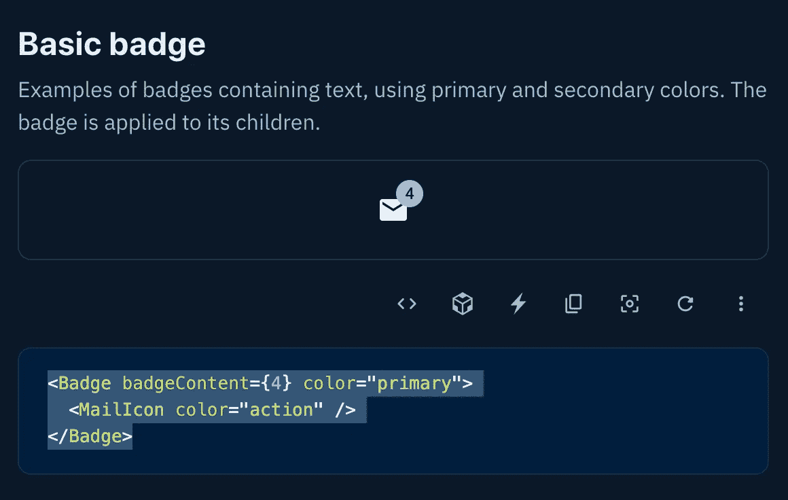
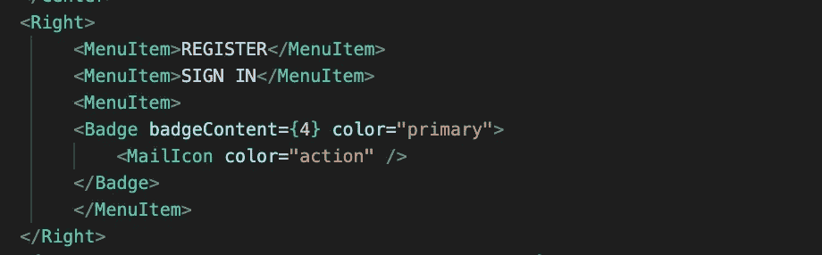
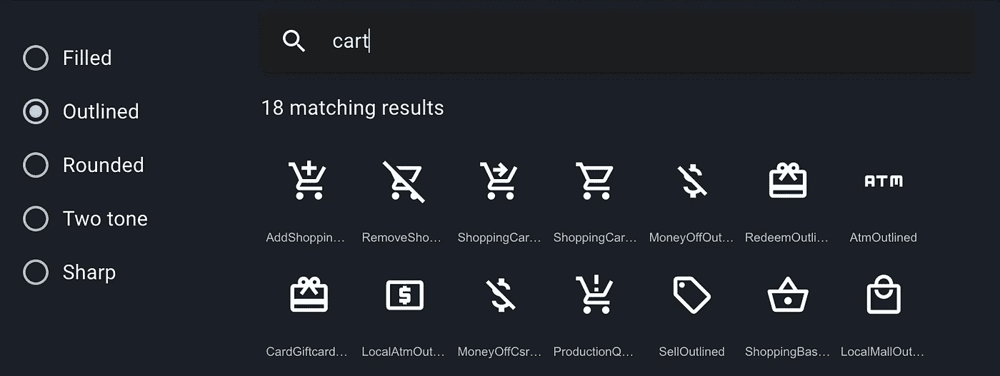
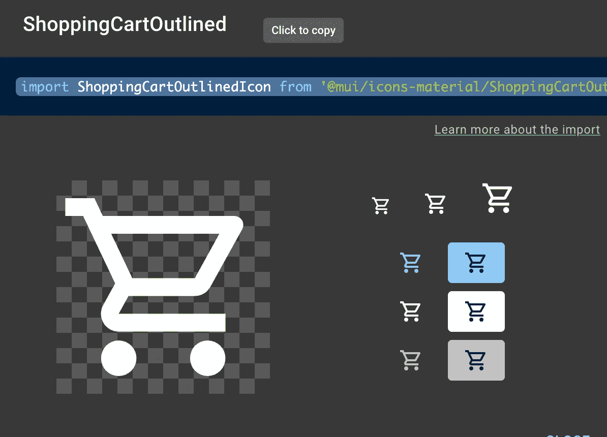
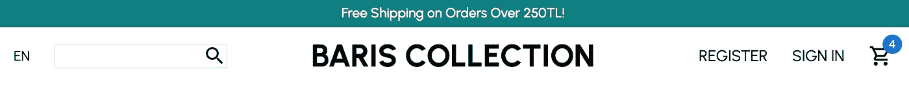

# 将材料设计纳入 ReactJS 应用程序

> 原文：<https://blog.devgenius.io/incorporating-material-design-in-a-reactjs-app-56029d181838?source=collection_archive---------8----------------------->

前端开发充满了好东西。材料设计是我在做电子商务项目时开始涉足的一个领域。我在我的应用程序中加入了一些材料设计库中的图标，并学习了更多关于材料设计的内容、原因和方法。这里有一个简单的介绍。

## 什么是材料设计，为什么我们在生活中需要它？

简单地说，在 [Material](https://material.io/design/introduction) 网站上，“Material 是谷歌创建的一个设计系统，旨在帮助团队为 Android、iOS、Flutter 和 web 构建高质量的数字体验。”一个奇妙的兔子洞，尽管如此，它可以被理解为一套指导原则，创造了一个设计组件库，可以用来建立视觉连贯的网站。材质主题包括颜色、字体和形状等。与其他库一样，material design 节省了开发人员的时间，因为他们不必从头开始创建每个元素。

## 材料设计是如何工作的？

虽然这个库很大，但我一直在使用 React 应用程序的 mui.com 库来渲染一些图标。好了，目前为止有一个图标成功了。但是因为第一个没成功，第二个感觉像是胜利！(更新:在审查我的博客代码时，我终于做出了调整，修正了我的第一个图标渲染——哇哦！)仔细观看，因为这个演练进行得很快。

## 我的购物车

你可以在材质 UI 库中找到成千上万的东西。我将描述使用我在应用程序中实现的购物车图标的步骤。首先，在终端中，我通过运行以下命令添加目录:NPM install @ material-ui/core @ material-ui/icons

现在我可以访问图书馆里的所有图标，我去 https://mui.com/material-ui/react-badge/的[拿徽章。我向下滚动得到了这个代码:](https://mui.com/material-ui/react-badge/)

现在我来解释一下什么是徽章。徽章是信封角上的数字。它将连接到购物车，并随着购物车中商品数量的变化而变化。我使用以下语句在我的 Navbar 组件中导入了徽章:import MailIcon from ' @ mui/icons-material/Mail '。然后，我像这样粘贴徽章代码:

它会这样呈现:

接下来，是时候用购物车图标替换邮件图标了。我去 https://mui.com/material-ui/material-icons/[寻找我想要的图标。然后，我搜索具有概述样式的购物车。看起来是这样的:](https://mui.com/material-ui/material-icons/)

一旦我点击了我想要的购物车(第一行，中间)，下面的弹出窗口给了我一个可点击的链接来复制导入命令。

接下来，在我的 Navbar 组件中，我使用准备好的 import 语句导入图标:import ShoppingCartOutlinedIcon from ' @ mui/icons-material/ShoppingCartOutlined '。最后我把<mailicon>换成了<shoppingcartoutlinedicon>。这是最终渲染的样子:</shoppingcartoutlinedicon></mailicon>

成功！现在连搜索图标都可以用了！