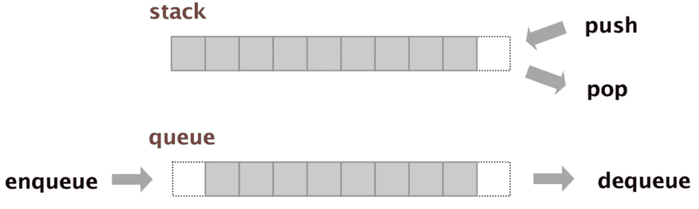

# 作为开发商增加新报价的机会

> 原文：<https://blog.devgenius.io/increase-chances-of-new-offer-as-developer-8696d150d5c4?source=collection_archive---------0----------------------->

## 给你的技术面试留下好印象


由[杰斯温·托马斯](https://unsplash.com/@jeswinthomas?utm_source=unsplash&utm_medium=referral&utm_content=creditCopyText)在 [Unsplash](https://unsplash.com/s/photos/white-board?utm_source=unsplash&utm_medium=referral&utm_content=creditCopyText) 上拍摄的照片

换工作很正常。我们可能有不同的动机:新的挑战、更高的薪水、更多的责任、更大或更小的团队。公司建立了他们的招聘程序，通常其中一项是检查候选人的技术能力。

无论是白板任务、家庭作业还是面试中的讨论。最终，招聘团队会寻找一种方法来证明你的技能和经验。

尽管每天都是软件工程师的工作，但你必须为此做好准备。通过下面的编程技巧，你将能够给面试官留下深刻印象，并在招聘过程中成功通过这一步。

# 利用内存卸载计算

有些问题会促使你跳出思维定势。如果你的解决方案的时间复杂度看起来太高，你应该考虑降低它。这通常可以通过缓存中间结果来实现。如果为了降低时间复杂度而牺牲一些空间呢？

询问内存使用是否有任何限制。在大多数情况下，内存约束被省略。字典作为一种数据结构非常适合缓存。您可以将计算结果保存为关联项目的值。

让我们看看下面的例子。我们有一个项目数组，我们必须计算每个项目的阶乘。

```
items = [21, 25, 18, 13, 9, 25, 14, 13, 15, 18, 10, 19, 13]
cache = dict()
for item in items:
    if item in cache:
        print(cache[item])
    else:
        cache[item] = factorial(item)
        print(cache[item])
```

在上面的代码中，我们引入了一个字典`cache`。我们用它来保存该项目的计算阶乘。在下一次迭代中，我们首先检查元素是否已经在字典中。如果是这样，我们就不必运行昂贵的函数来计算阶乘。我们提取缓存的值。

# 精通动态编程

动态编程是计算机科学中的一种方法，它专注于将一个复杂的问题分解成几个更简单的子问题。一个经典的例子是背包问题。当我们必须根据物品的重量和价格找到最佳组合时，这就是一个优化问题。动态编程出名主要是因为组合挑战。

有两种技术:

*   自顶向下(解决子问题的递归方法)
*   自底向上(解决子问题的迭代方法)

首先学习一种递归方法并很好地实践它是有意义的。更容易理解。主要思想是将一个任务分成更小的子任务，并递归地解决它们。在背包问题中，它将单独计算每个组合，排除或结合其他可能的组合。

当数据集很大时，递归会导致堆栈溢出。为了避免这种情况，我们必须使用迭代方法。这很难理解，但它没有堆栈溢出问题。

# 明智地应用 Set

您是否正在寻找一种方法来删除列表中的重复元素？然后将您的列表转换为集合。

需要加速搜索列表中的元素？考虑用一套。

集合是保证每个元素唯一性的数据结构。它在内部将数据保存在哈希表中。该键是元素的唯一计算散列。这使得集合没有重复的值，并且可以快速检查集合是否包含特定的元素。

```
cart1 = {"apple", "peach", "banana", "plum", "tomato"}
cart2 = {"peach", "orange", "plum", "pineapple"}common_items = cart1.intersection(cart2)
```

除此之外，还支持集合的标准数学运算，如交集或并集。在上面的例子中，我们可以从两个集合中找到共同的项目。

最后，集合不是“银弹”，而是一种强大的数据结构，但经常被遗忘。花点时间刷新一下关于集合的知识。

# 何时使用队列和堆栈

队列和堆栈等数据结构没有得到充分利用。作为一名软件工程师，我们知道队列遵循先进先出(FIFO)规则，而堆栈遵循后进先出(LIFO)规则。然而，这些信息对于有效的应用是否足够？



从[algs4.cs.princeton.edu](https://algs4.cs.princeton.edu/lectures/keynote/13StacksAndQueues.pdf)

一个例子是[调车场算法](https://en.wikipedia.org/wiki/Shunting-yard_algorithm)。这是解析数学表达式的算法。它使用堆栈和队列作为收集存储。

另一个流行的应用是带有回溯算法的动态编程。当我们需要通过遍历满足约束的不同组合来找到所有可能的解决方案时，就会使用该算法。从视觉上看，这就像遍历树，检查每个元素是否适合某个解决方案。如果是，它将被添加到堆栈中。

堆栈和队列有利于收集中间结果。它们有助于在遍历图形时保存数据。在这种情况下，元素将表示遍历的方向。

# 结论

为面试做准备是一项艰苦又费时的任务。它需要在解决各种技术挑战中学习和实践。有很多资源可以帮助你。HackerRank，Leetcode，GeeksForGeeks 只是其中的几个。

在这篇文章中，我试着列出了软件开发人员职位的热门话题。但招聘团队总有可能会问些别的。在那种情况下，保持冷静，不要担心。如果你掌握了上面的主题，你就可以准备解决许多其他的问题。