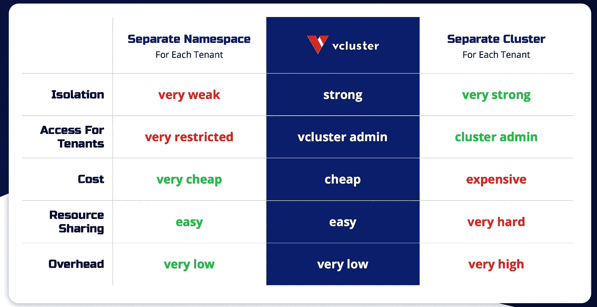

# Kubernetes 虚拟集群提高了开发人员的工作效率

> 原文：<https://blog.devgenius.io/increased-developer-productivity-with-kubernetes-virtual-cluster-7e478870d7aa?source=collection_archive---------3----------------------->

开发人员的生产力对您的业务非常重要。开发者生产力与[开发者体验](https://www.getport.io/blog/developer-experience)有关，所以也很重要，下面的文章举例说明(如果你的开发者体验不好，会降低开发者生产力)。

[](https://dagster.io/blog/dagster-airflow) [## 超越气流:为什么 Dagster 是下一代数据协调器| Dagster 博客

### 我们推出 Dagster 是因为在数据领域存在工具和工程危机。有一个戏剧性的…

dagster.io](https://dagster.io/blog/dagster-airflow) [](https://loft.sh/blog/why-a-good-developer-experience-matters/) [## 为什么良好的开发者体验很重要

### 将用户体验(UX)的概念应用于软件工程，开发人员的体验发生在另一边…

loft.sh](https://loft.sh/blog/why-a-good-developer-experience-matters/) 

作为工程师，开发人员需要好的工具来提高生产率(实际上它适用于所有人)。中国有句谚语:好的工具是成功执行一项工作的先决条件。如果开发人员不能找到或设计好的工具，从长远来看，生产力将会降低。

Kubernetes 是一个广泛使用的容器编排平台。如果您的应用程序团队管理自己的 Kubernetes 集群，您可能不需要继续阅读，它是单租户的，您可以完全控制一切。然而，通常对于大型企业，您的 Kubernetes 集群由一个中央平台团队管理，该团队为应用程序团队提供访问，这被称为多租户，您肯定会遇到以下问题:如何在降低成本的同时提高我的应用程序团队的工作效率。默认情况下，该公司将在两种多租户模式之间进行选择:名称空间即服务或集群即服务。

# Kubernetes 的多租户模型

使用名称空间即服务模型，[租户](https://kubernetes.io/blog/2021/04/15/three-tenancy-models-for-kubernetes/)共享一个集群，租户工作负载被限制在分配给租户的一组名称空间内。使用这种模型，租户共享集群范围的资源，如 ClusterRoles 和 CustomResourceDefinitions(CRD ),因此不能创建或更新这些集群范围的资源。

借助集群即服务模式，每个租户都可以获得自己的集群。该模型允许租户拥有不同版本的集群范围的资源，如 CRDs，并提供 Kubernetes 控制平面的完全隔离。

每种模式都有其优点和缺点，集群即服务成本更高，应用程序团队对集群拥有非常高的权限；名称空间即服务更便宜，但是，为了安装集群范围的资源，应用程序团队需要与平台团队合作来安装这些资源(这需要很长时间/永远)。许多 Kubernetes 高级工具，例如 Ray，操作员需要集群范围的资源。这大大降低了[开发者的生产力](/6-tips-to-increase-your-developer-productivity-6bf3e9a46669)。有关详细信息，请参阅以下文章

[](https://kubernetes.io/blog/2021/04/15/three-tenancy-models-for-kubernetes/) [## Kubernetes 的三种租赁模式

### 作者:瑞安·贝兹迪克(美敦力)，吉姆·布瓦迪亚(尼尔马塔)，塔莎·德鲁(VMware)，郭飞(阿里巴巴)，阿德里安·路丁…

kubernetes.io](https://kubernetes.io/blog/2021/04/15/three-tenancy-models-for-kubernetes/) [](https://deepankur797.medium.com/introduction-to-multi-tenancy-in-kubernetes-205786b7c8b5) [## Kubernetes 中的多租户简介

### 什么是多租户？

deepankur797.medium.com](https://deepankur797.medium.com/introduction-to-multi-tenancy-in-kubernetes-205786b7c8b5) [](https://medium.com/marionete/kubernetes-cluster-multi-tenancy-82ace45d6564) [## Kubernetes 集群多租户

### 多租户是指一个以上的实例在同一个共享环境中运行时的软件运行模式

medium.com](https://medium.com/marionete/kubernetes-cluster-multi-tenancy-82ace45d6564) 

# 控制平面即服务模型

Kubernetes 社区正在向真正的多租户模式转变，采用[控制平面即服务模式](https://containerjournal.com/kubeconcnc/kubernetes-true-superpower-is-its-control-plane/)，也称为虚拟集群。每个租户都有自己专用的 Kubernetes 控制平面，但共享工作节点资源。在物理 Kubernetes 集群/超级集群上，应用程序团队仍然只能获得名称空间的权限，但是，他们也获得了一个“虚拟集群”，在这个虚拟集群上，他们可以管理自己的集群范围的资源。这种模式既有成本效益的好处，又有开发人员的生产力。

[vcluster](https://www.vcluster.com) 是由 [Loft Labs](https://medium.com/u/c68ef4b4d3bb?source=post_page-----7e478870d7aa--------------------------------) 开发的开源“虚拟集群”解决方案。它有以下主张:

只要您能够在单个名称空间内创建部署，您就能够创建一个虚拟集群并成为该虚拟集群的管理员。
完全管理员权限:您可能不是主机集群内的管理员，但在 vcluster 内，您可以执行任何操作:

创建名称空间
配置 RBAC 权限
安装 CRD 并部署控制器
测试新的入口控制器

这意味着即使是虚拟集群也不需要由平台团队进行配置。应用团队喜欢这样。

# Azure Kubernetes 集群上的 vcluster

让我们快速尝试一下。目的是拥有一个对 AKS 集群拥有完全控制权的 Kubernetes 管理员帐户和一个只能访问 Kubernetes 命名空间的开发人员帐户，并查看开发人员帐户是否可以使用 vcluster 获得对“虚拟集群”的完全访问权限，并在带有 CRDs 的 Kubernetes 上安装工具。

## 配置 AK 并设置帐户

创建 AKS 集群并提供 1 个 Kubernetes 管理员和 1 个 Kubernetes 开发人员帐户。AKS 现在支持[托管身份](https://docs.microsoft.com/en-us/azure/aks/use-managed-identity)，所以让我们使用它

```
az aks create --resource-group <resource group name> --location <location> --name <cluster name> --node-vm-size Standard_DS2_v2 --node-count 2 --enable-aad --enable-azure-rbac --generate-ssh-keys
```

我们可以使用以下内容来查找 AKS 使用的托管身份

```
az aks show -g <resource group name> -n <cluster name> --query "servicePrincipalProfile"
/* returns
{"clientId": "msi"}*/az aks show -g <resource group name> -n <cluster name> --query "identity"/* returns
{"principalId": "","tenantId": "","type": "SystemAssigned","userAssignedIdentities": null}
```

现在分配帐户访问 AKS 集群。为此，您的帐户需要具有如下所述的“用户访问管理员”角色。

[](https://techcommunity.microsoft.com/t5/itops-talk-blog/what-s-the-difference-between-azure-roles-and-azure-ad-roles/ba-p/2363647) [## Azure 角色和 Azure AD 角色有什么区别？

### 如果你窥视一下你的微软 Azure 环境，你会看到两种不同的角色——Azure 角色和 Azure AD…

techcommunity.microsoft.com](https://techcommunity.microsoft.com/t5/itops-talk-blog/what-s-the-difference-between-azure-roles-and-azure-ad-roles/ba-p/2363647) 

Azure AD 中的所有角色只是授予 Azure AD 权限，而不是超出此范围(例如，特权角色管理员/全局管理员只能更改用户对 Azure AD 的权限)。如果您想要将“用户访问”更改为常规 Azure 资源(例如，资源组、订阅)，您至少应该拥有“用户访问管理员”角色。

[](https://docs.microsoft.com/en-us/azure/active-directory/privileged-identity-management/pim-configure) [## 什么是特权身份管理？-天蓝色广告

### 特权身份管理(PIM)是 Azure Active Directory (Azure AD)中的一项服务，使您能够管理…

docs.microsoft.com](https://docs.microsoft.com/en-us/azure/active-directory/privileged-identity-management/pim-configure) 

```
# AKS admin
AKS_ID=$(az aks show --resource-group <resource group name> -n <cluster name> --query id -o tsv)AKSADMIN_ID=$(az ad user show --id [<](mailto:xcheng1@godevsuite072.onmicrosoft.com)aks admin account> --query objectId --out tsv)
az role assignment create \
  --assignee $AKSADMIN_ID \
  --role "Azure Kubernetes Service RBAC Cluster Admin" \
  --scope $AKS_ID# Now you can create a Kubernetes namespace accessible to dev
az aks get-credentials --resource-group <resource group name> -n <cluster name>
kubectl create namespace dev# AKS dev, only access to namespace
APPDEV_ID=$(az ad user show --id [<](mailto:xchengdev1@godevsuite072.onmicrosoft.com)aks dev account> --query objectId --out tsv)
az role assignment create \
  --assignee $APPDEV_ID \
  --role "Azure Kubernetes Service RBAC Admin" \
  --scope "$AKS_ID/namespaces/dev"
```

## 在开发人员帐户下的物理 AKS 集群上安装 Ray

在上面的命令之后，你可以用开发者帐号连接 AKS。然后我们可以尝试在 Kubernetes 上安装[雷。你会清楚地看到“没有 CRD 的许可”](https://docs.ray.io/en/latest/cluster/kubernetes.html)

```
~$ kubectl get ns
Error from server (Forbidden): namespaces is forbidden: User "" cannot list resource "namespaces" in API group "" at the cluster scope: User does not have access to the resource in Azure. Update role assignment to allow access.
~$ kubectl get po -n dev
No resources found in dev namespace.# install Ray
cd ray/deploy/charts
~/ray/deploy/charts$ helm -n dev install example-cluster --create-namespace ./ray
Error: failed to install CRD crds/cluster_crd.yaml: customresourcedefinitions.apiextensions.k8s.io is forbidden: User "" cannot create resource "customresourcedefinitions" in API group "apiextensions.k8s.io" at the cluster scope: User does not have access to the resource in Azure. Update role assignment to allowaccess.
```

## 安装 vcluster

 [## 快速入门指南| vcluster 文档 Kubernetes 虚拟集群

### 此安装脚本的第 4 行将安装目录%APPDATA%\vcluster 添加到$PATH 环境变量中。这是…

www.vcluster.com](https://www.vcluster.com/docs/quickstart) 

```
curl -s -L "[https://github.com/loft-sh/vcluster/releases/latest](https://github.com/loft-sh/vcluster/releases/latest)" | sed -nE 's!.*"([^"]*vcluster-linux-amd64)".* | xargs -n 1 curl -L -o vcluster && chmod +x vcluster;sudo mv vcluster /usr/local/bin;vcluster --versionvcluster create vcluster-1 -n devvcluster connect vcluster-1 -n dev#use vcluster generated kubeconfig
export KUBECONFIG=./kubeconfig.yamlkubectl get namespace
/*
NAME              STATUS   AGE
default           Active   11m
kube-system       Active   11m
kube-public       Active   11m
kube-node-lease   Active   11m
*/
```

## 再次在 Kubernetes 上安装 Ray

瞧啊。现在可以用了。

```
cd ray/deploy/charts
helm -n dev install example-cluster --create-namespace ./ray~/ray/deploy/charts$ kubectl -n dev get rayclusters
NAME              STATUS   RESTARTS   AGE
example-cluster                       57s# delete ray cluster
~/ray/deploy/charts$ kubectl -n dev delete raycluster example-cluster
```

清除

```
vcluster delete vcluster-1 -n dev
```

# 基础建筑

请参考以下官方文档

 [## 基础| vcluster 文档 Kubernetes 虚拟集群

### 虚拟集群是运行在其他 Kubernetes 集群之上的 Kubernetes 集群。与完全分离相比…

www.vcluster.com](https://www.vcluster.com/docs/architecture/basics) 

vcluster 主要有 2 个组件:

控制平面:使用 [k3s](https://k3s.io) 服务 API 服务器、控制器管理器

同步程序:vcluster 没有调度程序。它使用 syncer(在 pod 中运行),将需要调度的 pod 从 vcluster 复制到底层主机集群

下面是来自 [vcluster 网站](https://www.vcluster.com)的三种多租户模式的对比。



此外，网上还有许多关于 vcluster 的有用信息。我把它们包括在附录中。请随意与我分享任何有用的资源。

# 附录

[](https://thenewstack.io/virtual-clusters-are-the-future-of-kubernetes-multitenancy/) [## 虚拟集群是 Kubernetes 多租户的未来——新的堆栈

### 跨团队共享 Kubernetes 集群极其困难。如果你和库伯内特社区的人交谈…

thenewstack.io](https://thenewstack.io/virtual-clusters-are-the-future-of-kubernetes-multitenancy/) [](https://www.linkedin.com/pulse/kubernetes-virtual-clusters-enabling-hard-cost-gokul-chandra?trk=read_related_article-card_title) [## Kubernetes 虚拟集群——支持硬多租户和成本优化

### 随着 Kubernetes 在关键业务技术基础设施方面的成熟，对 Kubernetes 应用程序访问的需求…

www.linkedin.com](https://www.linkedin.com/pulse/kubernetes-virtual-clusters-enabling-hard-cost-gokul-chandra?trk=read_related_article-card_title) [](https://loft-sh.medium.com/high-velocity-engineering-with-virtual-kubernetes-clusters-7df929ac6d0a) [## 虚拟 Kubernetes 集群的高速工程

### 毗湿奴·奇拉马库鲁

loft-sh.medium.com](https://loft-sh.medium.com/high-velocity-engineering-with-virtual-kubernetes-clusters-7df929ac6d0a) [](https://loft.sh/blog/kubernetes-multi-tenancy-a-best-practices-guide/) [## Kubernetes 多租户-最佳实践指南

### Kubernetes 多租户是一个越来越多的组织感兴趣的话题，因为他们的 Kubernetes 使用…

loft.sh](https://loft.sh/blog/kubernetes-multi-tenancy-a-best-practices-guide/) 

[Loft Labs](https://medium.com/u/c68ef4b4d3bb?source=post_page-----7e478870d7aa--------------------------------) 还有其他几个工具。我尝试了 Devspace，它有助于 Kubernetes 应用程序本地开发体验。我发现下面的视频很有帮助。

[](https://loft.sh/blog/skaffold-vs-tilt-vs-devspace/) [## Skaffold vs Tilt vs DevSpace

### 随着越来越多的开发人员使用 Kubernetes，各种各样的部署工具正在出现，以帮助他们。三个有趣的例子…

loft.sh](https://loft.sh/blog/skaffold-vs-tilt-vs-devspace/) [](https://medium.com/microsoftazure/azure-kubernetes-service-aks-authentication-and-authorization-between-azure-rbac-and-k8s-rbac-eab57ab8345d) [## Azure Kubernetes 服务—Azure RBAC 和 k8s RBAC 之间的 AKS 身份验证和授权

### Kubernetes 没有提供任何定义和管理用户的内置机制。相反，它允许管理员集成…

medium.com](https://medium.com/microsoftazure/azure-kubernetes-service-aks-authentication-and-authorization-between-azure-rbac-and-k8s-rbac-eab57ab8345d)