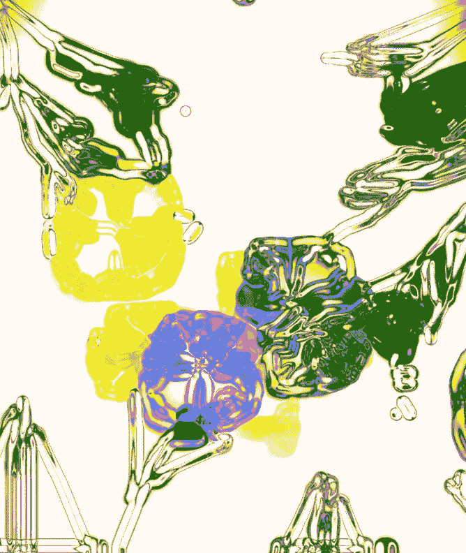
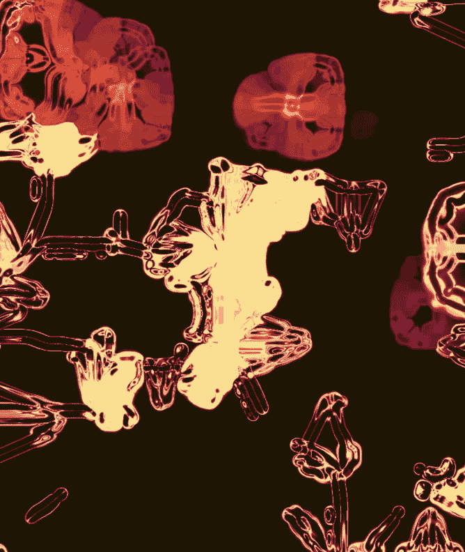

# 难以置信的艺术家宝石，BIPOC 和 POC 版 PT。二

> 原文：<https://blog.devgenius.io/incredible-artist-gems-bipoc-poc-edition-pt-ii-208f7d7d2f25?source=collection_archive---------9----------------------->

## 60 多位艺术家、开发人员、研究人员以及所有对新媒体艺术领域有着鼓舞人心贡献的人组成了一个不断增长的集合。

由于农历新年和情人节在同一个周末，我不得不将一些爱分享给所有有才华的独立艺术家、开发人员、研究人员、创意编码人员和学者，他们组成了这个全球名单。

大约在去年的这个时候，我开始了自己深入新媒体和 ArtxSci 的旅程，如果没有他们的作品、对话、DM 和研究，我不可能走到这一步，并且仍然保持增长。

1 周年！我在 Touchdesigner 中构建的第一个交互式生成绘画系列:)

去年我在 insta 上分享了一个帖子，强调了 BIPOC/POC 新媒体创意的一个小得多的列表，它收到了很大的反响，促使我分享这个更大的列表。我喜欢这个领域的一个关键点是社区和开源共享技巧、教程和研究，本着这种精神，**我已经构建了一年多的电子表格现在对其他人开放，供他们添加和编辑**。所有可用的信息仅来自艺术家的公开资料。**显然，如果任何人喜欢删除或编辑他们的详细信息，他们也可以这样做。**

 [## 难以置信的 BIPOC/POC 艺术家宝石 2021

60+和越来越多的令人难以置信的艺术家和研究人员。](https://docs.google.com/spreadsheets/d/1hsJsR3BAo5Mo7oA8p-3xll1tDNDp1xpWWDTpK9WY3eY/edit#gid=0) 

## **关于本电子表格中仅包含 BIPOC 和 POC 的具体信息**

作为一个行业，技术中一直缺乏代表性，尤其是在编码、ArtxSci 等领域，这并不奇怪。它正在迅速变得更好，通过深入研究这些不同的投资组合，我个人对[数字革命](https://www.tellart.com/projects/designnonfiction/)和[技术和种族历史的新观点](https://walkerart.org/magazine/soundboard-reenvisioning-internet-mimi-onuoha)了解得更多。随着我继续深入这个领域，我希望分享更多的这项研究！因此，继续扩大这个列表非常重要，因为我们需要承认、分享和建立新媒体社区中的各种经验。

我只是一个人，我希望这个列表能持续增长到 100+，因此我邀请其他人加入他们自己的发现！我将亲自审查任何新加入名单的名字，以确保随着时间的推移，这种包容性和增长。

祝大家农历新年、情人节快乐，并祝大家身体健康:)