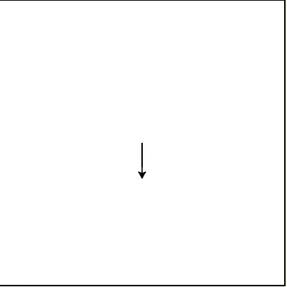
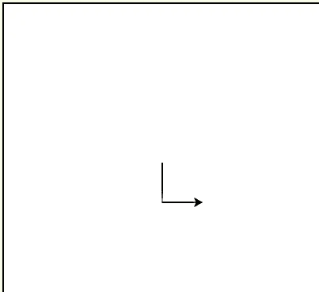
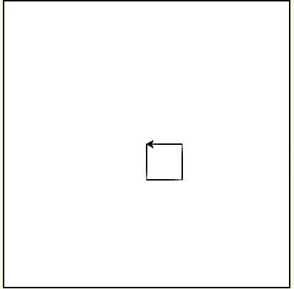
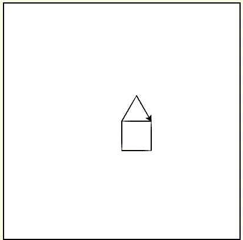

# 增量编程..

> 原文：<https://blog.devgenius.io/incremental-programming-dccbf8dbe7ab?source=collection_archive---------19----------------------->

基本上，我们在不知不觉中遵循了这种编程方法。这是程序员可以在日常代码中实践的最好的编程方法之一。

什么是增量编程？

1.  从小处着手——首先，从小处着手编写你的程序并保持运行，而不是在不知道程序是否正常运行或有错误的情况下写很多行。
2.  让它继续工作——现在我们的小部分工作正常了，那么我们应该开始把程序的另一小部分添加到我们的主程序中，并检查它是否工作正常。如果有任何错误，你可以在第一时间发现它。一旦没有错误，继续重复第二步，直到我们的问题得到解决。

通过这样做，我们可以避免在最后一次编译整个代码时出现大量错误，我们会被显示的大量错误所迷惑。因为当我们将程序的一小部分添加到主代码中时，我们将同时消除所有的错误。

我将展示一个简单的例子，通过建造一所房子，增量编程如何与 python 中的一个简单程序一起工作。因为这是我们在日常生活中看到的最好的例子。

1.  首先让我们画一条垂直线

进口龟
wn =龟。Screen()
房子=乌龟。龟()
house . right(90)
house . forward(50)
house . left(90)
house . forward(50)

2.我们在底部添加一条水平线

house . left(90)
house . forward(50)

3.在这里我们可以添加一条垂直和水平线，这样我们就可以得到一个盒子的形状。

豪斯. left(90)
豪斯. forward(50)
豪斯. left(90)
house.forward(50)

4.现在我们必须加上屋顶，使房子完整。

豪斯.左(180)
豪斯.左(60)
豪斯.前进(50)
豪斯.右(120)
豪斯.前进(50)

你可以看到的另一个例子是，数控机床也使用这种技术进行加工

如上所示，如果我们把程序分成小部分，这对我们编写无错代码会很有帮助。

“让某些东西发挥作用并保持它的作用”

编码快乐！！！