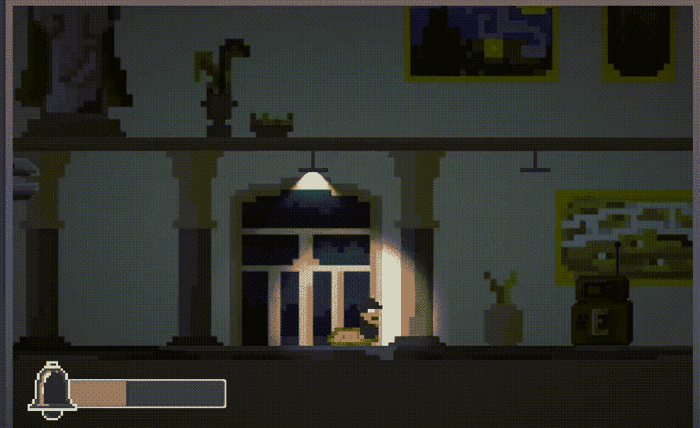
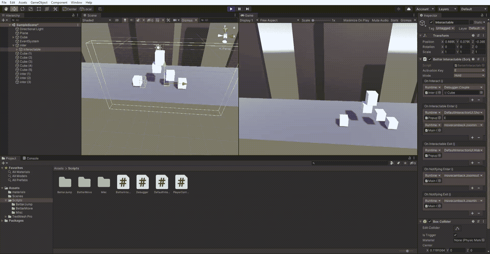
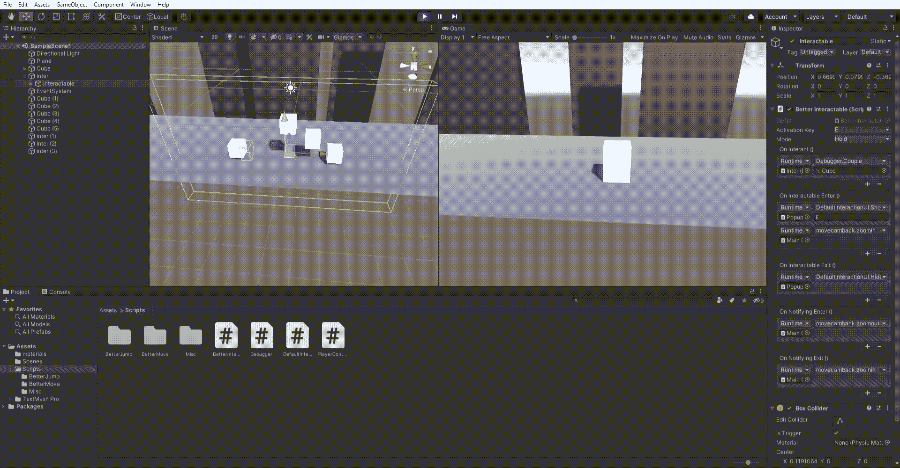
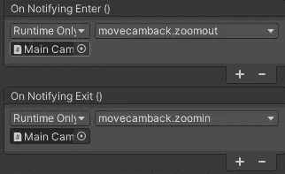

# 深度:可交互。使用 UnityEvents 设计和实现

> 原文：<https://blog.devgenius.io/indepth-interactables-design-and-implement-using-unityevents-9c81ee317eaa?source=collection_archive---------2----------------------->

《深度》是一个关于在 Unity 中构建游戏的原子组件的系列。每周我都会深入研究游戏设计的一个方面，无论是*跳跃、移动*还是今天的*互动。本系列的一个条目涵盖了游戏设计中每个组件的考虑因素，并讨论了它们的实现。此外，我的目标应该是保持这些组件*的模块化、可定制化、*和*的可伸缩性*，因为我希望它们成为我未来项目的基本构建模块！*

我试图在覆盖每个组件的尽可能多的方面，深入细节，以及像概述或游戏设计词典一样深入工作之间取得平衡。所以，事不宜迟，让我们开始吧！



一个可交互的终端从以前的游戏蠕虫过滤

# TLDR；

向玩家传达互动的存在，并把它们组织起来，这是好的互动设计的重要部分。我们可能需要使用听觉和视觉提示以及 UI 元素来向玩家解释我们的交互。这种实现应该允许很大的灵活性，因为个人交互的方式和他们修改的游戏组件会有很大的变化。为了符合这一要求，我们可以实施以下措施:

*   创建两个触发器，记录玩家是否在附近(用于提供线索或框架)以及玩家是否在交互范围内。一个触发器的事件需要从子组件中冒泡。
*   使用 **UnityEvents** 在检查器中公开这些事件。这允许任意数量的游戏对象具有在满足这些触发条件时运行的功能。
*   使用菜单和开关状态根据激活方法改变行为，即按下、释放、保持、空闲。
*   为简单的复制和复杂的抽象创建一个预置。

交互组件的代码相对简单，因为大多数功能需要在其他地方实现。它主要包装样板代码。尽管如此，当我们的游戏变大时，考虑设计并确保它适当地缩放确实对我们有很大的好处！

# 设计制作精良的可交互设备

互动可以是很多事情。躲在石头栅栏后面，拿起武器，打开电灯开关，或者发现一颗罕见的钻石，这只是几个例子。我们需要向玩家传达互动的存在，我们也需要设计这种互动。让我们从最后一个开始，分别看一下这些:

## 设计互动

在这一点上，玩家已经意识到有一个交互要做，以及为了执行他需要采取的步骤。对于实施而言，一个重要的考虑因素是交互作用的效果通常与交互作用本身无关，即:

*   *隐蔽*。修改**角色**的生命值和移动。可能它改变了**相机**的角度。
*   *拿起武器*。可能会改变“火”**脚本**和**武器动画**上的变量。
*   *打开灯开关*。这一个打开一盏灯**游戏对象**，它甚至不一定靠近可交互的(灯开关)。

关键是:与角色相关的代码也应该附加到角色上。对交互者来说不是。当我们稍后讨论实现时，我们将回到这一点。

接下来，我们需要确定一种交互方式。*我们将特别关注单键交互*。这些往往与角色的世界空间联系在一起，也就是说，互动发生在角色当前居住的任何地方。请注意，存在大量其他形式，例如鼠标点击、拖动、点击、身体传感器或相机，更不用说虚拟现实了。但是让我们保持简单。



拖动交互式

[Davide Aversa 的这篇文章](https://www.davideaversa.it/blog/game-design-essentials-single-button-controls/)深入探讨了单个按钮的输入状态，即*按下、释放、保持、空闲(无所事事)、节奏*。虽然我鼓励你自己去读这篇文章，但这里有一些主要的收获和我自己的观察:

*   *按下*。又快又直接。中立玩家感觉。适用于经常发生、需要快速执行或依赖反应的动作。
*   *发布*。模拟正在释放的张力/力。如果玩家需要做出一个非常重要或情绪化的决定，你可以尝试只在释放按键时*关闭*动作。还要注意，释放一个键的反应时间比按下一个键的反应时间要快。当然，它要求用户已经拿着钥匙。
*   *按住*。适用于被认为需要持续努力的动作，例如绳子摆动、推/拉障碍物、汽车加速等。也为我们提供了一种从二进制按钮创建非二进制值范围的方法。
*   *闲置*。在 RPG 中自动拾取物品或在环形转轮中向前推动可以被分配到这个类别。适用于经常发生或对玩家来说无关紧要的动作。
*   节奏。指重复按下按钮。快节奏是一种给玩家施加体力的方式。当角色打开一扇厚重的门，玩家必须按下按钮时使用。另一种较慢的节奏可用于锻造或其他持续精密动作的情况。更多信息请见 Davide Aversa 的文章。

## 交流互动

正如上一节所述，玩家需要 1)意识到交互的存在，2)知道如何执行它。让我们看一下存储或呈现这些信息的三个层次。



可互动的摄像机取景(最后一个白盒)

*   *知识、习俗和一致性。*作为游戏玩家，我们习惯于以某种方式看待事情。发光、移动或突出的东西很可能被认为是可交互的，也能吸引玩家的注意力。我们可以使用惯例，例如使用 E 键进行互动，和/或教玩家如何在整个游戏过程中进行互动。坚持使用可识别的共享外观也是有帮助的。
*   *非死亡元素*。我真的不知道该用什么词来形容这个——但基本上是所有不属于游戏世界的东西。例如，这包括用户界面弹出窗口、画外音、广告词、声音、摄影和取景。所有这些都是他们自己的主题，但考虑一下，例如，如果玩家在附近，一个摄像头会拍摄重要的项目(见示例)，或者一个图标声音，每当一个新的交互出现在屏幕上时就会播放！
*   *游戏世界元素。* 这可能是游戏中的路标，一个看着可互动方向的角色，战术性放置以吸引注意力的灯光，或者来自角色的音频提示，让玩家知道有东西在附近。作为一个旁注，这是一个很好的做法，当依赖声音提示时，要确保有大量的视觉提示来补充它们，因为不是所有的玩家都选择在听觉能力上加分！

现在，我们可以在这里提到这么多，但是所有这些，正如我们之前讨论的，都不是交互作用本身的一部分。我们只需要意识到它们，并使我们容易将它们绑定到交互对象上。

# 实施

考虑到我们到目前为止讨论的所有内容，看起来我们想要的是**公开一堆事件**，我们可以在我们的项目中绑定任意代码！交互者只负责在适当的时候运行代码。

请记住，我们希望支持以下两种通信:1)交互对象相对较近，2)玩家处于可以进行交互的范围内，以及 3)玩家已经进行了交互。知道玩家是否已经离开这些区域也是有用的！您可以随意命名这些事件，但我们应该公开类似以下事件的内容:

*   *onInteract* 。玩家进行了互动。
*   *onInteractableEnter* 。玩家在进行互动的范围内。
*   *onInteractableExit* 。玩家已经离开了他可以互动的范围。
*   *onNotifyingEnter* 。玩家离你很近，你可能想向玩家暗示互动就在附近。
*   *onNotifyingExit* 。玩家再次离开了这个范围。

接下来输入: **UnityEvents** 。这些东西真的很厉害。您可以像这样定义和使用它们:

```
[SerializeField] private UnityEvent onNotifyingEnter;
//...
onNotifyingEnter.Invoke();
```

这样我们就可以创建一个每次在 onNotifyingEnter 上运行的函数列表。调用 Invoke()。假设我们想在玩家接近交互对象时将摄像机移得更远。为此，在相机的脚本中创建一个具有缩小行为的函数。将摄像机拖动到 UnityEvent onNotifyingEnter。可能对重置缩放进行同样的操作。它可能看起来像这样:



相机行为的单位事件

如果玩家使用两个设置为触发的碰撞器进入相关范围，我们可以注册。现在，Unity 并不热衷于在一个游戏对象上安装多个碰撞器。出于这个原因，我们实际上需要在子对象上放置一个触发器，并使用一个脚本将触发器事件冒泡到父对象:

从子到父的气泡触发事件

最后一件事是创建实际的交互。还记得我们对按钮输入状态的讨论吗？我们可以这样用一个**枚举**来建模(它将在检查器中创建一个下拉列表):

```
private enum activationMode {press, release, hold, idle};
[SerializeField] private activationMode mode = activationMode.press;
```

然后根据*模式*的值设置，我们可以不同地处理输入。我在自己的实现中使用了 switch 语句。它是这样工作的:

*   在模式为 *idle* 的情况下，当玩家进入交互范围时，onInteract 被调用一次。
*   如果模式是*按下*或*释放*，我会对输入进行额外的检查。GetKeyDown(键)和输入。分别为 GetKeyUp(key)。
*   最后，*保持*被设置为只要使用输入按下键就持续调用。GetKey(key)。

## 最后几个音符

你可能注意到我选择了省略*节奏。*这个我认为更多的是*按下*或者*释放*的延伸。因此，它不能直接在可交互的。

作为一个想法，你也可以实现一个延迟动作，只在用户按住键一段时间后调用。这取决于你的游戏，并且会带来一些复杂的问题(例如，一些东西，比如 UI，应该立即被调用)。

这就结束了本周对交互的深入探讨。一如既往，这些简单事物的复杂性不断让我震惊！

我希望这能让你感兴趣。干杯！