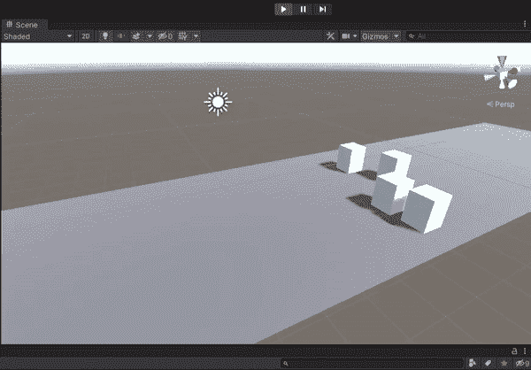
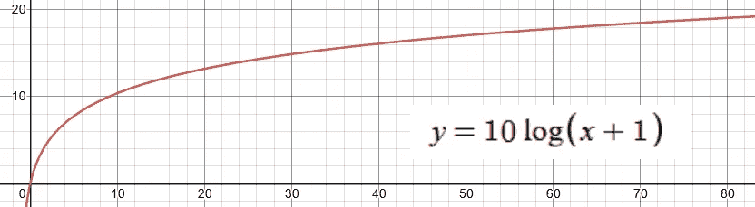
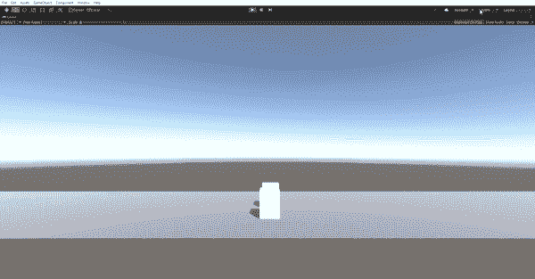
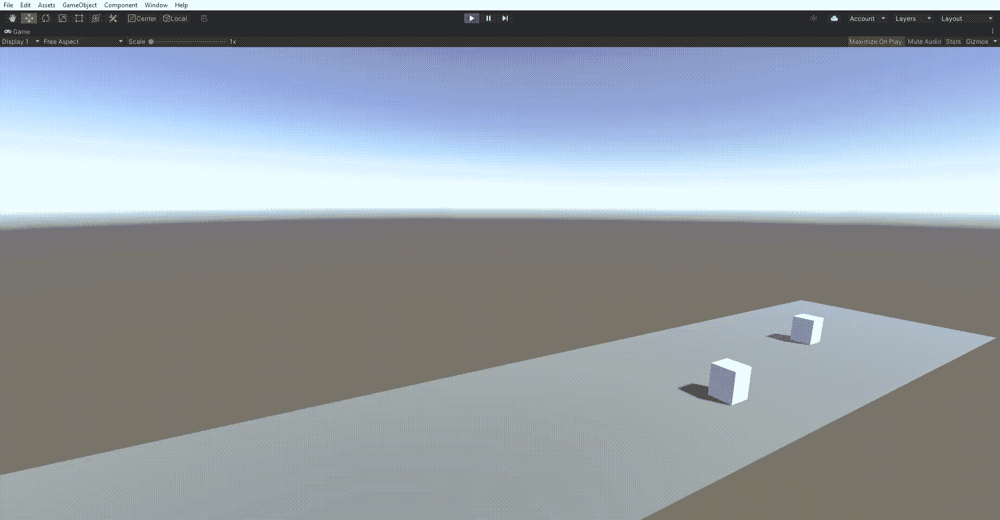

# 深度:使用动画曲线统一运动

> 原文：<https://blog.devgenius.io/indepth-movement-in-unity-using-animationcurves-1dba668dc777?source=collection_archive---------0----------------------->

厌倦了总是构建相同的脚本，它们从来没有像我希望的那样完美，我决定开始一个新的项目:*deepth*。虽然我不是在构建一个真正的游戏，但我是在构建一个游戏的基本组件。这样做的结果是，当我在编写一个脚本时，我只有一个目标:尽可能好地制作这个特定的组件！

上周我看了*跳跃*，你可以在这里阅读:

[](https://gustavcorpas.medium.com/building-a-customizable-jump-in-unity-using-animation-curves-a168a618428d) [## 使用动画曲线在 Unity 中构建可定制的跳转

### 游戏开发非常有趣！但是有多少次你坐下来，脑子里有一个美妙的想法，却从来没有看到…

gustavcorpas.medium.com](https://gustavcorpas.medium.com/building-a-customizable-jump-in-unity-using-animation-curves-a168a618428d) 

今天我们将讨论*运动。*更准确地说，是你在平台游戏中看到的水平移动。虽然这里的许多原则可以适用于其他类型，但平台游戏一直是我研究的重点。



# TLDR；

事实证明，在一个轴上运动比你想象的要多得多。虽然我们可以在屏幕上快速移动一些东西，但再多做一点可能会像这样:

*   使用一个**可脚本化的对象**来存储关于移动预置的信息。我的包括四个动画曲线，一个浮点和一个布尔。
*   两个**动画曲线**用于角色在地面上的加速和减速。
*   另外两条**动画曲线**用于角色在空中的加速和减速。
*   然后我用一个浮点数**作为字符在空中速度的乘数。**
*   **布尔**用于选择转弯时是否复位动量。

如果你读过我的另一篇文章，你可能会注意到我是动画曲线和脚本对象的超级粉丝。这些提供了一种非常直观的方法来调整数字，甚至可以在运行游戏时完成，然后在结束执行后保持不变。

使用**动画曲线。求值** (Time.time - timeAtKeyDown)得到角色的速度。

# 理解好的动作

以一种对玩家来说可信的方式移动角色的很多事情都归结于*上下文。* 不一定有什么错误的答案，但你应该问自己一些问题。你在创造什么类型的角色:他是一个有机的重怪物一样的生物，还是她是一个叶状的击剑手，在危险中跳舞？接下来，你希望你的玩家在玩这个游戏时有什么样的感觉:它是一个动作密集、高节奏的射击游戏，还是一个在城镇中心有美丽瀑布的平静的 rpg 游戏？(瀑布部分只是我真的很喜欢瀑布)。

我们现在将继续讨论一些实际参数，但我想提一下，因为理解*为什么*同样重要(如果不是更重要的话！)来了解*如何。*

我们的角色显然需要一定的速度。但是我们也需要考虑他是如何达到这个速度的，通过什么函数，也就是**加速度曲线**。对于像刺猬索尼克这样的赛车游戏来说，长时间提高速度可能是鼓励玩家保持动力的恰当方式。我们也可以选择对数加速:



通过这种方式，玩家可以很快回到行动中，而熟练的玩家仍然会因为保持动力而获得奖励。

一个非常流行的方法是让角色几乎立即达到最高速度，因为这使控制感觉爽快而不是漂浮。这样做时，我们需要在精度和速度之间取得平衡。请注意，在下一个例子中，即使两个立方体具有相同的最大速度，如果我们快速按下移动键，其中一个会移动得更远，因为这会重置加速度曲线！



示例 1

本质上，我们希望保留玩家小距离移动的能力，同时让他快速加速。如果漂浮感不适合你的游戏，另一个解决这个问题的方法是保持一个长的加速曲线，但是要确保有一个明显的移动的初始冲击。

接下来是**减速曲线。让玩家瞬间停下来可能看起来像机器人，而缓慢减速会让游戏看起来飘忽不定，难以精确。然而，在这里你可能有更多的回旋余地，因为玩家也有能力加速到另一个方向以降低速度。**

我应该提到的是，Steve Swink 有一本关于“游戏感觉”的书，第 7 章“反应指标”对这些曲线及其相关的玩家情绪进行了更详细的描述。我还发现[一项测量加速和减速对玩家感知的影响的研究](https://www.youtube.com/watch?v=S-EmAitPYg8)声称:

## 考虑到播出时间和跳跃

到目前为止，我们已经讨论了当球员在地面上时的移动。但是当玩家空中飞行时会发生什么呢？就我个人而言，我已经停止用 Unity 的物理构建来构建角色控制器，而是选择简单地使用角色控制器。Move()生成玩家移动。然而，如果我们考虑在跳跃的情况下会发生什么，我们想到的是摩擦和阻力。角色不再通过奔跑产生恒定的前进动力，周围的空气会提供阻力。出于这个原因，我们可能希望在空中模拟不同的角色行为。例如，考虑跑步跳跃，而不是静止不动地向前跳跃:



示例 2

最后，许多游戏采用了相当宽容的空中移动，如果玩家向墙钉前进，允许他在空中闪避、倒退或停止。如果我们还想降低空气中的加速度，这就提出了一个挑战。空气流动性基本上低于跳跃开始时的空气流动性(按照前面的例子)。然后，我们可能需要一种方法来重置动量，以防玩家改变方向。重置动量与组合曲线之间的区别如下所示:


示例 3

OBS。房间里有一头大象。你可能认为我们没有讨论输入的类型，即控制器、键盘等。你是对的！在我的实现中，我假设是一个按钮的数字输入。模拟输入，如控制器，甚至更奇特的选择，绝对是一个野兽自己完全。

# 实施

了解了运动的内容后，我们现在可以开始实施了。


首先，我们可以创建一个包含我们刚刚讨论过的内容的**脚本化对象**。可编写脚本的对象非常棒，因为它们允许我们轻松地将数据复制到多个对象，在播放模式下编辑属性，并在其他项目中导出和使用它们作为预设。我在之前关于跳跃的文章中描述了如何创建它们，所以我在这里不再赘述。我还提供了一个如何在控制器脚本中使用它们的例子。

接下来，我们检查播放器的相关输入键。这个检查应该在 **Update()** 函数中，而所有的物理计算应该在 **FixedUpdate()** 函数中。我喜欢有一个主控制器来处理输入检查，调用移动脚本上的相关函数，并将移动脚本的输出与潜在的其他脚本(如跳转)相结合，以给出最终的移动向量。有点像这样:

```
private void FixedUpdate(){
        playerVelocity = Vector3.zero;
        // little bit of default gravity
        playerVelocity += defaultVelocity * Time.deltaTime;
        // all controllers are applied here...
        playerVelocity += jumpController.JumpUpdate();
        playerVelocity += moveController.MoveUpdate();

        masterController.Move(playerVelocity * Time.deltaTime);
    }
```

移动控制器。MoveUpdate 可能看起来像这样:

如你所见，我有四个功能:地面移动、地面减速、空中控制和空中减速。它们接受一个方向参数作为 int。

这些函数充当了很好的脚手架，而 excact 实现是您可以有很多创作自由的地方。我不想把我的解决方案强加给你，但是我想分享一下我遇到的一些小问题！

1.  你可能想在你的脚本中推导出玩家的最大速度。考虑使用**move options . deceleration . evaluate(0)**来获得这个值，而不是在检查器中设置一个单独的值。
2.  您可能需要记住最后一帧的速度，例如在过渡到跳跃时。在我的实现中，我使用了一个**布尔** **请求存储移动**，如果在 MoveUpdate()函数结束时为真，将存储速度向量。
3.  考虑一下，如果您的角色尚未到达加速度曲线的终点，但现在需要减速，会发生什么。减速曲线将从最大速度开始减速。不太好。这可以通过计算减速度与最大速度之间的差值来解决，然后用它来更新玩家的速度:

```
 float diff = 
 maxSpeed - moveOptions.deceleration.Evaluate(Time.time-timestamp);
 float m = storedMovement.x * direction - diff;
 if (m > 0){
        movement.x = m * directionPram;
        requestStoreMovement = true;
 }
```

这就差不多概括了。游戏中的移动不仅仅是向左和向右。有了这些设计上的考虑，你就可以前进，建造伟大的运动系统。

我希望这能让你感兴趣。干杯！