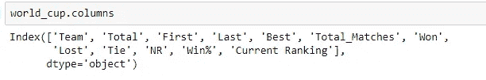

# 索引数据帧

> 原文：<https://blog.devgenius.io/indexing-dataframes-aecdde4daaf?source=collection_archive---------14----------------------->

## 熊猫的索引数据帧

照片由[戴维斯科](https://unsplash.com/@codytdavis?utm_source=medium&utm_medium=referral)在 [Unsplash](https://unsplash.com?utm_source=medium&utm_medium=referral) 拍摄

什么是指数？**索引**就像一个地址，它让我们能够访问跨越**数据帧**的数据点，或者可以访问一系列数据点。行和列都有**索引**，行**索引**被称为**索引**，列是它们的通用列名。

因此，理解索引行和/或列是非常重要的。在本教程中，让我们来看看熊猫的一些常用的索引方法。

请安装熊猫，以防你的系统没有安装。

**！pip 安装熊猫**

现在让我们开始吧。让我们将数据读入数据帧并查看一下。

使用来自 https://www。 [espncricinfo](https://www.espncricinfo.com/) 。com/

数据集有 14 行和 12 列

数据集有 14 行和 12 个特征，最左边的序列 0，1 2，3 …是索引。让我们看看更多的信息。

*以上信息将帮助我们了解数据帧的行数和列数。基本上，看看我们的数据看起来怎么样。*

**我们的索引方法:**

1.  **锁定方法**
2.  **iloc 方法**

我们首先想到的是“这两种方法的区别”。我们举个小例子来理解这一点。假设，5 个孩子站成一排，位置从 1 到 5。我们有两种方法来解决他们或呼唤他们。要么直呼其名，要么直呼其职位名。如果我们以孩子的名字来称呼他们，我们称之为' *loc 方法*'，如果我们以位置来称呼，我们称之为' *iloc 方法*'。

# **锁定方法:**

这是 pandas 中用于索引数据帧和/或系列方法的最通用的方法之一。 **loc** () **函数**用于通过标签或布尔数组访问一组行和列。loc[]主要基于标签，但也可以用于布尔数组。

语法是:

**df . loc[指定行:指定列]** ，其中 df 是我们的数据帧的名称。

允许的输入有:

*   单一标签
*   标签的列表或数组
*   切片对象
*   布尔数组
*   一个带有一个参数(调用序列或数据帧)的可调用函数，返回有效的索引输出(上述之一)

## **使用单个标签:**

帮助指定我们需要的行和/或列。对于行，标签是该行的索引值，对于列，列名是标签。例如，在我们的世界杯数据框架中，如果我们只需要第 3 行以及所有的列，我们将使用如下:

使用单个标签

这里我们指定了我们需要的标签，即 2，冒号(:)表示我们需要该行中的所有列。

## 标签的列表或数组:

如果我们想要多行和/或多列，而不是只有一行呢？嗯，通过使用标签数组，我们可以做到这一点。让我们来看看:

使用标签列表

如果我们需要与行相关的特定列，该怎么办:

## 切片对象:

**切片符号**表示**开始和**停止标签。其中**和**开始**和**停止标签都包含在我们的输出中，如下所示:

显示从团队到总匹配数的所有列

## 布尔数组:

最后，我们可以使用一个布尔值数组。但是，这个布尔值数组的长度必须与我们使用它的轴的长度相同。例如，我们的世界杯数据帧具有(14，12)的形状，这意味着它有 14 行和 12 列。所以如果我们想用一个布尔数组来指定我们的行，那么它需要有 14 个元素的长度，如果我们想用一个布尔数组来指定我们的列，它需要有 12 个元素的长度。

例如，假设我们想首先只选择列中包含 1975 的行:

注意，这将返回一个熊猫序列(或类似数组的对象),长度为 14 行，由布尔值(真或假)组成。这是我们需要的值的确切数目，以便能够使用这个布尔数组，使用 loc 方法来指定我们的行。使用这种方法的另一种方式是:

# iloc 方法:

**iloc** 选择一行时返回 Pandas 系列，选择多行时返回 Pandas DataFrame，或者选择任何完整的列。iloc 方法也可用于数据帧和系列方法。iloc 中的 I 代表整数，而不是标签。

iloc 的语法:

**df.iloc[ <行选择>，<列选择> ]**

“iloc”用于**通过数字**选择行和列，按照它们在数据框中出现的顺序。每一行都有一个从 0 到总行数的行号(df.shape[0]，0 表示行数)，iloc[]允许基于这些编号进行选择。这同样适用于列(范围从 0 到 df.shape[1]，1 表示列)。iloc 有两个“参数”——一个行选择器和一个列选择器。

在我们的数据帧中，我们没有改变索引，所以我们的数据帧的默认索引只是我们的行的整数位置。因此，让我们尝试使用 slice 对象通过 iloc 方法来指定我们的行:

在 iloc 方法中使用 slice 对象时，停止整数位置是包含在我们的数据帧中的**而不是**。所以我们只看到第 6、7 和 8 行。这是与 loc 方法的区别之一，在 loc 方法中，开始和停止标签都包含在我们的数据帧中。

现在让我们使用 iloc 方法来指定我们需要的列:

# 结论

在本教程中，我们学习了如何使用 loc 和 iloc 方法索引数据帧。我们知道 loc 方法处理行和列的标签，而 iloc 方法处理整数位置。