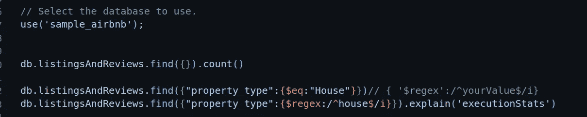
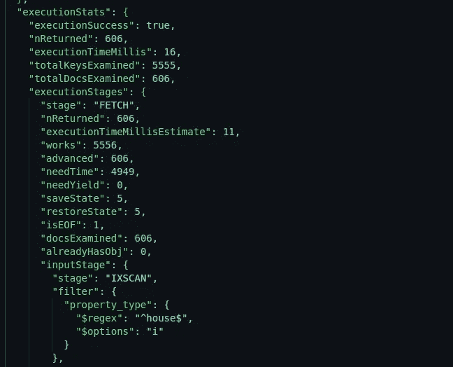
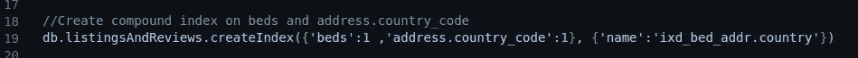

# MongoDB 集合的索引-第 1 部分

> 原文：<https://blog.devgenius.io/indexing-on-nosql-collection-part-1-59f3fe577110?source=collection_archive---------16----------------------->


索引使读取查询更快。我们可以对文档中的任何字段应用索引，包括嵌入字段。当文档被索引时，mongo DB 将首先使用过滤后的偏移量进行搜索，而不是对所有文档进行 COLLSCAN ( column-span ),然后对其应用过滤标准。

让我们通过创建现有集合的索引并比较应用索引前后的查询执行统计来理解这一点。

顺便说一下，我在这个演练中使用了 Mongo DB Atlas Free cluster。Mongo 亚多拉斯是一个基于云的解决方案，用于托管和管理 NoSQL 数据，它还提供了一个用于学习目的的免费集群，只需点击一下即可将样本数据集加载到您的免费集群中。我喜欢了:)

为了连接到 Atlas 集群，我使用了 VS 代码扩展“MongoDB VS Code”。还有其他方法，如使用 mongo shell、mongo Atlas UI。请参考下面的链接【https://www.mongodb.com/docs/atlas/getting-started/ T2

我正在使用加载到我的 Atlas 帐户中的“sample_airbnb”数据集，并使用 MongoDB for VS 代码扩展来查询它们。

> **请注意，以防图片截图不清晰可见。请在新的标签中打开它们，或者点击图片描述。**



[在“listingAndReview”集合上没有任何索引的情况下获取属性类型的查询](https://cdn-images-1.medium.com/max/800/1*hvVmMt7e0M2NkABcZsLV8g.png)

> 在上面的查询中，我对集合“listingAndReviews”执行查找查询，其中 property_type 是 house。我还使用 regex 获取结果，忽略大小写，并使用 explain('executionStats ')函数获取查询计划。

在有索引的情况下， ***winningPlan 部分将把 inputStage.stage 作为 IXSCAN***


[带索引](https://cdn-images-1.medium.com/max/800/1*VlYEObu2eitowhNYEDEMJA.png)的“listingandReview”的执行统计。

我从“listingAndReviews”集合中删除所有预先创建的索引，并重新执行相同的查询。我们可以看到 **winningPlan.stage 为“coll span”**而**execution stats . execution time millis 为 118。totaldocsexaminas 5555 找到了符合我们搜索条件的 606 条记录。**


不将索引应用于“listingAndReviews”集合的执行统计信息

让我们在字段“property_ type”上创建一个索引，以便更快地获取结果。


[在属性类型字段上创建单个索引](https://cdn-images-1.medium.com/max/1200/1*dKqX8j4Jppvr4EnzkJoJhg.png)



对“property_type”应用索引后获取查询的执行统计信息

> 要定义一个索引，我们需要了解所需的查询以及将要对集合执行的读写操作的数量。索引会对写操作造成一定的负担，这就是为什么我们不应该对所有的文档字段应用索引的原因。
> 
> **注意*在 fetch 查询将返回集合中接近所有文档的字段上创建索引没有帮助，事实上还会降低查询的执行速度。基于查询用例创建索引，以便查询结果应该只返回有限的获取结果。**

## 复合指数

上面的例子是关于单指数领域的。还有另一种称为“复合索引”的索引类型，其中两个或多个字段被认为是按照与它们被添加到 相同的 ***顺序进行索引。***

如果我们添加了两个字段作为复合索引，优先级将从左到右开始。例如，让我们使用“beds and address.country_code”(嵌入式文档)字段在“listingAndReviews”集合上创建一个复合索引。



使用床位数和地址国家代码的复合索引

这里字段的顺序很重要，优先顺序是从左到右。即，字段 beds 获得第一优先权，然后是 address.country_code。


在上面的查询中，尽管我们在 find 查询中使用了两个过滤器来获取床位数为 1 并且可以容纳 4 个人的结果。这里的“容纳”字段不是我们索引键的一部分。Mongo DB 执行 IXSCAN，即索引扫描，而不是跨越集合中所有文档的 COLLSPAN 列，因为我们将“beds”添加为键索引的一部分，并且优先级是从左到右的。

如果我们只查询容纳的字段，Mongo DB 会执行 COLLSPAN 并检查总数为 5555 的所有文档


到目前为止执行的 MongoDB 读取查询

```
// Select the database to use.
use('sample_airbnb');db.listingsAndReviews.find({}).count()db.listingsAndReviews.find({"property_type":{$eq:"House"}})// { '$regex':/^yourValue$/i}db.listingsAndReviews.find({"property_type":{$regex:/^house$/i}}).explain('executionStats')//Create index on field property_type 1 denotes ascending and -1 descending
db.listingsAndReviews.createIndex({"property_type":1})//Create compound index on beds and address.country_code
db.listingsAndReviews.createIndex({'beds':1 ,'address.country_code':1}, {'name':'ixd_bed_addr.country'})db.listingsAndReviews.find({'beds':1,'accommodates': {$eq:4}}).explain('executionStats')db.listingsAndReviews.find({'accommodates': {$eq:4}}).explain('executionStats')db.listingsAndReviews.find({'accommodates': {$eq:4}}).sort({'maximum_nights':1}).explain('executionStats')
```

**定义指数的规则**

[**使用 ESR(相等、排序、范围)规则**](https://www.mongodb.com/docs/manual/tutorial/equality-sort-range-rule/#std-label-esr-indexing-rule)

[**创建索引来支持您的查询**](https://www.mongodb.com/docs/manual/tutorial/create-indexes-to-support-queries/#std-label-create-indexes-to-support-queries)

[**使用索引对查询结果进行排序**](https://www.mongodb.com/docs/manual/tutorial/sort-results-with-indexes/#std-label-sorting-with-indexes)

```
We need index not only for fetching the results quickly but also to use sorting. In case of non indexed document, Mongo DB has limit of 32 MB in memory and this will time out in case sorting (Default in- memory sorting) of huge millions of document without indexing.
```

1.  [**保证指标适合 RAM**](https://www.mongodb.com/docs/manual/tutorial/ensure-indexes-fit-ram/#std-label-indexes-ensure-indexes-fit-ram)
2.  [**创建确保选择性的查询**](https://www.mongodb.com/docs/manual/tutorial/create-queries-that-ensure-selectivity/#std-label-index-selectivity)

在本系列的下一部分中，我们将深入研究其他类型的索引以及创建索引时要遵循的最佳实践。

**地理空间索引:**

Mongo DB 允许我们保存地理空间数据