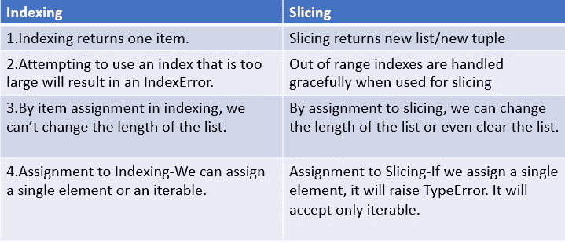

# Python 中的索引与切片

> 原文：<https://blog.devgenius.io/indexing-vs-slicing-in-python-de01cd99c499?source=collection_archive---------0----------------------->

## 了解索引和切片


照片由[比安卡·阿克曼](https://unsplash.com/@biancablah?utm_source=unsplash&utm_medium=referral&utm_content=creditCopyText)在 [Unsplash](https://unsplash.com/s/photos/slicing?utm_source=unsplash&utm_medium=referral&utm_content=creditCopyText) 上拍摄

# 索引和切片:

在 python 序列数据类型中，我们可以通过索引和切片来访问元素。序列数据类型有字符串、列表、元组、范围对象。让我们在本文中详细了解索引和切片。

# 本文涵盖的主题:


作者图片

# 什么是索引和切片？

**索引:** *索引*用于获取单个元素。

**切片:** *切片*用于获取一个元素序列。

索引和切片可以在 Python 序列类型中完成，如**列表、字符串、元组、范围**对象。

# 索引

索引从`0`开始。索引 `0`表示序列中的第一个元素。

负索引从-1 开始。索引`-1`代表序列中的最后一个元素。

# 字符串索引


**字符串索引(图片来源:作者)**

## 字符串中的索引示例

```
s="Python"
print (s[0])#Output:P
print (s[-1])#Output:n
print (s[-2])#Output:o
```

# 列表中的索引


列表中的索引(图片来源:作者)

## 列表中的索引示例

```
list_=[10,20,30,40,50]
print (list_[0])#Output:10
print (list_[-1])#Output:50
print (list_[-2])#Output:40
```

# 元组和范围对象中的索引

```
#Indexing - tuple
t=(1,2,3,4,5)
print (t[0])#Output:1
print (t[-1])#Output:5
print (t[-2])#Output:4

#Indexing - range object
r=range(5)
print (r[0])#Output:0
print (r[-1])#Output:4
print (r[-2])#Output:3
```

# 索引错误

试图使用过大的索引将导致 IndexError。

```
#Indexing - tuple
t=(1,2,3,4,5)
print (t[-6])#Output:IndexError: tuple index out of range

#Indexing - range object
r=range(5)
print (r[-7])#Output:IndexError: range object index out of range

#Indexing - List
n=[1,2,3,4,5]
print (n[6])#Output:IndexError: list index out of range

#Indexing -string
s="python"
print (s[7])#Output:IndexError: string index out of range
```

# 分配给索引

**不可变对象:**

为**不可变对象**如字符串、元组、范围对象分配索引位置将引发`TypeError`。

**元组、字符串、范围对象中的项目赋值:**

```
s="Python"
s[0]="j"
#Output:TypeError: 'str' object does not support item assignment

t=(1,2,3)
t[2]=7#Output:TypeError: 'tuple' object does not support item assignment

r=range(5)
r[0]=10
#Output:TypeError: 'range' object does not support item assignment
```

如果一个元组包含像列表一样的可变对象，我们可以为该列表进行项赋值。

```
t=(1,2,[3])
#Item assignment supported for list element inside tuple.
t[2][0]=7
print (t)#Output:(1, 2, [7])
```

**可变对象:**

列表中支持项目分配(可变对象)。

```
num=[1,2,3,4,5]
num[2]=99
*#list supports item assignment* print (num)
*#Output:[1, 2, 99, 4, 5]* colors=[**"red"**,**"blue"**,**"green"**]
colors[1]=**"yellow"** print (colors)
*#Output:['red', 'yellow', 'green']*
```

# 切片:

*   **切片(索引范围):**

我们可以指定一个索引范围。

```
s[i:j:k] — slice of *s* from *i* to *j* with step *k*
```

# 分割字符串

*切片*可以获得子串
1。`s[1:3]` —返回从第一个索引到第三个索引的元素(排除)。

```
s=**”Python”** print (s[1:3])
**#Output:yt**
```

2.`s[0:3]`-返回从字符串开头到第三个索引的元素(排除)。

```
s=**”Python”** print (s[0:3])
***#Output:Pyt***
```

3.切片索引具有有用的默认值；省略的第一个索引默认为零，省略的第二个索引默认为被切片的字符串的大小。

**省略开始索引:**

`s[:4]`-返回从字符串开头到第三个索引的元素。

```
s=**"Python"** print (s[:4])
***#Output:Pyth***
```

**省略停止指数:**

`s[2:]`-返回从第二个索引开始直到字符串结束的元素。

```
s=**"Python"** print (s[2:])
***#Output:thon***
```

**4。负指数。**

`s[-2:]`-返回从倒数第二个索引到字符串末尾的元素

```
s=**"Python"** print (s[-2:])
*#Output:on*
```

**5。使用步进索引。**

`s[1:5:2]`-使用步骤 2 返回从索引 1 到索引 5 的元素(不包括)。

```
s=**"Python"** print (s[1:5:2])
***#Output:yh***
```


图片来源:作者

**6。超出索引范围。**
用于切片时，超出范围的索引会得到妥善处理。

```
s=**"Python"** print (s[10:])
*#Output:''*
```

# 切片列表:

切片列表返回一个包含被请求元素的新列表。

1.  **浅抄。**

`n[:] -Returns shallow copy of the list.`

```
n=[0,1,2,3,4,5]
print(n[:])
*#Output:[0, 1, 2, 3, 4, 5]*
```

[浅抄](https://medium.com/analytics-vidhya/shallow-copy-vs-deep-copy-vs-assignment-in-python-921d7e413a3a)参考我的故事。

2. `n[1:3]`-返回包含从索引 1 到索引 3 的元素的新列表(排除)

```
n=[0,1,2,3,4,5]
print(n[1:3])
*#Output:[1, 2]*
```

**3。省略停止索引**

`n[1:]`-返回包含从第一个索引到列表末尾的元素的新列表。

```
n=[0,1,2,3,4,5]
print(n[1:])
*#Output:[1, 2, 3, 4, 5]*
```

**4。省略起始索引**

`n[:4]`-返回包含从列表开头到第三个索引的元素的新列表

```
n=[0,1,2,3,4,5]
print(n[:4])
*#Output:[0, 1, 2, 3]*
```

**5。切片返回一个新的列表，但是索引只返回项目。**

`n[1:2]`-返回包含来自索引 1.n 的元素的新列表

`s[1]`-返回索引 1 处的元素

```
n=[0,1,2,3,4,5]
print(n[1:2])
***#Output:[1]***print (n[1])
***#Output:1***
```

6。使用步骤:

`n[1:5:2]`-使用步骤 2 返回包含从索引 1 到索引 5 的元素的新列表(排除)。

```
n=[0,1,2,3,4,5]
print(n[1:5:2])
*#Output:[1,3]*
```

# 分配给切片:

分配给片也是可能的，这甚至可以改变列表的大小或完全清除它。

1.  分配给切片时，不需要指定相同数量的元素。我们可以指定任意数量的元素。这甚至会改变列表的大小。

```
n=[0,1,2,3,4,5]
#Replace some values
n[1:3]=[999]
print (n)#Output:[0, 999, 3, 4, 5]

n[1:]=[22]
print (n)#Output:[0, 22]
```

**2。我们必须只指定 iterable，而不是一个单独的元素。它将引发 TypeError。**

```
n=[0,1,2,3,4,5]
#Replace some values
n[1:3]=99
#Output:TypeError: can only assign an iterable
```

**3。我们必须为切片分配一个 iterable(列表/元组/字符串)。**

```
n=[0,1,2,3,4,5]
*#Assigning iterable to slicing* n[1:3]=[99]
print (n)
*#Output:[0, 99, 3, 4, 5]

#tuple one element* n[1:3]=(77,)
print (n)
*#Output:[0, 77, 4, 5]* n[1:3]=**'5'** print (n)
*#Output:[0, '5', 5]*
```

**4.Removing/deleting 元素被赋值给切片。**

```
n=[0,1,2,3,4,5]
n[1:4]=[]
print (n)#Output:[0, 4, 5]
```

**5。通过将空列表分配给 s[:]** 来清除列表

```
n=[0,1,2,3,4,5]
n[:]=[]
print (n)#Output:[]
```

# 薄片

> *一个对象通常包含一个* `***sequence***` *的一部分。使用下标符号创建切片，* `*[]*` *当给出几个数字时，数字之间带有冒号，例如在* `*variable_name[1:3:5]*` *中。括号(下标)符号在内部使用切片对象。-* [*Python 文档*](https://docs.python.org/3/library/functions.html#slice)

**切片构造器:**

```
slice(start,stop,step)
slice(stop)
```

返回一个切片对象，表示由`slice(start, stop, step)`指定的一组索引。*开始*和*步骤*参数默认为`None`。

```
num=[0,1,2,3,4,5]
num1=slice(1,3)
print (num1)
*#Output:slice(1, 3, None)* print (type(num1))
*#Output:<class 'slice'>*
```

**在扩展索引语法中使用切片对象:**

```
num=[0,1,2,3,4,5]
s=slice(1,3)
print (num[s])
*#Output:[1, 2]*
```

**islice():**

> *创建一个迭代器，从 iterable 中返回选定的元素。如果开始是* `*None*` *，那么迭代从零开始。如果步长是* `*None*` *，那么步长默认为一。如果 stop 是* `*None*` *，那么迭代继续，直到迭代器用尽，如果有的话；否则，它停止在指定的位置。* `*islice()*` *不支持负值的开始、停止和步进。-* [***Python 文档***](https://docs.python.org/3/library/itertools.html#itertools.islice)

```
itertools.islice(iterable,stop)
itertools.islice(iterable, start, stop[, step])
```

itertools.islice()

```
**import** itertools
*#if only one argument is mentioned other than iterable,it is stop value.* num=itertools.islice([1,2,3,4,5,6,7,8,9,10],5)
print (list(num))*#Output:[1, 2, 3, 4, 5]

#start=2 and stop=5 mentioned. It will start from second index and ends at fifth index* num=itertools.islice([1,2,3,4,5,6,7,8,9,10],2,5)
print (list(num))*#Output:[3,4,5]

#start=2,step=3.It will start from second index and increment by 3.* num=itertools.islice([1,2,3,4,5,6,7,8,9,10],2,**None**,3)
print (list(num))*#Output:[3,6,9]

#step is given as negative value,it raises ValueError* num=itertools.islice([1,2,3,4,5,6,7,8,9,10],2,**None**,-2)
print (list(num))*#Output:ValueError: Step for islice() must be a positive integer or None.*
```

## **分度和切片的区别。**



图片来源:作者

# 结论

*   使用索引的项赋值或使用切片的不可变对象(如字符串、元组、范围)的赋值将引发`TypeError`。
*   通过使用扩展索引语法(切片)，我们可以创建一个列表的浅层副本。
*   ITER tools . is lice()-返回一个迭代器，其中包含从 iterable 中选择的元素。
    `islice()`不支持负值的开始、停止和步进。

# 资源(Python 文档):

[**切片**](https://docs.python.org/3/library/functions.html#slice)

[ITER tools . is lice](https://docs.python.org/3/library/itertools.html#itertools.islice)

[**序列**](https://docs.python.org/3/glossary.html#term-sequence)

[分度和切片](https://docs.python.org/3/tutorial/introduction.html)

如果你喜欢阅读我更多关于 Python 和数据科学的教程，
关注我 [**中**](https://medium.com/@IndhumathyChelliah) 。

感谢阅读！