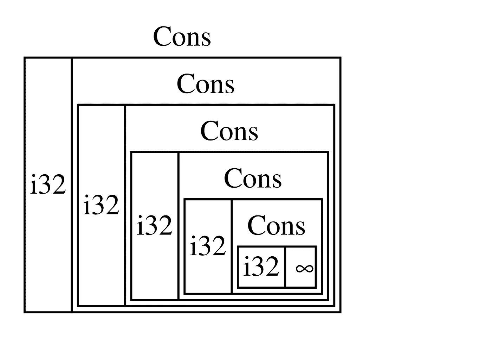

# 无限数据结构

> 原文：<https://blog.devgenius.io/infinite-data-structures-9c193789dae6?source=collection_archive---------8----------------------->

使用 scheme 和 lazy evaluation 形成无限列表

# 工具

我将在本指南中使用球拍编程语言。它是 scheme 的一种扩展方言，但是大部分代码应该可以直接转移到 R5RS-R7RS scheme。我相信概念可以在 scheme 之外有用和实现，它只是我选择使用的工具。Haskell 内置了无限列表，其他 Lisps 和函数式语言如 Javascript 当然可以用来实现无限列表。甚至 [Python](https://stackoverflow.com/questions/13910259/list-with-infinite-elments) 也可以使用相似或完全不同的方法制作无限列表。

# 惰性评估和流

显然，计算机没有无限的内存，所以整个无限的数据结构不能简单地存储在内存中。有些元素可以在内存中进行赋值，但有些必须保留，直到我们需要它们。将表达式求值延迟到需要该值时进行，这称为惰性求值。

## 延迟评估

如果我们想延迟一个表达式的求值，我们可以把它包装在一个 lambda 中。那么在我们对 lambda 求值并强制它的主体求值之前，它不会被求值。这可以通过定义一个冻结宏来实现，冻结宏只是将一个表达式包装在一个 lambda 中以延迟它的扩展。然后，解冻接受一个包装在 lambda 中的表达式(冻结表达式)并强制求值。

注意:这些函数通常被称为延迟和强制，但我在这里选择了不同的名称，以便不与内置函数冲突，并提供一个可视的图像。

## 流

流是一个缺点列表，其中尾部的评估被延迟/冻结，直到它需要被评估——一个懒惰列表。我们将永远有可用的头部，而对尾部的评估是冻结的。当我们要尾巴的时候，它会解冻，给我们一个价值。这很可能是另一个流，头部有一个值，尾部有一个冻结的表达式。这允许我们创建无限列表。上面给出了流的各种列表函数的定义，它们的行为类似于同名的列表函数，但是根据需要冻结和解冻尾部的求值。

# 无限列表！

最简单的无限流是全 1 流。这被定义为

`ones`实际上是一个无限列表。我发现有两种方法可以对正在发生的事情进行推理。

## 声明式方法

这种方法可以说是最漂亮的，但需要一些信任，而且开始时有点令人费解。透过陈述性的镜头来看问题需要看我们告诉计算机做什么，而不一定是它如何做。

假设无限个一的流存在。姑且称之为`ones`。根据定义，这个流的头必须是 1。所以我们很容易得到`(define ones (stream-cons 1 _))`，但是现在我们需要弄清楚它的尾巴是什么。如果流有无限个 1，那么它的尾部一定是一个无限个 1 的流。幸运的是，我们已经有了一连串的:`ones`！所以我们得到了`(define ones (stream-cons 1 ones))`

## 命令式方法

透过命令式镜头看问题需要看计算机实际上是如何评估表达式的。

我们来看看`ones` : `(define ones (stream-cons 1 ones))`的定义。这个定义是递归的——它引用自身。如果我们用它的定义替换表达式中的`ones`会怎么样？因为我们只交换了一个变量和它的定义，这将产生一个等价的表达式。

`(equal? ones (stream-cons 1 ones))` —按定义
`(equal? ones (stream-cons 1 *(stream-cons 1 ones)*))` —按个的定义
`(equal? ones (stream-cons 1 (stream-cons 1 *(stream-cons 1 ones)*)))` —按个的定义

这种扩展可以一直持续到无穷大，幸运的是这个列表很懒，所以只有当我们请求它的时候，它才会一直持续到无穷大。但是通过研究它，很明显这将产生一个无限的列表。

# 流添加

让我们定义一个函数 stream-add，它向下扫描两个流，将相应的元素加在一起，然后返回新的流。

现在一串二进制数

声明式推理，将两个结果流全部加在一起。强制性推理，stream-add 将每个流的头部加在一起(1 + 1 = 2)，然后添加尾部。尾部也是 1，所以一直向下就是 1 + 1 = 2。

# 日益增加的复杂性

到目前为止，我们的无限列表虽然是无限的，但并不十分有趣。让我们试着做一个自然数流。

## 陈述推理

假设自然数流存在。姑且称之为`nats`。根据定义，这个流的头必须是 1。所以我们很容易得到`(define nats (stream-cons 1 _))`，但是现在我们需要弄清楚它的尾巴是什么。列表的尾部现在必须是`'(2 3 4 5 6 7 8 …)`。这个列表是自然数和 1 的流的加法。幸运的是我们已经拥有了这两样东西。因此我们以`(define nats (stream-cons 1 (stream-add ones nats)))`结束

## 命令推理

让我们看看`nats` : `(define nats (stream-cons 1 (stream-add ones nats)))`的定义。这个定义是递归的——它引用自身。如果我们用它的定义替换表达式中的`(stream-add ones nats)))`呢。这将产生一个等效的表达式。

这导致了自然数的形成。同样，因为这是一条尾巴不会像这样延伸到无穷远处的河流，所以它只会在我们要求的时候进行评估。这样，列表实际上是无限的，但是我们不需要无限的内存来存储它。

# Fibonacci 数

这就是我认为这一概念进入下一个层次的地方。斐波那契数列

让我们看看为什么会这样。再次，假设斐波那契数列存在。姑且称之为`fibs`。
谎言是无限的列表`'(0 1 1 2 3 5 8 13 21 ...)`。我们再来看看`(stream-cdr fibs)` :
`'(1 1 2 3 5 8 13 21 34 ...)`。当我们将这两个流加在一起时，我们得到`'(1 2 3 5 8 13 21 34 55)`。所以`(equal? (stream-add fibs (stream-cdr fibs)) (stream-cdr (stream-cdr fibs)))`。

`fibs`的前两个元素根据定义是 0 和 1，因此称为`(define fibs (stream-cons 0 (stream-cons 1 _)))`。现在我们只需要弄清楚这条小溪的尾巴是什么；换言之什么`(stream-cdr (stream-cdr fibs))`。不过，我们已经有了定义！让我们把之前发现的关于`fibs`的属性塞住。我们得到`(define fibs (stream-cons 0 (stream-cons 1 (stream-add fibs (stream-cdr fibs)))))`。在我看来，这个流非常漂亮，它让我们看到了函数式编程和惰性评估的潜在力量和优雅。

如果这个陈述性推理仍然令人困惑(起初对我来说是这样)，你也可以用命令式推理向自己证明这是正确的。我将把这个留给读者做练习。

# 继续的

这个故事是第一部分。第二部分到了[这里](https://eric-breyer.medium.com/infinite-data-structures-part-2-6662f143e3b9)。它进一步进入了更多的无限列表和质数无限列表的压轴戏。

# 关于作者

Eric Breyer 是莱斯大学的计算机科学本科生。你可以在他的[网站](http://www.ericbreyer.com/)以及 [GitHub](https://github.com/ericbreyer) 和 [LinkedIn](https://www.linkedin.com/in/eric-breyer/) 上找到他。