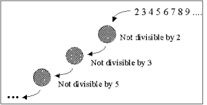

# 无限数据结构:第 2 部分

> 原文：<https://blog.devgenius.io/infinite-data-structures-part-2-6662f143e3b9?source=collection_archive---------8----------------------->

scheme 中的更多无限列表

这是我之前故事的延续，可以在这里找到。

# 流式联合收割机

[上次](https://eric-breyer.medium.com/infinite-data-structures-9c193789dae6)我们用`stream-add`做了几个有趣的流。我现在想介绍一个更通用的函数，它将让我们创建一些更有趣的流。

这个函数和`stream-add`几乎完全一样，除了我们可以传递任何操作给它，而不仅仅是`+`。`stream-add`和`(stream-combine +)`是等价的。

## 新力量

我们可以用这种新的组合方式创造出一些有趣的新流。我们通过将两个流相加来创建自然数，因此我们可以通过将两个流相乘来创建 2 的幂。

就像自然数一样，让我们假设 2 的幂流`powsOf2`存在。这个流是`'(1 2 4 8 16 32 ...)`，当我们把这个流和`'(2 2 2 2 2 2 ...)`相乘得到`'(2 4 6 8 16 32 64 ...)`。所以像以前一样，`((stream-combine *) twos powsOf2))`是我们列表的尾部，我们只需要用`1`开始。

另一个现在很容易构建的流是正方形序列。

阶乘呢

再次注意阶乘:`'(1 2 6 24 120 720 …)`乘以自然数:`'(1 2 3 4 5 6)`，等于阶乘:`'(2 6 24 120 720 5040 …)`的`cdr`。因为我们已经有了阶乘的`cdr`,我们只需要显式地从第一个阶乘开始，然后将两个阶乘组合起来。

如果这仍然有点令人困惑，我强烈建议你按照我在上一篇文章中展示的那样，完成工作中的基本流程。

# 走向质数

无限列表的一个最经典和优雅的例子是构造素数列表。用我们唯一的工具`stream-combine`这显然是不可能的，所以让我们介绍最后一个函数。

`stream-filter`带一个谓词和一个流。然后，它沿着列表向下，只保留满足谓词的项目，如果一个项目评估为 false，则跳过它。由于这些都是延迟评估的，`stream-filter`按需工作:只执行我们请求的必要内容。

## 简单用途

构造奇数的(许多)方法之一是从自然数中过滤出所有的偶数。

## 厄拉多塞的筛子

厄拉多塞筛是一种寻找质数的古老算法。本质上，您从 2(第一个质数)开始获取自然数列表。根据定义，任何二的倍数都不是质数，所以把它们从列表中删除。现在移动到下一个质数，从列表中删除它的所有倍数，依此类推。此过程将删除除 1 或自身之外的所有系数。([延伸阅读](https://en.wikipedia.org/wiki/Sieve_of_Eratosthenes))通常这个过程需要一个上界，但是我们已经找到了一种玩转无穷的方法。懒惰评估再次通过仅在我们需要时过滤来挽救局面。

筛网可视化

## 质数达到无穷大

sieve 函数简单地实现了上面描述的算法。它将流的第一个元素作为素数，过滤掉它的所有因子，并对下一个(素数)数重复这个过程。传递从 2 开始的自然数流会产生素数。

令人惊讶的是，我们可以在有限的内存空间内有效地创建无限的数据结构。它展示了懒评的一些威力和妙处。至于这些列表的实际使用，我不会在这里深入讨论，但是我发现这个[堆栈溢出线程](https://stackoverflow.com/questions/5284458/what-are-some-compelling-use-cases-of-infinite-data-structures)有一些有趣的地方。有些语言，比如 Haskell，内置了无限列表，所以这个概念不仅仅是理论上的。

# 关于作者

Eric Breyer 是莱斯大学的计算机科学本科生。你可以在他的[网站](http://www.ericbreyer.com/)以及 [GitHub](https://github.com/ericbreyer) 和 [LinkedIn](https://www.linkedin.com/in/eric-breyer/) 上找到他。