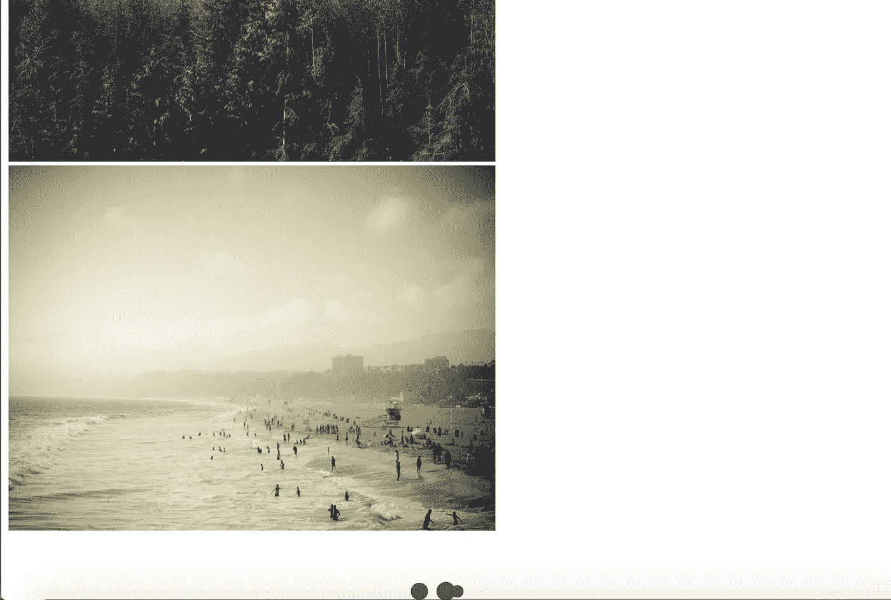
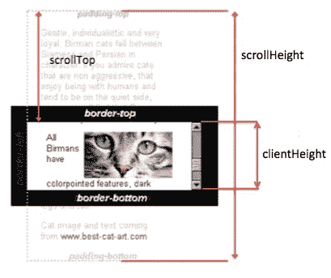

# 香草 Javascript 无限卷轴和照片库

> 原文：<https://blog.devgenius.io/infinite-scroll-with-photo-gallery-in-vanilla-javascript-9dc1d3896cf7?source=collection_archive---------3----------------------->

在 [Unsplash](https://unsplash.com?utm_source=medium&utm_medium=referral) 上由 [Vincentas Liskauskas](https://unsplash.com/@vincentas_?utm_source=medium&utm_medium=referral) 拍摄的照片

像世界上大多数人一样，你可能有一个 facebook 账户。

你有没有想过为什么当你沿着主页向下滚动时，你会看到更多的帖子出现？

今天我们将解释它是如何与普通的 javascript、css 和 html 一起工作的。

为了理解所有这些是如何工作的，让我们首先理解整个应用程序将如何被构建在一起。这有三个组成部分:

*   包含图像和加载指示器的 html
*   一个 css 文件，控制装载指示器的动画和图像的大小
*   一个 javascript 文件，包含获取图像的逻辑，检测用户何时滚动到页面底部的逻辑，以及当用户向下滚动以获取更多图像时提供加载新图像的时间的超时逻辑。

让我们来看看下面的 html 文件:

在这里，我们有一个容器，目前不包含任何图像。至于如何检索图像，我将在展示 javascript 逻辑是如何编写的时候解释。

第二部分是装载部分。加载指示器的动画将由 css 文件控制。默认情况下，这个加载指示器是隐藏的，但是一个 css 规则可以用来显示加载指示器。当用户滚动到页面底部时，事件监听器会将 show 类添加到 loading div 中，以显示加载指示器。

现在让我们来看看 css 部分:

好的，这有很多需要吸收，所以让我一点一点的记下来。

让我们来看看 css 的加载规则。请注意，不透明度为 0；这将在屏幕上隐藏装载指示器。我们还有一个额外的规则，那就是. loading.show。只有当包含 loading 类的 div 也包含 show 类时，这个规则才适用。当用户滚动到页面底部时，show 类将被添加到 javascript 文件中。

为了使它更明显，下面是当加载指示器:

我将讨论当我们转移到 javascript 文件时，show 类是如何被删除的。更重要的是. loading.show 将显示不透明度为 1 的加载指示器。

让我们来看看。球 css 属性:

在这里，我们有一个 display: block，它在装载指示器的上方和下方生成空间。它还专门为加载指示器本身保留了整行。我还设置了 animation-duration 属性，它规定了装载指示器的动画将运行多长时间。

动画计时功能指示动画将如何进行(例如缓慢滑动、一次滑动一步、缓慢滑动但重复滑动)。

这张截图不会显示动画，但应该可以看到它的样子:

在我们的例子中，我们让加载圆(加载指示器的一部分)滑动，但在一个无限的周期内重复，因此动画迭代计数属性设置为无限。这决定了动画发生的频率。

让我们再仔细看看几个有球的 css 规则:

我们来看看@关键帧是什么意思。

@keyframes 指定动画代码。它有两个值，一个 from 值和一个 to 值。这指定了最初将发生的动画效果逐渐改变为其他效果。

例如，使用 reveal 属性，我们最初有一个动画，将圆缩放到非常小，然后随着它慢慢显露出来而放大。

对于滑动，我们只是描述它的动画将会是什么样的，即水平滑动 1em。

让我们看看每个球分区的 css。所有这些球代表了形成装载指示器的点。对于前两个球 div，我们希望缓慢显示加载指示器，然后放大它，显示加载动画。对于第三个球格，我们只想向右滑动，对于第四个球格，我们显示加载点，然后反转动画(通过动画方向属性)。

克林特·帕特森在 [Unsplash](https://unsplash.com?utm_source=medium&utm_medium=referral) 上拍摄的照片

有很多要消化，对吧？css 用加载指示器做了很多有趣的动画效果。让我们远离 css 逻辑，看看 javascript 逻辑如何在幕后处理事情:

这有几个组成部分。一个是获取图像的函数，另一个是用于滚动的事件监听器，它指示何时显示加载指示器和获取新图像。

让我们来看看 getImages 函数。在这里，我们使用 page 和 limit 作为 url 参数进行 api 调用来获取照片。该页面指定了我们从 url 的哪个页面获取照片，并且该页面在每次调用该函数时都会增加，每次都会呈现不同的图片。

一旦 api 返回 img 信息，我们就创建 4 个不同的 img 元素，将指向实际图像的 url 附加为 src 属性。之后，我们将每个 img 元素添加到容器中。因为我们刚刚加载了新的图像，所以我们也可以从容器 div 中删除 show 类，有效地隐藏加载指示器。

我们有另一个函数叫做 showLoading。我们寻找加载指示器 div，并向它添加 show 类。当 show 类是加载指示器 div 的一部分时，css 逻辑会将加载指示器不透明度更改为 1。

最后但同样重要的是，我们调用 window.addEventListener 来实现滚动功能。在这里，我们尝试从根文档访问滚动高度和客户机高度，根文档实际上是 html 页面的根节点。

那么，什么是 scrollTop、scrollHeight 或 clientHeight 呢？

让我们来看看下图:

当我们有一个满是帖子的页面，需要多个滚动条才能看到时，我们有一个 clientHeight，这是我们目前看到的。我们有一个 scrollTop，它是我们目前看到的当前帖子上方所有内容的高度。我们还有 scrollHeight，它是实际页面中所有内容的高度，无论是可见的还是不可见的。在这里，我们检查如果 client height+scroll top≥scroll height-5，我们将检索更多的图像。

那是什么意思？这意味着当 clientHeight + scrollTop 几乎等于或大于 scrollHeight 时，我们就没有可以向下滚动的内容了。这时，我们知道我们可以检索更多的照片，作为让无限照片图库就位的要求的一部分。

埃文·丹尼斯在 [Unsplash](https://unsplash.com?utm_source=medium&utm_medium=referral) 上的照片

到目前为止，我们已经介绍了所有的部分，但是这有什么关系呢？

首先，无限滚动在今天的很多平台上都很常见，比如 twitters 和 facebook。如果你要去参加前端开发人员面试，他们很有可能会问你这个问题。

其次，这将帮助你更好地理解 css 动画是如何工作的，并理解 api 调用是如何在初始化时触发的等等。

就是这样！试着自己实现它，看看效果如何！如果您想了解这在 react 中是如何实现的，也可以阅读下面的文章:

[https://kaleongtong 282 . medium . com/infinite-scroll-with-photo-gallery-in-react-c 7219 b 8 be 2 a 0](https://kaleongtong282.medium.com/infinite-scroll-with-photo-gallery-in-react-c7219b8be2a0)

快乐编码。