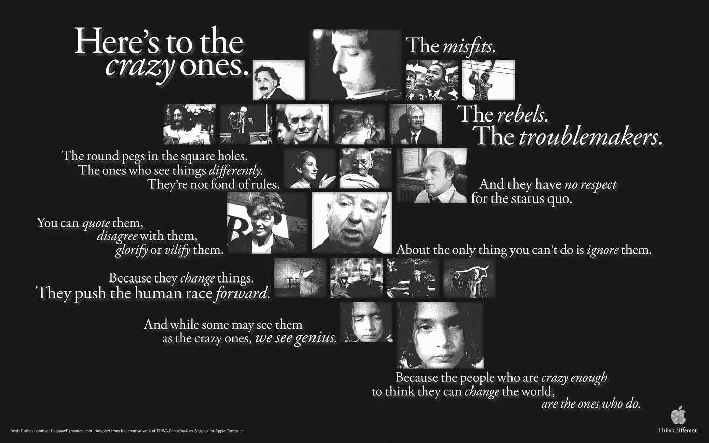
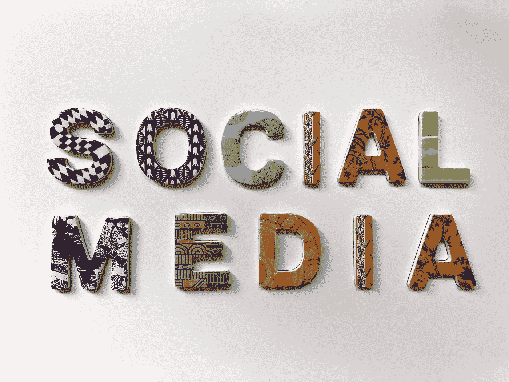

# 影响者营销正在兴起！但是，在接下来的两年里，它将会改变..

> 原文：<https://blog.devgenius.io/influencer-marketing-is-on-rise-now-but-it-will-change-in-the-next-2-years-5a181746f747?source=collection_archive---------4----------------------->

## 广告

即使社交网络的最初目的是与你的朋友和家人联系，它也为许多不同的使用案例打开了大门。现在有如此多的社交网络，但所有主要的社交网络都服务于不同的目的，彼此之间没有竞争。

*   Instagram:分享你生活中的照片，对每天发生的事情的喜好和兴趣
*   推特:分享你对周围发生的事件的想法
*   Pinterest:分享你对某个领域的喜好，比如室内装饰
*   脸书:嗯，与你的朋友和家人联系，但现在真的感觉像一本广告公告书。

尽管这些产品在同一个区域，但它们并不是真正地相互竞争，而是竞争获得大多数用户的时间。

# 广告——广告牌、报纸、电视

在早期，公司使用广告牌做广告。不要误会我的意思，他们仍然在那里，但它不再是一个主要的广告渠道。报纸广告是另一个来源，那里曾经有好几页的广告。还记得 1984 年著名的苹果广告吗，其中一些广告变得如此受欢迎。

(来源: [ThoughtRod](http://www.thoughtrod.com) )

即使这些服务的目的，广告不是个性化的。公司付钱给这么多对产品毫无兴趣的人。

# 互联网广告

[LinkedIn 销售导航员](https://unsplash.com/@linkedinsalesnavigator?utm_source=medium&utm_medium=referral)在 [Unsplash](https://unsplash.com?utm_source=medium&utm_medium=referral) 上的照片

随着互联网的兴起，公司开始更多地了解用户、他们的喜好、兴趣、他们在寻找什么等等。有了这样的数据，它就可以将广告准确地定位到将购买其产品的用户，而不是其他人。因此，公司基本上支付更少的费用，获得更多的转化。对于公司来说，这是一条神奇的途径。现在，如果你正在搜索手机充电器，它将只显示充电器的广告。

## 但是，有效性正在下降..

因为它是有效的，公司现在过度使用它，用户开始对广告感到厌烦。还有隐私，因为随着技术和机器学习等的进步，公司几乎开始跟踪用户的每个细节和活动。大量的数据可以立刻被存储和分析。

现在每个网站都有很多广告，这些广告对用户不友好。当公司过于关注这个问题——“我怎样才能向客户展示这个广告，而不遗漏”，而不太担心“这种体验是否让用户感到沮丧”。现在有整页弹出广告，一个页面上有多个广告位，用于实际内容的空间更少。有了这样的体验，用户开始不关注这些，对这样的广告变得盲目。现在，当有弹出窗口时，我会寻找关闭按钮，而不是实际的广告。

# 社交网络和反过来的影响者的崛起

随着脸书的出现，社交网络成为每个人生活的一部分，随着手机、wifi 速度和蜂窝覆盖的改善，几乎每个人每天都在使用手机和社交网络。好吧，就在他们的“空闲时间”。有了它，普通人只需点击一下鼠标，就可以联系到世界另一端的任何人。因此，人们开始更多地分享他们的个人生活、兴趣和观点。当你们有共同的兴趣时，你会倾向于喜欢它们，实际上，会追随它们。影响者的概念应运而生，因为当一个拥有数百万追随者的人推荐一种产品时，人们会信任他们。作为一个用户，因为我开始关注某人是因为我喜欢他们，信任已经建立起来了。有了这个，效果远高于任何形式的广告。

在 [Unsplash](https://unsplash.com?utm_source=medium&utm_medium=referral) 上 [Merakist](https://unsplash.com/@merakist?utm_source=medium&utm_medium=referral) 拍摄的照片

这为有影响力的人打开了大门，让他们有了收入来源，最初是兼职收入。但是，广告是十亿(是万亿吗？不确定)美元业务和公司开始注意到这一趋势和影响者的影响范围。所以，一开始，有影响力的人推销他们喜欢的和个人使用的产品，但现在他们也开始代表公司并推销他们的产品。

# 它现在去哪儿了？

影响者营销现在正在兴起。有很多人开始拥有越来越多的追随者。很多书和文章都是写如何吸引追随者的。影响者营销现在是一项全职工作，公司越来越倾向于这种广告，而不是遵循传统的方法。

照片由[约书亚·罗森-哈里斯](https://unsplash.com/@joshrh19?utm_source=medium&utm_medium=referral)在 [Unsplash](https://unsplash.com?utm_source=medium&utm_medium=referral) 拍摄

尽管它主要始于时尚产品，但却扩展到了每一个产品类别。互联网广告现在不仅仅是被污染了，所以影响者广告是现在的事情。

但是，问题是，由于如此受欢迎，这是否也会像互联网广告一样。如果有影响力的人开始推广更多的赞助产品，他们会失去信誉吗？人们会对这种广告变得盲目吗？

将会有一些有影响力的人，他们将是真诚的，即使有赞助商的产品，他们也可能会仔细选择，而不是推销任何东西。但是，肯定在几年内(或更短时间内)，影响者营销将成为另一种互联网广告，进入这一领域将不会像现在这样容易。

乔恩·泰森在 [Unsplash](https://unsplash.com?utm_source=medium&utm_medium=referral) 上的照片