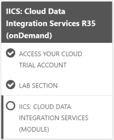

# Informatica:迈向 Informatica 智能云服务的第一步(IICS)

> 原文：<https://blog.devgenius.io/informatica-first-step-toward-informatica-intelligent-cloud-services-iics-620c113f6021?source=collection_archive---------3----------------------->

我很多读者私下给我打电话，问我一个简单的问题，为什么你只在雪花上写，而不在其他东西上写。因此，我向大家分享我迈向 Informatica 智能云服务(IICS)的旅程，这是一个 Informatica 云智能套件。我只为雪花写作的唯一原因是因为我想专注于一项技术，然后继续研究其他技术。

几个月前，我有机会在 Informatica 的新云智能服务中学习。我想分享我如何开始学习 IICS 的旅程，如果有人也有兴趣这样做，可以跟随我的学习之路。

什么是 Informatica 智能云服务(IICS)？

它是下一代 iPaaS 解决方案，可用于在应用程序或业务合作伙伴之间交换数据。您可以使用 IICS 来集成、同步和关联驻留在本地或云环境中的数据、应用程序和流程。

借助 IICS，您可以轻松执行复杂的业务流程，例如:

*   在数据源之间导入或迁移数据
*   执行对象同步以在多个应用程序上创建数据副本。
*   设计流程集成以连接多个流程。
*   出于备份和归档目的，在数据源之间复制数据。

云可以推动创新，提高效率，并帮助重新定义业务流程。但是，只有当您的云基础架构允许您集成、同步和关联所有数据、应用程序和流程时，才能实现这些优势——在内部或您的多云环境的任何部分。所有产品的通用用户体验、[CLAIRE engine](https://www.informatica.com/nl/about-us/claire.html)的 AI/ML 驱动智能以及微服务架构加速了环境的生产力。

# IICS 平台的能力

IICS 平台提供实时和批量集成服务。它还提供了连接数据源的连接器和创建定制连接器的 SDK 工具包。

核心集成平台服务包括:

*   数据同步
*   数据复制
*   工序自动化
*   测试数据管理
*   云 DQ 雷达
*   云集成中心(CIH)
*   云 B2B

资料来源:信息

我对 IICS 很陌生，也有很多信息涌入，我真的不知道该做什么，不该做什么，从哪里开始。我相信，即使不是所有人，也会有更多的人有同样的感受。所以，对于那些想跟随我学习道路的人，可以跟随我下面的书。

**注:**本课程适用于 R35 版本。了解 Informatica 智能云服务(IICS)的基础知识，包括架构和数据集成功能、同步任务、云映射设计器、屏蔽任务和复制任务。本课程使您能够在 IICS 操作和管理用户安全、安全代理以及监控任务和资源。

**第一部分:初始设置**

1 >打开链接:[https://now . informatica . com/IICS-云-数据-集成-服务-onDemand.html](https://now.informatica.com/IICS-Cloud-Data-Integration-Services-onDemand.html)

2 >点击“注册”按钮，注册“IICS:云数据集成服务 R35(按需)”

3 >您将看到登录页面。因为你不是 Informatica 大学的注册学生，你需要在这里做第一层注册。点击[需要帮助登录吗？](https://infapassport.okta.com/app/informaticapassport_informaticalearningmanagement_1/kv7rzxv1ITTFXRGBOUVX/sso/saml)"然后点击[没有账户？在这里报名](https://accounts.informatica.com/registration.html)”

4 >您将进入下一页。提供您的个人电子邮件 ID，您将在几秒钟内收到确认邮件。按照邮件中的说明，激活/确认您的帐户。

5 >再次打开邮件中提供的链接，点击立即注册并登录:[https://now . informatica . com/IICS-云-数据-集成-服务-onDemand.html](https://now.informatica.com/IICS-Cloud-Data-Integration-Services-onDemand.html)

6 >点击登录面板上的 Informatica 大学。您将在屏幕下方看到。

资料来源:信息

7 >开放课程“IICS:云数据集成服务 R35(按需)”。课程概述如下所示:

 [## 信息大学

### 本课程适用于 R35 版本。了解 Informatica 智能云服务(IICS)的基础知识…

now.informatica.com](https://now.informatica.com/IICS-Cloud-Data-Integration-Services-onDemand.html) 

8 >课程模块简表附后。

**第二节:实验室经费&理论**

资料来源:信息

1 >课程分为以下 3 个部分:

**第一部分**只是做 IICS 云试用，我发现有一些问题，因为它不允许我使用我的个人电子邮件 ID 注册自己，只要求公司电子邮件 ID。因为我想用我的个人电子邮件 ID 注册，所以我选择了不同的途径&通过下面的流程单独注册。

**创建 Informatica 云试用组织**

1.要创建试用组织，请在 web 浏览器中打开以下链接:

[https://www.informatica.com/trials.html](https://www.informatica.com/trials.html)

2.在页面中，选择**云数据集成**选项，点击选择试用。

3.在注册页面上，输入所需信息，然后单击开始免费试用。

第二部分**即实验部分**，该部分进一步分为 3 个子部分，前 2 个是所有实验部分的简单脚本下载，第三个是所有实验的文档/说明，实验部分相当长(360 页文档),这将测试你在完成该部分时的专注程度&耐心。共有 20 个模块，每个模块都有多个实验室。从模块 0 到模块 2 ( 3 个模块)，都是关于以下内容的设置/概述:

1 >云 IICS 设置和概述

2> Salesforce 帐户创建和概述

3> Oracle 和 Sql Developer 安装

4 >邮递员安装

5> IICS 安全代理安装

这将需要 3-4 个小时来完成所有的事情，因为所有的软件下载，安装和帐户设置都需要时间。

模块 3 -7 和 11–20(15 个模块)是纯实验，包含详细步骤和屏幕截图。非常直接。此部分用于下载实验室说明。实际上，您将在第 3 部分“**云数据集成服务**”中学习所有实验和理论。

**第 3 部分**是“**云数据集成服务**”。这是理论部分，也包括所有 20 个模块。每个模块都有自己的理论，然后是一个或多个实验。以知识检查结束。

**需要记住的事情:**

1 >对于所有初始设置，保留文本中注明的所有 URL、用户名、密码、令牌和其他小细节，以便在稍后阶段使用。否则，如果你不能用单一或连续的方法继续下去，你可能会在适当的时候忘记。

2 >将所有重要的网址加入书签，以备将来研究之用。

3> IICS 云试用账户有效期为 30 天。它只能工作 30 天，然后你必须购买。所以确保你在 30 天内完成所有的实验。

4 >最初在实验中你会觉得有点慢，因为所有的 UI 和流程对我们来说都是新的，但是在几个实验之后，你似乎理解了文档的下一步。

5 >确保从管理员用户或拥有所有管理员权限的用户运行您的 **ICS 安全代理**。您可以通过 services.msc 执行此操作。如果尚未使用 Admin 用户启动，您必须先停止 Secure agent，然后修改用户。下面截图。

资料来源:信息

6 >我注意到的一件重要事情是，由于每个功能都有非常详细的实验，在几个实验之后，您可能会开始忘记之前做了什么。最好记下您在之前的实验中完成的每个功能。不管怎样，你都要在理论部分复习同样的内容。

7 >实验说明中提供的用于下载 Oracle SQL developer 的链接不起作用。你可以用下面的下载 20 个。x 版本

[https://www . Oracle . com/tools/downloads/sqldev-downloads . html](https://www.oracle.com/tools/downloads/sqldev-downloads.html)

8 >在模块 0–2 中创建 Salesforce 连接时，您将找不到 Salesforce Connector。相反，您必须添加新连接器(管理员>附加连接器> Salesforce 连接器)。你必须点击“开始免费旅行”。它只能工作 30 天，然后你必须购买。所以确保你在 30 天内完成所有的实验。

资料来源:信息

拥有 30 个实验室的主页面板截图。最后，实现这次学习的目标。

**完成这个实验后，你会有什么收获？**

亲身体验 IICS。

可以在社交媒体上展示的课程结业证书。

向新工具迈出更进一步的自信。

**你可以找到我:**

**跟我上媒:**[https://rajivgupta780184.medium.com/](https://rajivgupta780184.medium.com/)

**在推特上关注我:**[https://twitter.com/RAJIVGUPTA780](https://twitter.com/RAJIVGUPTA780)

**在 LinkedIn 联系我:**[https://www.linkedin.com/in/rajiv-gupta-618b0228/](https://www.linkedin.com/in/rajiv-gupta-618b0228/)

**订阅我的 YouTube 频道:**[https://www.youtube.com/channel/UC8Fwkdf2d6-hnNvcrzovktg](https://www.youtube.com/channel/UC8Fwkdf2d6-hnNvcrzovktg)

#坚持学习#坚持分享#每天学习。

## 参考资料:-

*   [https://www.informatica.com/](https://www.informatica.com/)