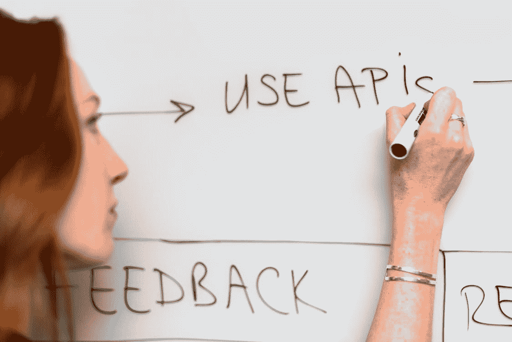

# 作为代码和 API 的基础设施

> 原文：<https://blog.devgenius.io/infrastructure-as-code-and-apis-b3e4f0c6eb1b?source=collection_archive---------1----------------------->

来自 [Pexels](https://www.pexels.com/photo/woman-writing-on-whiteboard-3861943/?utm_content=attributionCopyText&utm_medium=referral&utm_source=pexels) 的 [ThisIsEngineering](https://www.pexels.com/@thisisengineering?utm_content=attributionCopyText&utm_medium=referral&utm_source=pexels) 摄影

我们知道基础设施是隐藏的部分，是任何建筑的基础。在信息技术的上下文中，这个词有类似的意思。基础设施是隐藏的物理组件，软件在其上运行。

一开始，我们必须手动配置基础架构组件。然后，虚拟化出现了。通过虚拟化，组件传递到虚拟和物理世界中。它们继续存在于物质世界中。但是在虚拟世界中，我们定义了它们的配置。这样可以最大限度地利用物理组件。

虚拟化流程还改善了操作员体验。友好的用户界面，而不是手动步骤。远程管理，而不需要在本地。这使得复杂的基础设施系统可以通过“点击”来设置。

这是一个巨大的进步！我们不得不承认！虚拟化使基础架构管理变得更安全、更快速，而不是需要花费数天时间来操作物理组件。

但是，手动方法对于某些用例来说还不理想。我们如何一次又一次地重建同样的基础设施？我们如何在不需要更多人的情况下，使用“点击”从几十个资源增加到几千个资源？
很明显，将程序记录在检查表中是不够的。也不雇佣数百名操作员。

下一步:现在我们希望我们的虚拟化工具自动化，并与其他解决方案集成。虚拟化解决方案、强大的应用程序编程接口(API)取代了面向人的界面(GUI)。

代码形式的基础设施就是:使用代码管理配置。根据写在代码上的内容进行 API 调用，而不是使用图形界面。

配置这个词是有目的的。当我们将基础设施称为代码时，我们不再仅仅指虚拟化的硬件。而是可以通过 API 管理的任何类型的配置。

API 是代码移动的基础设施。

如今，使用代码来管理 SaaS 配置和其他工具是很常见的。即使对于内部平台，这也成为可能。

所以，当有人把基础设施作为代码跟你说的时候，记住:是 API 让这一切成为可能！

为了了解更多与 SRE 相关的话题，我推荐我的 Udemy 课程，比如:[https://www.udemy.com/course/sre-the-big-picture/?referral code = fa 215 c 81 b 6 b 26 c 631 f 5f](https://www.udemy.com/course/sre-the-big-picture/?referralCode=FA215C81B6B26C631F5F)