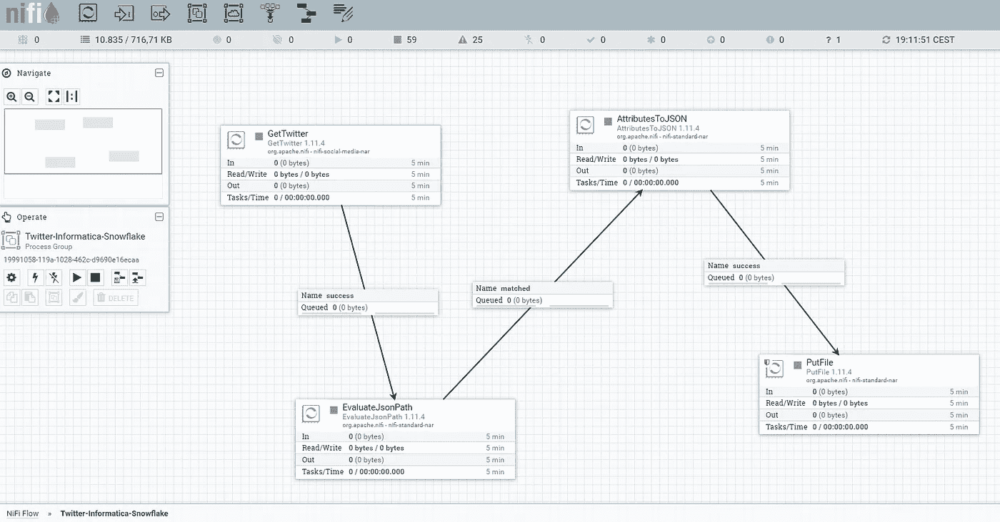
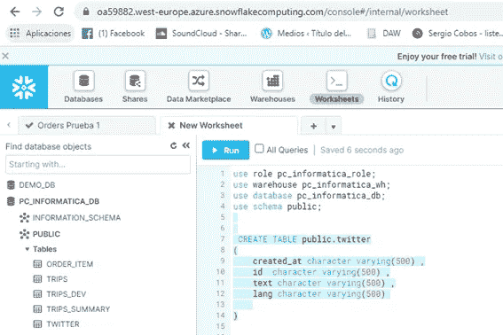

# 使用 Apache NiFi 和 Informatica 智能云服务在雪花上摄取推文

> 原文：<https://blog.devgenius.io/ingest-tweets-on-snowflake-with-apache-nifi-and-informatica-intelligent-cloud-services-b4196af438ec?source=collection_archive---------2----------------------->


所有徽标、商标均为各自公司的版权。

# **语境**

在本文中，我们将看到如何在云中的关系数据库中管理、转换和存储 JSON 这样的半结构化信息，以充分利用 JSON 的灵活性和 RDBMS 的健壮性。

我们还将了解如何使用 Oracle 和 Tableau 等工具将这些信息“下载”到经典的数据分析和开发环境中。

# 先决条件

要创建这个实验室，必须在计算机上安装 Apache NiFi，这可以通过两种方式完成:在内部安装，

https://nifi.apache.org/download.html

或者下载 CLOUDERA 提供的“沙盒”，也是免费的。

[https://www . cloud era . com/downloads/Horton works-sandbox/hdf . html](https://www.cloudera.com/downloads/hortonworks-sandbox/hdf.html)


Hortonworks 沙盒 HDF 3.1 在虚拟盒子上运行

此外，有一个雪花帐户是必要的，截至本文发表之日，雪花提供 30 天的免费试用。

[https://signup.snowflake.com](https://signup.snowflake.com/)

一旦你有了雪花账户，你就可以从那里连接到 Informatica 的智能云服务(IICS，从现在开始)并享受一定数量的免费处理。(这种联系会在文章后面看到)。

# **摄取过程的配置和创建**

## 尼菲阿帕奇流



我们将在实验室中使用的 NiFi Apache 流

我们从创建 NiFi 中的流开始，这将非常简单。

*Apache NiFi 模板的下载链接:*

[https://github . com/sergicobosgarcia/Ingesta-de-Tweets-en-snow flake-con-Apache-NiFi-e-Informatica-Intelligent-Cloud-Services/tree/master/Template](https://github.com/sergioCobosGarcia/Ingesta-de-Tweets-en-Snowflake-con-Apache-NiFi-e-Informatica-Intelligent-Cloud-Services/tree/master/Template)

我们只想收集包含我们正在寻找的单词的 tweets，为此我们将使用 GetTwitter 处理器，我们必须用我们的 Twitter 开发人员 API 数据进行配置。

[https://developer.twitter.com/en/app](https://developer.twitter.com/en/apps)


Twitter API 开发者


配置 NiFi GetTwitter 的密钥和令牌


盖特维特

这个处理器为每条包含单词冠状病毒的 tweet 返回一个 JSON。


推特上 JSON 格式的射线照相术🐦🐦

这个 JSON 将被处理，以分离出需要分析的名称-值对。这一步是在 **EvaluateJsonPath** 处理器中完成的，在这里创建属性来为存储名称-值对的变量赋值。在这种情况下，它们被选中:

**推文的创建日期。**

**推文的 ID。**

**推文的语言。**

**推文本身。**


EvaluateJsonPath

一旦我们有了感兴趣的 JSON 字段，就对它们进行过滤，只保留前面的 **EvaluateJsonPath** 步骤中存储在变量中的信息。

这是在 **AttributesToJSON 中完成的。**


AttributesToJSON


JSON 已处理

现在，JSON 已经处理了所需的信息，我们将通过 **PutFile** 处理器把它存放在一个路由上，IICS 将在这个路由上监听执行对雪花的摄取。


PutFile

# **注意事项**

应该注意的是，GetTwitter 处理器可以配置为执行实时摄取(0 秒)或使其适应我们在 IICS 配置的计划，同时记住我们可以处理任何 JSON，当然不仅仅是 tweets。


推特搜索频率

信息量将取决于在推文中搜索的术语，在这种情况下，每秒钟包含单词**冠状病毒**的推文量确实很大。

# **雪花表格创建并与 IICS** 链接

在创建表格之前，我们将通过 Partner Connect 将雪花帐户链接到 IICS。


雪花合作伙伴连接

此操作将在 Snowflake 实例中生成以下对象，并将您重定向到 IICS 用户创建页面，您可以在该页面免费注册并使用 IICS(在这种情况下，您之前已经拥有关联帐户)。


IICS 物体

一旦这两个工具链接起来，我们将在 Snowflake 中创建一个表，它包含与我们在 NiFi 中过滤和处理的 JSON 格式相同的字段和模式。



创建表格

```
use role pc_informatica_role;use warehouse pc_informatica_wh;use database pc_informatica_db;use schema public;CREATE TABLE public.twitter (created_at character varying(500) ,id character varying(500) ,text character varying(500) ,lang character varying(500))
```

# **IICS 的批量摄取任务**

现在，我们将继续配置接收推文的任务。在此步骤中，有必要配置 IICS 安全代理，其步骤可在其教程中找到。

[https://docs . informatica . com/integration-cloud/cloud-data-integration/current-version/getting-started/installing-secure-agents/secure-agent-installation-on-windows . html](https://docs.informatica.com/integration-cloud/cloud-data-integration/current-version/getting-started/installing-secure-agents/secure-agent-installation-on-windows.html)

从信息数据集成->新建->批量摄取任务中选择。


批量摄取任务

这将启动向导来创建此任务，在步骤 1 中，我们选择环境，在本例中，是已经配置了 IICS 安全代理的我的本地。


运行时环境


在 Informatica 云安全代理中一切正常。

在第二步中，我们配置源并指出连接的类型。在这种情况下，由于它是与本地文件夹的连接，要配置的参数如下:

IICS 希望存放文件的目录。(将是 Apache NiFi PutFile 中指示的那个)。

**待处理文件的模式。**(路径中的所有 JSON 文件)。

**一旦文件被成功接收，该如何处理。**


源选项

第三步是关于摄取的目的地，选择雪花实例和来自 DWH 的信息，其中目的地表已经被创建，最后也是最重要的是，**它指示在处理和格式类型中出现错误的情况下该做什么，因为如果没有指示格式，名称-值对将被输入到表中，而不仅仅是我们感兴趣的值。**

**on _ error = ABORT _ STATEMENT&&FILE _ FORMAT =(TYPE = JSON)&&MATCH _ BY _ COLUMN _ NAME = CASE _ INSENSITIVE**


目标选项

该向导的第四步也是最后一步是分配或不分配执行该任务的时间表。在这里，您可以设置一个批处理过程，其中 NiFi 不断地处理推文并将它们存放在路线上，而 IICS 每天在某个时间处理当天由 NiFi 流摄取的所有内容。


工作规划

为此，您可以选择按计划运行此任务的选项，并选择 Informatica Administrator 为此创建的计划，在此示例中没有使用计划。


我们不想计划任何事情

一旦完成，保存任务，在我的例子中，我把它叫做 **Tw** 。

# 摄取过程的执行和检查

启动 NiFi 流。


几秒钟内 169 条与冠状病毒相关的推文

检查显示的文件夹是否用 JSON 填充了从 tweets 处理的信息。


推特。JSON


存放在 PutFile 路径中的一个 JSON 文件

在开始摄取任务之前，检查表格是否为空。


0️⃣

在 IICS 从浏览器中选择之前创建并保存为 **Tw** 的任务，并启动批量摄取任务。


运行 Tw

在“我的工作”中，您可以看到流程的状态。


运行 Tw

一旦成功完成:


成功

我们检查雪花表是否以正确的格式包含来自 tweets 的信息。


雪花上的推文

并且 IICS 已经从所示的文件夹中删除了文件。


rm — rf

# 后续步骤

从这里开始，限制就在你的想象中，你可以存储来自 tweet 的地理信息，并在任何 BI 工具中的地图上显示它，存储在任何数据库系统中，并将其添加到你所拥有的信息中，以增加你的数据的价值…任何你能想到的东西。

# （舞台上由人扮的）静态画面

要将雪花实例连接到 Tableau，您只需从雪花下载并安装 ODBC 驱动程序，并了解我们的服务器(在 URL 中找到的信息)、用户和密码。


从雪花下载 ODBC 驱动程序

[**https://OA 59882 . west-Europe . azure . snowflakecomputing . com/console #/internal/worksheet**](https://oa59882.west-europe.azure.snowflakecomputing.com/console#/internal/worksheet)


雪花 Tableau 连接数据

连接后，我们在雪花连接的对象中选择我们的表。


我们的雪花对象的 Tableau 面板

就这样，让我们创建一些图形。


画面 X 雪花

在这种情况下，因为这是一个用 JSON 中很少的字段进行摄取的说明性示例，所以最快、最简单的方法是用写 tweets 的语言画一个图。


Tweets X 语言条形图

这取决于您是否知道您想要分析什么，并将其添加到 JSON 中，稍后您将以图形方式显示出来。

# 神谕

假设我们的 Oracle 数据库中已经有了大量的信息源，并且我们觉得使用它更舒服，我们可以很容易地在 IICS 中创建一个映射来添加雪花信息并补充我们存储在 Oracle 中的数据。

同样，我们有很多完成这项任务的可能性，因为 IICS 为您提供了大量的 ETL 组件和设计，您可以在您的用例中使用它们。在这种情况下，我们将只是从一个点加载到另一个点，从雪花到 Oracle，简单易行。


组件映射 IICS

为了执行这个过程，我们将在 Oracle 中创建一个表，就像我们在 Snowflake 中的表一样，在 IICS 中建立一个到 Oracle 模式的连接，并创建和执行世界上最简单的映射。


创建 Oracle 表

映射已创建。


新映射

源是用雪花表中的信息配置的。


源雪花

目标配置了我们刚刚在 Oracle 中创建的表中的信息。


目标 Oracle

使用 IICS **智能匹配**功能映射字段。


智能匹配映射

**我们检查字段的映射是否正确，以确保智能匹配如其承诺的那样智能**，并且我们保存或执行映射，在这种情况下，我们将保存它以将其放入映射任务中。

映射任务已创建。


映射任务

配置要执行的环境和映射，


定义

我们表明如果我们想计划它，如果我们想收到警告电子邮件，我们把我们的电子邮件。


规划和导航

现在我们将执行映射任务。


运行映射任务

在这里我们已经完成了。(在两次失败的尝试后，我将在后面澄清)。


成功和失败

我们检查 Oracle 表是否被填充，


甲骨文推特

记录数量与雪花表相同。


490 甲骨文


490 雪花

而这是你在失败发生或者结局令人满意时收到的邮件。


😄


😩

# 错误

执行中出现两个错误是因为在第一次执行中没有为 Java 虚拟机(JVM)正确配置内存，出现第二个错误是因为我在更新 JVM 的参数后没有重新启动安全代理😅。

这是正确配置 JVM 内存的解决方案:

[https://kb.informatica.com/solution/23/Pages/76/627388.aspx](https://kb.informatica.com/solution/23/Pages/76/627388.aspx)