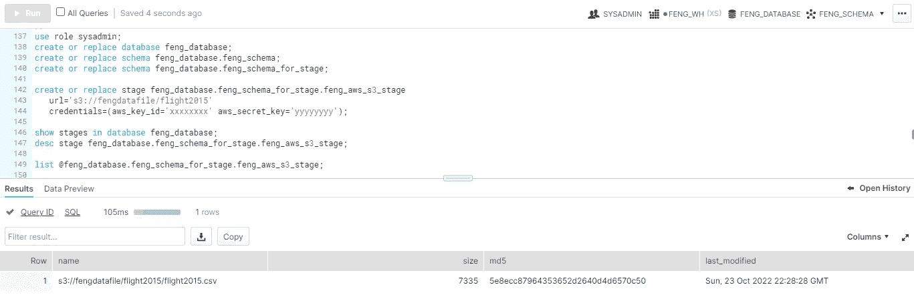

# 将数据摄取到雪花中(1):雪花阶段

> 原文：<https://blog.devgenius.io/ingesting-data-into-snowflake-1-snowflake-stage-10a688cd5eed?source=collection_archive---------8----------------------->


菊芋花在马卡姆，在。2022 年 10 月 2 日

(雪花存储阶段包括内部阶段，如用户阶段、表阶段、命名阶段和外部阶段。在本帖中，我们将讨论外部阶段。)

雪花阶段是一个雪花对象，它定义了访问该桶所需的 AWS S3 桶 URL 和凭据。当然，stage 也支持 Azure 和 GCP 位置。例如:

```
// Create aws_s3_stage object in given database/schema
CREATE OR REPLACE STAGE MYDB.MYSCHEMA.aws_s3_stage
    url='s3://<bucketname>'
    credentials=(aws_key_id='access_key_xxxxxxxx' aws_secret_key='secret_key_yyyyyyyy');
```

创建阶段后，可以使用复制命令从阶段中复制数据。例如:

```
COPY INTO MYDB.MYSCHEMA.MYTABLE
    FROM [@](http://twitter.com/MANAGE_DB)MYDB_MYSCHEMA.aws_s3_stage
```

请注意，需要提前创建表，以使列与 stage 指向的数据文件中的字段保持一致。

另请注意，stage 的范围跨越此雪花帐户中的所有数据库，您可以使用一个 stage 将数据复制到不同数据库的表中。其他用户需要在舞台上被授予“usage”权限，才能使用它来加载数据。

以下示例为 S3 位置创建数据库、方案和阶段。

```
use role sysadmin;
create or replace database feng_database;
create or replace schema feng_database.feng_schema;
create or replace schema feng_database.feng_schema_for_stage;create or replace stage feng_database.feng_schema_for_stage.feng_aws_s3_stage
   url='s3://fengdatafile/flight2015'
   credentials=(aws_key_id='xxxxxxxx' aws_secret_key='yyyyyyyy');show stages in database feng_database;
desc stage feng_database.feng_schema_for_stage.feng_aws_s3_stage;list [@feng_database](http://twitter.com/feng_database).feng_schema_for_stage.feng_aws_s3_stage;
```



然后我们将创建一个表并读入数据文件。([原始数据文件](https://github.com/databricks/Spark-The-Definitive-Guide/tree/master/data/flight-data/csv)

```
Create or replace transient table feng_database.feng_schema.flight2015_staging (
      DEST_COUNTRY_NAME varchar(64),
      ORIGIN_COUNTRY_NAME varchar(64),
      count int
);COPY into feng_database.feng_schema.flight2015_staging
    from [@feng_database](http://twitter.com/feng_database).feng_schema_for_stage.feng_aws_s3_stage
    file_format=(type=csv field_delimiter=',' skip_header=1 FIELD_OPTIONALLY_ENCLOSED_BY = '"');select * from feng_database.feng_schema.flight2015_staging;
```


**虽然我们可以成功地从 S3 读取数据文件，但我们担心我们需要将我们的 AWS 凭据放在代码中。为了解决这个问题，我们可以在雪花阶段使用雪花存储集成对象来访问 S3。**

# 使用雪花存储集成对象

雪花存储集成对象使用 AWS 角色来访问 S3 位置。为了承担这个 AWS 角色，根据角色配置，需要一个受信任的实体和一个外部 ID。

因此，我们需要首先创建雪花存储集成对象，并将其实体和 ID 提供给 AWS，以便允许进一步的访问。

因此，我们希望创建如下所示的存储集成…但您会看到，我们需要提供 AWS 角色 ARN。在创建 AWS 角色时，我们必须提供可信的实体和 ID…这很难理解！AWS 和雪花在这里能做得更好吗？

```
create or replace storage integration s3_integration
  TYPE = EXTERNAL_STAGE
  STORAGE_PROVIDER = S3
  ENABLED = TRUE 
 **STORAGE_AWS_ROLE_ARN = '????'**  STORAGE_ALLOWED_LOCATIONS = ('s3://fengdatafile/flight2015/')
  COMMENT = 'To access S3 by assuming a role'
```

所以我们需要有点创意:

1 使用虚拟可信实体和 ID 创建 AWS 角色

2 使用上述 AWS 角色 ARN 创建雪花存储集成对象

3 返回 AWS，使用上述雪花存储集成对象 ARN 作为真实可信实体和真实 ID 来更新角色。

## **首先创建 AWS 角色**

转到 IAM ->角色->创建角色


为可信实体选择“AWS 帐户”


暂时使用“此帐户”和“123456”作为可信实体和外部 ID

然后选择“AmazonS3ReadOnlyAccess”权限，给角色名“雪花 _read_S3”来创建角色。请注意这个角色的 ARN。

## 接下来，转到雪花创建存储集成对象

```
create or replace storage integration s3_integration
 TYPE = EXTERNAL_STAGE
 STORAGE_PROVIDER = S3
 ENABLED = TRUE 
 **STORAGE_AWS_ROLE_ARN = 'arn:aws:iam::xxxx:role/Snowflake_read_S3'** **STORAGE_ALLOWED_LOCATIONS** = ('s3://fengdatafile/flight2015/')
 COMMENT = 'To access S3 by assuming a role';

desc storage integration s3_integration;
```


记录存储 AWS IAM 用户 ARN 和存储 AWS 外部 ID。

## 并返回到 AWS 以修改具有上述 ARN 和外部 ID 的角色中的“信任策略”。


使用新创建的存储集成对象中的真实实体 ARN 和外部 ID 修改信任策略

## 最后，转到雪花创建一个使用这个存储集成对象访问 S3 的阶段。(在该阶段不提供您的 AWS 凭据。)

```
CREATE OR REPLACE stage feng_database.feng_schema_for_stage.feng_aws_s3_integration_stage
   url='s3://fengdatafile/flight2015/'
   STORAGE_INTEGRATION = s3_integration;list [@feng_database](http://twitter.com/feng_database).feng_schema_for_stage.feng_aws_s3_integration_stage;
```


正如我们所看到的，只有在创建阶段时指定存储集成对象，我们才能成功读取 S3，而无需提供凭据！

**注意**，stage 中的此“url”必须与存储集成定义中的 STORAGE_ALLOWED_LOCATIONS 相同:“url”为“s3://fengdatafile/flight2015”将不起作用，因为与 STORAGE_ALLOWED_LOCATIONS 相比，它在末尾缺少一个斜杠。也许这在将来可以改进。

然后，您可以将数据文件“复制”到您的表中…

```
Create or replace transient table feng_database.feng_schema.flight2015_staging_2 (
      DEST_COUNTRY_NAME varchar(64),
      ORIGIN_COUNTRY_NAME varchar(64),
      count int
);
COPY into feng_database.feng_schema.flight2015_staging_2
    from [@feng_database](http://twitter.com/feng_database).feng_schema_for_stage.feng_aws_s3_integration_stage
    file_format=(type=csv field_delimiter=',' skip_header=1 FIELD_OPTIONALLY_ENCLOSED_BY = '"');

select * from feng_database.feng_schema.flight2015_staging_2;
```

**注意**，除了为 stage 创建存储集成，您还可以在创建 stage 时直接在“credentials”中指定 IAM 角色，如下所示。

```
CREATE OR REPLACE STAGE MYDB.MYSCHEMA.aws_s3_stage
    url='s3://<bucketname>'
    credentials=(aws_role = 'arn:aws:iam::xxxx:role/Snowflake_read_S3');
```

# 附录

如果你想创建一个公共的只读 s3 bucket，你可以使用 ACL 规则从"你的 bucket 页->权限页签" :


With bucket 策略设置如下:

```
{
    "Version": "2012-10-17",
    "Id": "S3 public access",
    "Statement": [
        {
            "Sid": "Public Read Only",
            "Effect": "Allow",
            "Principal": "*",
            "Action": "s3:getObject",
            "Resource": "arn:aws:s3:::<bucket_name>/*"
        }
    ]
}
```

在这种情况下，每个人都可以通过创建如下阶段来阅读/列出您的存储桶:

```
CREATE OR REPLACE STAGE MYDB.MYSCHEMA.aws_s3_stage
    url='s3://<bucket_name>'

list @MYDB.MYSCHEMA.aws_s3_stage;
```

快乐阅读！

[](https://medium.com/@fengliplatform/membership) [## 通过我的推荐链接-李冯加入媒体

### 写作帮助我们自己，分享帮助很多人。从我自己的学习笔记开始，没有要求完美的压力…

medium.com](https://medium.com/@fengliplatform/membership)