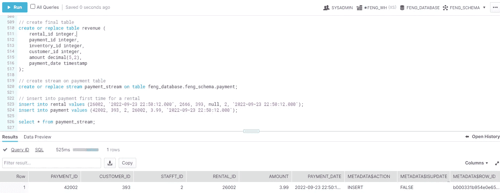

# 将数据摄取到雪花中(4):流和任务

> 原文：<https://blog.devgenius.io/ingesting-data-into-snowflake-4-stream-and-task-3725287c2755?source=collection_archive---------8----------------------->


约翰尼湖，基拉尼省立公园，2022 年 9 月 9 日

我们在另一篇文章中谈到过 [Snowpipe，它用于将数据接收到雪花中(来自 S3)——通常原始数据被放在一个“暂存表”中。接下来，将对原始数据进行更多的转换，然后将它们放入生产或最终表格中进行进一步分析。](https://medium.com/@fengliplatform/ingesting-data-into-snowflake-2-snowpipe-6b68cc6ffed6)

类似地，OLTP 系统中的事务记录可以被视为“暂存”表，这些表将被转换为 OLAP 操作的“最终”表。

这些是典型的 ELT 数据流——从 S3 中提取数据，加载到雪花状“暂存”表中，然后为最终表转换数据。雪花在这里能做什么？

在这两种情况下，我们都需要监视新记录或记录修改的“暂存”表。我们需要捕捉更改，并将它们合并到“最终”表中，这样我们的 OLAP 系统就可以尽快分析最新的数据。如果所有这些捕获和合并都可以自动化，那就太好了。

为了监视和转换“暂存”表，我们可以使用雪花流和任务。

雪花流是在表上定义的，用于自动监控和收集数据变化。流对象保存数据更改。当数据更改被消耗到最终表时，流对象将它们从流中删除。

雪花任务是一个预定的动作，它可以消耗流中的数据变化并更新最终表。特别是，如果流中有数据更改到达，它会被触发。

让我们使用样本数据集“dvdrental”来尝试一下这个用例——点击此链接查看更多信息[，点击此处](https://www.postgresqltutorial.com/postgresql-getting-started/postgresql-sample-database/)查看[ER 图表。如果你认为 DVD 租赁有点过时，你可以想象一下家得宝的工具租赁或企业或任何类似企业的汽车租赁。](https://www.postgresqltutorial.com/wp-content/uploads/2018/03/printable-postgresql-sample-database-diagram.pdf)

让我们看看租赁表和付款表。业务逻辑是:当一张 DVD 被租出时，一条新记录被插入到租金表和付款表中。付款表中的记录将根据租金每天改变金额。归还此 DVD 时，租赁表中的 return_date 将相应更新。付款表中的金额将是本次租赁的最终金额。


在一天结束时，我们想分析这个行业，找出:哪些 DVD 是产生最多的利润？或者谁是最有价值的客户？还是有季节性的起伏？

因此，我们可能希望有一个“最终”表，比如收入表，其中包括租赁标识、付款标识、库存标识、客户标识、金额、付款日期。使用这个收入表，我们可以应用所有的聚合——你知道 OLAP 的东西。

要做到这一点，我们可以创建一个流表支付。该流捕获插入和数量更新。我们还创建了一个任务，如果流获得新的数据更改，将会触发该任务。然后，该任务将连接租金和付款表，以向我们的最终收入表写入新记录。

详细步骤如下

```
// create our final table revenue
create or replace table revenue (
    rental_id integer,
    payment_id integer,
    inventory_id integer,
    customer_id integer,
    amount decimal(5,2),
    payment_date timestamp
);// create stream on payment table
create or replace stream payment_stream on table feng_database.feng_schema.payment;// insert into rental and payment tables first time for a rental
insert into rental values (26002, '2022-09-23 22:50:12.000', 2666, 393, null, 2, '2022-09-23 22:50:12.000');
insert into payment values (42002, 393, 2, 26002, 3.99, '2022-09-23 22:50:12.000');// look at what we have in payment stream
select * from payment_stream;
```



在付款流中，我们捕获了一条插入记录

正如我们看到的，付款流捕获了付款表中的新记录。现在，让我们消费这一数据变化…

1 我们通过检查流中的 payment_id 是否与最终表中的 payment_id 匹配，从流数据中使用“merge into”最终表语句。

2 如果流中的 payment_id 不在最终表中，我们会将此付款插入最终表中。

3 如果 payment_id 已经在最终表中，我们将用流中最新金额数据更新最终表。

```
merge into revenue rev
using (select ren.rental_id, ren.inventory_id, ren.customer_id, p.payment_id, p.amount, p.payment_date, p.METADATA$ACTION, p.METADATA$ISUPDATE
       from payment_stream p
       join rental ren
       on ren.rental_id=p.rental_id) rent
on rev.payment_id = rent.payment_id
when not matched
  then insert
  (rental_id, payment_id, inventory_id, customer_id, amount, payment_date)
  values
    (rent.rental_id,rent.payment_id, rent.inventory_id, rent.customer_id, rent.amount, rent.payment_date)
when matched and rent.METADATA$ACTION='INSERT' and rent.METADATA$ISUPDATE='TRUE'
then update 
set rev.amount = rent.amount;select * from revenue;
```


消费付款流后，我们可以看到最终表收入有一个新的记录。支付流现在是空的。

接下来，让我们更新付款表以修改金额，因为此租赁成本会根据租赁费率增加。

```
// updated amount in payment table
update payment set amount=5.99 where payment_id=42002;select * from payment_stream;
```


更新付款表时付款流中有什么

更新记录被视为删除旧记录并在付款流中插入新记录。因此，我们在支付流中看到两个记录:METADATA$ACTION 告诉 INSERT 和 DELETE，以及 METADATA $ ISUPDATE，它表示真值，这表示在被监控的表中发生了记录更新的插入/删除。这两个记录在流中是耦合的。

当我们在流中使用这些更改时，我们的合并部分发现流中的 payment_id 与最终表中现有的 payment_id 相匹配，并查找元数据列，因此它知道这是对最终表记录的更新。

因此，我们将再次执行上述“合并”代码…


根据付款流修改最终表中的金额

到目前为止，我们已经了解了 stream 如何捕获表的变化，以及如何将这些变化消费到最终的表中。

为了实现自动化，我们将使用雪花任务…每 1 分钟创建一个任务监控支付流，如果 steam 捕获到数据更改(当 SYSTEM $ STREAM _ HAS _ DATA(' feng _ database . feng _ schema . payment _ STREAM '))，则运行相同的“merge”代码！

```
// Task
CREATE OR REPLACE TASK final_table_revenue_task
    WAREHOUSE = FENG_WH
    SCHEDULE = '1 MINUTE'
    WHEN SYSTEM$STREAM_HAS_DATA('feng_database.feng_schema.payment_stream')    AS 
merge into revenue rev
using (select ren.rental_id, ren.inventory_id, ren.customer_id, p.payment_id, p.amount, p.payment_date, p.METADATA$ACTION, p.METADATA$ISUPDATE
       from payment_stream p
       join rental ren
       on ren.rental_id=p.rental_id) rent
on rev.rental_id = rent.rental_id
when not matched
  then insert
  (rental_id, payment_id, inventory_id, customer_id, amount, payment_date)
  values
    (rent.rental_id,rent.payment_id, rent.inventory_id, rent.customer_id, rent.amount, rent.payment_date)
when matched and rent.METADATA$ACTION='INSERT' and rent.METADATA$ISUPDATE='TRUE'
then update 
set rev.amount = rent.amount;show tasks;
alter task final_table_revenue_task resume;
```


创建任务是为了监视流并触发 merge 语句来更新最终表

注意，任务创建后处于暂停状态。使用上面的“resume”语句启动任务。

让我们通过再次更新付款表来测试任务…

```
// Modify amount again in payment table
update payment set amount=7.99 where payment_id=42002;// Check payment stream
select * from payment_stream;// Check final table revenue
select * from revenue;// Troubleshooting task - checking task history
select * from table(information_schema.task_history())
order by name asc, scheduled_time desc;
```


任务已自动使用最新金额更新最终表格


故障排除任务—检查任务历史记录

快乐阅读！

[](https://medium.com/@fengliplatform/membership) [## 通过我的推荐链接-李冯加入媒体

### 写作帮助我们自己，分享帮助很多人。从我自己的学习笔记开始，没有要求完美的压力…

medium.com](https://medium.com/@fengliplatform/membership)