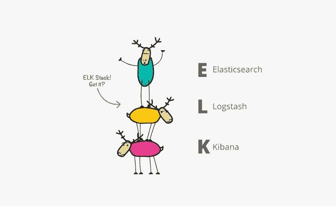
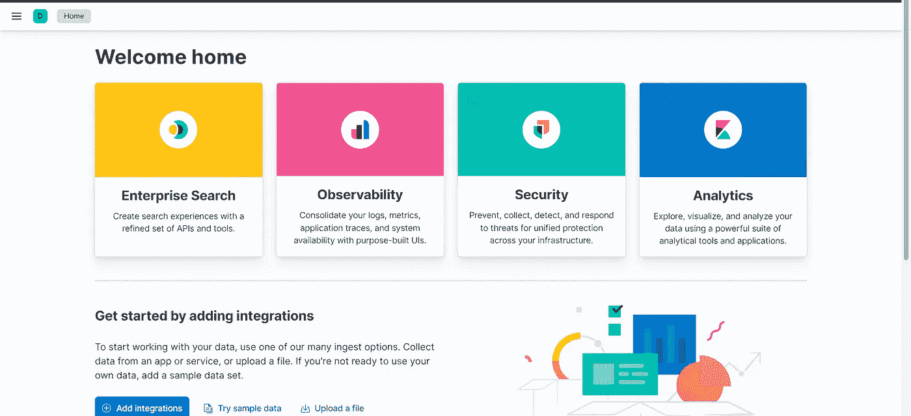
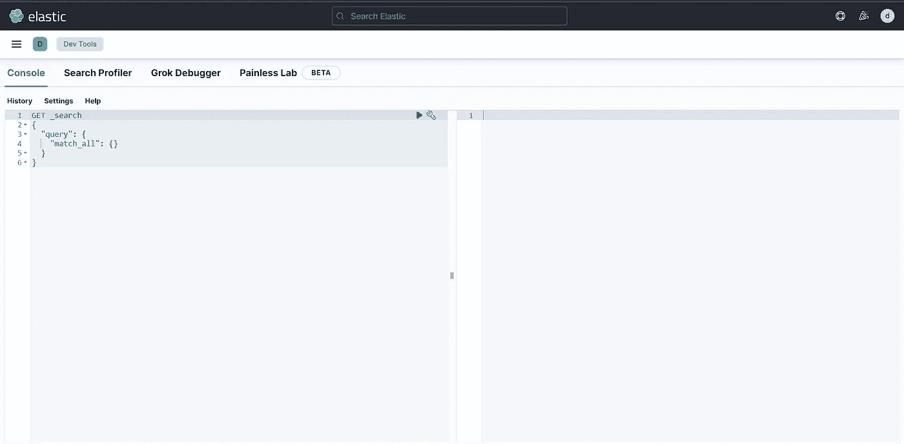

# 使用 node.js 将 Reddit 迷因吸收到 Elasticsearch 中:本地和谷歌云

> 原文：<https://blog.devgenius.io/ingesting-reddit-memes-into-elasticsearch-using-node-js-locally-and-on-google-cloud-d9ec61ccba95?source=collection_archive---------8----------------------->


是一个相对较新的开源搜索引擎，世界上任何人都可以使用！它速度惊人，而且是用 java 编写的！它使用`JSON`格式来存储可以通过各种`HTTP`方法访问的数据。这项服务也是可扩展的，是大型科技公司的完美选择。目前，像优步、网飞、Slack 和微软这样的公司使用`Elasticsearch`将搜索功能集成到他们的产品中。`Elasticsearch`最近改变了它的开源许可，导致亚马逊发布了`OpenSearch`，一个通过分叉`Elasticsearch`创建的搜索引擎。

`Elasticsearch`使用一个叫做`index`的东西来存储所有的信息。引用文件-

> 索引就像关系数据库中的“数据库”。它有一个定义多种类型的映射。
> 
> 最简单、最熟悉的布局复制了您对关系数据库的期望。你可以(非常粗略地)把索引想象成一个数据库。
> 
> MySQL = > Databases = > Tables = > Columns/Rows
> elastic search =>indexes =>Types =>带属性的文档
> 
> 一个 Elasticsearch 集群可以包含多个索引(数据库)，而索引又包含多个类型(表)。这些类型包含多个文档(行)，每个文档都有属性(列)。

总结文档，我们需要一个`index`在`Elasticsearch`中存储任何类型的数据。可以有多个`indeces`，然后可以存储不同的数据。

此外，`Elasticsearch`还附带了一系列与其无缝集成的其他产品。这个家族的最初成员是`Logstash`和`Kibana`，他们一起创造了著名的`ELK`栈！



2015 年，`Elastic`想出了一个新的家族成员，叫做`Beats`，但遗憾的是，这个新栈没有正式名称:(本文我们不会涉及这些家族成员，但我们可能会在最后触及`kibana`；)

# 启动弹性搜索(局部)


让我们从本地启动`Elasticsearch`开始，使用我们经典的命令提示符-

1.  如果你还没有从[这里安装`Elasticsearch`](https://www.elastic.co/downloads/elasticsearch)。
2.  导航到下载的文件，如果需要，将其解压缩。
3.  在下载的文件中打开命令提示符或终端，运行`bin/elasticsearch`启动`Elasticsearch`服务。

该服务将在`[http://localhost:9200/](http://localhost:9200/)`或您的命令提示符/终端中提到的端口上开始运行！

# 新的 node.js 项目


我们现在可以创建一个新的`node.js`项目来编码我们的服务器-

1.  创建一个新的空文件夹。我将把它命名为`node_elastic`。
2.  运行`npm init`并选择您的配置。我将把我的`entry point`设为`server.js`，而不是默认的`index.js`。
3.  这将在当前目录下创建一个`package.json`文件。在我的例子中，`package.json`文件看起来像这样

```
{
  "name": "node_elastic",
  "version": "1.0.0",
  "description": "Scraping and ingesting Reddit memes into Elasticsearch using node.js",
  "main": "server.js",
  "scripts": {
    "test": "echo \"Error: no test specified\" && exit 1"
  },
  "author": "Saransh-cpp",
  "license": "ISC"
}
```

作为最后一步，让我们添加一个新的`script`来使开发过程更加顺利

```
"start": "node server.js"
```

完整的`json`文件现在——

```
{
  "name": "node_elastic",
  "version": "1.0.0",
  "description": "Scraping and ingesting Reddit memes into Elasticsearch using node.js",
  "main": "server.js",
  "scripts": {
    "test": "echo \"Error: no test specified\" && exit 1",
    "start": "node server.js"
  },
  "author": "Saransh-cpp",
  "license": "ISC"
}
```

# 创建弹性搜索客户端


我们将使用名为`elasticsearch`的`javascript`库与我们的本地部署`Elasticsearch`进行交互。让我们将它安装在我们的工作目录中-

```
npm i elasticsearch
```

现在，我们可以创建一个`Client`对象，通过它我们将能够访问各种`HTTP`方法。在这里，我创建了一个名为`client_local.js`的新的`javascript`文件(如果您的部署在不同的端口号上，请替换`"host"`值)

# 创建索引


我们现在可以使用上面创建的`client`来创建一个索引。让我们编写一个新文件`create.js`

使用`node create.js`运行上面编码的文件应该会在`Elasticsearch`的本地部署中创建一个新的`index`，并且不会给出任何输出。如果第一次运行代码时出现错误，那么您的部署可能不正确，或者您可能已经关闭了本地部署。再次运行该文件应该会给出一个错误消息

```
index [memes/<index_uuid>] already exists
```

这证实了我们的索引已经创建！您也可以通过简单地将`create.js`文件中的`create`替换为`delete`来删除创建的索引。

# 从 Reddit 获取迷因


在将我们的迷因数据吸收到`Elasticsearch`之前，我们实际上需要一些数据。让我们通过 Reddit 的开放 API 和另一个名为`axios`的`javascript`库获取一个迷因的 URL。让我们快速安装库-

```
npm i axios
```

我们将通过 URL — `[https://reddit.com/r/memes.json](https://reddit.com/r/memes.json.)` [向 Reddit 的`meme`子编辑发送一个`http` `get`请求。](https://reddit.com/r/memes.json.)在深入研究(你可以使用任何流行的 chrome 扩展来美化`json`)这个网址上显示的大量`json`之后，我发现一个 meme 的网址出现在-

```
["data"]["children"][num]["data"]["url_overridden_by_dest"]
```

迷因的名称出现在-

```
["data"]["children"][num]["data"]["title"]
```

其中`num`是小于所显示的迷因的最大数量的任何正整数。我们现在可以创建一个新的`js`文件来抓取 meme 的 URL 和标题-

# 将我们的数据纳入 Elasticsearch


现在，我们将上面编码的所有内容组合起来创建`server.js`，它将把搜集到的 meme 数据吸收到我们本地部署的`Elasticsearch`中。我们将抓取 100 个这样的 URL 和标题，并将它们存储在索引`memes`(我们在上面创建的)。

我们可以使用客户端的`index`方法将数据追加到关联的`index`中

```
client.index({  
     index: 'memes',
     body: {
         url: memeURL,
         title: memeTitle
     }
}, (err, resp, status) => {
     console.log(resp);
});
```

在代码中，我还将在接收发生之前清除(使用`deleteByQuery`并将`match_all`设置为`{}`)索引，以确保我们没有存储任何旧数据。

最终代码(`limit`在 URL 中查询的是我们想要的模因数)—

如果你还记得，我们在创建`npm`项目的时候创建了一个`“start”`脚本。让我们用它来运行我们的服务器-

```
npm start
```

一旦运行这个命令，您应该会看到大约 100 条记录被打印到您的终端上，当它们被附加到您的索引体中时！我们终于向本地`Elasticsearch`部署添加了一些数据！万岁！

运行以下代码-

应该会给你一个肯定的输出(因为我们正在搜索索引`memes`中的所有内容)

```
{
  took: 60,
  timed_out: false,
  _shards: { total: 1, successful: 1, skipped: 0, failed: 0 },
  hits: {
    total: { value: 100, relation: 'eq' },
    max_score: 1,
    hits: [
      [Object], [Object],
      [Object], [Object],
      [Object], [Object],
      [Object], [Object],
      [Object], [Object]
    ]
  }
}
```

我们完了！现在我们可以在任何地方使用这些数据！

# 在 Google Cloud 上部署和接收数据


我们现在处于最后阶段了！让我们在`Google Cloud`上部署`Elasticsearch`

1.  前往`[https://www.elastic.co/pricing/](https://www.elastic.co/pricing/)`，选择 14 天免费试用(注意:将显示的 ID 和密码保存在安全的地方)。
2.  选择“独自探索”选项。

您将被重定向到类似于以下内容的屏幕



现在，单击汉堡包图标并选择“管理此部署”。您应该会被重定向到包含`Elasticsearch`的端点和您的`"Cloud ID"`的屏幕。把这两个都复制存储起来！

最后，我们准备编写一些`javascript`来接收`Google Cloud`部署的`Elasticsearch`中的数据

1.  将`Cloud ID`、`username`和`password`分别存储在名为`CLOUD_ID`、`USERNAME`和`PASSWORD`的环境变量中。
2.  转到您的`Elasticsearch`端点，确保您能够使用复制的`username`和`password`登录。
3.  创建一个新的`javascript`文件`client_cloud.js`

注意:URL 应该是你的`Elasticsearch`的端点。

万岁！我们的客户机现在可以创建索引和接收数据了。运行上面的代码应该不会出现错误。

我们现在可以替换我们的陈述-

```
var client = require('./client_local.js');
```

到

```
var client = require('./client_cloud.js');
```

在`create.js`和`server.js`中。

要创建一个新的索引，只需运行`create.js`中的代码，然后嘣！我们现在有了一个全新的索引！我们可以使用`kibana`来检查我们的索引是否创建成功。一个完整的`kibana`教程将超出这个博客的范围，但我们仍然可以触及它；) -

1.  打开`Elasticsearch`部署中的汉堡菜单。
2.  导航到管理并点击`devtools`。

你应该被重定向到一个屏幕，看起来像这样-



在左侧面板中添加以下行并点击 run -

```
GET memes/_search
{
  "query": {
    "match_all": {}
  }
}
```

右边面板上的输出应该是这样的

```
{
  "took" : 0,
  "timed_out" : false,
  "_shards" : {
    "total" : 1,
    "successful" : 1,
    "skipped" : 0,
    "failed" : 0
  },
  "hits" : {
    "total" : {
      "value" : 0,
      "relation" : "eq"
    },
    "max_score" : null,
    "hits" : [ ]
  }
}
```

没有错误！您可以通过`kibana`的文档探索更多这样的命令！

现在让我们通过编辑`require`语句来运行我们的`server.js`。你应该再次看到大约 100 个 meme URLs 和标题被打印在你的终端上，然后被摄入`Elasticsearch`！

在`kibana`中再次运行相同的查询，现在应该会得到前 10 个迷因的摄取数据！

```
{
  "took" : 89,
  "timed_out" : false,
  "_shards" : {
    "total" : 1,
    "successful" : 1,
    "skipped" : 0,
    "failed" : 0
  },
  "hits" : {
    "total" : {
      "value" : 100,
      "relation" : "eq"
    },
    "max_score" : 1.0,
    "hits" : [
      {
        "_index" : "memes",
        "_type" : "_doc",
        "_id" : "DtBrWn4B1NYkqWeI3ZWx",
        "_score" : 1.0,
        "_source" : {
          "url" : "[https://i.redd.it/b6rraassqnb81.gif](https://i.redd.it/b6rraassqnb81.gif)",
          "title" : "The sword will not cut"
        }
      },
      {
        "_index" : "memes",
        "_type" : "_doc",
        "_id" : "FdBrWn4B1NYkqWeI3ZXI",
        "_score" : 1.0,
        "_source" : {
          "url" : "[https://i.redd.it/vxp1izvzfob81.jpg](https://i.redd.it/vxp1izvzfob81.jpg)",
          "title" : "that's my first post here, hope you like It :)"
        }
      },
      {
        "_index" : "memes",
        "_type" : "_doc",
        "_id" : "z3xrWn4BGc7VZGO83X6t",
        "_score" : 1.0,
        "_source" : {
          "url" : "[https://i.redd.it/b12i54rfgmb81.gif](https://i.redd.it/b12i54rfgmb81.gif)",
          "title" : "Very sadge"
        }
      },
      {
        "_index" : "memes",
        "_type" : "_doc",
        "_id" : "0nxrWn4BGc7VZGO83X6w",
        "_score" : 1.0,
        "_source" : {
          "url" : "[https://i.redd.it/tpor5kmpjmb81.gif](https://i.redd.it/tpor5kmpjmb81.gif)",
          "title" : "Its always clickbait"
        }
      },
      {
        "_index" : "memes",
        "_type" : "_doc",
        "_id" : "JdBrWn4B1NYkqWeI3pUZ",
        "_score" : 1.0,
        "_source" : {
          "url" : "[https://i.redd.it/1cw59ws6qmb81.gif](https://i.redd.it/1cw59ws6qmb81.gif)",
          "title" : "He's here to raise hell and grab some candles"
        }
      },
      {
        "_index" : "memes",
        "_type" : "_doc",
        "_id" : "JtBrWn4B1NYkqWeI3pUb",
        "_score" : 1.0,
        "_source" : {
          "url" : "[https://i.redd.it/r3y9o89tiob81.jpg](https://i.redd.it/r3y9o89tiob81.jpg)",
          "title" : "best feeling in the world"
        }
      },
      {
        "_index" : "memes",
        "_type" : "_doc",
        "_id" : "6XxrWn4BGc7VZGO83n4g",
        "_score" : 1.0,
        "_source" : {
          "url" : "[https://i.redd.it/o5qoysvw2pb81.jpg](https://i.redd.it/o5qoysvw2pb81.jpg)",
          "title" : "You wanna know how I got these scars?"
        }
      },
      {
        "_index" : "memes",
        "_type" : "_doc",
        "_id" : "KNBrWn4B1NYkqWeI3pUk",
        "_score" : 1.0,
        "_source" : {
          "url" : "[https://i.redd.it/fbcr779kznb81.png](https://i.redd.it/fbcr779kznb81.png)",
          "title" : "If I disappear soon you'll know why"
        }
      },
      {
        "_index" : "memes",
        "_type" : "_doc",
        "_id" : "J9BrWn4B1NYkqWeI3pUj",
        "_score" : 1.0,
        "_source" : {
          "url" : "[https://i.redd.it/wfa8jks39mb81.png](https://i.redd.it/wfa8jks39mb81.png)",
          "title" : "Literally happens everyday"
        }
      },
      {
        "_index" : "memes",
        "_type" : "_doc",
        "_id" : "63xrWn4BGc7VZGO83n4l",
        "_score" : 1.0,
        "_source" : {
          "url" : "[https://i.redd.it/98dhrdna3nb81.jpg](https://i.redd.it/98dhrdna3nb81.jpg)",
          "title" : "Wait, what?"
        }
      }
    ]
  }
}
```

同样，您可以通过参考官方文档来更多地处理这些查询。

耶！一切正常！这个部署将在接下来的 14 天内保持活跃，因此，您可以尽情地玩它！

# 快速回顾一下

我们开始熟悉`Elasticsearch`并在本地托管它。然后我们学习了如何通过`javascript`与本地部署交互，并在其中摄取了一些随机的 meme 数据！接下来，我们决定在`Google Cloud`举办这个活动，让它更上一层楼。最后，我们使用我们的`javascript`代码与这个`Google Cloud`部署进行了交互！作为奖励，我们还快速看了一下`kibana`的能力以及它如何补充`Elasticsearch`的部署！

谢谢你坚持到最后！希望你喜欢它！

Psst，完整的代码可以在这里找到—[https://github.com/Saransh-cpp/elastic-node-reddit](https://github.com/Saransh-cpp/elastic-node-reddit)