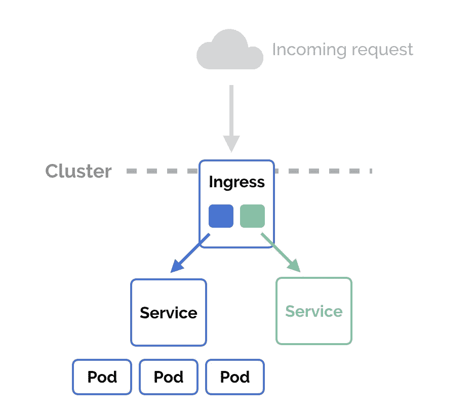
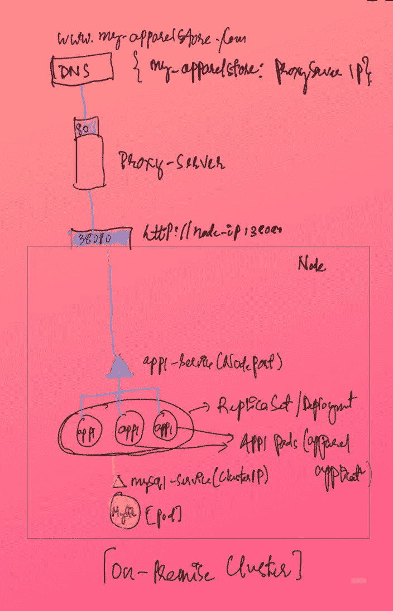
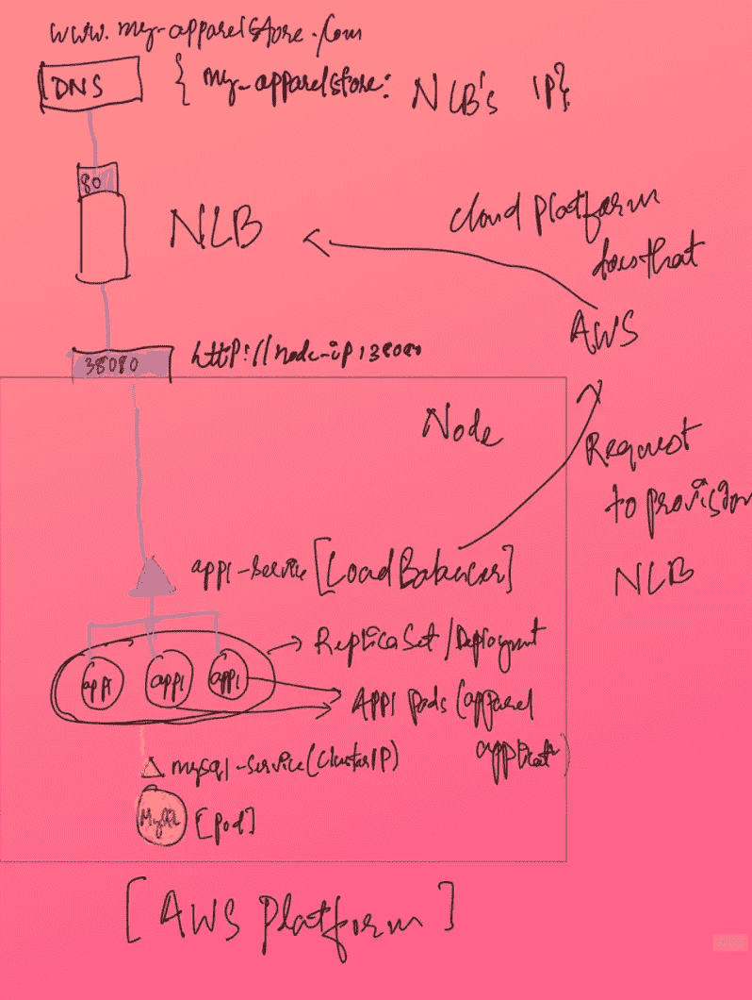
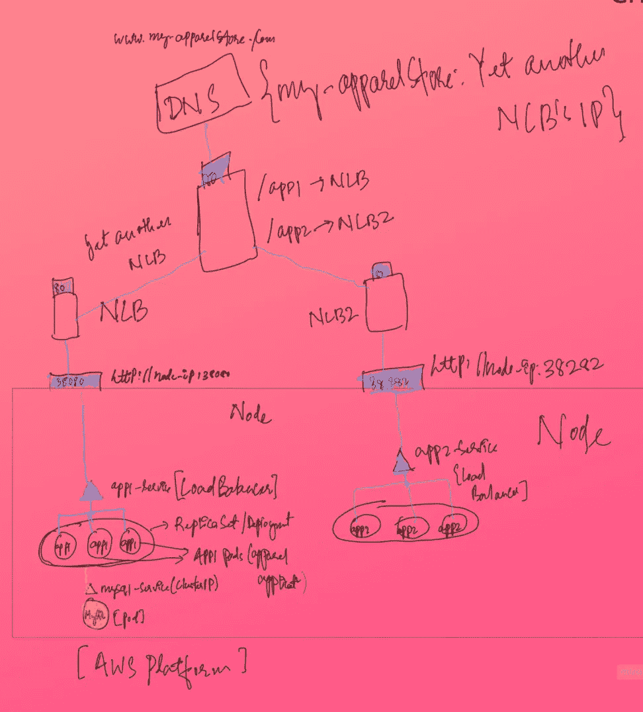
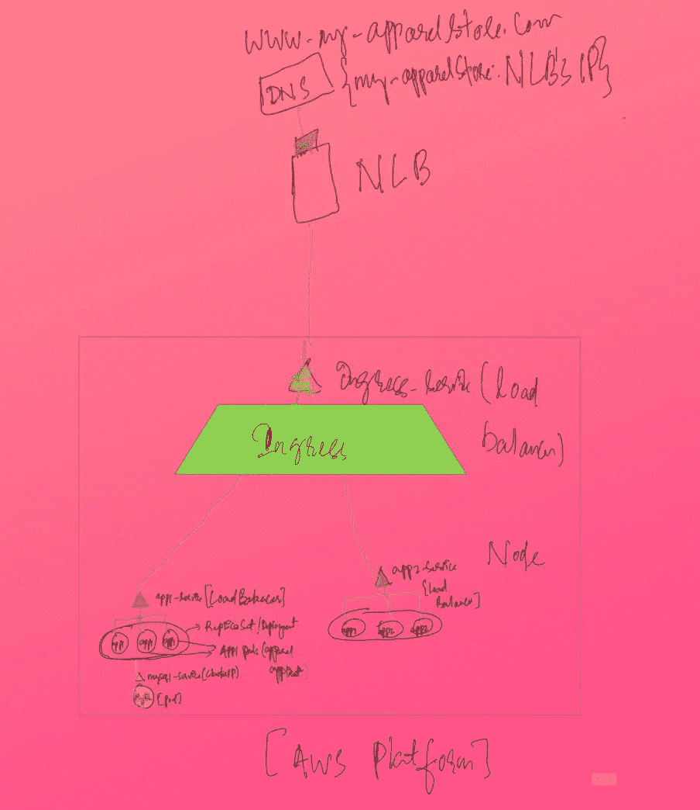

# Kubernetes 的入口

> 原文：<https://blog.devgenius.io/ingress-in-kubernetes-67a4b843ea4e?source=collection_archive---------6----------------------->



图片来源:[https://matthewpalmer.net/](https://matthewpalmer.net/)

## 在本地集群中没有入口时会发生什么

> 初始要求:

*   建立和部署服装店
*   应该可以在 www.my-apparelstore.com[的](http://www.my-apparelstore.com)买到

> 步骤:

*   构建应用程序 docker 映像
*   在 K8s 集群中部署它(应用 1)
*   部署一个数据库 pod (MySQL)
*   创建一个集群 ip 服务以使 DB pod 可访问。
*   创建一个节点端口服务，使外部世界可以访问 app1。
*   图中的节点端口服务是“app1-service ”,它监听 38080 端口。
*   应用程序现在可以在 [http://node-ip:38080 访问。](http://node-ip:38080.)
*   创建一个域名为“my-apparel-store”的 DNS，映射到节点 ip。
*   所以现在网址是[www . my-apparelstore:30080 . com](http://www.my-apparelstore:30080.com)
*   为了摆脱端口，创建一个代理服务器，公开端口 80 并重定向到节点的 38080。
*   请在 Node-IP 上将 DNS 映射改为 proxy-server-ip。
*   所以现在的网址是[www.my-apparelstore.com](http://www.my-apparelstore.com)



**托管云中没有入口会发生什么**

> 一切都保持原样，除了几个:

*   用负载平衡器服务替换节点端口服务。
*   这将提供与节点端口相同的功能，但也会要求托管云平台提供 NLB。
*   所以现在不需要创建代理服务器。
*   DNS 指向 NLB ip，而不是以前的代理服务器。



**如果引入了另一个应用程序，在没有入口的情况下会发生什么**

> 如果您希望支持另一个应用程序，请更改:

*   使用类似的设置部署 app2:一个部署、一个负载平衡器服务，如果需要的话，一个单独的 DB pod，等等。
*   此外，除了现有的 app1 的 NLB 和即将推出的 app2 的 NLB2 之外，还需要引入另一个负载平衡器。
*   该额外的负载平衡器将根据路由将流量重定向到下游 NLB。



**挑战**

*   要引入新的服务或应用程序，您必须重新配置顶级负载平衡器。
*   如果需要启用 SSL，那么应该在哪里启用，因为可以在不同的级别上启用。
*   随着应用的扩展，难以管理各种配置。

**最好有:**

*   如果可以在集群中管理所有配置。
*   作为 K8s 定义文件，就像在其他 K8s 对象中一样。

***进入救援。***

**上述配置如何通过入口得到简化**



**什么是入口**

它有两个部分:

*   入口控制器:对 nginx/HAPROXY/trafik/Istio 的抽象，这些基本上是负载平衡解决方案。虽然在创建集群时，默认情况下不会创建。
*   **入口资源**:定义 URL 路由、SSL 证书等一系列配置。

**入口如何工作**

*   比方说，集群中的入口控制器是基于 nginx 构建的。
*   入口控制器具有额外的智能来检测任何新的入口资源，挑选它们的配置并应用于 nginx。会议文件。
*   类似地，当资源被删除时，入口控制器也会对底层 nginx 配置文件进行更改。

**入口控制器配置**

它是四个 K8s 对象的组合:

*   **部署【nginx 映像的抽象。**

```
apiVersion: apps/v1
kind: Deployment
metadata:
    name: nginx-ingress-controller
spec:
    replicas: 1
    selector:
        matchLabels:
            name: nginx-ingress
    template:
        metadata:
            labels:
                name: nginx-ingress
        spec:
            containers:
                - name: nginx-ingress-controller
                  image: quay.io/kubernetes-ingress-controller/nginx-ingress-controller:0.21.0
            args:
                - /nginx-ingress-controller
                - --configmap=$(POD_NAMESPACE)/nginx-configuration
            env:
                - name: POD_NAME
                  valueFrom:
                    fieldRef:
                        fieldPath: metadata.name
                - name: POD_NAMESPACE
                  valueFrom:
                    fieldRef:
                        fieldPath: metadata.namespace
            ports:
                - name: http
                  containerPort: 80
                - name: https
                  containerPort: 443
```

*   **服务**:公开部署。

```
apiVersion: v1
kind: Service
metadata:
    name: nginx-ingress
spec:
    type: NodePort
    ports:
    - port: 80
      targetPort: 80
      protocol: TCP
      name: http
    - port: 443
      targetPort: 443
      protocol: TCP
      name: https
    selector:
      name: nginx-ingress
```

*   **ConfigMap** :提供 nginx 配置数据，如 sslprotocol、logpath 等。

```
apiVersion: v1
kind: ConfigMap
metadata:
    name: nginx-configuration
```

*   **ServiceAccount** :应用入口资源配置。服务帐户必须配置正确的角色集、集群角色和角色绑定。

```
apiVersion: v1
kind: ServiceAccount
metadata: 
    name: nginx-ingress-serviceaccount
```

**入口资源配置**

```
apiVersion: extensions/v1beta1
kind: Ingress
metadata:
    name: ingress-service
spec:
    rules:
    - host: my-apparelstore.com
      http:
        paths:
        - path: /app1
          backend:
            serviceName: app1
            servicePort: 8080
    - host: my-apparelstore.com
      http:
        paths: 
        - path: /app2
          backend:
            serviceName: app2
            servicePort: 8080
```