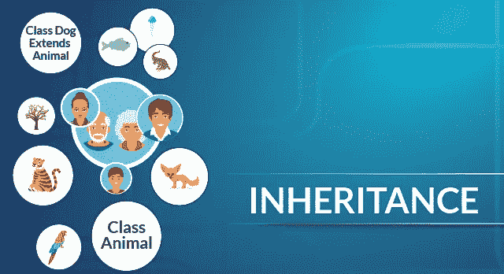
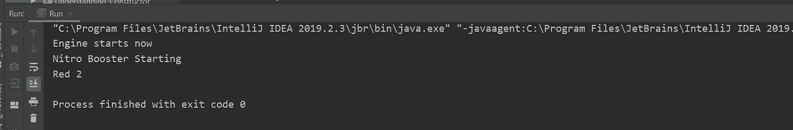
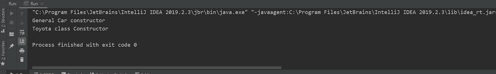
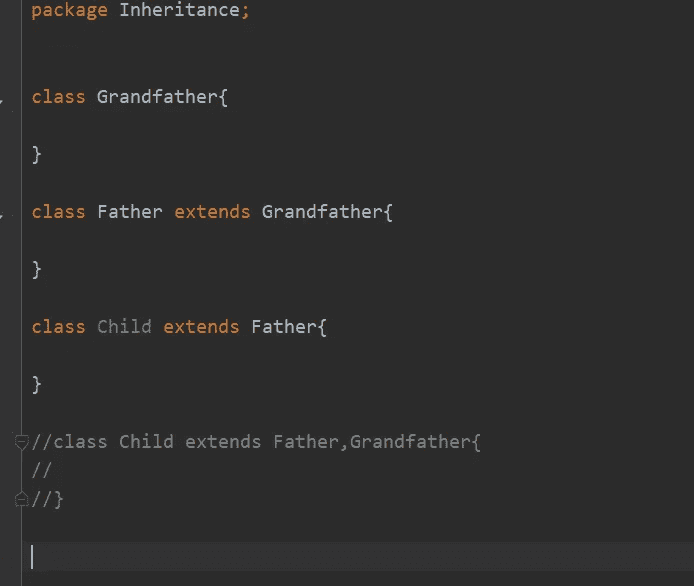
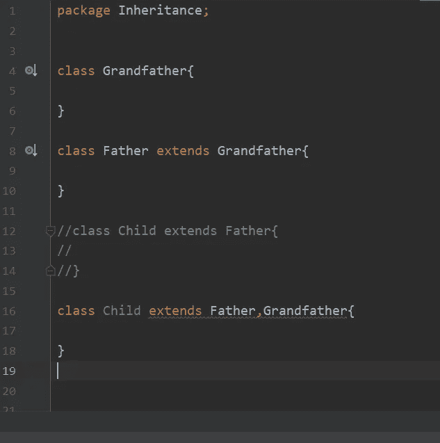

# JAVA 中的继承

> 原文：<https://blog.devgenius.io/inheritance-in-java-e4a3269b657c?source=collection_archive---------14----------------------->

在本文中，我们将了解 Java 中的继承概念。继承是面向对象编程的第一支柱。

# 什么是继承？

**继承**是 OOP(面向对象编程)的重要支柱。它是一种允许一个类**继承**另一个类的字段和方法等特性的机制。除了超类的字段和方法之外，子类还可以添加自己的字段和方法。

超类也称为父类，而子类也称为子类。

让我们用一个例子来理解这个概念——

假设我们有一辆**级汽车**。现在汽车类将有字段，如颜色，轮胎和功能，如启动引擎，停止引擎等。

现在 Car 是一个通用类，这个类中定义的所有字段和方法对于市场上所有的汽车都是通用的。

现在我定义一款特殊的车丰田。丰田将拥有一般汽车的所有属性。所以我不需要定义那些在 Car 中可用的字段和方法。我只需要继承那些财产。我还可以为 Toyota 类添加额外的字段和方法。

在上面的代码中，我们有两个类 General_Car 和扩展了 General_Car 的 Toyota 类。我们可以清楚地观察到，作为子类的 Toyota 类可以访问 General_Car(父类)的所有字段和方法。

**继承过程中的构造函数**

当子类的对象被创建时，为子类和父类调用构造函数。

创建了 Toyota 类的对象，但从父类和子类中调用了构造函数。

# 多级还是多重继承？

**Java 有多级继承，没有多重继承。**

我们所说的多层次是指如果有三个类祖父、父亲和孩子，那么父类可以扩展祖父类，而孩子类可以扩展父类。

多重继承意味着子类同时继承父类和祖父类。这在 Java 中是不可能的。

**多级继承有效**

**多重继承无效**

我希望你们喜欢这篇文章。请在这里订阅更多精彩的文章，并请给出一个👏如果你觉得这篇文章信息丰富。