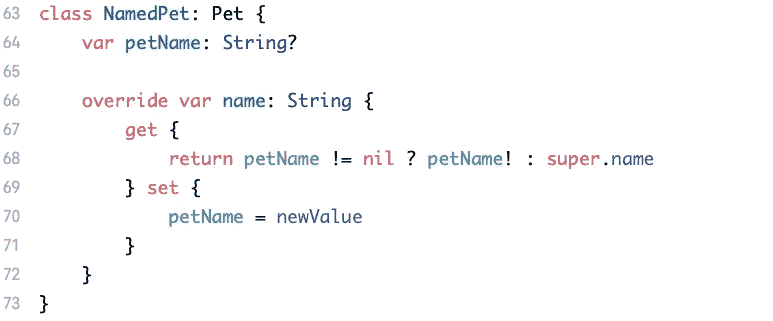
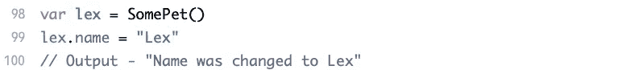

# Swift 中的继承

> 原文：<https://blog.devgenius.io/inheritance-in-swift-390cd55e601c?source=collection_archive---------5----------------------->

阿兰·范在 [Unsplash](https://unsplash.com/s/photos/structure?utm_source=unsplash&utm_medium=referral&utm_content=creditCopyText) 上的照片

继承允许您创建基于其他类的类。通过重用您已经编写的代码，您可以编写不同的实现，同时保持相同的行为。今天的文章将集中在如何创建一个基类和子类化它，覆盖属性和方法以及覆盖属性观察者。

本文是 [**Swift 基础知识**](https://swiftsimplified.medium.com/list/swift-basics-b2f15c120a96) 系列的一部分，帮助初学者以更加简单实用的方式理解 Swift 的基本概念。请随意查看关于其他基本 Swift 概念的文章。这些教程的全部内容可以在[这里](https://github.com/harshvardhanarora/Swift_Basics)找到。我们开始吧！

## 基础类

一个*基类*不继承任何东西。让我们看一个例子——

现在我们将尝试创建这个类的一个实例—

注意，我们不需要为我们的类创建一个**初始化器**方法，因为没有需要初始化的属性。

这个类不从任何类继承，但是其他类可以从它继承并覆盖我们这里的属性和方法。让我们看看如何！

## 亚纲

一个*子类*是一个继承自*基类*的类，就像我们上面定义的那个。这基本上意味着我们在另一个类的基础上构建我们的新类，而不影响那个类本身。让我们看一个例子——

这是声明我们的类**狗**想要继承我们的类**宠物**的语法。现在它所做的是让**宠物**到**狗**的所有公共属性可用。我们还在 Dog 类中创建了一个额外的属性，宠物不能访问。让我们看一个例子——

如您所见，Dog 类型的实例可以访问属于 Cat 类的属性。你也可以子类化一个子类本身。现在让我们看看如何在子类中改变基类的属性！

# 最重要的

对于从基类继承的属性或方法，子类可以有自己的实现。我们称之为**超越**。即使您选择重写方法、属性或下标，您仍然可以使用基类中的现有实现。让我们看看如何！

## 重写方法

让我们从*宠物* 类创建另一个子类，并尝试覆盖*speak()**方法。*

**

*注意 **override** 关键字，让 Swift 知道您正试图为超类中的方法编写一个自定义实现。让我们来看看它的实际应用—*

**

*就这么简单！现在，尽管我们最初实现的方法*speak()**是空的，但是让我们看看如何调用它。我们使用 **super** 关键字来访问超类—**

****

## **覆盖属性**

**您不能重写存储属性以将其设置为新值。另一方面，您可以为继承的属性覆盖 **getter** 和 **setter** 方法。您还可以添加**属性观察者**来响应底层属性的变化。**

****覆盖 Getter 和 Setter****

**在我们看一个覆盖 getter 和 setter 方法的例子之前，您需要理解一个简单的规则。您可以为只读属性提供 getter-setter 重写，但不能只为读写属性提供 getter 重写。现在让我们跳到一个例子来理解它是如何工作的—**

****

**如果你回去，你会记得我们班的**宠物**有一个名为 **name** 的属性，它是一个 **var** 。让我们逐行看看上面的代码是什么意思—
**63 —** 定义继承自 **Pet** 的子类 **NamedPet** 。
**64 —** 创建一个可选属性**宠物名**。
**66 —** 在提供 getter 和 setter 方法
**68 —** 返回 **petName** 如果不为空，否则使用关键字 **super** 从基类返回 **name** 属性。**

**希望在我们看到这个类的例子之前，你能理解它是做什么的。另外，尝试移除第 69 行中的**名称**属性的**设置器**，您将收到一个错误，提示您不能用**只获取**属性覆盖可变属性。希望你现在也能理解我们上面讨论的规则。让我们看一个这个类工作的例子—**

****

**我们创建一个名为 **max** 的类**的对象。最初，它被设置为 Margo 的默认值，这就是我们在输出中看到的。但是在将属性**名称**改为**最大值**后，我们看到现在属性**宠物名称**和**名称**都被设置为**"最大值"**。****

****压倒一切的财产观察家****

**就像覆盖属性 setter 和 getter 一样，在覆盖属性 observers 之前，您需要理解一些事情。不能将属性观察器添加到继承的属性中，这些属性是常量存储属性或只读计算属性。理性——观察无法改变的事物的变化毫无意义。**

**在这一点上，你一定认为我们仍然可以**覆盖子类中的 setter 方法**。你这样想是正确的，但是这里有另一条规则——你**不能**为同一个属性提供一个**覆盖设置器**和**覆盖属性观察者**。您可以简单地处理 setter 方法本身内部的观察。现在，让我们来看一个例子**

****

**在这个例子中，我们覆盖 name 属性来添加一个 **didSet** 属性观察者。每当名称改变时，就会执行 didSet 中的闭包。让我们看一个例子——**

****

## **防止覆盖**

**您可以通过在任何属性、方法或下标之前使用关键字 **final** 来防止覆盖它们。**

****

**如果您试图在子类中覆盖这个属性，您将会收到一个错误。**

**你也可以在一个类前使用 **final** ，这样就不允许任何其他类继承你的类。**

**就是这样！这是一个很大的范围。给自己时间吸收全部，尝试自己写出代码，看看[操场](https://github.com/harshvardhanarora/Swift_Basics)本身，以防卡住。如果你有任何问题，请随时在 LinkedIn 上联系我。**

**为你创作这些文章，占用了我大量的精力和资源。你可以通过 [**给我买一杯咖啡**](https://www.buymeacoffee.com/swiftsimplified) 来支持我的旅程。如果目前你还不能贡献金钱，如果你能把这篇文章分享给你的网络，那就太好了！希望能继续给大家带来这样的内容，帮助你的 iOS 开发之旅。**