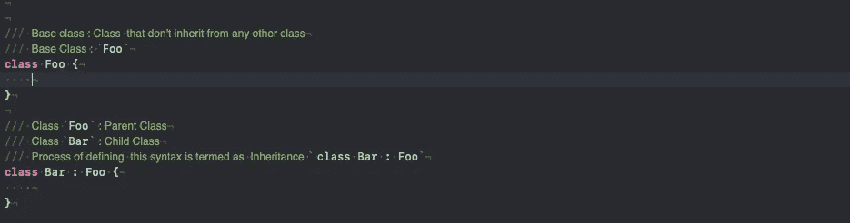
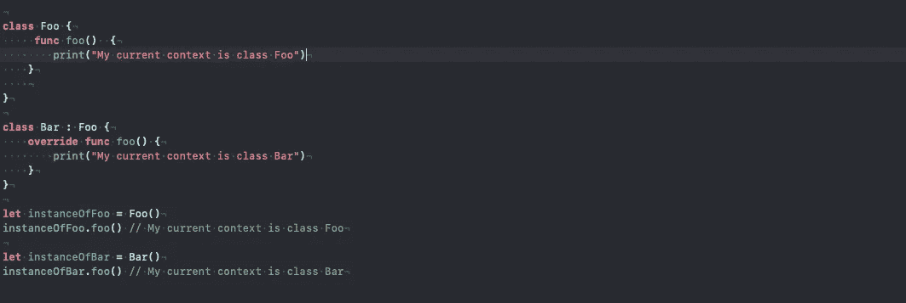
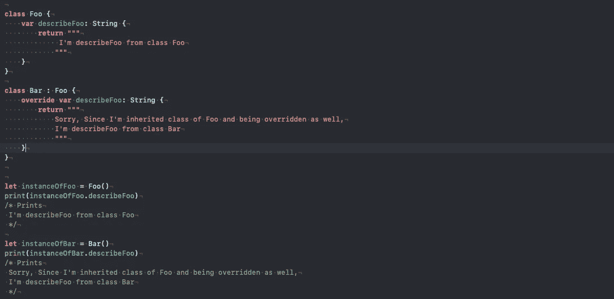
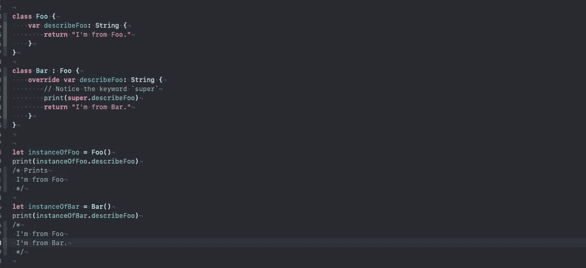
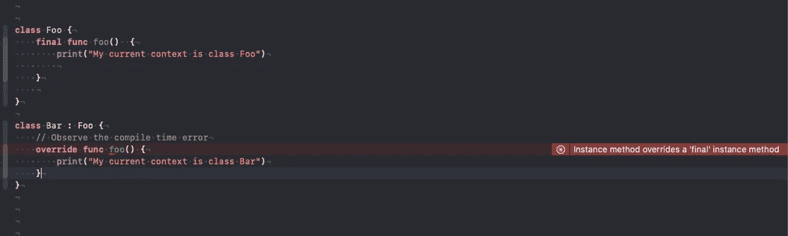

# Swift 继承

> 原文：<https://blog.devgenius.io/inheritance-with-swift-8c2da5d5234a?source=collection_archive---------5----------------------->

继承: [**继承**是将一个对象或类建立在另一个对象(基于原型的继承)或类(基于类的继承)之上的机制，保留类似的实现。](https://en.wikipedia.org/wiki/Inheritance_(object-oriented_programming))

当有父子关系时，就会发生继承。



遗产

— — — — — — — — — — — — — — — — — — — — — — — — — — — — — —

当我们谈论 swift
* override
* super
* final 的继承时，关键词就会浮现出来

**关键字“覆盖”**:用关键字覆盖观察。



用函数覆盖



用属性覆盖

— — — — — — — — — — — — — — — — — — — — — — — — — — — — — -

**关键词“超”**:用关键词“超”观察。



用关键字“super”覆盖

与覆盖属性相关的一些规则是
1。用 getter 重写属性可以是 getter。
2。用 getter 重写属性可以是 getter 和 setter。反之则不然。

— — — — — - — — — — — — — — — — — — — — — — — — — — — — — — —

**关键词“最终”**:用关键词“最终”观察。



**防止最终超控**

“final”关键字防止被覆盖。
该关键字可与以下关键字一起使用。
1。类别
2。func
3。var
4。下标
5。类函数。

— — — — — — — — — — — — — — — — — — — — — — — — — — — — — -

```
Try out questions
**Question 1\. What it will print or Compile time waring**
class Foo {
   func foo() {print(“I’m from Foo”)}
}class Bar: Foo {}let instanceOfBar = Bar()
instanceOfBar.foo()**Question 2\. What it will print or Compile time waring**
class Foo {
   final func foo() {print(“I’m from Foo”)}
}class Bar: Foo {}let instanceOfBar = Bar()
instanceOfBar.foo()**Question 3\. What it will print or Compile time waring**
class Foo {
   final func foo() {print(“I’m from Foo”)}
}class Bar: Foo {
   func foo() {print(“I’m from Bar”)}
}let instanceOfBar = Bar()
instanceOfBar.foo()**Question 4\. What it will print or Compile time waring**
class Foo {
   final class func foo() {print(“I’m from Foo”)}
}class Bar: Foo {}let instanceOfBar = Bar()
instanceOfBar.foo()Try finding reason behind each behaviour. Its fun. 🤪
```

— — — — — — — — —
***下一章是关于***[*初始化*](https://roshankumar350.medium.com/initialization-with-swift-32e132f7bc3f) ***。***

延伸阅读:
[https://docs . swift . org/swift-book/language guide/inheritance . html](https://docs.swift.org/swift-book/LanguageGuide/Inheritance.html)

你可以在这里找到我
roshankumar350@gmail.com