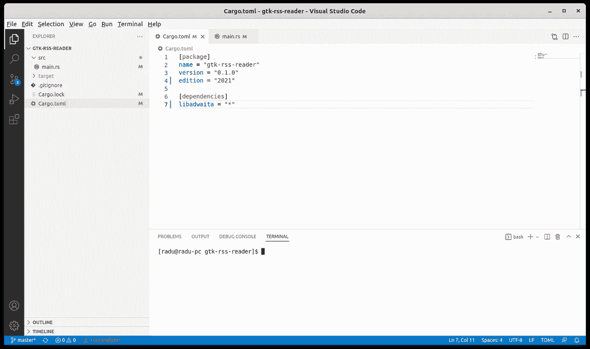
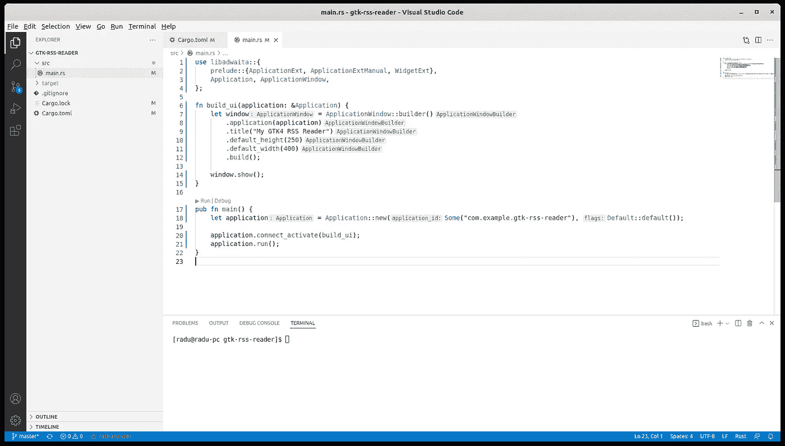
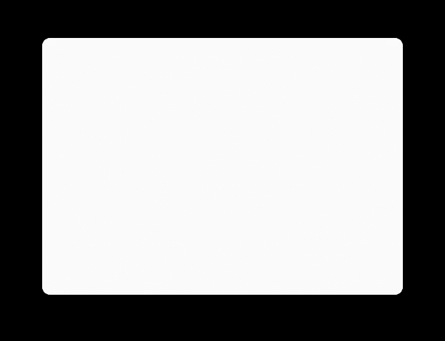
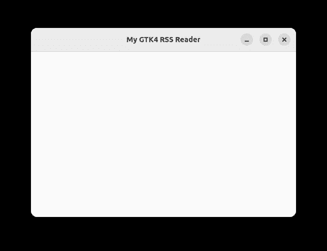

# 使用 VSCode 在 Rust 中对带有 libadwaita 的 GTK4 应用程序进行初始设置

> 原文：<https://blog.devgenius.io/initial-setup-for-a-gtk4-app-with-libadwaita-in-rust-using-vscode-b6f8c127a75e?source=collection_archive---------0----------------------->


照片由[穆罕默德·拉赫马尼](https://unsplash.com/@afgprogrammer?utm_source=medium&utm_medium=referral)在 [Unsplash](https://unsplash.com?utm_source=medium&utm_medium=referral) 上拍摄

当我读到 GTK4 对 Rust 的支持时，我知道我想尝试一下这个设置。为了更好，我想使用 VSCode。VSCode 只是我的一个偏好，如果你使用官方的 Gnome Builder，你可能会更容易编写代码，但是对于这篇文章，我将坚持使用 VSCode。此外，我们将使用 Fedora 35。我们将要开发的应用程序是一个简单的 RSS 阅读器，所以我们称它为 GTK RSS 阅读器。它将使用 Gnome 开发者所期望的`libadwaita` UI 框架。

本文的项目在 [github](https://github.com/raduzaharia-medium/gtk-rss-reader-initial) 上，但是如果你有一点 Rust 的经验，我强烈建议你自己写，而不要只是克隆它。这将是一个新的系列，在我撰写文章时，要点将变成链接:

1.  [初始设置(本文)](/using-template-files-in-rust-for-a-gtk4-libadwaita-ui-8322694cbc3c)
2.  [将用户界面移动到模板文件](/using-template-files-in-rust-for-a-gtk4-libadwaita-ui-8322694cbc3c)
3.  [将模板与应用捆绑在一起](/bundling-templates-into-resources-in-rust-for-the-gtk4-ui-eb387a7918bf)
4.  [应用程序 UI 框架](/using-the-libadwaita-leaflet-widget-for-a-responsive-gtk4-ui-in-rust-73bbc2f4025)
5.  [重构 UI 模板](/refactoring-gtk4-ui-templates-in-rust-68cbef1a1778)
6.  [向我们的自定义小部件添加属性](/adding-properties-to-custom-gtk4-widgets-in-rust-67d4bbed8b08)
7.  [使用模型进行 UI 数据绑定](/using-models-to-bind-data-to-gtk4-custom-widgets-in-rust-379dd9d1bf4d)
8.  [事件处理和自定义事件](/event-handling-for-gtk4-widgets-in-rust-d3c3f89b092f)
9.  [在不同的线程上读取 RSS 文件](/using-threads-and-messages-to-load-data-in-a-gtk4-widget-5e1da3b0621d)

首先我们需要 VSCode，cargo，rust 和 rustfmt。我们将把 VSCode 存储库添加到 dnf:

```
#sudo rpm --import [https://packages.microsoft.com/keys/microsoft.asc](https://packages.microsoft.com/keys/microsoft.asc)
#sudo sh -c 'echo -e "[code]\nname=Visual Studio Code\nbaseurl=https://packages.microsoft.com/yumrepos/vscode\nenabled=1\ngpgcheck=1\ngpgkey=https://packages.microsoft.com/keys/microsoft.asc" > /etc/yum.repos.d/vscode.repo'
```

然后我们将它与 Rust 包和 GTK4 开发包一起安装:

```
#sudo dnf install code 
#sudo dnf install cargo rust-src rustfmt 
#sudo dnf install gtk4-devel libadwaita-devel
```

接下来，我们需要创建一个新的空 Rust 项目:

```
#mkdir Projects
#cd Projects
#mkdir gtk-rss-reader
#cd gtk-rss-reader
#cargo init
```

现在我们可以在 VSCode 中打开新的 gtk-rss-reader 项目了。为了更好的开发体验，我使用了两个 VSCode 扩展:Better TOML 和 Rust Analyzer。您可以从“扩展”面板安装这两个组件。

## Cargo.toml 文件



应用程序的初始 cargo.toml

Cargo.toml 需要知道要使用的应用程序名称、版本、Rust 版本，并且我们需要指定`libadwaita`依赖关系:

```
[package]
name = "gtk-rss-reader"
version = "0.1.0"
edition = "2021"[dependencies]
libadwaita = "*"
```

就目前而言，这已经足够了。当我们开始处理 RSS 文件时，我们将在这里填充更多的依赖项。

## 应用程序窗口



添加代码以创建主应用程序窗口

在`main.rs`我们将开始构建我们的应用程序。在这篇文章中，我只想完成初始设置，所以我将展示如何构建一个空窗口。下一次我们将更多地讨论应用程序 UI。

我们现在有两个功能:应用程序入口点`main`和`build_ui`助手。让我们来看看`main`的功能:

```
pub fn main() {
    let application = Application::new(Some("com.example.gtk-rss-reader"), Default::default());

    application.connect_activate(build_ui);
    application.run();
}
```

我们正在使用`Application::new`创建一个 GTK4 `libadwaita`应用程序。我们在这里使用的字符串`com.example.gtk-rss-reader`是 Gnome 生态系统中使用的应用程序 ID。每个应用程序都需要有一个 ID，格式看起来像一个倒置的 URL。我们还使用`Default::default()`为应用程序提供默认标志。

接下来，我们在创建的应用程序上调用两个函数:`connect_activate`和`run`。`run`函数只是启动应用程序，而`connect_activate`函数注册我们的`build_ui`函数，以便在应用程序启动时执行。再来看`build_ui`:

```
fn build_ui(application: &Application) {
    let window = ApplicationWindow::builder()
        .application(application)
        .title("My GTK4 RSS Reader")
        .default_height(250)
        .default_width(400)
        .build(); window.show();
}
```

这个函数是我们构建应用程序 UI 的地方。现在，我们简单地创建应用程序窗口，我们设置它的标题和大小，并在屏幕上显示它。我们稍后会在这里添加更多内容，但首先，让我们看看到目前为止我们做了什么。我们将使用码头中的货物构建并运行该应用程序。我一直用 VSCode 提供的便捷终端(`ctrl+shift+``没看到的话):

```
#cargo build
#cargo run
```

在一些构建步骤之后，我们应该会看到全新的 GTK4 `libadwaita` powered 应用程序窗口:



空的应用程序窗口

有点失望？我们的窗口甚至没有标题栏。让我们将其添加到`build_ui`函数中:

```
fn build_ui(application: &Application) {
    let content = libadwaita::gtk::Box::new(Orientation::Vertical, 0);
    content.append(&HeaderBar::builder()
        .title_widget(&WindowTitle::new("My GTK4 RSS Reader", ""))
        .build()); let window = ApplicationWindow::builder()
        .application(application)
        .title("My GTK4 RSS Reader")
        .default_height(250)
        .default_width(400)
        .content(&content)
        .build(); window.show();
}
```

不要忘记更新`use`语句:

```
use libadwaita::{
    gtk::Orientation,
    prelude::{ApplicationExt, ApplicationExtManual, BoxExt, WidgetExt},
    Application, ApplicationWindow, HeaderBar, WindowTitle,                             };
```

现在，如果我们构建并运行应用程序，我们将看到预期的空应用程序窗口:



带有标题栏的最后一个空窗口

初期工作到此结束，本文也是如此。我们将进一步探索`libadwaita`框架，我们将创建一个简单但可用的 RSS 阅读器应用程序。[下一次](/using-template-files-in-rust-for-a-gtk4-libadwaita-ui-8322694cbc3c)我们将把我们的 UI 代码转移到一个模板文件中，以提高代码的可读性和复杂性。现在，你可以随意评论你跟随本教程的经历，这样我就可以改进它。下一篇文章再见！