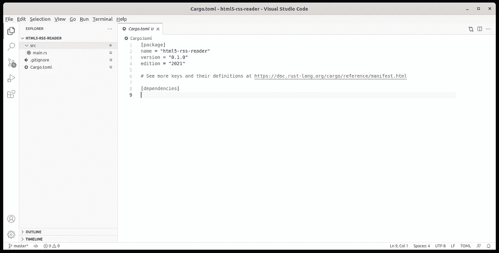
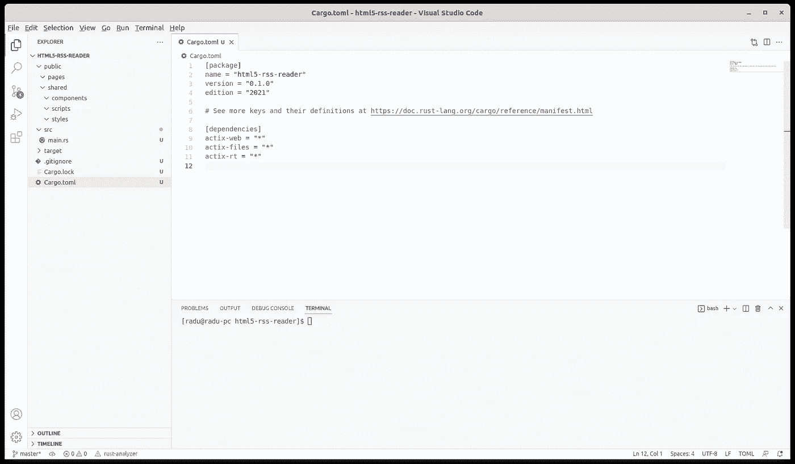
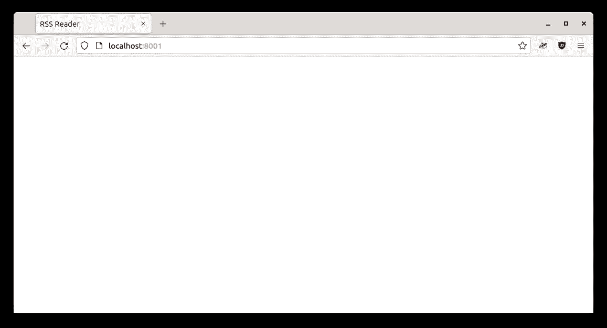

# 使用 web 组件和本地 Javascript 模块对 Rust web 应用程序进行初始设置

> 原文：<https://blog.devgenius.io/initial-setup-for-a-rust-web-application-using-web-components-and-native-javascript-modules-ee832c062e8a?source=collection_archive---------5----------------------->


Gabriel Crismariu 在 [Unsplash](https://unsplash.com?utm_source=medium&utm_medium=referral) 上拍摄的照片

谈论 HTML5 Web 组件有点奇怪。web 开发行业现在都是关于框架的:Angular、React、Vue，当然还有它们无数的分支和变体。如今，当开始一个新项目时，问题总是你使用什么框架，没有人关心你是否需要一个框架。看起来你只需要使用一个 Javascript 框架，否则所有的神都会生你的气，用他们的愤怒打击你。

在本系列文章中，我们将探索如何使用普通 Javascript 构建现代 web 应用程序。我们将解释什么是 HTML5 web 组件，如何使用它们，如何不使用它们，如何设计它们的样式以及如何处理可怕的状态。另外，应用程序将是静态的:由 Rust web 服务器提供的普通 HTML 页面，由 Rust API 提供支持。可以说是一种 Jamstack(仅 Javascript、API 和标记)。

我们还将使用 Javascript 模块，这也是现代浏览器固有的支持。这再次意味着我们不需要 Webpack 或任何其他翻译工具。我们将简单地在所有更新的浏览器中使用已经存在一段时间的原生 Javascript 工具。代码可以在 [github](https://github.com/raduzaharia-medium/html5-rss-reader-initial) 上获得，但是如果你想学得更好，你应该按照教程自己写代码。

该应用程序将是一个 HTML5 RSS 阅读器，该系列将是这样的(当我写文章时，这些点将更新到链接):

1.  应用程序的初始结构(本文)
2.  [模仿应用程序布局](/the-responsive-layout-for-our-rust-web-application-8fb46fe14c8f)
3.  [第一个 HTML5 web 组件](/html5-rss-reader-writing-the-first-web-components-949eec88dbf9)
4.  [继承组件](/html5-rss-reader-writing-specialized-web-components-8c8a972e681a)
5.  [向自定义列表添加过滤器](/html5-rss-reader-filtering-the-custom-list-component-c3ba366c08fd)
6.  [关于暗影 DOM](/the-shadow-dom-of-an-html5-web-component-d99af7844192)
7.  正在读取 RSS 数据

## 发展先决条件


杰伊·黑克在 [Unsplash](https://unsplash.com?utm_source=medium&utm_medium=referral) 上拍摄的照片

本教程将使用 VSCode 和 Rust，因此您应该同时安装它们。我们将在 Fedora 35 机器上开发，所以我的设置代码将使用`dnf`。让我们安装 VSCode:

```
#sudo rpm --import https://packages.microsoft.com/keys/microsoft.asc
#sudo sh -c 'echo -e "[code]\nname=Visual Studio Code\nbaseurl=https://packages.microsoft.com/yumrepos/vscode\nenabled=1\ngpgcheck=1\ngpgkey=https://packages.microsoft.com/keys/microsoft.asc" > /etc/yum.repos.d/vscode.repo'#sudo dnf install code
```

接下来让我们安装 Rust:

```
#sudo dnf install cargo rust rustfmt
```

我通常添加两个 VSCode 扩展来帮助 Rust 开发:`Better TOML`和`rust-analyzer`。现在我们可以创建我们的`html5-rss-reader`应用程序了，我将使用一个项目文件夹:

```
#mkdir Projects
#cd Projects
#mkdir html5-rss-reader
#cd html5-rss-reader
#cargo init
```

好了，我们可以启动 VSCode 并加载 html5-rss-reader 文件夹了:



空的 RSS 阅读器应用程序

就是这样。我们已经准备好开始开发我们的 HTML5 RSS 阅读器应用程序。

## web 和 API 服务器


达米安·扎列斯基在 [Unsplash](https://unsplash.com?utm_source=medium&utm_medium=referral) 上拍摄的照片

让我们用 web 服务器所需的依赖项来更新`Cargo.toml`文件。我们将使用`Actix` web 框架，我们将准备异步工作的代码，因为将来我们将加载 RSS 数据，我们希望在不阻塞服务器线程的情况下这样做:

```
[package]
name = "html5-rss-reader"
version = "0.1.0"
edition = "2021"[dependencies]
actix-web = "*"
actix-files = "*"
actix-rt = "*"
```

让我们在 public 中添加一些文件夹:`pages`和`shared`，其中`components`、`scripts`和`styles`为子文件夹:



应用程序文件夹结构

现在我们可以在`main.rs`中创建我们的 web 服务器了:

```
use actix_files::Files;
use actix_web::{App, HttpServer};#[actix_rt::main]
async fn main() -> std::io::Result<()> {
  return HttpServer::new(|| {
    App::new()
     .service(Files::new("/shared/scripts", "./public/shared/scripts/"))
     .service(Files::new("/shared/components", "./public/shared/components/"))
     .service(Files::new("/shared/styles", "./public/shared/styles/"))
     .service(Files::new("/", "./public/pages/").index_file("index.html"))
  })
  .bind("0.0.0.0:8001")?
  .run()
  .await;
}
```

我们正在准备 web 服务器，以便从我们创建的文件夹中提供静态内容:普通文件夹的`shared`、`components`和应用程序 HTML 的`styles`、`pages`。我们将默认的 HTML 文件配置为位于`pages`文件夹中的`index.html`。我们还配置服务器监听端口`8001`。

注意声明`main`的方式:is 通过声明`actix_rt::main`属性来使用`actix_rt`异步运行时。这允许我们通过允许`main`本身异步来创建`async`函数。

让我们在`public`文件夹中添加一个几乎为空的`index.html`文件:

```
<!DOCTYPE html>
<html lang="en">
  <head>
    <title>RSS Reader</title> <meta charset="UTF-8">
    <meta name="viewport" content="width=device-width, initial-scale=1.0">
  </head>
  <body>
  </body>
</html>
```

我们已经准备好构建和运行我们的应用程序:

```
#cargo build
#cargo run
```

现在我们可以打开浏览器并转到 localhost:8001:



我们的空应用程序

暂时就这样了。我们看到标题为 RSS 阅读器的空 HTML 页面。[下一次](/the-responsive-layout-for-our-rust-web-application-8fb46fe14c8f)我们将通过创建一个我们想要实现的小模拟来开始我们的应用程序。在那之前，如果你有任何问题，请随意使用评论，或者让我知道你是否有特别想在本教程中看到的东西。下次见！