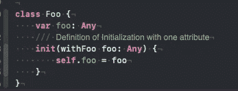
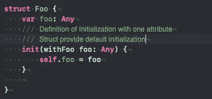
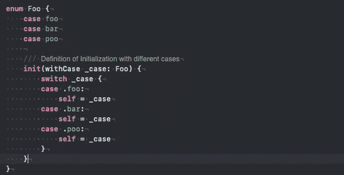
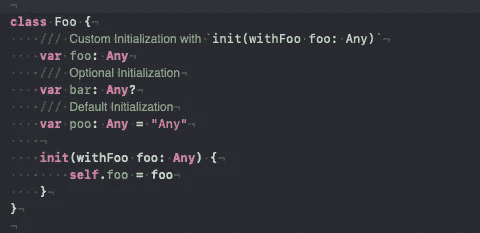
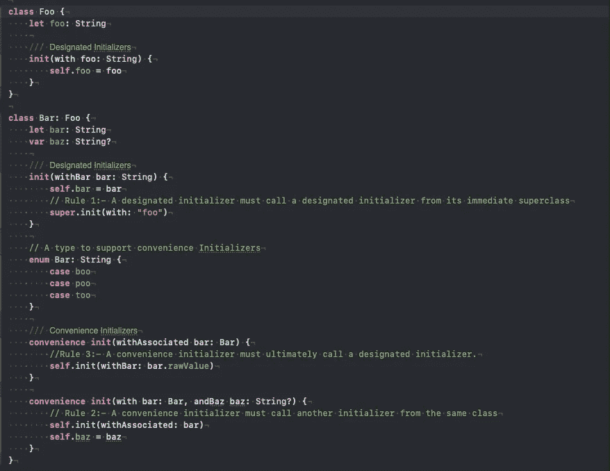
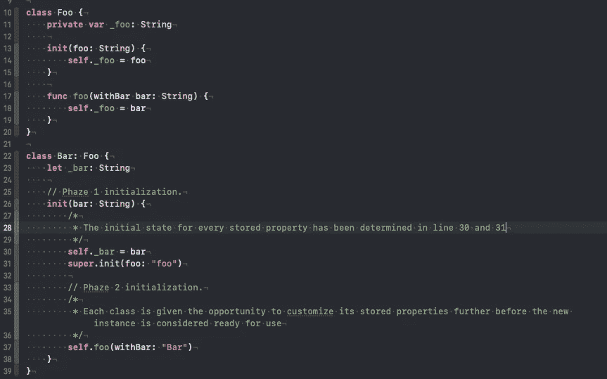
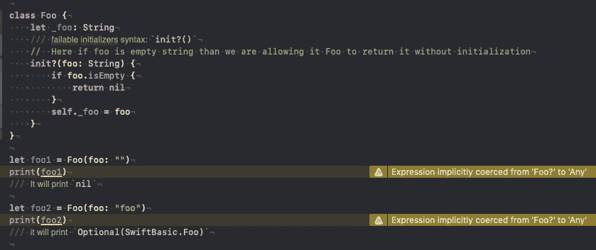
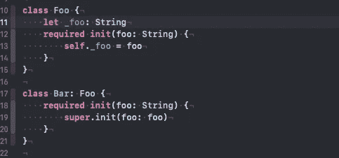
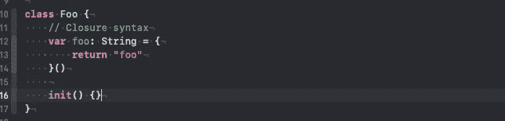

# 使用 swift 进行初始化。

> 原文：<https://blog.devgenius.io/initialization-with-swift-32e132f7bc3f?source=collection_archive---------3----------------------->

**初始化:**初始化是准备类、结构和枚举的实例以供使用的过程。
注意:——Swift 保证你的实例完全初始化或零初始化。



类初始化(自定义)



结构初始化(自定义)



枚举初始化(自定义)

**缺省初始化:** Swift 为任何结构或类提供了一个*缺省初始化器*，该结构或类为其所有属性提供了缺省值，但本身没有提供至少一个初始化器。
**可选属性类型:**如果您的自定义类型有一个逻辑上允许“无值”的存储属性——可能是因为它的值不能在初始化期间设置。



初始化

# 类继承和初始化。

对于类类型
1 有两种初始化器。去设计的初始化器:
2。方便的初始化器:



指定的与方便的初始值设定项

两阶段初始化:

Swift 中的类初始化分为两个阶段。在第一阶段，每个存储的属性由引入它的类赋予一个初始值。一旦确定了每个存储属性的初始状态，第二阶段就开始了，在新实例被认为可以使用之前，每个类都有机会进一步定制其存储属性



两阶段初始化。

* *请注意，对于相同的语法，您也可以覆盖“init”。(第 26 行)

**失败的初始化器:**允许在对象初始化过程中的任何时间点触发失败。



类类型的初始化失败

**必需的初始化器:**需要初始化链来提供超类的必需初始化。



**闭合方式初始化:**



闭包语法

— — — — — — — — — — — — — — — — — — — — — — — — — — — — — -

**练习:-**

```
**class** Animal {
   **let** name: String
   **let** type: String
   **var** description: String {
      **return** “Animal is \(name) having subType \(type)”
    } **init**(withName name: String, type: String) {
       **self**.name = name
       **self**.type = type
     }
}**class** Vertebrates: Animal {
   **let** category: String **override** **var** description: String { 
        **return** “\(**super**.description) which further categories as \.     (category)”
     } **init**(withName name: String, type: String, category: String) {
        **self**.category = category
        **super**.init(withName: name, type: type)
    }
}**Question:- What will be the output.
let** instanceOfVertebrates: Animal = Vertebrates(withName: “vertibrates”, type: “Warm-blooded”, category: “Mammal”)print(instanceOfVertebrates.description)
```

延伸阅读:
[https://docs . swift . org/swift-book/language guide/inheritance . html](https://docs.swift.org/swift-book/LanguageGuide/Initialization.html)

感谢阅读。如果您有任何疑问，请告诉我。

roshankumar350@gmail.com
罗山·库马尔·萨。