# F#中的内联程序集！它是如何工作的？

> 原文：<https://blog.devgenius.io/inline-assembly-in-f-net-language-6d70ab9f58c1?source=collection_archive---------1----------------------->

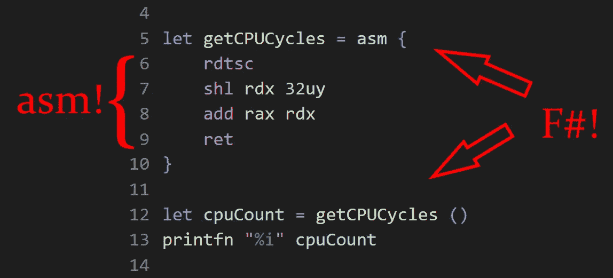

这是 F#中的汇编语言。不，这不是模仿。它不是 IL。它是 x86 汇编语言。在你的 CPU 上运行的那个。…在 F#中。

这一切是如何开始的(看看我的推特，呵呵)

所以，让我们看看它是如何工作的引擎盖下！

# 让我们用 C#编码几条指令！

所以，我来给你讲讲[冰镇](https://github.com/icedland/iced)。这是一个非常棒的库，它允许你为 x86(基本上，大多数桌面 CPU)编码和解码汇编。

我们可以像这样创建一个装配生成器，并添加一些指令:

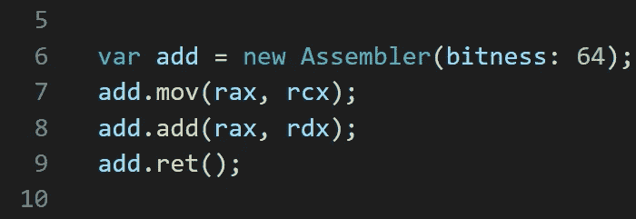

创建一个汇编程序并实现两个数相加的函数

但是这没有任何作用。它只是把它们保存在某个地方，是为了方便我们使用它们。它不会使任何东西可执行。

# 现在，我们将汇编保存到可执行内存中

什么是可执行内存？它就像常规内存，但操作系统“允许”从那里运行字节作为 CPU 指令。

我们将使用 Windows API 来分配内存。一旦分配，我们将改变其保护为可执行。我们正在做的是:

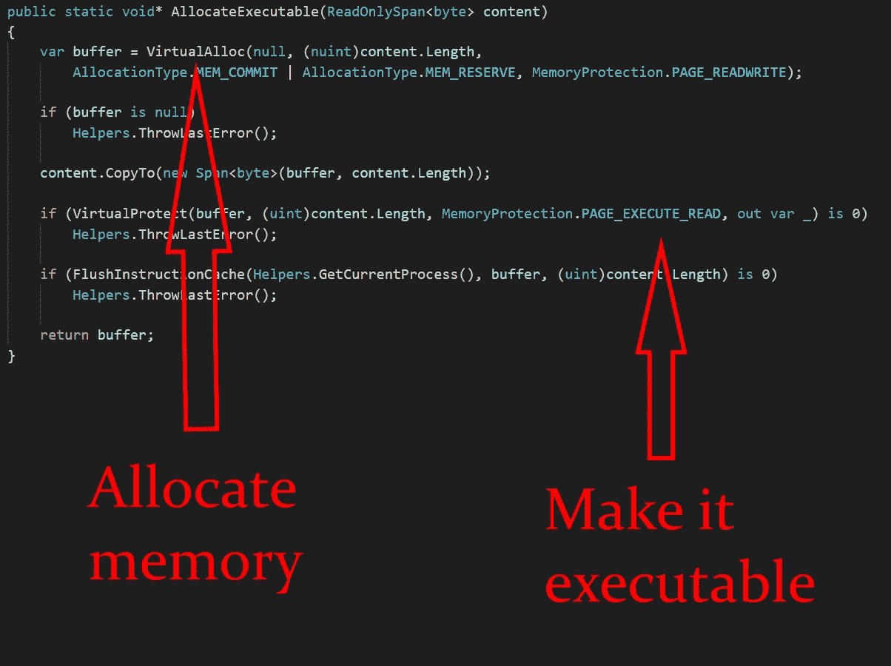

分配内存并使其可执行

好吧，那么…现在我们做到了，这意味着什么？这意味着，如果我们写入那个内存，我们可以制作一个 [*函数指针*](https://docs.microsoft.com/en-us/dotnet/csharp/language-reference/proposals/csharp-9.0/function-pointers) 指向第一个字节，并本地运行它！

# 将我们的程序集复制到内存中

基本上，使用 Iced API 我们只是将字节保存到一个流中，然后我们为它们分配内存并复制到其中。

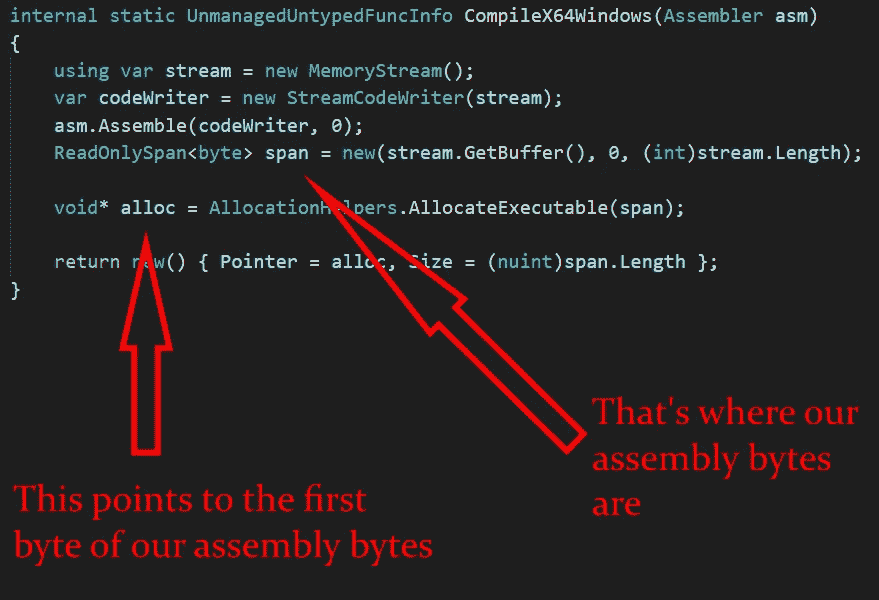

将汇编字节复制到可执行内存

# 编译以委托

正如你所注意到的，到目前为止我们一直使用 C#。原因是 F#还不喜欢函数指针。我们得做出能被 F#执行的东西。

记住——我们得到了一个指向汇编内存块第一个字节的指针。所以我们所需要的就是以某种方式调用它作为一个函数。为此，我做了一个扩展方法，将指针转换成函数指针:

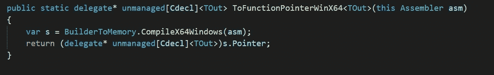

“编译”后将指针强制转换为函数指针

然后我需要为它做 Func <tout>。这部分我就省略了，因为太邪恶了。但是如果你很好奇，这里有它的来源。它从函数指针中获取 Func < TOut >。</tout>

# F#的简洁语法

为了获得我在截图中展示的语法，我们将使用[计算表达式](https://docs.microsoft.com/en-us/dotnet/fsharp/language-reference/computation-expressions)(CE)——非常丰富的特性，是 F#所独有的。

你可能已经见过 CEs 在使用中，例如 task { }，async { }，seq {}，如下所示:

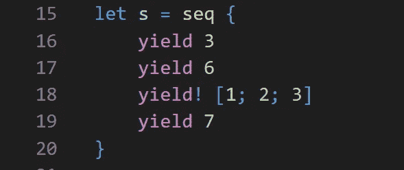

内置 CE 的示例

我们要宣布我们自己的。此外，我们将对它使用自定义操作。

首先，让我们定义 Yield，在定制操作符的情况下，它可以用作“初始化器”:

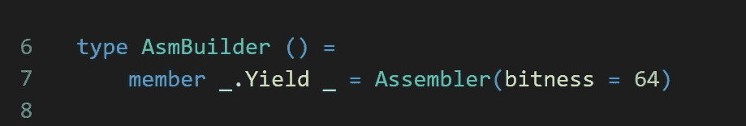

首先创建汇编程序的实例

现在，让我们创建一些方法。Iced 的汇编器有成百上千个方法，实际上可以使用反射为它们生成一个包装器，但是为了简单起见，我将在这里展示我在示例中使用的方法:

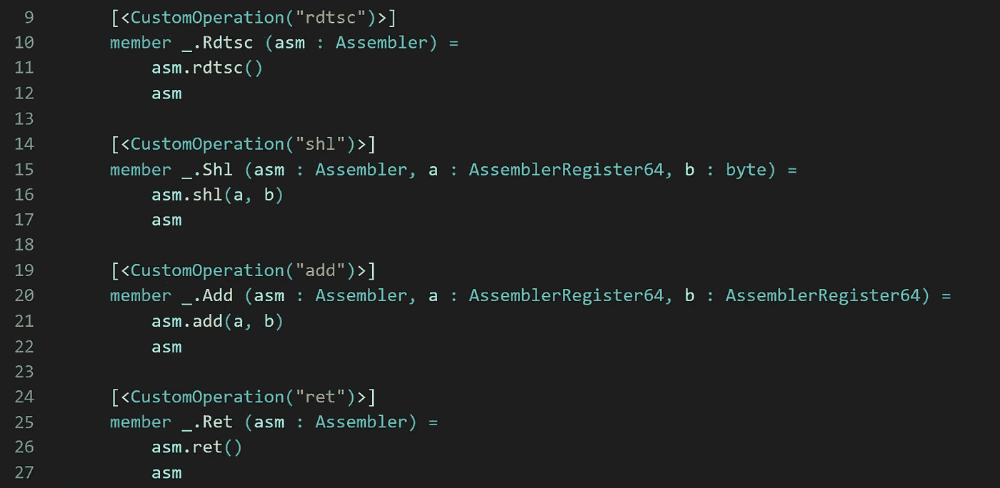

定义 rdtsc、shl、add 和 ret

我们通过属性的第一个参数给它们命名。

最后，我们声明方法 Run，它“终结”表达式:

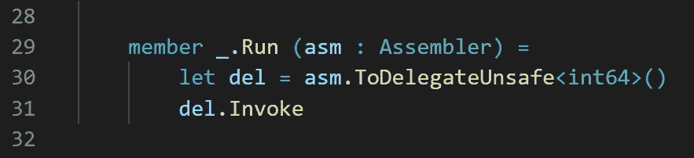

定义运行方法

所以最后它返回一个函数，这个函数不接受任何参数，但返回一个 int64。

搞定了。我们声明了 AsmBuilder。我们现在可以实例化它的一个实例(我们实际上只需要创建它一次，因为我们从不改变它):

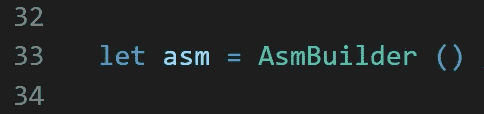

# 使用

现在，我们可以使用我们的 asm 计算表达式，通过使用我们定义的自定义操作，并从 ice 传递常量或寄存器。

下面是用这种内联 asm 语法创建的两个函数示例:

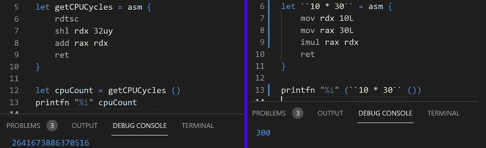

# 结论

所以，这就是它，我没有进入任何主题的细节，我认为这只是一个有趣的 ice/F #的 CE 和东西的用例。

对于“真正的”使用，有很多限制。

首先，F#不支持函数指针，[不可能](https://github.com/dotnet/runtime/issues/9136)从泛型函数指针创建委托。这意味着我们需要为不同大小和 ABI 的参数创建大量重载(例如，Windows x86 上的浮点在 xmm 寄存器中传递)。在这篇文章中，我只考虑一个返回的函数，但不接受任何参数。

第二，我没有做任何事情来支持调用和标签(显然，这对于任何非基本的东西都是必不可少的)。所以这是一个概念的证明，而不是真实的东西。

但无论如何，我希望它是有趣的！来源是这里的。感谢您的关注！

我的 [twitter](https://twitter.com/WhiteBlackGoose) ， [github](https://github.com/WhiteBlackGoose) 。