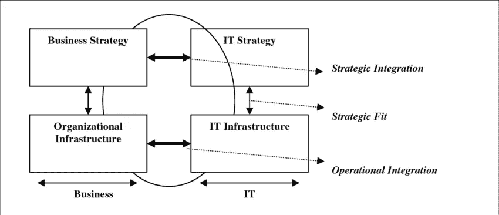

# 软件架构师和开发人员的创新

> 原文：<https://blog.devgenius.io/innovation-for-software-architects-and-developers-3fa207ec2556?source=collection_archive---------9----------------------->

## 作为开发人员，您如何发现创新

里卡多·安南达尔在 [Unsplash](https://unsplash.com/s/photos/innovation-ideas?utm_source=unsplash&utm_medium=referral&utm_content=creditCopyText) 上的创新

在这篇文章中，我想寻找作为一名开发人员，如何帮助您的公司创新的方法。当您听到创新时，您会想到您的公司可以开发的新产品或服务。你是对的，因为“创新”这个词来自拉丁语 innovate，意思是“创造新事物”。但这不是我想讨论的创新类型。相反，我想解释另一种创新，作为一名开发人员，您可以实现这种创新。

# 创新源自哪里？

在我们谈论创新的可能来源之前，我想看看业务和 IT 的一致性。等等，我知道这不是一个开发人员最关心的话题，但是了解创新的背景是很重要的。

战略联盟模型(亨德森和文卡特拉曼，1999 年)

Henderson 和 Venkatraman 的这个模型显示了业务和 IT 之间的各种一致性。现在，我想用这个模型来展示创新的可能起源。该模型的左侧是业务侧，而右侧是 IT 侧。

业务创新源自左侧，这表明了业务的领域。右侧的创新是 IT 创新。

让我给你看两个例子来解释区别。

## 来自业务方面的创新

我为一个客户工作，他创造了控制温室内气候的系统。如果我们看看哪种创新来自他们的业务方面，我们会看到改善作物平衡的新增长模式。例如，这些模式有助于种植质量更好、产量更高的西红柿，同时保持低能源成本。

## 来自 IT 方面的创新

该客户还使用了来自 IT 部门的其他创新，例如，使用天气雷达数据。该系统不断检索和分析天气雷达数据。使用雷达数据，当有可能出现冰雹或强降水的迹象时，他们可以关闭温室的窗户。

## 开发者的责任

作为一名开发人员，您在前面显示的模型的右边。您在创建和执行 IT 战略中扮演着一个角色。当你是一个程序员，你的责任不仅仅是编程。这也是关于识别 It 趋势和技术，当你从业务方面将它们与问题联系起来时，它们可以转化为创新。

# 作为一名开发人员，您如何带来 IT 创新？

照片由[福蒂斯·福托普洛斯](https://unsplash.com/@ffstop?utm_source=unsplash&utm_medium=referral&utm_content=creditCopyText)在 [Unsplash](https://unsplash.com/s/photos/development?utm_source=unsplash&utm_medium=referral&utm_content=creditCopyText) 拍摄

作为开发人员，您有责任引入 IT 创新。这并不意味着跳到每一种新的编程语言、库、框架或 IDE 上。这意味着你可以选择新技术并应用它来为你的公司带来价值。

让我给你看几个例子。

## 自动连接系统

正如我之前所说，我的一个客户创造了一个控制温室气候的系统。有时候，温室太大了，我们需要不止一个系统来控制气候。然后，系统工程师必须连接系统。他通过输入网络配置加入他们。他在两个系统中输入 IP 地址、端口和协议。耦合系统需要很长时间，而且容易出错。

开发团队想出了一个很棒的解决方案。他们已经使用 Windows Communication Foundation(WCF)进行内部通信。他们添加了 UDP 协议。这意味着，当控制站位于同一个网络中时，它们会发现彼此并自动连接。

因此，服务工程师可以节省时间并安装更多系统。客户可以销售更多的系统。

这是创新吗？将 WCF 与 UDP 结合使用则不是。但是在园艺领域使用这种技术来自动连接控制站是非常困难的！

## 单击演示安装

我的另一个客户为航空公司和游轮生产娱乐系统。潜在客户想要一个演示，展示我们如何将该系统集成到他们的 IT 基础架构中。以前，演示系统的安装和配置需要很长时间。需要软件开发人员来排除故障。

开发团队提出了一个创新的解决方案。他们对解决方案和演示进行了改造，使其可以在 Docker 容器中运行。我们创建了一个 docker-compose 文件，可以在几分钟内启动整个演示环境。我们将 docker-compose 文件发送给客户来安装演示系统。他们通过一个简单的命令启动演示环境:`docker-compose up -f demo-environment.yaml`。

客户对安装的简易性印象深刻。这给我的客户带来了更多的订单。

现在将 Docker 容器与 Docker compose 结合使用是创新吗？不，Docker 容器是分发应用程序的一种常见方式。

但是，能够在几分钟内在客户的 IT 基础架构中安装和配置演示环境是真正的创新！

## 提供健康信息

创建娱乐系统的客户收到一个健康组织的请求。这个组织在非洲很活跃。该组织需要一种方法来为没有互联网连接的村庄提供健康信息。

娱乐产品包括一个带有 WIFI 接入点的硬件解决方案。当你将手机连接到飞机上的接入点时，它会显示一个页面，上面有飞机上播放的电影。

开发团队重组了娱乐产品，以支持 PDF 文档。例如，这些文件描述了如何预防霍乱。

这是创新吗？对村里的人来说，是的。他们现在可以在手机上查找和阅读健康信息。

# 这些创新有什么共同点？

如果您仔细查看这三个示例，您会发现它们在客户端领域中使用它解决了一个特定的问题。因此，为了能够提出这些解决方案，您必须了解客户在其领域中的问题。

以园艺领域的客户为例，它有助于了解种植者面临的问题。他日常工作中最耗时的是什么？这次是否有新的 IT 趋势或解决方案会减少？

我们还研究如何优化其他客户在飞机上使用的解决方案。飞机最关键的一点是减少周转时间。因此，现在我们正在寻找优化媒体内容加载的方法。

所以下次你听到新技术时，试着看得更远，而不是它有多酷。搜索该技术如何解决客户领域中特定问题的可能性！

如果你有一个如何以创新的方式解决客户问题的很酷的例子，请在评论中告诉我。

感谢阅读。

*更多内容尽在*[*blog . dev genius . io*](http://blog.devgenius.io)*。*