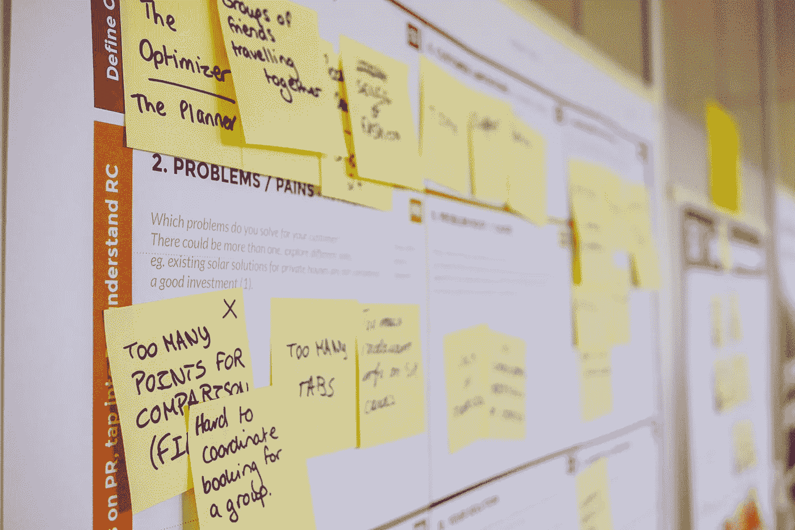

# 创新惯性——什么、如何以及为什么会发生？

> 原文：<https://blog.devgenius.io/innovation-inertia-what-how-and-why-it-happens-e20bac9626b9?source=collection_archive---------12----------------------->

首先，一些定义:

> **创新**在现代意义上是“一个新的想法，创造性的思想，以装置或方法的形式出现的新的想象”。**创新**通常也被视为应用更好的解决方案，以满足新的需求、未阐明的需求或现有的市场需求。
> 
> **惯性**，名词，一种无所事事或保持不变的倾向。

有一天晚上睡不着的时候我把这两个词放在一起。你看，在最近的一次任务中，有些事情让我非常沮丧。2019 年初，我受雇于一家成功的电子商务公司，踏上了“敏捷转型”的征程。它被出售，因为企业中最优秀、最聪明的人才被重新分配到这个高优先级项目中，其主要目的是将他们庞大的整体拆分成，你猜对了…微服务！

当我开始的时候，肯定有很多好事发生。该架构已经经历了几次迭代，最终决定采用基于 [CQRS](https://docs.microsoft.com/en-us/azure/architecture/patterns/cqrs) 的产品 API 方法(作为 AWS ECS 上的 Spring Boot 应用程序运行)。前端通过由 NGINX、NodeJS 和 React 组件组成的页面组合层提供页面服务。非常现代和令人印象深刻的技术堆栈。

团队编写了一个又一个测试，以确保自动化是他们工作的核心，手动测试是非常轻松的，如果有的话。性能测试甚至是开发工作流的一部分，以确保他们的服务为黑色星期五及以后提供所需的性能。设计团队正在根据最新的客户研究精心设计响应式设计。我们的基础设施*是*代码，持续交付是一切的核心，站立、倒退和冲刺也在全面展开。见鬼，我们甚至有小队，部落和行会。

**这个项目具备现代软件项目的所有特征，这应该很大程度上保证了成功，对吗？**

那么，为什么在一年多的时间里(在撰写本文时),这个项目几乎没有任何东西呈现在公众面前呢？唯一值得注意的成功是一个新的“静态”页脚添加到网站的低流量页面作为测试平台。除此之外，这一转变我们的建筑和交付文化的巨大努力几乎没有留下任何东西。

我们仍然在做前面提到的所有“最佳实践”——他们疯狂地招聘，但交付的却很少。

这就是我想出“创新惯性”这个词的原因。

# 文化

你可能遇到过“文化早餐吃策略”这句话被任命为彼得·德鲁克和后来的福特首席执行官马克·菲尔兹。这句话非常非常准确。当你提到公司文化时，你往往会想到免费食物、啤酒冰箱和豆袋类型的文化。文化，比这更微妙和微妙。抱歉，这也不局限于 t̵e̵a̵m̵s̵队。它比生产产品的团队更广泛。文化延伸到组织的运作方式，哪个筒仓控制产业的哪个部分。例如，生产站点的前端是内容交付网络(CDN)。要将任何新东西投入生产，都需要改变 CDN 的配置；只有一小群除了自己谁也不相信，通过换票和出租车会议交流的人才能改变。那些半看不见的障碍是有原因的，我的猜测是有人搞砸了一个变化，导致停机和业务亏损的下意识反应。然而，这些类型的障碍削弱了企业的敏捷性。

*我曾经参加过一个会议，会上开发人员因造成宕机而受到严厉指责，并给出了一个 AdWords 预算在网站瘫痪时被花掉的大概数字。然而，美好时光——我跑题了。*

这个 CDN 团队并不是唯一一个对生产领域拥有重大控制权的团队，他们多年来积累了大量的狂妄自大。安全小组也持有类似的立场。经常可以发现他们居住在知识的制高点上，用牙齿剧烈地吸进空气，抚摸着下巴，同时高兴地站在进步的路上，只是为了让别人听到他们的意见。每个人都会倾听并欣然接受为期三周的修复工作，以修复 Docker 容器层中的一个漏洞。没有人想为安全漏洞负责——所以这个过程重新开始。

# 生产之路

如果你在进行一个转型项目时遇到了文化障碍，就像前面提到的团队一样，你将会经历一些非常痛苦的对话。领导者需要找出并适应最简单的生产方式。首先，善于运送你的独石，试着两周发布一次以上来了解痛点。这样做至少六个月，可能会比任何激进的技术变革清除更多的障碍。

承认诸如提高变更票和 CAB 会议之类的流程都有点责备文化的味道，在这种文化中，人们会因犯错误而受到斥责，因此监护人被安排到位以确保类似的错误永远不会重复！随着时间的推移，越来越多的保护措施被层层叠加，直到人们最终不愿做出任何有风险的改变。他们不能完成改变过程，或者他们开始绕过它。无论哪种方式，事情开始停滞不前，任何敏捷性都被取消。

通过分析和发现你当前交付过程中的缺陷，你将能够避免任何潜在的障碍。如果不审视当前的交付途径并首先消除障碍，无论你选择什么样的技术堆栈或架构，规避风险的文化都将依然存在。

错误时有发生，这是生活的现实。使它们更容易修复。

# 规划谬误来袭

非技术利益相关者倾向于大量参与项目，如从整体到微服务的转换。毕竟，当他们无法更改网站内容或获得所需的报告以更好地为客户服务时，他们每天都会感到痛苦。他们被“微服务的勇敢新世界”耀眼的灯光和它带来的可能性蒙蔽了双眼，这是可以原谅的。他们开始要求你做大，因为亚马逊和网飞有微服务，我们想成为他们那样的人！

所以，你踏上了这个旅程，在真正知道真正涉及到什么之前就过早地让人们参与进来。你向他们展示了一个网站的新的前端设计，例如，兴奋建立。但是，如果你要将它分解成组件或微前端，在实现微服务涅槃之前，你需要相当多的部件，即使是小规模的。作为绝对最低要求，您需要:

*   页眉组件
*   可选择与 CMS 集成的页面主体组件
*   页脚组件
*   页面合成服务
*   提供页面数据的数据层或服务

更不用说所有的基础设施、监控和日志记录、自动化测试、代码回收和构建管道，只是为了让这些代码出门。对于外行人来说，这可能只是一个简单的网页，但实际情况却大不相同。估计很难。你将会从耳朵里得到依赖(映射并跟踪这些)。事情需要被协调，事情需要被优先化并且在被部署之前被测试，整合策略需要被决定等等。一口气吞下去的工作量真大。我大胆猜测，如果你要重新开始，你至少要花六个月的时间写一页。

再加上对工作的低估，利益相关者不会感兴趣，直到你演示完整的页面——因为这是他们想要的，也是他们得到的承诺，对吗？你那些花哨的轻量级、高性能的 API 不会以同样的方式流动。因此，相关团队会在头脑中保持这个目标，“我们必须建立一个完整的页面，我们必须建立一个完整的页面”。混合方法就是不行。**这是瀑布人。**多年前，这种思维模式让我们陷入困境，但现在我们正试图说服自己，我们是敏捷的，因为我们在做同样的事情，但却不同，因为我们在构建微服务，在 sprints 中工作，并采用 Spotify 模式。

经验告诉我的一件事是，你不可能在一次巨大的成功中建立以上所有的东西。[我的连续交付时刻](https://medium.com/@devdoneuk/my-continuous-delivery-moment-dbd96a9a3adf)概述。你必须找到尽可能小的一块，然后这样做。《精益创业》和《敏捷宣言》谈到了“为了验证这种方法，我们能做的最少的工作是什么”和“最大限度地减少未完成的工作”。然而，我们似乎总是吃不完，更不用说咀嚼了。

当提出整体到微服务项目的理由时。解决办法是不要承诺构建一个完整的页面或无数的服务。从一个微小的服务开始，一个服务于版权声明或你的财产的其他微小部分的组件。将它嵌入到你现有的整体结构中，观察会发生什么并从中学习。

> 从一开始就构建一个服务，并将其集成到您的 monolith 中。让它成熟，监视它。善于部署它。看看它的表现，从中学习。

就是这样。一件事使用你的新架构和工作方式等。它可能会做得很少，利益相关者会问“怎么回事，什么时候才能完成整个页面？”。但是，你的答案将是“稍后，我们正在学习”。你可能会发现微服务现在并不是最合适的，只能坚持使用更大的服务。你可能会发现你的技术选择并不合适。我的一位同事最近对一种新的电子邮件营销解决方案进行了为期一周的研究，老板要求这种解决方案应该成为营销活动的新规范。他的老板周末过来问为什么他们不抓紧时间把它建好？他们认为新的解决方案完全不可行。如果他们只是盲目地按老板最初的要求去做，而没有提前做好准备，他们会遭遇一个痛苦的世界。

> 失败得快，失败得小。

# 企业与创业心态

当你在像这样的大型企业中时，倾向于“这是我们一贯的做法”的思维方式，让那些公司的安全专员和 CDN 团队等行使他们的权力。是的，两周一次的发布周期和几天的手工测试已经让你到达了今天的位置，但是它不会让你停留在那里。消费者的趋势在不断变化，能够站在客户的角度对你的成功至关重要。所以，你需要实验的能力，去尝试不确定性更高的不同事物。像重新构建您的应用程序以便直接部署到生产环境中，并且只进行自动化测试这样的实验仍然会发生，但是会带来更高的风险。这就是公司心态开始发挥作用的地方，人们开始想“我们以前从来没有这样做过，如果出了问题，我们都会看起来很愚蠢，我们再也不会有这样的机会了”。恐惧和谨慎占据了主导地位，会议开始变得越来越频繁，越来越多的人参与进来，这只会延缓进展。在您知道之前，您设置的发布单个组件的 90 天时间表已经错过了，因为没有您的安全团队和代表不同“业务”领域的无数其他人的签署，您无法上线。六个月过去了，仍然有没有业务的人在那里对项目提出要求。开发团队现在面向内部，构建一个能够处理数百万事务的复杂的监控、日志记录和警报平台，支持轮值表已经达成一致，因为你想看起来很忙，但是…你还没有启动一个服务来支持你的体系结构，即使是一点点——因为你的恐惧文化！

> 你没有像初创公司一样思考，你的管理层也没有像初创公司一样对待这个“孵化器项目”。
> 
> 但事实就是如此！

在创业公司，你的时间和预算都是有限的。你必须要有创造力才能把事情做好。我曾经在亚马逊上听说过一个轶事，有人向杰夫·贝索斯推销一个新想法，他只是简单地回答道:“太好了，你有三个月的时间和 25 万美元，否则这个计划就泡汤了”。残酷，但也精彩。玛莎·莱恩-福克斯(Martha Lane-Fox)主持重建英国政府的数字服务时，gov.uk 网站也进行了类似的实验。他们采用了一种服务并将其数字化。这个团队很小，只有八个人，并且又一次被给予三个月的时间来提出一个工作原型来证明这个概念。查找 [AlphaGov](https://en.wikipedia.org/wiki/Alphagov) 获取更多信息。这些类型的约束迫使人们以不同的方式思考和工作。人们必须拿出一些东西来展示他们的时间和他们被赋予的自主权。他们需要清晰、明确的目标来努力实现——他们最终要对项目的成功负责。团队必须足智多谋，在资金或时间耗尽之前更聪明地工作。

按照公司的思维方式，财权是集中管理的，每个人本质上都还在工资单上，这个项目似乎有一个预算无底洞。很少或没有问责制，人们只通过状态报告和输出，而不是结果来负责。必须有某个人或某件事作为项目成功的基础。这不能是一个长期的模糊目标，比如“我们希望有一个平台供业务中的所有团队使用”或“我们希望让我们的客户更容易购买东西”——微服务可能会帮助你做到这一点，但你也可以更新你的网站设计，对吗？

当像 AlphaGov 等进行小赌注时。你必须做好赌输的准备，承认失败，并足够无情地放弃整件事。小赌注伤害较小。

> 制定具体的、可衡量的、有时间限制的计划，如果计划失败，准备好退出或改变。

# 克服创新惯性

总的来说，把你的架构的任何改进都当成一个普通的 IT 项目，很可能会让人们坚持以他们一贯的工作方式做事。你必须彻底改变日常工作的条件。给团队施加约束，给人们自主权，让他们完全掌控自己的命运。不再有集中的团队控制基础设施或对生产环境的访问。

在 开始这段旅程之前，尽可能地去除官僚作风 ***，每周两三次轻松地运送你的巨石，这样人们就不用担心部署和发布会变得无聊。去掉 CAB 会议之类的东西，尽量减少人工测试，这是 2020 人！***

保持团队规模较小，这个任务告诉我，超过 40 个人无法提供一项服务。忘记队伍、部落、公会和所有那些 [Spotify 的废话](https://www.jeremiahlee.com/posts/failed-squad-goals/)——这甚至都不是真的。让你的两个披萨团队(不超过八个人，也许五个？)并给他们一个现实的三个月目标。有形的东西，但很小。和他们一起想出一些东西，提供足够的知识来开启你接下来三个月的旅程。也要现实一点，承认如果方法不奏效，可能会取消整个计划！

保持其他东西小也是关键。不要试图马上构建几个部分。想想页面是如何组成的——什么服务/组件可以完全独立运行？挑那个。弄清楚它将如何推出，你将如何将它与你现有的产品整合在一起？你怎么知道它工作得很好？在花时间构建自己的产品之前，购买一些优秀的 DevOps 监控产品，如 New Relic 或 AppDynamics。企业也可以用这些！很多都是！

*我最近看了一集*[*syntax . FM*](https://github.com/wesbos/Syntax/blob/master/shows/182%20-%20practical.md)*，他们被问及如何打造下一个 Airbnb 或优步。他们一次也没有提到 AWS、Azure 或谷歌云。一切都下架了。如果/当你买不到这些现成的产品时，就换掉它们！*

作为 C-Level 或项目赞助商，你必须全力支持这样的项目。相信你选择的团队会做正确的事情。给他们选择自己命运的自由，取消阻碍他们的繁文缛节。他们都希望企业获得最好的结果，没有人打算搞砸和破坏底线！

你的文化是使这类项目成功的最大因素，比任何技术选择都重要。为小规模、快速的实验创造一个安全的空间是关键，其次是设置可衡量的限制。让项目团队中的每个人都像对待一个创业公司一样对待这个项目，就像这是他们自己的公司，花的是他们自己的钱，结果将会大不相同。