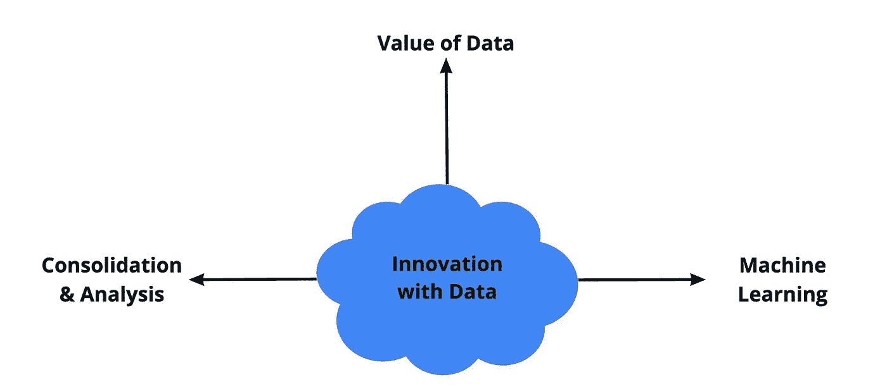
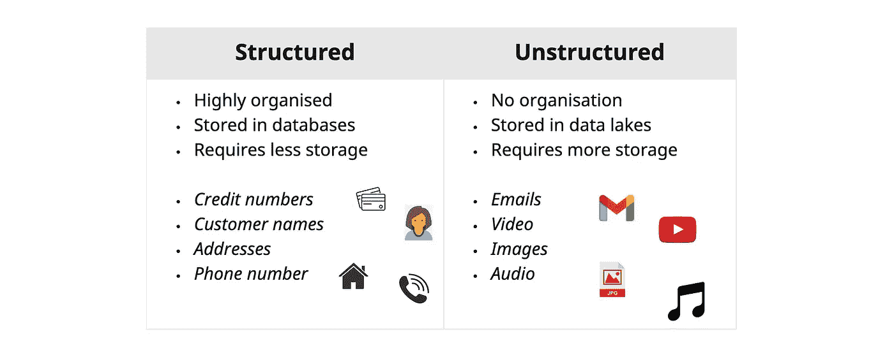
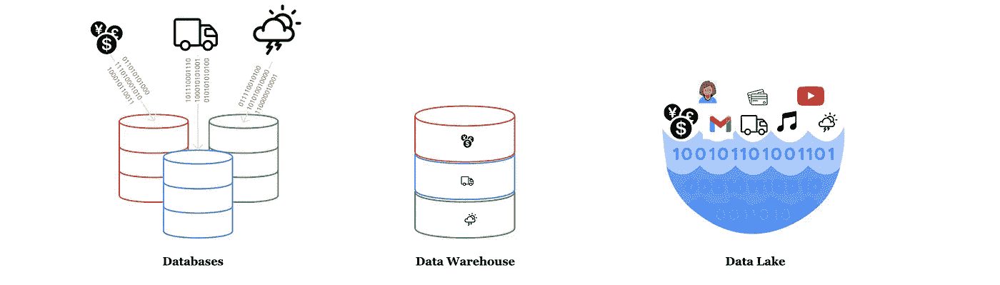
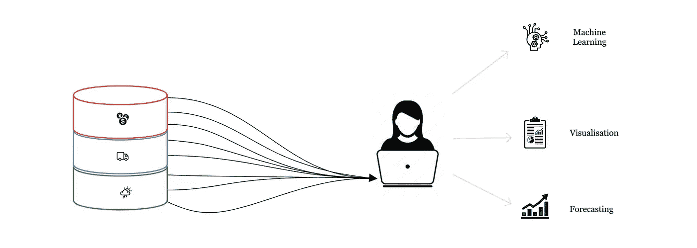

# 数据和谷歌云创新

> 原文：<https://blog.devgenius.io/innovation-with-data-and-google-cloud-337fbc29276c?source=collection_archive---------7----------------------->

## 学习指南

## 谷歌云数字领袖简介第 2 部分

欢迎阅读我的谷歌数字领袖概要系列的第二篇文章！你需要熟悉的所有关键术语都用**粗体**突出显示，并在文章底部定义📌

在本文中，我们将介绍数据的价值，如何管理、存储和分析数据，以及如何使用数据来预测特征。

> **注:**请以此文为指南，补充学习。我建议阅读完整提供的所有 Google cloud 文档，以完成考试准备。

# 数据的价值

数据可能来自组织内部或外部的多个地方。随着许多企业将其运营数字化，各种形式的有用数据变得可用。例如网络流量数据、物流数据或金融信息。现在的问题是，组织如何改善当前的基础设施以利用大量的输入数据，哪些类型的数据可用，以及必须采取哪些考虑因素？

## 利用数据

利用数据释放商业价值，这是数据驱动文化和组织数字化转型的根本原因。然而，由于基础设施的限制，并非所有组织都能利用数据:

**传统 IT 基础设施的局限性:**
❌不断增长的数据量
❌各种数据
❌经济高效的解决方案
❌可扩展性
❌对历史数据的访问
❌从历史数据和新数据中获得洞察力

**云技术使企业能够:**
✅实时消费、存储和处理万亿字节的数据
✅应对数据丢失或服务中断的能力
✅分析各种数据

## 数据类型

数据可以以多种形式出现，如电子邮件或交易。但是这些例子不是同一类型的数据，需要区别对待。在处理数据时，组织需要了解正在收集的数据类型、收集方式以及这些数据的存储位置。大多数收集的数据将是**结构化**或**非结构化数据**，它们的存储方式将有所不同。

组织依靠结构化和非结构化数据来获得洞察力并做出明智的决策。然而，非结构化数据历来很难分析。对此的解决方案是使用 API(应用程序接口),它可以集成不同的平台。API 的这个值是我们将在本系列的第 3 节的[中更多触及的内容。](https://medium.com/@rycole.hoyte/infrastructure-application-modernisation-with-google-cloud-a4f11643b2f1)

## **数据伦理**

数据伦理是指系统化、捍卫和推荐与数据(尤其是个人数据)相关的正确和错误行为的概念。虽然拥有大量数据对数据驱动型公司有利，但他们必须考虑收集何种数据以及数据存储的安全性。例如，如果需要存储关于员工和客户的个人和敏感信息，那么就要由企业来确保数据在存储到云中时得到安全收集和加密。我们将在本系列的第 4 节中更深入地讨论云中的安全性。

# 数据整合和分析

到目前为止，我们已经知道，数据是丰富的，强大的，并以多种形式出现。但是数据的用处是你没有合适的地方来存储它！在本节中，我们将讨论如何存储数据、Google Cloud 提供的存储产品以及如何分析存储的数据。

## 迁移到云

正如我们之前在[章节](https://medium.com/@rycole.hoyte/digital-transformation-with-google-cloud-be78e1ae48be) 1 中所讨论的，组织可以在内部、云中存储数据，或者选择两者之间的混合方式。在这三种方法中，内部部署成本最高，因为组织需要支付 IT 基础架构维护、升级和管理系统停机的费用。如果组织选择在公共云中租用数据空间，所有这些责任都可以转移给云提供商。这意味着他们的数据存储和计算能力是有弹性的。

**迁移到云的优势** :
✅弹性存储和计算能力
✅实时接收
✅灾难恢复
✅大数据分析

## 存储数据

存储结构化数据的传统方式是在本地的**数据库**中。多种来源的数据可以汇编成自己独立的数据库。但是如果需要使用多个数据集进行分析呢？**数据仓库**通过将来自多个来源的大量数据集中在一个地方进行快速分析，为这个问题提供了一个解决方案。对于非结构化数据，**数据湖**充当一个存储库，将所有数据类型存储在一个地方。在处理之前、期间或之后，数据可以在此保存任意长的时间。

数据存储选项

谷歌云有几个存储产品，允许你存储任何数量的数据，可以从任何地方访问，并提供低延迟。[云存储](https://cloud.google.com/storage)提供多区域存储位置，因此内容可以在全球范围内提供。它也是结构化、半结构化和结构化数据的存储服务，用于数据湖解决方案。根据数据的访问频率，云存储提供不同的存储类别。标准用于频繁访问，近线用于每月访问一次，冷线用于每三个月访问一次，归档存储用于每年访问一次。[云 SQL](https://cloud.google.com/sql) 是一个完全托管的关系数据库服务，适用于 MySQL、PostgreSQL 和 SQL Server。 [Cloud Spanner](https://cloud.google.com/spanner) 是另一个关系数据库，但是提供全局可伸缩性。最后， [Bigquery](https://cloud.google.com/bigquery) 是谷歌提供的一个现代数据仓库，具有高度可扩展性，旨在为商业决策提供动力。

## 商业智能解决方案

到大纲系列的这一步，你应该清楚地知道数据是非常有价值和重要的。因此，企业需要确保他们选择了最好的工具来从他们的数据中获得洞察力。 [Looker](https://cloud.google.com/looker) 是一个商业智能工具，它与分析数据库一起工作，以简化、描述数据和定义业务指标。Looker 的一个特别有用的特性是能够为业务报告和预测创建交互式仪表板。这些仪表板可以在团队之间共享，或者在会议中用来阐述想法或关注的领域。

# 机器学习的创新

我们知道仪表板是回顾历史数据和过去趋势的好方法。然而，现在可以利用历史数据来预测未来的事件。机器学习是使用数据模型(算法)来分析和学习数据，以便获得预测性的见解。然而，数据模型只能处理通过它们传递的数据。因此，为了确保准确的预测，所使用的数据应该是干净的、一致的和容易获得的。理想情况下，数据不应该缺少数据点或缺少大的时间段，并且应该是合理的数据集大小。机器学习为组织提供了一种创造新商业价值的方法，并通过自动化流程、理解数据(结构化和非结构化)和个性化应用程序来解决常见的商业问题。

## 📌关键术语

> **结构化数据** : *高度组织化的定量数据，易于在数据库中存储和管理。例如号码、日期、地址。*
> 
> **非结构化数据** : *没有组织且倾向于定性的数据。它可以存储为对象，这些对象由原生格式的数据组成。例如图像、音频文件、电子邮件。*
> 
> **数据库** : *通常存储在表格中的有组织的数据集合，可通过计算机系统进行电子访问。经过构建和优化，能够高效地从许多不同来源获取大量数据。*
> 
> **数据仓库** : *为实时快速分析多维数据集而构建的中心枢纽。数据来自多个来源，包括数据库。当与连接器工具结合使用时，它可以将非结构化数据转换成可用于分析的半结构化数据。*
> 
> **数据湖** : *旨在存储、处理和保护大量结构化、半结构化和非结构化数据的存储库。它可以以原始格式存储数据，并处理任何种类的数据，而不考虑大小限制，并有许多用途，如探索性数据分析。*
> 
> **人工智能** *:* 一个宽泛的领域或术语，描述任何一种能够完成通常需要人类智能的任务的机器，如视觉感知、语音识别、决策或语言之间的翻译。
> 
> **机器学习(ML)***:*AI 领域内的一个分支。能够从历史数据中“学习”并做出预测或决策的计算机，使用算法或模型来分析数据。

## 准备好下一步了吗？

单击此处进入下一部分:

📓简介:[我如何准备谷歌云数字领袖考试](https://medium.com/@rycole.hoyte/how-i-studied-for-the-google-cloud-digital-leader-exam-32d5f4b3dc96)
📓第 1 节:[数字转换](https://medium.com/@rycole.hoyte/digital-transformation-with-google-cloud-be78e1ae48be)📓第 3 节:[基础设施&应用现代化](https://medium.com/@rycole.hoyte/infrastructure-application-modernisation-with-google-cloud-a4f11643b2f1)
📓第四节:[云存储&运营](https://medium.com/@rycole.hoyte/google-cloud-security-operations-2ffa21f8639d)