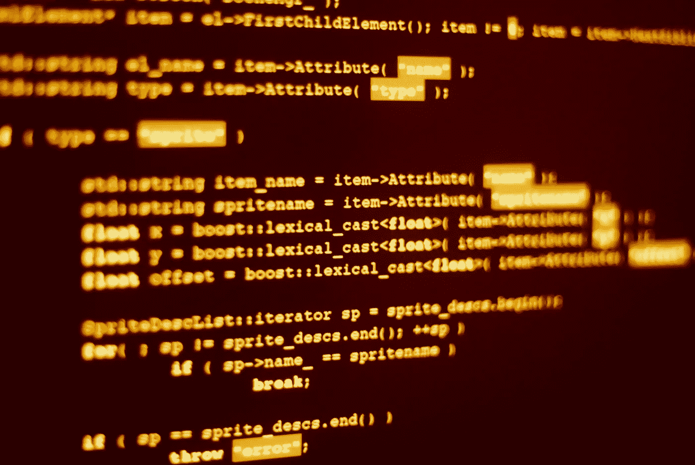

# 已知值的输入验证

> 原文：<https://blog.devgenius.io/input-validation-for-known-values-b060e779ee5b?source=collection_archive---------19----------------------->



[www.freepik.com nikitabuida 制作的 Html 代码照片](https://www.freepik.com/photos/html-code)

相当多的安全问题是由于输入验证缺失或有缺陷造成的。

完全避免所有类型注射的唯一方法是完全不使用用户输入。在大多数情况下，这是不可行的。

但是有一部分使用可以完全避免安全问题:任何时候从一组已知的值中选择输入，都可以使用白名单来防止不好的事情发生。

# 直接使用用户输入

幸运的是，在过去几年中，不经过任何验证和确认就直接使用参数的情况越来越少了。这主要归功于涵盖这些基础知识的良好框架。

像这个 PHP 片段这样的代码容易受到各种注入攻击。

```
include "locale_" + $_GET['lang'] + ".php";
```

为了你的灵魂，**永远不要**写任何接受任何类型输入并直接使用它的代码。(相信我，这会导致永恒的火焰和诅咒)

# 一些基本验证后的使用

## 用文字验证后使用

```
if (arg == "value1") {
  own_variable = arg;
  do_something(arg);
} else if (arg == "value2") {
  own_variable = arg;
  do_something_else(arg);
} else {
  own_variable = "default_value";
  do_some_default();
}do_something_further(own_variable);
```

用文字验证用户输入，并在认为安全的情况下使用它，乍一看似乎没问题。然而，这取决于所使用的语言。有些语言，例如 C 系列，这可能是天生不安全的。

例如，如果 arg 的值包含一个空字节(0x00 ),则后面的任何内容可能不会在条件中进行检查，但可能会在以后使用。这种情况是否会发生取决于很多因素，比如使用哪种语言，在哪个版本中使用。甚至还取决于事后用这些值实际调用了什么函数。例如，即使一种语言本身不容易受到这种攻击，但如果执行像文件系统操作这样的操作系统级调用，它也可能会继承这种攻击。

事实是，一个有经验的开发人员可能会说这是显而易见的，知道该做什么和不该做什么，并且第一次就做对了。对于没有经验的开发人员来说，情况可能会有所不同。我们必须永远不要忘记，即使是最有经验的开发人员也曾经是新手，犯过所有新手犯过的基本错误。

然而，即使对于这不是一个问题的语言，我也建议不要使用这种结构，原因很简单，而且完全不是技术性的:人脑是一个有趣的东西，它倾向于遵循过去行之有效的已知模式。

如果开发人员在安全的语言中使用这样的验证，这种情况往往会持续下去。即使在转换到其他语言后，情况可能并非如此。

## 逻辑验证

```
if (is_valid(arg)) {
  own_variable = arg;
} else {
  own_variable = “value_default”;
}do_something_further(own_variable);
```

这只是上述内容的一个变体，只是做有效性检查的逻辑更长，通常更复杂，因此包含更多出错的机会。

# 气隙使用

```
if (arg == “value1”) {
  own_variable = “value1”;
  do_something(“value1”);
} else if (arg == “value2”) {
  own_variable = “value2”;
  do_something_else(“value2”);
} else {
  own_variable = “default_value”;
  do_some_default();
}do_something_further(own_variable);
```

正如我在开始时所说的，完全避免任何类型的注入的唯一方法是不使用用户提供的输入。

这里，输入仅在条件中使用。任何疯狂，即使是一个天才的对手，也不会影响接下来的逻辑，因为它与论点毫无关系。

我听到有人说这是一种不好的风格，因为它复制了硬编码的值。所以请使用硬编码的常量，定义一次就可以在任何需要的地方使用它们。

重要的是将用户输入与逻辑中使用的值彻底分离。从根本上说，这是争论的空隙，也是唯一安全的方法。

从头回到 PHP 的例子。最简单的方法是增加几行代码，每当添加一种新语言时，都需要修改文件，但这很难被滥用:

```
if ($_GET['lang'] == "de") {
  include "locale_de.php";
}else if ($_GET['lang'] == "es") {
  include "locale_es.php";
}else{
  include "locale_en.php";
}
```

**警告**

必须确保 arg 的内容不能用于脱离代码结构本身。在编译语言中这不是问题，在解释语言中可能是。然而，大多数这样的语言还提供了对任何可能被用来脱离结构的内容进行转义的功能。