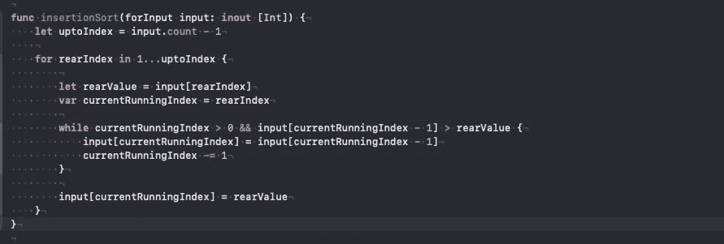

# 插入排序

> 原文：<https://blog.devgenius.io/insertion-sort-6be38a64411c?source=collection_archive---------2----------------------->

[**插入排序**是一种简单的排序算法，一次一个项目地构建最终排序的数组(或列表)。在大型列表上，它的效率比快速排序、堆排序或合并排序等更高级的算法低得多](https://en.wikipedia.org/wiki/Insertion_sort)

插入排序:

```
**var** unOrderArray = [1,5,3,9,7]
Suppose we have array of unordered numbers(In this case odd number, subset of natural numbers)
We have two option to sort this.
1\. Ascending order.
2\. Descending order.
```



插入排序(升序)

我们不需要任何检查来确定数组是否排序。此事正在`while`案中处理。

关于冒泡排序和选择排序，在插入排序中需要注意的一点是，插入排序维护两个子数组，其中左边的子数组有已排序的数字，右边的子数组没有排序。

支持代码:

感谢阅读。如果您有任何疑问或疑问，请告诉我。

roshankumar350@gmail.com
罗山·库马尔·萨。