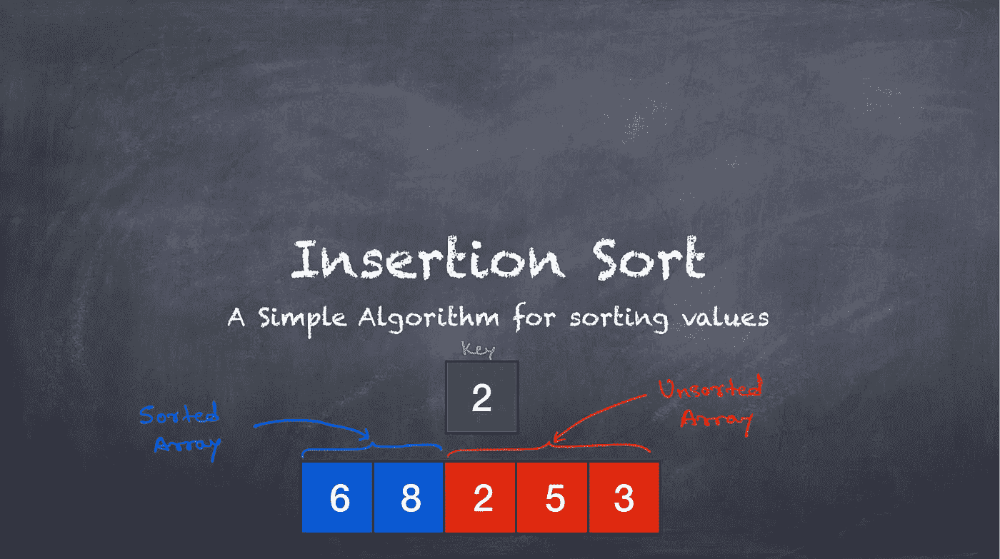
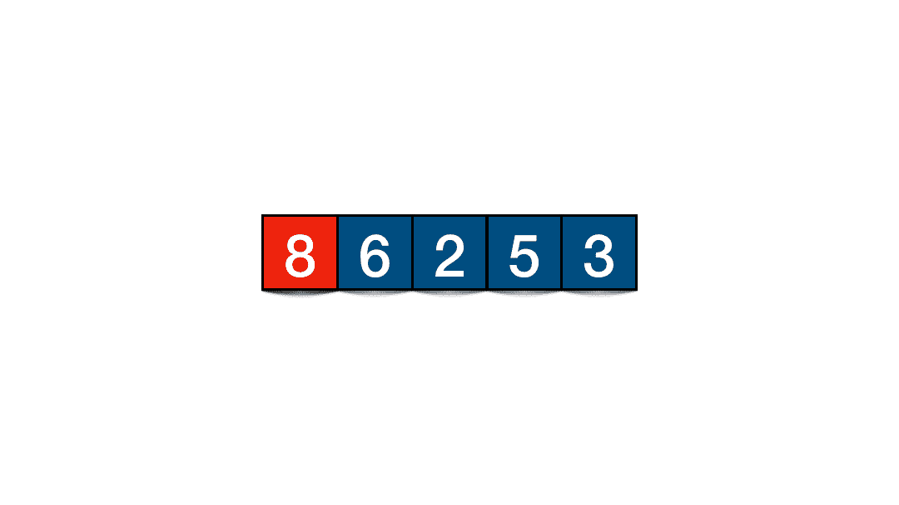
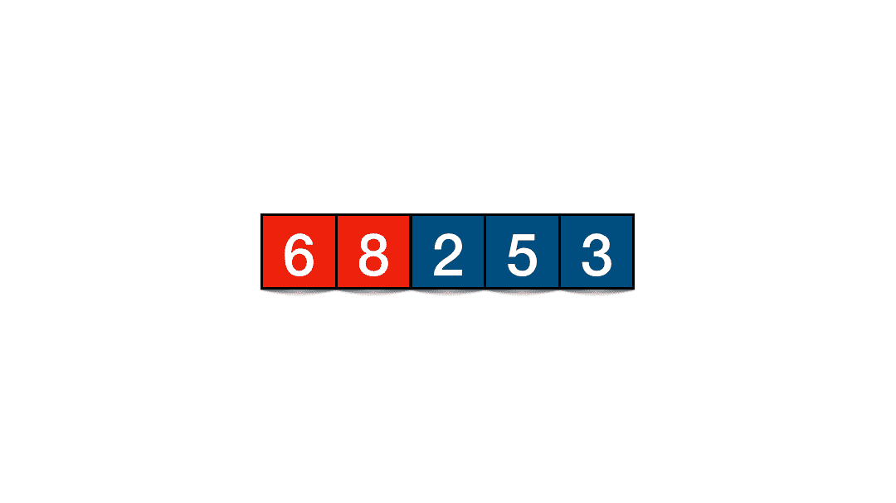
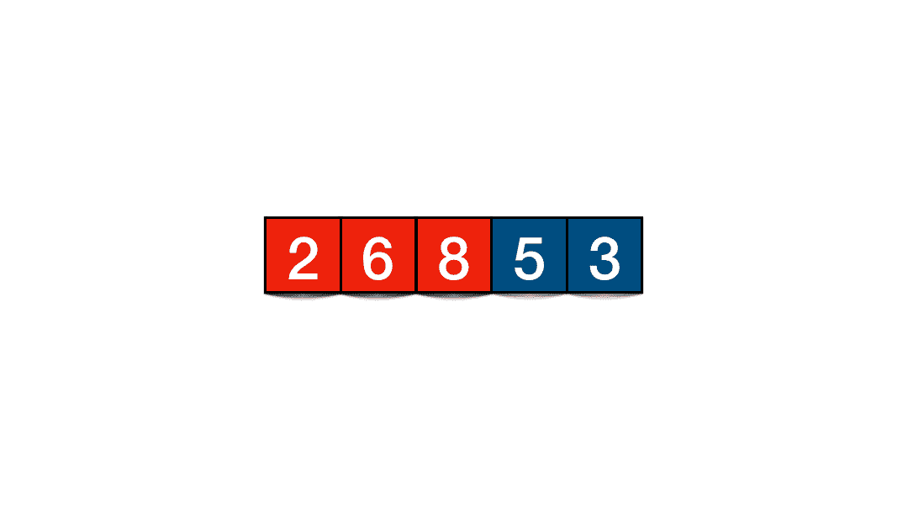
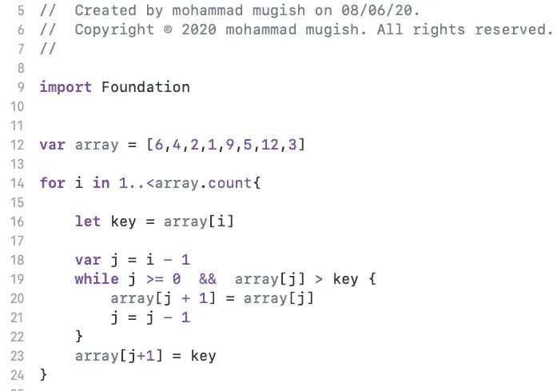

# 插入排序算法

> 原文：<https://blog.devgenius.io/insertion-sort-algorithm-c8c6aee65c8c?source=collection_archive---------11----------------------->

**Swift 中插入排序的逐步说明**

# **插入排序:**

> **插入排序是一种简单的排序算法，一次构建一个最终排序的数组。** *🤔🤔🤔*

# 让我们看看这个概念，然后我们将逐行理解🤏代码🤩

数组样本

**步骤 1 :** 将该数组分成两部分:-排序数组和未排序数组👍(GIF -1)

注意:数组的第一个元素总是排序的🤪

GIF-1

**步骤 2 :** 将未排序数组的第一个元素存储在一个常量中(常量名:key)

在本例(GIF-2)中，值 6 存储在常量名称键中。

**步骤 3 :** 将关键字与排序后的数组进行比较，如果关键字小于值，则将值从左向右移动，如果排序后的数组中没有更多可比较的元素，则插入关键字。

在这个例子(GIF-2)中，我比较了 6 和 8，6 小于 8，所以我们将 8 向右移动，之后没有元素可用，所以我们不能再比较 key。

## 所以最后两个元素在这个数组中排序，三个元素未排序。现在我们必须重复同样的步骤👏👏👏

GIF-2

**步骤 5 :** 将未排序数组的第一个元素存储在 key 中，并将 key 与排序后的数组进行比较。如果键小于值，则将值从左向右移动

**步骤 6 (A):** 将关键字与排序数组的剩余元素进行比较。如果键小于值，将值从左向右移动，如果没有更多的元素要比较，则插入键。

**步骤 6 (B) :** 如果 key 大于 value，则在 value 之前插入 key。

你可以很容易地注意到，我们在排序后的数组中从后向前移动，找到插入键的正确位置(键只是未排序数组的第一个元素)

GIF-3

如您所见(GIF-4 ),该数组的三个元素是排序的，两个元素是未排序的。我们将继续同样的过程，所有的元素将被排序🤝

GIF-4

# 🤓现在让我们为这个算法编码🤓

图 10

**第 12 行:**宣告本阵。

**第 14 行:**从未排序数组的第一个元素开始循环。

**第 16 行:**将未排序数组的第一个元素存储在 constant-key 中。

**第 18 行:**存储排序数组的最后一个索引。

图 10

**第 19 行:**通过将未排序数组的第一个元素与已存储数组的所有元素进行比较，在已排序数组中查找合适的插入位置。

**第 20 行:**如果键小于值，则从左向右移动值。

**第 21 行:**减小‘j’的值，这样我们可以在排序后的数组中从最后一个到第一个反向移动。

**第 23 行:**在右边位置插入键(未排序数组的第一个元素)。