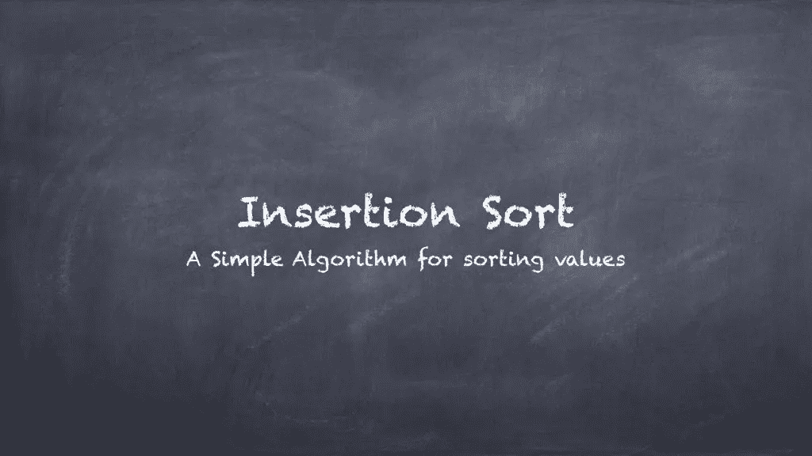
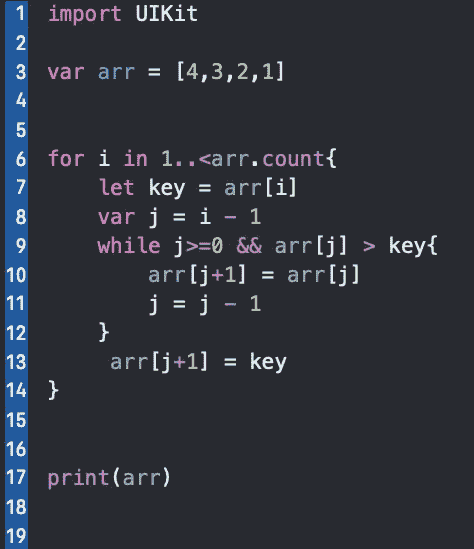

# Swift 中的插入排序程序

> 原文：<https://blog.devgenius.io/insertion-sort-program-in-swift-31740a454573?source=collection_archive---------17----------------------->

作者将用 Swift 编程语言向你逐行解释插入程序。

> E **每次重复插入排序都会从输入数据中删除一个元素，并将其插入到已经排序的列表中的正确位置，直到没有输入元素存在。**

**第 3 行:-** 这里我们声明一个数组为 *arr* ，里面有一些元素。

**第 6 行:-** 现在我们从第二个索引开始遍历数组，因为在插入算法中我们认为数组的第一个元素是有序的。我们使用范围方法，从第二个索引开始，即从 1 到最后一个，使用数组方法计数。

**第 7 行:-** 这里我们创建一个常量键*存储数组的第二个元素。将*键*视为临时常量。*

**第 8 行:-** 现在创建一个变量作为 *j* 并给出一个比第 I 个元素小的值。这样做的原因是在数组中向后移动，并使用 while 循环比较 ith 元素和。

**第 9 行:-** 这里给出了 while 循环的两个条件，首先是检查 *j* 的值是否小于零，原因就像，它们应该是一个极限，这样 while 循环就会停止，因为数组的最小值可能是 0。第二件事是比较元素。

**第 10 行:-** 在检查了 while 循环中给出的条件后，如果这些条件为真，那么我们将在这一行进行移位。

**第 11 行:-** 这里我们减少了 j 的值，这样我们可以在数组中向后移动。

第 13 行:- 在这里，我们终于将元素定位到了正确的位置。

**第 17 行:-** 打印数组的最后一个排序元素。

这就是代码的全部解释，你如何在 swift 中为插入算法编码。值得注意的重要一点是，我们总是比较和转移，而不是交换。我们只是在正确的位置插入元素。