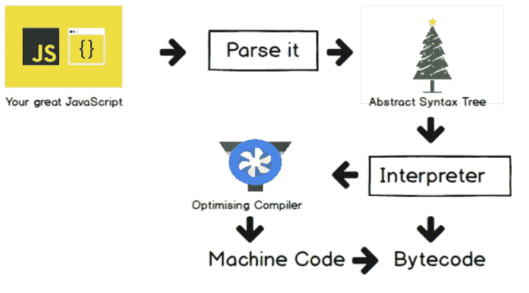

# 在 JavaScript 引擎内部

> 原文：<https://blog.devgenius.io/inside-the-javascript-engine-bb7b9f26e84b?source=collection_archive---------0----------------------->

## JavaScript 引擎的简要说明

几天前，我们开始了一个系列，旨在更深入地挖掘 JavaScript 及其实际工作方式:我们认为，通过了解 JavaScript 的构建块以及它们如何协同工作，您将能够编写更好的代码和应用程序。

[本系列的第一篇文章](/how-javascript-works-behind-the-scenes-88c546173f32)重点介绍了引擎、运行时和调用栈。第二篇文章将深入 JavaScript 引擎的内部。在本文中，我们还将了解为什么 JavaScript 不再是一种解释型语言。

# 什么是 JavaScript 引擎？

所以 JavaScript 引擎只是一个执行 JavaScript 代码的计算机程序。这样做需要很多步骤，但本质上执行 JavaScript 代码是引擎的工作。现在每个浏览器都有自己的 JavaScript 引擎，但最著名的引擎是谷歌的 V8。V8 引擎支持 Google Chrome，也支持 Node.js，node . js 是我们在[上一篇文章](/how-javascript-works-behind-the-scenes-88c546173f32)中谈到的 JavaScript 运行时，我们可以用它在任何浏览器之外用 JavaScript 构建服务器端应用程序。无论如何，理解什么是发动机是很容易的，但最重要的是真正理解它的组成和工作原理。

该引擎由两个主要组件组成:
*内存堆——这是内存分配发生的地方
*调用堆栈——这是代码执行时堆栈帧所在的地方

# 内存堆和调用堆栈

所以任何 JavaScript 引擎总是包含一个调用栈和一个堆。调用堆栈是使用所谓的执行上下文来实际执行代码的地方。那么堆就是一个非结构化的内存池，存储我们的应用程序需要的所有对象。好了，看看这个引擎，我们已经回答了我们的代码在哪里执行。但是现在的问题是如何将代码编译成机器码，以便以后可以执行。所以让我们来看看。

# 编译和解释

首先，我们需要一个快速的计算机边注，并谈论编译和解释之间的区别。我们知道，计算机的处理器只能理解 0 和 1。因此，每一个计算机程序最终都需要转换成机器代码，这可以通过编译或解释来实现。

## 汇编

所以在**编译**中，整个源代码一次转换成机器码。然后这个机器码被写入一个可移植的文件，可以在任何计算机上执行。所以我们有两个步骤。首先，构建机器代码，然后在 CPU 中执行，也就是在处理器中执行。并且执行可以在编译之后进行。例如，你现在在电脑上使用的任何应用程序之前都已经编译过，而你现在正在编译后执行它。

汇编

## **解读**

另一方面，在**解释**中，有一个解释器贯穿源代码并逐行执行。所以我们没有和以前一样的两个步骤。相反，代码是同时被读取和执行的。当然，源代码仍然需要转换成机器码，但这只是在执行之前发生，而不是提前。

解释

## 即时编译

JavaScript 曾经是一种纯解释语言，但是解释语言的问题是它们比编译语言慢得多。这在过去对于 JavaScript 来说是可以的，但是现在随着现代 JavaScript 和我们今天构建和使用的成熟的 web 应用程序的出现，低性能不再是可接受的了。想象一下，你正在浏览器中使用谷歌地图，你正在拖动地图，每次拖动都需要一秒钟的时间。那是不可接受的，对吗？

现在许多人仍然认为 JavaScript 是解释型语言，但这不再是真的了。因此，现代 JavaScript 引擎现在使用的不是简单的解释，而是编译和解释的混合，这被称为实时(JIT)编译。

即时编译

这种方法基本上是一次性将整个代码编译成机器码，然后立即执行。所以我们将有两个常规的提前编译步骤，但是没有可移植的文件来执行。并且在编译之后立即执行。这对于 JavaScript 来说是完美的，因为它比一行一行地执行代码要快得多。现在我们知道 **JavaScript 不再解释语言**。

# JAVASCRIPT 的现代实时编译

当一段 JavaScript 代码进入引擎时。第一步是解析代码，这实质上意味着读取代码。在解析过程中，代码被解析成一种叫做 [**抽象语法树(AST)的数据结构。**](https://www.geeksforgeeks.org/abstract-syntax-tree-ast-in-java/) 这种方法首先将每行代码分割成对语言有意义的片段，如常量或函数关键字，然后将所有这些片段以结构化的方式保存到树中。该步骤还检查是否有任何语法错误，并且生成的树稍后将用于生成机器代码。

现在假设我们有一个非常简单的程序。它所做的只是在所示的例子中声明一个变量，在右边，它只是一行代码的 AST。所以我们有一个变量声明，它应该是常量，名称为“a”，值为“23”。除此之外，你可以看到这里有很多东西。所以想象一下，对于一个大型的实际应用程序，它会是什么样子。

下一步是编译，将生成的 AST 编译成机器码，正如我们在本文前面所学的。这段机器码会立即执行，因为现代 JavaScript 使用即时编译。记住，执行发生在 JavaScript 引擎的调用栈中。我们将在下一篇文章中对此进行更深入的探讨。

JavaScript 的实时编译

好吧，到目前为止还不错。我们已经运行了代码，所以我们可以在这里结束，对吗？嗯，没那么快，因为现代 JavaScript 引擎实际上有一些非常聪明的优化策略。他们所做的是在开始时创建一个非常未优化的机器码版本，以便它可以尽可能快地开始执行。然后在后台，这段代码在已经运行的程序执行过程中被优化和重新编译。这可以在大多数时候和每次优化后完成。在不停止执行的情况下，简单地扫描未优化的代码以寻找新的更优化的代码。这一过程使得 V8 等现代发动机如此之快。

所有这些解析、编译和优化都发生在引擎内部的一些特殊线程中，我们无法从代码中访问这些线程。因此，从主线程中分离出来，主线程基本上运行到执行代码的调用堆栈中。现在，不同的引擎以稍微不同的方式实现，但是简单地说，这就是 JavaScript 的现代实时编译的样子。下次有人告诉你 JavaScript 是一种解释型语言时，你只需向他们展示这篇文章，让他们了解它的实际工作原理。

好了，我们看了 JavaScript 引擎，以及它是如何在幕后相当详细地工作的。我希望上面的文章能帮助你理解 JavaScript 引擎。现在，让我们在这里结束它。下一篇文章将讨论 JavaScript 运行时和其他非常重要的组件。所以要继续关注这个系列，就在 [**Twitter**](https://twitter.com/fixslyr) 或者 [**Medium**](https://adityayaduvanshi.medium.com/) 上关注我吧。

我建议你去上乔纳斯·施梅德曼的 JavaScript 课程。是我下面链接的最好的 JavaScript 课程。

[https://www . udemy . com/share/101 wey 3 @ 3 pmwhqsgn 9d 9 VC 3 do Q1 MFS 9 rndnm-qivj 0 YC _ hpaicxhmxjcvwnk 7 eny _ hneir 2/](https://www.udemy.com/share/101WeY3@3pMWHQSgN9D9VC3dOQ1MFS9rnDNm-QIvj0yc_HPaIcxhsmXJcvwnk7eNy_HNeIr2/)

别忘了看这个系列的第一个帖子，我已经在下面链接了。

 [## JavaScript 如何在幕后工作？

### JavaScript 代码执行中涉及的所有核心组件的概述。

blog.devgenius.io](/how-javascript-works-behind-the-scenes-88c546173f32) 

如果你喜欢这篇文章，请广而告之。要获得我的新故事的更新，请在 M[**edium**](https://adityayaduvanshi.medium.com/)**和**[**Twitter**](https://twitter.com/fixslyr)**上关注我。**