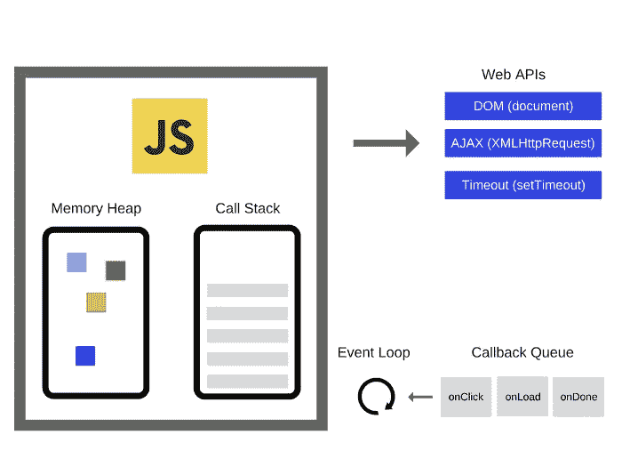
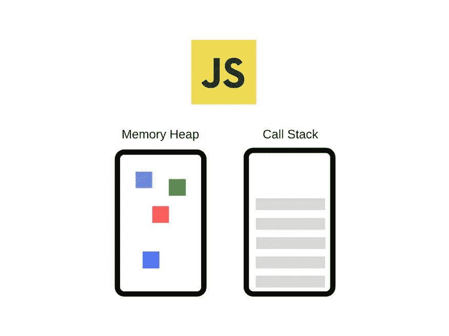

# 在 JavaScript 运行时环境中

> 原文：<https://blog.devgenius.io/inside-the-javascript-runtime-environment-457c02100827?source=collection_archive---------1----------------------->

## JavaScript 运行时环境的简要说明

几天前，我们开始了一个系列，旨在更深入地挖掘 JavaScript 及其实际工作方式:我们认为，通过了解 JavaScript 的构建块以及它们如何协同工作，您将能够编写更好的代码和应用程序。

[本系列的第一篇文章](/how-javascript-works-behind-the-scenes-88c546173f32)重点介绍了引擎、运行时和调用栈。本系列的第二篇文章关注 JavaScript 引擎内部的简要解释。

在本文中，我们将讨论 JavaScript 运行时环境是如何工作的。

# JavaScript 运行时

JavaScript 运行时就像一个盒子或容器，包含了我们使用 JavaScript 需要的所有东西。任何 JavaScript 运行时的核心都是 JavaScript 引擎。这正是我们在上一篇文章中谈到的。没有引擎就没有运行时，也就没有 JavaScript。

在浏览器环境中，这由以下元素组成:

1.  JavaScript 引擎
2.  Web APIs
3.  回调队列
4.  事件循环

# JavaScript 引擎

在上一篇文章[**JavaScript 引擎**](/inside-the-javascript-engine-bb7b9f26e84b) 里面我们已经深入的谈过 JavaScript 引擎了。但是总的来说，JavaScript 引擎只是一个执行 JavaScript 代码的计算机程序。今天，JavaScript 引擎内置在所有现代浏览器中。当 JavaScript 文件加载到浏览器中时，JavaScript 引擎将从上到下执行文件的每一行(为了简化解释我们在 JS 中避免提升)。JavaScript 引擎会逐行解析代码，转换成机器码然后执行。

每个浏览器都有自己的 JavaScript 引擎，但最著名的引擎是谷歌的 V8。V8 引擎支持 Google Chrome，也支持 Node.js，后者是 JavaScript 运行时。

引擎由两个主要组件组成:
**内存堆—这是内存分配发生的地方
*调用堆栈—这是代码执行时堆栈帧所在的地方*

## 垃圾堆

环境中的第一个容器，也是 V8 JS 引擎的一部分，被称为“内存堆”当 V8 JS 引擎在代码中遇到变量和函数声明时，它将它们存储在**堆**中。

## 堆栈

环境中的第二个容器称为“调用堆栈”它也是 V8 JS 引擎的一部分。当 JS 引擎遇到一个可操作的项目时，比如一个函数调用，它会将它添加到**堆栈**中。

一旦一个函数被添加到堆栈中，JS 引擎就立即开始解析它的代码，向堆中添加变量，向堆栈顶部添加新的函数调用，或者将自己发送到 Web API 调用所在的第三个容器。

当一个函数返回值，或者被发送到 **Web API 容器**时，它被弹出堆栈，并移动到堆栈中的下一个函数。如果 JS 引擎到达函数的末尾，并且没有显式写入返回值，JS 引擎将返回 undefined，并从堆栈中弹出函数。当他们说 JavaScript 同步运行**时，这个解析函数并将其弹出堆栈的过程就是他们的意思。它在单线程上一次只做一件事。**

**注意—堆栈是一种运行后进先出的数据结构。除了栈顶的那个函数，其他函数都不会被聚焦，引擎也不会移动到下一个函数，除非它上面的那个函数被弹出。**

# **Web API 容器**

**Web APIs 不是 JavaScript 引擎的一部分，但它们是浏览器提供的运行时环境的一部分。现代浏览器中有大量可用的 API，允许我们做各种各样的事情。一些最常见的浏览器 API 类别让我们:**

*   ****操作文档**:最常用的 Web APIs 之一是[DOM API](https://developer.mozilla.org/en-US/docs/Web/API/Document_Object_Model)，它允许开发人员操作 HTML 和 CSS，让我们创建、更改甚至删除 HTML，并动态地将样式应用到我们的 Web 页面。**
*   ****绘制和操作图形:**在浏览器中得到广泛支持，[Canvas API](https://developer.mozilla.org/en-US/docs/Web/API/Canvas_API)和[Web 图形库 API](https://developer.mozilla.org/en-US/docs/Web/API/WebGL_API) 让我们以编程方式更新包含在`<canvas>`元素中的像素数据。**
*   ****从服务器获取数据:** [获取 API](https://developer.mozilla.org/en-US/docs/Web/API/Fetch_API) 通过使用`Request`和`Response`对象的通用定义，提供了通过网络获取资源的接口。**

**事件侦听器、计时函数和 AJAX 请求等特性都位于 Web APIs 容器中，直到某个动作被触发。一个请求完成接收它的数据，一个定时器到达它的设定时间或者一个点击发生，这触发一个回调函数被发送到回调队列。**

# **回调队列**

**回调队列按照添加顺序存储从 Web APIs 发送的回调函数。这个队列是一个运行[先进先出](https://en.wikipedia.org/wiki/FIFO_(computing_and_electronics))的数据结构。队列使用[数组推送方法](https://developer.mozilla.org/en-US/docs/Web/JavaScript/Reference/Global_Objects/Array/push)向队列末尾添加一个新的回调函数，使用[数组移位方法](https://developer.mozilla.org/en-US/docs/Web/JavaScript/Reference/Global_Objects/Array/shift)移除队列中的第一项。**

**回调函数将在队列中等待，直到调用堆栈为空，然后由事件循环将它们移入堆栈。然后，当堆栈为空时，回调函数被传递到堆栈，以便可以执行。这是通过一个叫做**事件循环**的东西来实现的(我们将在另一篇文章中讨论*)。***

# **事件循环**

**所以基本上，事件循环从回调队列中获取回调函数，并将它们放入调用堆栈中。这样它们就可以被执行。此外，事件循环对于非阻塞并发模型也是必不可少的。现在我们将在另一篇关于事件循环的文章中讨论为什么这会使 JavaScript 成为非阻塞的。因为这确实是 JavaScript 开发的一个基本部分，每个开发人员都需要深入理解。**

**好了，我们看了 JavaScript 运行时，以及它是如何在幕后相当详细地工作的。我希望上面的文章能帮助你理解 JavaScript 运行时环境。现在，让我们在这里结束它。会有一篇关于事件循环的新文章。要获得我的新故事的更新，请关注我的**M**[**edium**](https://adityayaduvanshi.medium.com/)和**T**[**witter**](https://twitter.com/fixslyr)**。****

**如有疑问，可直接联系我[**Linkedin**](https://www.linkedin.com/in/theaditya-yaduvanshi-/)**。****

**还有，你可以看看这些文章，让你的 JavaScript 更强大。**

** [## JavaScript 如何在幕后工作？

### JavaScript 代码执行中涉及的所有核心组件的概述。

blog.devgenius.io](/how-javascript-works-behind-the-scenes-88c546173f32)  [## 在 JavaScript 引擎内部

### JavaScript 引擎的简要说明

blog.devgenius.io](/inside-the-javascript-engine-bb7b9f26e84b) 

如果你喜欢这篇文章，请广而告之。要获得我的新故事的更新，请在 M [**edium**](https://adityayaduvanshi.medium.com/) **和**[**Twitter**](https://twitter.com/fixslyr)**上关注我。****