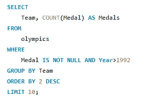
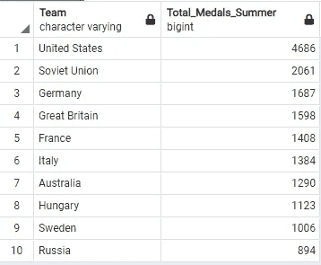
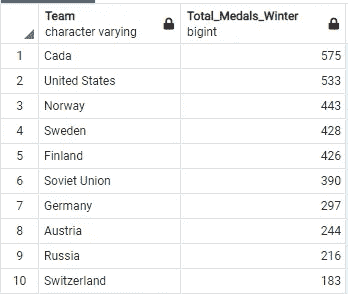
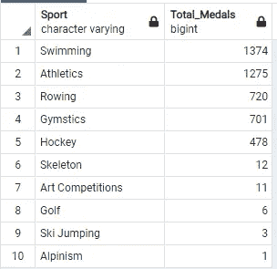
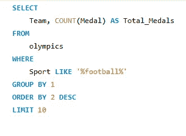

# 来自奥运会的启示

> 原文：<https://blog.devgenius.io/insights-from-the-olympics-1994b551919f?source=collection_archive---------11----------------------->

## 通过做#1 来学习

当你试图在现实生活的数据集中实现 SQL 查询并试图回答你脑海中突然出现的问题时，学习 SQL 查询将会有趣得多，所以这就是我所做的，我下载了一个包含 1896 年至 2016 年奥运会细节的数据集。

## 数据集:

该数据集总共包含 15 列，它们是

> 身份证，姓名，性别，年龄，身高，体重，团队，NOC(国家奥委会)，游戏(例如:1992 年夏季)，年份，季节(夏季或冬季)，城市，运动，事件，奖牌。

链接到数据集- [奥运数据集](https://www.kaggle.com/heesoo37/120-years-of-olympic-history-athletes-and-results)

> **获得一个国家每届奥运会获得的奖牌总数(至少 1 枚)。**

按奖牌总数降序排列查询。

结果片段

奖牌总数几乎是原始计数的两倍，这是因为该查询计算每一枚奖牌，而不考虑团队运动或个人运动(因此，如果美国赢得了 4*100 接力赛，而不是 1 枚奖牌，则它将每个运动员的 4 枚奖牌计为 1 枚)。

> **奥运会历史上获得奖牌数最多的前 10 个国家。**

通过限制子句选择前 10 个

结果片段

因为苏联只在 1992 年后解体，它在这个列表中占主导地位，让我们看看如果我们只在 1992 年后得出同样的结果会发生什么。

在 where 子句中添加额外的条件

> **选出在夏季奥运会上赢得奖牌最多的前 10 支队伍**

让我们看看夏季奥运会和冬季奥运会在统治力上是否有什么不同。

用于检查夏季关键字的 like 子句

> **评选冬奥会奖牌数最多的前 10 支队伍**

用于检查 winter 关键字的 like 子句

> **评选获得奥运会奖牌数最多的前 10 名男运动员。**

> **评选奥运会奖牌数最多的前 10 名女运动员**

> **评选奥运历史上获得金牌数最多的前 10 名运动员**

所以迈克尔·菲尔普斯获得的 28 枚奖牌中，有 23 枚是金牌

> **找出获得奥运会奖牌的男女运动员的平均年龄**

获得奖牌的女运动员的平均年龄比获得奖牌的男运动员的平均年龄小两岁。

> **找出男性运动员赢得奖牌的前 5 名和后 5 名项目**

联合包含前 5 名和后 5 名的两个表，并按降序对它们进行排序

> **找出女性参与者赢得奖牌的前 5 名和后 5 名项目**

在上述两个结果中，最后的 3，4 个事件是过时的事件，它们或者被丢弃或者被取消。

**分析国家在两项最大运动(足球、篮球)中的表现:**

> 评选足球运动表现最佳的 10 个国家

> 选出篮球运动表现最佳的 10 个国家

## 分析印度独立后(1947 年)在奥运会上的表现；

> 挑选独立后在奥运会上获得奖牌的印度男性

结果片段

> 选拔独立后在奥运会上获得奖牌的印度女性

通过这篇文章，我希望我可以给读者灌输一些开始项目的动机，并可能使用相同的代码来改进他们的个人项目，如果您对我使用的查询有任何疑问或建议，请对文章进行评论或给我发一个说明，这将是非常棒的。
谢谢你