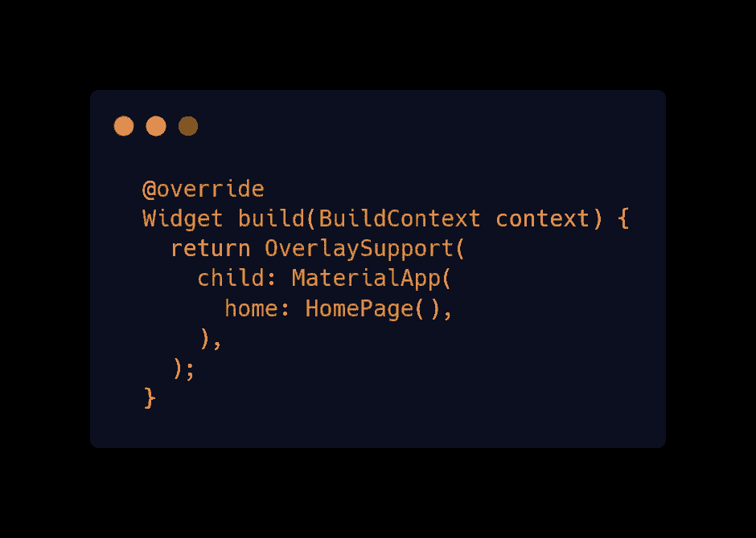
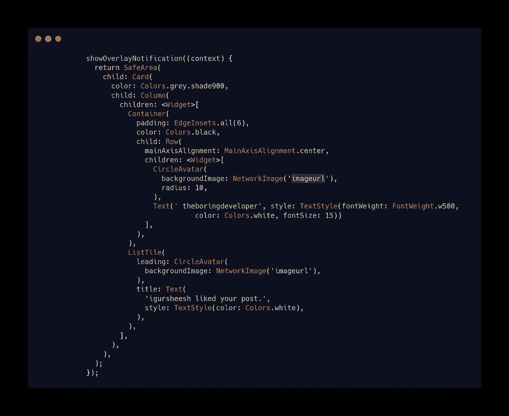
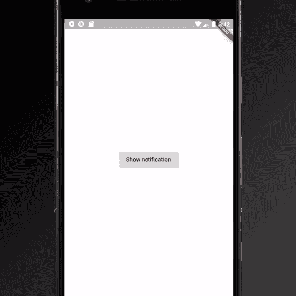

# 类似 Instagram 的应用内通知——Flutter

> 原文：<https://blog.devgenius.io/instagram-like-in-app-notification-flutter-eb2ce6a10d88?source=collection_archive---------8----------------------->

欢迎光临！今天我们将学习:如何添加像应用内通知一样的 Instagram。

最近我在 Instagram 上写博客，你可以看看这里-

 [## boring 开发者

### 欢迎回到 Instagram。登录查看您的朋友、家人和兴趣爱好捕捉和分享了什么…

www.instagram.com](https://www.instagram.com/theboringdeveloper/) 

# 我们先来看看它在 Instagram 上的样子

# 让我们现在开始吧

1.  将 ***叠加 _ 支持*** 添加到 pubspec.yaml

 [## 覆盖 _ 支持|颤振包

### 提供商支持覆盖，易于构建 toast 和内部通知。

公共开发](https://pub.dev/packages/overlay_support#-readme-tab-) 

2.用 ***重叠支撑*** 包裹 **MaterialApp**

3.使用***showOverlayNotification***显示应用内通知

**让我们检查输出-**

***超级容易对吧？***

*在下面评论并分享你如何使用它们的想法*

> 谢谢你坚持到最后

# 更多激动人心的博客-

 [## 实时模板— Flutter

### 欢迎光临！今天我们将学习 flutter 的实时模板。

medium.com](https://medium.com/@theboringdeveloper/live-templates-flutter-6e48683e14e0)  [## Instagram stories swiper — Flutter

### 欢迎使用本教程创建像 swiper 一样的 Instagram 故事！

levelup.gitconnected.com](https://levelup.gitconnected.com/instagram-stories-swiper-flutter-bb53f9377431)  [## 更新应用程序— Flutter

### 欢迎来到本教程，为你的 flutter 应用程序添加更新应用程序

medium.com](https://medium.com/swlh/update-app-flutter-402c528235e4)  [## 信用卡滑块—颤动

### 欢迎来到本教程，创建一个可怕的信用卡滑块。

levelup.gitconnected.com](https://levelup.gitconnected.com/credit-card-slider-flutter-1edec451103a)  [## 简单易用的通用底部导航栏——Flutter

### 欢迎来到本教程，在 Flutter 中创建一个普通的底部导航栏。

medium.com](https://medium.com/swlh/common-bottom-navigation-bar-made-easy-flutter-199c9f683b29) 

> 我将会发布更多关于 flutter 的消息，敬请关注:)