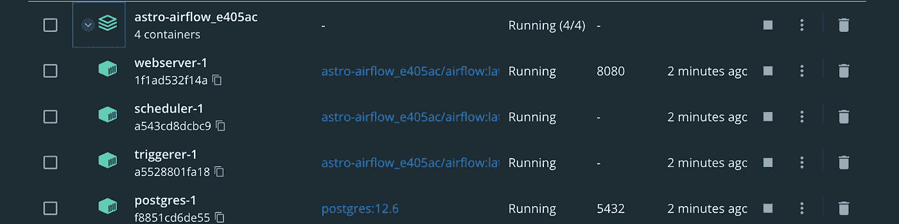
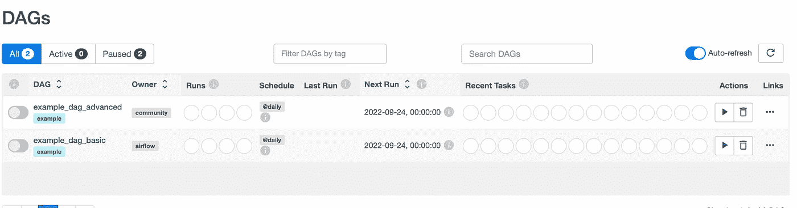
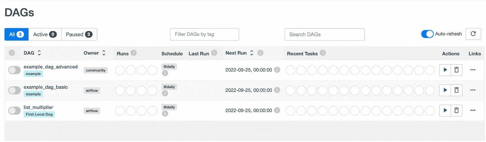

# 在 5 分钟内局部安装气流

> 原文：<https://blog.devgenius.io/install-airflow-locally-in-5-min-a03b09b98eeb?source=collection_archive---------7----------------------->


在本文中，您将看到如何在本地机器上快速安装 airflow 并运行您的第一个 DAG。在进入这个话题之前，让我简单解释一下什么是气流。

Apache airflow 是 Airbnb 在 2014 年开发的基于 python 的开源编排工具。它用于调度和监控工作流，最近几年在开发数据管道的数据工程师中流行起来。

***1:安装 Astro CLI。*** Astro CLI 是构建在 Apache Airflow 之上的命令行界面和开源工具。在本地运行 Apache airflow 是最简单的方法。
先决条件
1。对于 Mac - >自制:[https://brew.sh/](https://brew.sh/)2。对于 Mac/ Linus - > Docker 桌面:[https://docs.docker.com/get-docker/](https://docs.docker.com/get-docker/)

在 Mac Os 上安装 Astro CLI，打开您的终端并运行以下命令。

```
brew install astro
```

在 Linux 上安装 Astro CLI。

```
curl -sSL install.astronomer.io | sudo bash -s
```

检查 Astro CLI 是否安装正确。

```
astro version
------------Output------------Astro CLI Version: 1.5.1
```

现在是时候创建一个文件夹了，您可以在其中找到有关创建项目并在本地气流环境中运行它的信息。我在 Documents 目录下创建了一个名为 Astro-Airflow 的文件夹(你可以用任何名字创建这个文件夹)。

```
mkdir Astro-Airflow && cd Astro-Airflow
```

现在检查您当前的目录。应该是“太空气流”

```
pwd
----output------/Users/khushboo.purohit/Documents/Astro-Airflow
```

到目前为止一切顺利，现在从最近创建的文件夹中调用 init 方法。

```
astro dev init
-----output-----------------------Initializing Astro projectPulling Airflow development files from Astro Runtime 6.0.0Initialized empty Astro project in /Users/ayush.pareek/Documents/Astro-Airflow
```

您将看到在该目录中创建了以下文件。

```
--Dockerfile  
--README.md 
--airflow_settings.yaml 
--dags   
--include  
--packages.txt  
--plugins   
--requirements.txt 
--tests
```

现在启动 Docker-Desktop 并运行下面的命令在本地构建项目。

```
astro dev start
```

该命令构建您的项目，并在您的机器上旋转 4 个 Docker 容器，每个容器用于不同的气流组件:

*   Postgres: Airflow 的元数据数据库
*   Webserver:负责呈现气流 UI 的气流组件
*   调度器:负责监控和触发任务的气流组件
*   Triggers:气流组件负责运行触发器，并在条件满足时发出任务恢复的信号。触发器专门用于使用可推迟操作符运行的任务。



Docker 桌面仪表板

有时你可能会得到一个错误，如端口繁忙或使用，在这种情况下，你需要检查 docker-desktop 仪表板，如果已经有运行 Astro 集群，你需要删除它。

是时候在你的本地机器上打开气流 UI 了。转到 URL[http://localhost:8080](http://localhost:8080)并使用用户名和密码`admin`登录。



安装气流的第一瞥。

***2:创建第一个气流 DAG 并在本地运行。*** 这里我们将创建一个名为 list_multiplier 的简单 DAG，它将一个预定义的列表乘以 2，并每天打印出来。下面是相同的代码，并将其保存在前面步骤中创建的`Astro-Airflow`目录下的`dag`文件夹中。

```
from airflow.decorators import task
from airflow.operators.dummy import DummyOperator
from airflow import DAG
from datetime import datetimewith DAG(
    dag_id='list_multiplier',
    schedule_interval="@daily",
    start_date=datetime(2021, 1, 1),
    catchup=False,
    default_args={ "retries": 2, # If a task fails, it will retry 2 times. },
    tags=['First Local Dag']
    ) as dag: start = DummyOperator(task_id='start') end  = DummyOperator(task_id='end') @task
    def list_multiplier():
        lst=[1,2,3,4,5]
        print([i*2 for i in lst])
    list_multiplier_task=list_multiplier() start >> list_multiplier_task >> end
```

现在停止项目，并重新启动它与下面的命令，然后你将能够看到新创建的 DAG 在气流用户界面。

```
astro dev stop
astro dev start
```



第一个本地 dag 创建。

***总结:*** 在本文中，您已经了解了我们如何快速地在本地设置 Airflow，如何从您的本地机器部署和运行 Dag，
以及 Astro CLI 对于快速创建开发环境是多么有用。如果你认为这篇文章信息丰富，对你有所帮助，那么请鼓掌并关注我的媒体账户(
[datageeks.medium.com](https://datageeks.medium.com/))，如果你对这个话题有任何疑问，请随意在评论中写下。

通过注册成为会员([https://datageeks.medium.com/membership](https://datageeks.medium.com/membership))，你可以阅读每一个故事，并帮助媒体上的作者。