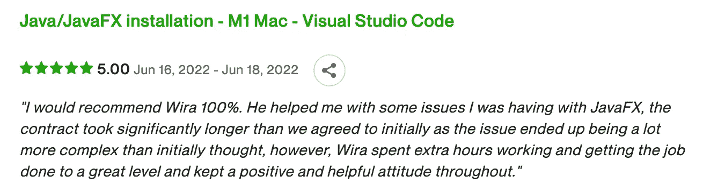

# 使用 Visual Studio 代码在 Macbook M1 专业版上安装并运行 JavaFX 项目

> 原文：<https://blog.devgenius.io/install-and-run-javafx-project-using-visual-studio-code-in-your-macbook-m1-pro-9525f012075e?source=collection_archive---------1----------------------->

漂亮的 2021 款 Macbook Pro。杰瑞米·贝赞格在 [Unsplash](https://unsplash.com?utm_source=medium&utm_medium=referral) 上的照片。

一个 pple 硅片就是一个畜生。它具有卓越的性能、出色的电池续航时间和最低的发热。但自 2020 年首次亮相以来，我们知道它仍处于走向成熟的过渡期。我们希望所有的厂商都能很快在他们的应用上加入对苹果硅片的支持。

使用 Visual Studio 代码在 Macbook M1 专业版上安装和运行 JavaFX 项目的视频指南

# 背后的故事

作为 Apple Silicon Macbook 用户和 Java 开发人员，我的眼睛被 [UpWork](https://www.upwork.com) 上的一则招聘信息吸引住了。这项工作是在 M1 Mac 上提供 JavaFX 安装的指导，并使用 Visual Studio 代码作为 ide。而且几乎没有涉及这个话题的文章。

客户对后续工作的审查

# 什么是 JavaFX

JavaFX 是一个软件平台，旨在创建和运行桌面、web 和移动应用程序。以下是它历史的一瞥:

*   2008 年—首次发布
*   2011 年——甲骨文开始开源这个项目，作为 OpenJDK 的一部分，名为 [OpenJFX](https://github.com/openjdk/jfx)
*   未来——将继续由胶子公司[支持](https://gluonhq.com/products/javafx/)

# 编译和运行 JavaFX 三种方法

1.  基本项目
2.  使用 Maven
3.  使用 Gradle

您也可以查看 [OpenJFX 网站](https://openjfx.io)以获取更多补充信息。

# 步骤 1 —安装 JDK

我更喜欢使用 brew 安装 Java 和其他依赖项，因为我希望安装维护简单。如果有一天我不再需要它，它很容易卸载，我认为没有垃圾文件了。

正在安装 OpenJDK

# 步骤 2 —设置 OpenJFX 库

基本项目需要 OpenJFX 库。据我所知，Maven 和 Gradle 使用他们的存储库解决了所有的依赖关系。

1.  从[https://gluonhq.com/products/javafx](https://gluonhq.com/products/javafx)下载库
2.  将其提取到`~/Development/sdk`

# 步骤 3 —安装 Maven 和 Gradle

正在安装 maven。

# 步骤 4 —安装 Gradle

安装梯度

# 步骤 5-设置环境变量

首先，通过执行这个命令获得`JAVA_HOME`的路径:`/usr/libexec/java_home`。其次，通过编辑`~/.zshrc`文件并添加下面的代码行来设置环境。第三，通过执行`printenv`命令确认变量。

# 步骤 6 —安装 Visual Studio 代码和扩展

1.  从 https://code.visualstudio.com/download[下载并安装 Apple Silicon Visual Studio 代码。](https://code.visualstudio.com/download)
2.  安装延伸件`Extension Pack for Java`。
3.  安装加长件`Gradle for Java`。

# 步骤 7 —克隆示例项目

从这个 GitHub 库克隆提供的示例:[https://github.com/openjfx/samples](https://github.com/openjfx/samples)

# 步骤 8 —编译并运行基本项目

根项目是`OPENJFX_SAMPLES\HelloFX\CLI\hellofx`。

编译并运行基本项目。

# 步骤 9 —编译并运行 Maven 项目

1.  根项目是`OPENJFX_SAMPLES\HelloFX\maven\hellofx`。
2.  用下面的设置修改 pom.xml 中的`properties`值。
3.  通过执行这个命令运行项目:`mvn clean javafx:run`。

pom.xml

# 步骤 10 —编译并运行 Gradle 项目

1.  根项目是`OPENJFX_SAMPLES\HelloFX\Gradle\hellofx`。
2.  当 Visual Studio 代码提示升级 Gradle 时，选择“是”。
3.  用以下设置修改`build.gradle`文件中的配置。
4.  通过执行以下命令升级梯度包装:`gradle wrapper — gradle-version 7.4.2 — distribution-type all`
5.  通过执行以下命令运行项目:`./gradlew run`。

build.gradle

# 关闭

在 Apple Silicon Macbook 中使用 Visual Studio 代码建立一个功能完整的 JavaFX 开发环境是一个长期的步骤。希望这篇文章对你有帮助。如果你需要我的专业支持，你可以在 UpWork 联系我，随时[联系我](https://www.upwork.com/freelancers/uniqcode87)。