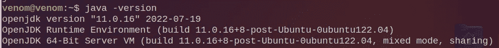
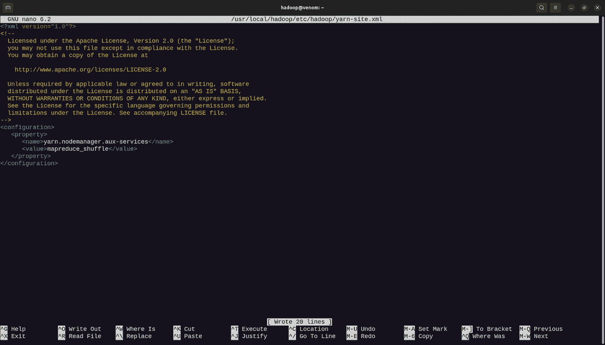

# 适用于 Ubuntu 的 Hadoop-3.3.1 安装指南

> 原文：<https://blog.devgenius.io/install-configure-and-setup-hadoop-in-ubuntu-a3cdd6305a0e?source=collection_archive---------0----------------------->

# 介绍

Apache Hadoop 软件库为跨计算机集群的海量数据的分布式处理提供了一个框架。从一台服务器到数千台设备，每台设备都提供本地计算和存储，它旨在纵向扩展。该库本身旨在识别和处理应用层的问题，而不是依赖硬件来提供高可用性。因此，高可用性服务是在一个计算机集群之上提供的，而每个计算机集群都容易出现故障。

更多详情请访问[https://hadoop.apache.org/](https://hadoop.apache.org/)

 [## Apache Hadoop

### 这是 Apache Hadoop 3.3 系列的一个版本。它包含少量安全和关键集成修复，因为…

hadoop.apache.org](https://hadoop.apache.org/) 

# 步骤 1 : Java 安装

**1.1 安装最新或所需版本的 java**

> sudo apt 安装默认值-jdk 默认值-jre -y

输出 1.1

**1.2 检查 java 版本**

> java 版本

产出 1.2

# 步骤 2:创建 Hadoop 用户(可选)

如果您想要独立管理 Hadoop 文件，请创建一个不同的用户(Hadoop 用户)。

**2.1 创建一个名为 *hadoop* 的新用户。**

> sudo adduser hadoop

产出 2.1

**2.2 让 hadoop 用户成为 sudo 组的成员。**

> sudo usermod -aG sudo hadoop

上述命令 usermod 中的-aG 参数代表 append(a)-Groups(G)。

产出 2.2

**2.3 现在改为 Hadoop 用户。**

> sudo su - hadoop

su 代表 switchuser。

产出 2.3.1

现在，您可以在操作系统中看到两个用户。

打开文件>其他位置>电脑>主页

产出 2.3.2

# 步骤 3:配置无密码 SSH

> **注意:**如果您完成了第 2 步，那么在切换到 hadoop 用户( *sudo su — hadoop* )后继续第 3 步。

**3.1 安装 OpenSSH 服务器和客户端**

> sudo 安装 openssh-server openssh-client -y

产出 3.1.1

产出 3.1.2

ssh-keygen 是一个用于生成新的 ssh 认证密钥对的工具。这种密钥对用于自动登录、启用单点登录和验证主机。

**3.2 生成公钥和私钥对。**

> ssh-keygen -t rsa

产出 3.2

SSH 协议使用公钥加密对主机和用户进行身份验证。keygen 程序用于生成认证密钥，即 SSH 密钥。

作为旧的. rhosts 认证的更安全的替代方案，SSH 引入了公钥认证。它通过消除将密码存储在文件中的需要，以及被入侵的服务器窃取用户密码的可能性，提高了安全性。

SSH 密钥和密码一样，都是认证凭证。因此，它们必须以类似于用户名和密码的方式进行管理。他们应该有一个适当的终止过程，以便在不再需要钥匙时将其移除。

欲了解更多信息，请访问[https://www.ssh.com/academy/ssh/keygen](https://www.ssh.com/academy/ssh/keygen)

 [## 什么是 ssh-keygen &如何使用它来生成新的 ssh 密钥？

### 这个页面是关于 ssh-keygen 的版本。请参见。如果您希望为生成密钥，请参见 Windows 上的 PuTTYgen 或…

www.ssh.com](https://www.ssh.com/academy/ssh/keygen) 

**3.3 将 *id_rsa.pub* 生成的公钥添加到*authorized _ keys***

> sudo 猫~/。ssh/id _ RSA . pub > > ~ ~/。ssh/授权密钥

产出 3.3

**3.4 更改 *authorized_keys* 的文件权限。**

> sudo chmod 640 ~/。ssh/授权密钥

产出 3.4

在上述命令*中，chmod* 站*改变模式。*如果您想了解更多关于 chmod 的信息，请访问[https://www . how togeek . com/437958/how-to-use-the-chmod-command-on-Linux/](https://www.howtogeek.com/437958/how-to-use-the-chmod-command-on-linux/)

 [## 如何在 Linux 上使用 chmod 命令

### 使用 Linux 的 chmod 命令控制谁可以访问文件、搜索目录和运行脚本。这个命令…

www.howtogeek.com](https://www.howtogeek.com/437958/how-to-use-the-chmod-command-on-linux/) 

**3.5 检查无密码 SSH 是否工作。**

> ssh 本地主机

产出 3.5

# 第四步:在 *hadoop 用户*中安装和配置 Apache Hadoop

> **注意:**检查你使用的是 hadoop 用户；如果没有，使用以下命令切换到 hadoop 用户。
> 
> sudo su - hadoop

**4.1 下载 hadoop 最新稳定版本**

> wget[https://downloads . Apache . org/Hadoop/common/Hadoop-3 . 3 . 1/Hadoop-3 . 3 . 1 . tar . gz](https://downloads.apache.org/hadoop/common/hadoop-3.3.1/hadoop-3.3.1.tar.gz)

产出 4.1

如果前面的命令失败并出现错误，请使用下面的命令。

> sudo apt-get 安装

wget 是一个免费的从网上自动下载文件的工具。它支持 HTTP、HTTPS 和 FTP 协议以及 HTTP 代理检索。

如果你想了解 wget 更多，请访问 https://www.computerhope.com/unix/wget.htm

 [## Linux wget 命令帮助和示例

### Linux wget 命令帮助和 wget 示例、语法、相关命令以及如何使用 wget 命令的信息…

www.computerhope.com](https://www.computerhope.com/unix/wget.htm) 

**4.2 提取下载的 tar 文件**

> 塔尔-xvzf hadoop-3.3.1.tar.gz

产出 4.2

“Tar”代表*磁带存档*。这是一种存档文件格式。

在类 Unix 操作系统上， **tar** 命令创建、维护、修改和提取以 **tar** 格式归档的文件。

如果你想了解更多关于 tar 的信息，请访问 https://www.computerhope.com/unix/utar.htm

 [## Linux tar 命令帮助和示例

### Linux tar 命令帮助、示例和附加信息。

www.computerhope.com](https://www.computerhope.com/unix/utar.htm) 

**4.3 创建 Hadoop 目录**

为了确保您的所有文件都组织在一个位置，请将提取的目录移动到/usr/local/

> sudo mv Hadoop-3 . 3 . 1/usr/local/Hadoop

要维护 hadoop 日志，请在 usr/local/hadoop 中创建一个名为 logs 的不同目录。

> sudo mkdir/usr/local/Hadoop/logs

最后，使用以下命令修改目录的所有权。

> sudo chown-R Hadoop:Hadoop/usr/local/Hadoop

我们正在更改目录的所有权，因为 root 用户所有权是默认的，每个命令都必须使用 sudo。因此，我们必须将所有权转移给 hadoop 用户。

**4.4 配置 Hadoop**

> 须藤纳米~/。bashrc

一旦执行上述命令，你可以在你的终端看到纳米编辑器，然后粘贴以下行

> 导出 HADOOP _ HOME =/usr/local/HADOOP
> 导出 HADOOP _ INSTALL = $ HADOOP _ HOME
> 导出 HADOOP _ MAPRED _ HOME = $ HADOOP _ HOME
> 导出 HADOOP _ COMMON _ HOME = $ HADOOP _ HOME
> 导出 HADOOP _ HDFS _ HOME = $ HADOOP _ HOME
> 导出 YARN_HOME=$HADOOP_HOME
> 导出 HADOOP _ COMMON _ LIB _ NATIVE _ DIR = $ HADOOP

产出 4.4

复制上面的行后，按 CTRL + S 保存，按 CTRL + X 退出 nano 编辑器。

关闭 nano 编辑器后，使用以下命令激活环境变量。

> 来源~/。bashrc

# **第五步:配置 Java 环境变量**

Hadoop 能够执行其基本功能要归功于大量的组件。您必须在配置文件中为***hadoop-env . sh***定义 Java 环境变量，以便配置这些组件，包括 YARN、HDFS、MapReduce 和 Hadoop 相关的项目设置。

**5.1 借助以下命令找到 Java 路径并打开 JDK 目录**

> 哪个 javac
> 
> readlink -f /usr/bin/javac

产出 5.1

**5.2 编辑 Hadoop-env.sh 文件**

该文件包含 Hadoop 的环境变量设置。您可以使用这些来修改 Hadoop 守护进程的行为，比如日志文件存储在哪里、使用的最大堆量等等。该文件中唯一应该更改的变量是 JAVA HOME，它指定了 Hadoop 使用的 Java 1.5.x 安装的路径。

首先在您喜欢的文本编辑器中打开 hadoop-env.sh 文件。在这种情况下，我将使用纳米。

> sudo nano $ HADOOP _ HOME/etc/HADOOP/HADOOP-env . sh

产出 5.2.1

现在将接下来的几行添加到文件的末尾。

> export JAVA _ HOME =/usr/lib/JVM/JAVA-11-open JDK-amd64
> export HADOOP _ class path+= " $ HADOOP _ HOME/lib/*。罐子"

一旦你知道你的 JAVA 和打开 jdk 路径，在 ***hadoop-env.sh*** 文件中导出 **JAVA_HOME** 和 **HADOOP_CLASSPATH** 。

产出 5.2.2

**5.3 Javax 激活**

转到 hadoop 目录安装 Javax。

> 光盘/usr/本地/hadoop/lib

现在，将以下命令复制并粘贴到您的终端中，以下载 javax 激活文件

> sudo wget[https://jcenter . bin tray . com/javax/activation/javax . activation-API/1 . 2 . 0/javax . activation-API-1 . 2 . 0 . jar](https://jcenter.bintray.com/javax/activation/javax.activation-api/1.2.0/javax.activation-api-1.2.0.jar)

产出 5.3.1

通过键入 ***hadoop 版本*** 来验证您的 hadoop

产出 5.3.2

# **第六步:编辑 core-site.xml**

core-site.xml 文件告诉 Hadoop 守护进程 NameNode 在集群中的位置。它包含 Hadoop 核心配置设置，如 HDFS 和 MapReduce 共享的 I/O 设置。

**6.1 启动 nano 编辑器并打开 core-site.xml**

> sudo nano $ HADOOP _ HOME/etc/HADOOP/core-site . XML

产出 6.1

**6.2 复制下面几行并粘贴到 core-site.xml 中**

> <configuration><属性>
> <名称>fs . default . name</名称>
> <值>HDFS://0 . 0 . 0:9000</值>
> <描述>默认文件系统 URI</描述>
> </属性>
> </配置></configuration>

复制上面的行后，按 CTRL + S 保存，按 CTRL + X 退出 nano 编辑器。

产出 6.2

**6.3 为节点元数据存储创建一个目录，并赋予其 hadoop 的所有权**

> sudo mkdir-p/home/Hadoop/HDFS/{ NameNode，datanode}
> 
> sudo chown-R Hadoop:Hadoop/home/Hadoop/HDFS

产出 6.3

# **第七步:编辑 hdfs-site.xml、mapred-site.xml 和 yarn-site.xml**

**hdfs-site.xml-**NameNode、辅助 NameNode 和 DataNodes HDFS 后台进程的配置选项可在 HDFS-site . XML 文件中找到。在这里，我们可以在 hdfs-site.xml 中为 HDFS 设置默认的数据块复制和权限检查。创建文件时，还可以指定精确的复制次数。如果在创建时未指定复制，则应用默认值。

**mapred-site.xml-**maprede 守护程序的作业跟踪器、任务跟踪器和配置设置都包含在 mapred-site . XML 文件中。

**yarn-site.xml -** 为非 Ambari 集群配置 Kerberos 时，yarn-site.xml 配置文件应该包含安全信息

**7.1 编辑 hdfs-site.xml**

启动 nano 编辑器并打开 hdfs-site.xml

> sudo nano $ HADOOP _ HOME/etc/HADOOP/HDFS-site . XML

产出 7.1.1

复制以下行并将其粘贴到 hdfs-site.xml 中

> <configuration><属性>
> <名称>DFS . replication</名称>
> <值>1</值></属性></configuration>
> 
>  <property><名称>DFS . name . dir</名称>
> <值>文件:///home/Hadoop/HDFS/NameNode</值>
> </属性></property>
> 
>  <property><名称>DFS . data . dir</名称>
> <值>文件:///home/Hadoop/HDFS/datanode</值>
> </属性>
> </配置></property>

复制上面的行后，按 CTRL + S 保存，按 CTRL + X 退出 nano 编辑器。

产出 7.1.2

**7.2 编辑 mapred-site.xml**

启动 nano 编辑器并打开 mapred-site.xml

> sudo nano $ HADOOP _ HOME/etc/HADOOP/map red-site . XML

产出 7.2.1

复制以下行并将其粘贴到 mapred-site.xml 中

> <configuration><属性>
> <名称>MapReduce . framework . name</名称>
> <值>纱</值>
> </属性>
> </配置></configuration>

复制上面的行后，按 CTRL + S 保存，按 CTRL + X 退出 nano 编辑器。

产出 7.2.2

**7.3 编辑 yarn-site.xml**

启动 nano 编辑器并打开 yarn-site.xml

> sudo nano $ HADOOP _ HOME/etc/HADOOP/yarn-site . XML

产出 7.3.1

复制以下行并将其粘贴到 yarn-site.xml 中

> <configuration><属性>
> <名称>yarn . nodemanager . aux-services</名称>
> <值>MapReduce _ shuffle</值>
> </属性>
> </配置></configuration>

复制上面的行后，按 CTRL + S 保存，按 CTRL + X 退出 nano 编辑器。

产出 7.3.2

# **步骤 8:格式化 HDFS 命名节点并验证 Hadoop 配置。**

**8.1 切换到 hadoop 用户**

> sudo su - hadoop

产出 8.1

**8.2 格式命名节点**

> HDFS NameNode-格式

产出 8.2.1

产出 8.2.2

# **第 9 步:启动 Apache Hadoop 集群**

**9.1 启动 namenode 和 datanode**

> start-dfs.sh

输出 9.1

**9.2 启动纱线资源和节点管理器**

> start-yarn.sh

输出 9.2

**9.3 验证运行组件**

> 日本药理学会

jps 代表 ***java 虚拟机进程状态***

产出 9.3

知道一个人的 IP 地址和 Hadoop 端口将允许访问 Hadoop 仪表板。

例如:[http://192 . 168 . 10 . 12:9870/](http://192.168.1.12:9870/dfshealth.html#tab-overview)

这里我的 IP 地址/服务器 IP 是 192.168.10.12，端口 9870。

Apache Hadoop 已成功安装在您的服务器上。现在您可以访问仪表板，设置您的首选项。