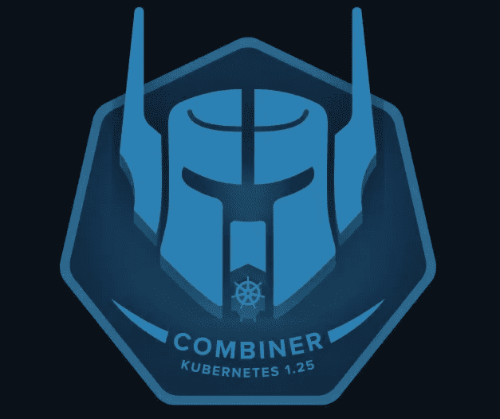
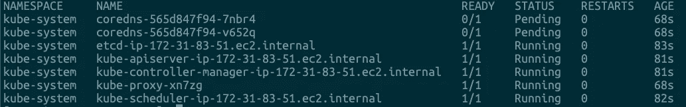
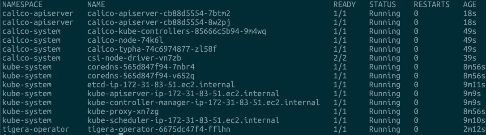

# 在 AWS 亚马逊 Linux 2 上安装 K8s v1.25

> 原文：<https://blog.devgenius.io/install-k8s-v1-25-on-amazon-linux-2-e2a717444736?source=collection_archive---------0----------------------->

## 如何在 Amazon Linux 2 实例上安装单节点 K8s v1.25



图片来自 k8s.io

K8s v1.25.0 于 2022 年 8 月 23 日发布，命名为`Combiner`，可以从这里查看发布说明 [K8s v1.25.0 发布说明](https://github.com/kubernetes/sig-release/blob/master/releases/release-1.25/release-notes/release-notes-draft.md)。本文向您展示了如何在 Amazon Linux 2 上使用`kubeadm`安装这个新版本的 K8s。

# 用 kubeadm 创建 K8s 集群

使用`kubeadm`，您可以创建一个符合最佳实践的最小可行 K8s 集群。您还可以使用`kubeadm`创建一个生产就绪的 K8s 集群。本文仅涵盖单节点控制平面安装。

`kubeadm`专注于在现有基础设施上引导 K8s 集群，并执行一系列重要的维护任务。`kubeadm`接口的核心非常简单:通过运行`kubeadm init`创建新的控制平面节点，通过运行`kubeadm join`将工作节点加入控制平面。

# 服务器规格

*   **云平台** : AWS
*   **实例类型** : m5.large
*   **磁盘大小** : 100GB gp3

# 更新系统包

让我们首先更新系统 yum 包:

```
$ yum update -y
Loaded plugins: extras_suggestions, langpacks, priorities, update-motd
amzn2-core                                                                                                                                         | 3.7 kB  00:00:00
Resolving Dependencies
--> Running transaction check
---> Package chrony.x86_64 0:4.0-3.amzn2.0.2 will be updated
---> Package chrony.x86_64 0:4.2-5.amzn2.0.2 will be an update
...
Installed:
  kernel.x86_64 0:5.10.135-122.509.amzn2Updated:
  chrony.x86_64 0:4.2-5.amzn2.0.2      dhclient.x86_64 12:4.2.5-79.amzn2.1.1          dhcp-common.x86_64 12:4.2.5-79.amzn2.1.1   dhcp-libs.x86_64 12:4.2.5-79.amzn2.1.1
  gnupg2.x86_64 0:2.0.22-5.amzn2.0.5   kernel-tools.x86_64 0:5.10.135-122.509.amzn2   tzdata.noarch 0:2022c-1.amzn2Complete!
```

# 安装 kubeadm、kubelet 和 kubectl

我们将在 EC2 实例上安装这些包:

*   `kubeadm`:引导集群的命令。
*   `kubelet`:在集群中的所有机器上运行的组件，负责启动 pod 和 containers。
*   `kubectl`:命令行 util 与您的集群对话。

## 安装 K8s yum repo

```
# cat <<EOF | sudo tee /etc/yum.repos.d/kubernetes.repo
[kubernetes]
name=Kubernetes
baseurl=https://packages.cloud.google.com/yum/repos/kubernetes-el7-\$basearch
enabled=1
gpgcheck=1
gpgkey=https://packages.cloud.google.com/yum/doc/yum-key.gpg https://packages.cloud.google.com/yum/doc/rpm-package-key.gpg
exclude=kubelet kubeadm kubectl
EOF[kubernetes]
name=Kubernetes
baseurl=[https://packages.cloud.google.com/yum/repos/kubernetes-el7-$basearch](https://packages.cloud.google.com/yum/repos/kubernetes-el7-$basearch)
enabled=1
gpgcheck=1
gpgkey=[https://packages.cloud.google.com/yum/doc/yum-key.gpg](https://packages.cloud.google.com/yum/doc/yum-key.gpg) [https://packages.cloud.google.com/yum/doc/rpm-package-key.gpg](https://packages.cloud.google.com/yum/doc/rpm-package-key.gpg)
exclude=kubelet kubeadm kubectl
```

## 禁用 SELinux

```
# setenforce 0
setenforce: SELinux is disabled
# sed -i 's/^SELINUX=enforcing$/SELINUX=permissive/' /etc/selinux/config
```

## 安装 kubeadm、kubelet 和 kubectl

```
# yum install -y kubelet-1.25.0-0 kubeadm-1.25.0-0 kubectl-1.25.0-0 --disableexcludes=kubernetes
...
Installed:
  kubeadm.x86_64 0:1.25.0-0                               kubectl.x86_64 0:1.25.0-0                               kubelet.x86_64 0:1.25.0-0Complete!# systemctl enable --now kubelet
Created symlink from /etc/systemd/system/multi-user.target.wants/kubelet.service to /usr/lib/systemd/system/kubelet.service.
```

# 安装容器运行时

您需要在集群中的每个节点上安装一个[容器运行时](https://kubernetes.io/docs/setup/production-environment/container-runtimes)，以便 Pods 可以在那里运行。

`K8s v1.25.0`要求您使用符合[容器运行时接口](https://kubernetes.io/docs/concepts/overview/components/#container-runtime) (CRI)的运行时。我们将使用`containerd`作为 CRI。

## 转发 IPv4 并让 iptables 看到桥接的流量

```
# cat <<EOF | sudo tee /etc/modules-load.d/k8s.conf
overlay
br_netfilter
EOF# modprobe overlay
# modprobe br_netfilter
# lsmod | egrep  "overlay|netfilter"
br_netfilter           32768  0
bridge                258048  1 br_netfilter
overlay               151552  0
```

## 设置所需的系统参数

```
# cat <<EOF | sudo tee /etc/sysctl.d/k8s.conf
net.bridge.bridge-nf-call-iptables  = 1
net.bridge.bridge-nf-call-ip6tables = 1
net.ipv4.ip_forward                 = 1
EOF# sysctl --system
...
* Applying /etc/sysctl.conf ...
```

## 安装容器 d

从[https://github.com/containerd/containerd/releases](https://github.com/containerd/containerd/releases)下载`containerd-<VERSION>-<OS>-<ARCH>.tar.gz`档案，验证其 sha256sum，解压到`/usr/local`下:

```
# tar Cxzvf /usr/local containerd-1.6.8-linux-amd64.tar.gz
bin/
bin/containerd-shim-runc-v2
bin/containerd-shim
bin/ctr
bin/containerd-shim-runc-v1
bin/containerd
bin/containerd-stress
```

## 安装 containerd 系统服务

将`containerd.service`单元文件从[https://github . com/container d/container d/blob/main/container d . service](https://github.com/containerd/containerd/blob/main/containerd.service)下载到`/usr/lib/systemd/system/containerd.service`中，运行以下命令:

```
# cp containerd.service /usr/lib/systemd/system/
# systemctl daemon-reload
# systemctl enable --now containerd
Created symlink from /etc/systemd/system/multi-user.target.wants/containerd.service to /usr/lib/systemd/system/containerd.service.
```

## 安装 runc

从[https://github.com/opencontainers/runc/releases](https://github.com/opencontainers/runc/releases)下载`runc.<ARCH>`二进制文件，验证其 sha256sum，安装为`/usr/local/sbin/runc`。

```
# install -m 755 runc.amd64 /usr/local/sbin/runc
```

## 安装 CNI 插件

从[https://github.com/containernetworking/plugins/releases](https://github.com/containernetworking/plugins/releases)下载`cni-plugins-<OS>-<ARCH>-<VERSION>.tgz`档案，验证其 sha256sum，解压到`/opt/cni/bin`下:

```
# mkdir -p /opt/cni/bin
# tar Cxzvf /opt/cni/bin cni-plugins-linux-amd64-v1.1.1.tgz
./
./macvlan
./static
./vlan
./portmap
./host-local
./vrf
./bridge
./tuning
./firewall
./host-device
./sbr
./loopback
./dhcp
./ptp
./ipvlan
./bandwidth
```

# 安装 K8s v.1.25.0

## 下拉所需图像

下载图像

```
# kubeadm config images pull --v=5
...
[config/images] Pulled registry.k8s.io/kube-apiserver:v1.25.0
[config/images] Pulled registry.k8s.io/kube-controller-manager:v1.25.0
[config/images] Pulled registry.k8s.io/kube-scheduler:v1.25.0
[config/images] Pulled registry.k8s.io/kube-proxy:v1.25.0
[config/images] Pulled registry.k8s.io/pause:3.8
[config/images] Pulled registry.k8s.io/etcd:3.5.4-0
[config/images] Pulled registry.k8s.io/coredns/coredns:v1.9.3
```

## 初始化控制平面

控制平面节点是控制平面组件运行的机器，包括 [etcd](https://kubernetes.io/docs/tasks/administer-cluster/configure-upgrade-etcd/) (集群数据库)和 [API 服务器](https://kubernetes.io/docs/concepts/overview/components/#kube-apiserver)(与 [kubectl](https://kubernetes.io/docs/user-guide/kubectl-overview/) 命令行工具通信)。

要初始化控制平面节点，请运行:

```
# kubeadm init --pod-network-cidr=10.244.0.0/16 --apiserver-advertise-address=172.31.83.51 --node-name "ip-172-31-83-51.ec2.internal" --v=9
...
Your Kubernetes control-plane has initialized successfully!To start using your cluster, you need to run the following as a regular user:mkdir -p $HOME/.kube
  sudo cp -i /etc/kubernetes/admin.conf $HOME/.kube/config
  sudo chown $(id -u):$(id -g) $HOME/.kube/configAlternatively, if you are the root user, you can run:export KUBECONFIG=/etc/kubernetes/admin.confYou should now deploy a pod network to the cluster.
Run "kubectl apply -f [podnetwork].yaml" with one of the options listed at:
  [https://kubernetes.io/docs/concepts/cluster-administration/addons/](https://kubernetes.io/docs/concepts/cluster-administration/addons/)Then you can join any number of worker nodes by running the following on each as root:kubeadm join 172.31.83.51:6443 --token xxxx \
 --discovery-token-ca-cert-hash sha256:1bf0cf842e56f84bdb1156a2635910bda519d20203fcbc2f99127abbf2bd626c
```

注意`--apiserver-advertise-address`是私有 ip。

## 检查舱运行正常

```
# mkdir -p $HOME/.kube
# cp -i /etc/kubernetes/admin.conf $HOME/.kube/config
# chown $(id -u):$(id -g) $HOME/.kube/config
# kubectl get po -A
```

输出应该类似于:



不要担心`coredns`吊舱，它需要安装网络插件。

## 安装网络插件

我们将使用 Calico 作为我们的 K8s 集群网络插件。下载`tigera-operator.yaml`和`custom-resources.yaml`文件

```
# curl [https://raw.githubusercontent.com/projectcalico/calico/v3.24.1/manifests/tigera-operator.yaml](https://raw.githubusercontent.com/projectcalico/calico/v3.24.1/manifests/tigera-operator.yaml) -O
$ curl [https://raw.githubusercontent.com/projectcalico/calico/v3.24.1/manifests/custom-resources.yaml](https://raw.githubusercontent.com/projectcalico/calico/v3.24.1/manifests/custom-resources.yaml) -O
```

更新`custom-resources.yaml` CIDR 配置，使用`--pod-network-cidr=10.244.0.0/16`代替默认的`192.168.0.0/16`

安装 tigera 操作员

```
# kubectl create -f tigera-operator.yaml
namespace/tigera-operator created
...
customresourcedefinition.apiextensions.k8s.io/tigerastatuses.operator.tigera.io created
serviceaccount/tigera-operator created
clusterrole.rbac.authorization.k8s.io/tigera-operator created
clusterrolebinding.rbac.authorization.k8s.io/tigera-operator created
deployment.apps/tigera-operator created# kubectl get po -n tigera-operator
NAME                               READY   STATUS    RESTARTS   AGE
tigera-operator-6675dc47f4-fflhn   1/1     Running   0          44s
```

安装 calico 自定义资源

```
# kubectl create -f custom-resources.yaml
installation.operator.tigera.io/default created
apiserver.operator.tigera.io/default created
```

观看 pod 创建过程:

```
# watch kubectl get po -A
```

直到所有吊舱准备就绪:



恭喜你！您已经成功构建了您的 K8s v1.25 集群！

```
# kubectl version --short
Client Version: v1.25.0
Kustomize Version: v4.5.7
Server Version: v1.25.0# kubectl get node
NAME                           STATUS   ROLES           AGE   VERSION
ip-172-31-83-51.ec2.internal   Ready    control-plane   11m   v1.25.0
```

# 参考

*   containrd:[https://github . com/containerd/containerd/blob/main/docs/getting-started . MD](https://github.com/containerd/containerd/blob/main/docs/getting-started.md)
*   kube ADM:[https://kubernetes . io/docs/setup/production-environment/tools/kube ADM/create-cluster-kube ADM/](https://kubernetes.io/docs/setup/production-environment/tools/kubeadm/create-cluster-kubeadm/)
*   https://projectcalico.docs.tigera.io/about/about-calico