# 在 Win10 上安装 Laravel 8 . x with Homestead(VirtualBox)

> 原文：<https://blog.devgenius.io/install-laravel-8-x-on-win-10-with-homestead-virtualbox-ec996f9a2cb6?source=collection_archive---------0----------------------->

L aravel 是由 Taylor Otwell 创建的最流行的开源 PHP MVC 框架。Laravel 的当前版本是 8.x。您可能是 Windows dev 机器的 XAMPP 迷。但是，在开发例程中，您可能偶尔会听到“在我的机器上工作”的借口。

[**家园**](https://laravel.com/docs/8.x/homestead) 是官方的 Laravel 包，通过利用虚拟机和 [*流浪者*](https://www.vagrantup.com/) 自动化脚本的力量来帮助你解决这个可怕的时刻。所以，你所有的队友都会一直在同一个环境里！

【4 月 21 日更新 5:现在底部有 Youtube 演示视频！】

请确保您的 Windows 上安装了以下软件:

*   Git(下载[链接](https://git-scm.com/downloads)
*   VirtualBox(下载[平台&扩展包](https://www.virtualbox.org/wiki/Downloads)
*   流浪汉(下载[链接](https://www.vagrantup.com/downloads)
*   PuTTY(下载[链接](https://www.chiark.greenend.org.uk/~sgtatham/putty/latest.html)
*   HeidiSQL(下载[链接](https://www.heidisql.com/download.php)
*   VS 代码(下载[链接](https://code.visualstudio.com/)

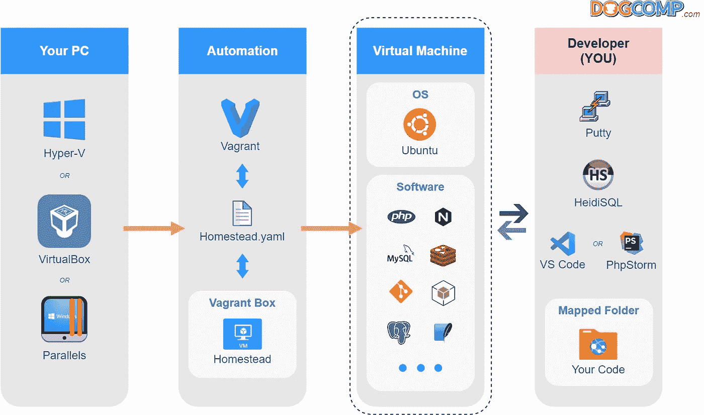

家园设置概览图

# 1.饭桶

通常，只需遵循安装向导(接受默认选项)并完成安装。

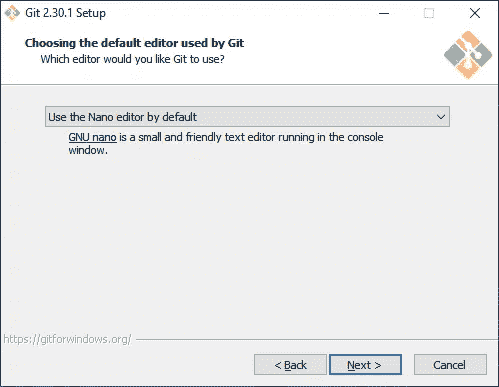

对于初学者，推荐 Nano 编辑器。

> 你可能会注意到 *Git* 在上图中没有提到，但是它是你日常开发程序背后的一个重要软件。

# 1.1 生成您的 SSH 密钥

> 注意:如果您之前已经创建了 SSH 密钥对，请跳过这一步。

使用 RSA 算法，为了更好地兼容不同系统，
执行此命令:
`ssh-keygen -t rsa -b 4096 -C “your_email@example.com”`

强烈建议使用密码，但不要忘记😉

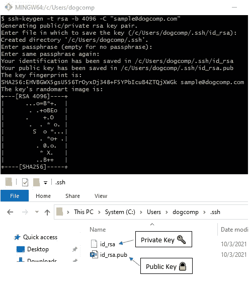

".ssh”文件夹是用位于其中的公钥和私钥创建的

# 1.2 IDE 和实用程序

安装 VS 代码，PuTTY，HeidiSQL，SourceTree 以及所有你喜欢的开发工具。

# 2.VirtualBox

使用默认选项安装主平台，然后添加扩展。

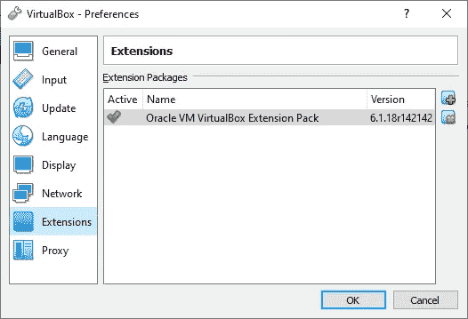

通过文件菜单>首选项>扩展安装

# 3.无赖

安装并遵循安装向导，然后在安装完成后重新启动。

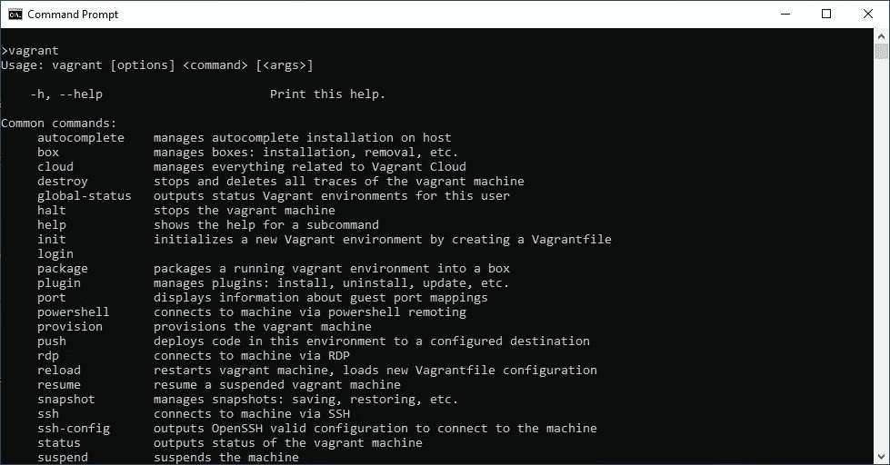

在命令提示符中键入“vagger ”,然后您应该会看到输出

# 3.1 流浪 NFS 插件

安装 NFS 插件以提高映射文件夹的性能。

```
vagrant plugin install vagrant-winnfsd
```

> 注意:如果没有 NFS，您可能会在安装 composer 软件包
> [https://www.virtualbox.org/ticket/18776](https://www.virtualbox.org/ticket/18776)
> 时遇到映射文件夹的问题，或者，您可以按照 [stackoverflow](https://stackoverflow.com/a/63139337/9104189) 中的建议降级到 VirtualBox 6.0.4。

# 4.安装家园

> 提示:请始终参考最新的官方文件[https://laravel.com/docs/8.x/homestead](https://laravel.com/docs/8.x/homestead)

从开始菜单启动你的 *Git Bash* ，然后执行命令
`git clone https://github.com/laravel/homestead.git ~/Homestead`

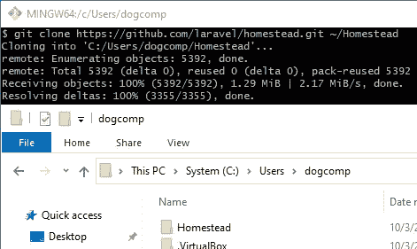

“家园”文件夹是在您的用户目录中创建的

然后结账`release`分支
`cd ~/Homestead`
`git checkout release`

# 4.1 下载家园流浪箱

在 Windows 命令提示符下执行
命令`vagrant box add laravel/homestead`

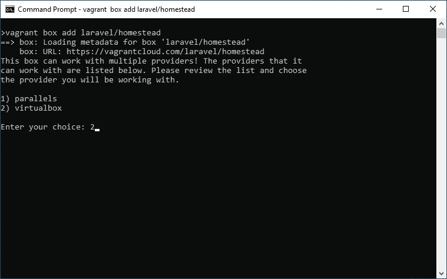

为 VirtualBox 选择 2

> 你可能会遇到下载速度极慢的情况，所以我创建了盒子的镜像(v11.3.0 & v11.4.0)可以从我的 [Google Drive](http://bit.ly/3l2HvKi) 下载。
> a)提取内容到`C:\Users\<username>\.vagrant.d\boxes` b)然后通过命令进行验证:`vagrant box list`

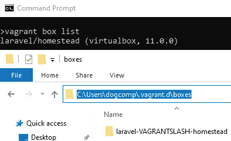

验证是否下载了家园盒

# 4.2 配置宅基地

双击并执行 Homestead 文件夹中的`init.bat`

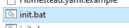

用你最喜欢的编辑器编辑`Homestead.yaml`

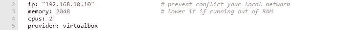

第一部分:虚拟机规范


第二部分:SSH 密钥对

> 您必须创建要映射到虚拟机的共享文件夹。
> 例如`*C:\Users\john\****code***` 注意:如果字符串中包含空格或特殊字符，请用引号括起来


第三部分:共享文件夹映射

> 注意:为了在 Linux 和 Windows 环境中获得最好的兼容性，总是推荐使用小写字母

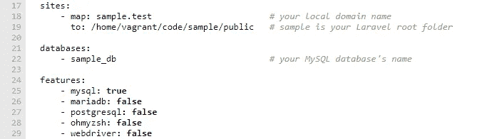

第四部分:Nginx、MySQL 和特性设置

> 确保`mysql`功能设置为`true`，并保存`Homestead.yaml`。
> 
> 【更新:2021 年 3 月 29 日】
> 一个非常有用的指南谈到了`Homestead.yaml`
> [https://abbasharoon.me/homestead-yaml-explained-a-z/](https://abbasharoon.me/homestead-yaml-explained-a-z/)

编辑您的主机文件以匹配您的本地域
使用管理员权限运行您的记事本，然后打开文件`C:\Windows\System32\drivers\etc\hosts`

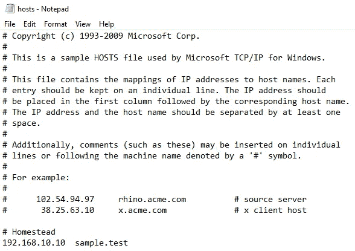

确保 IP 和本地域与 Homestead.yaml 文件匹配

# 5.启动你的家园！

将目录`cd`改为你的`Homestead`目录
例如`cd C:\Users\<username>\Homestead`
在你的命令提示符下执行`vagrant up`

> 注意:您必须在`Vagrantfile`目录下执行您的`vagrant up`命令

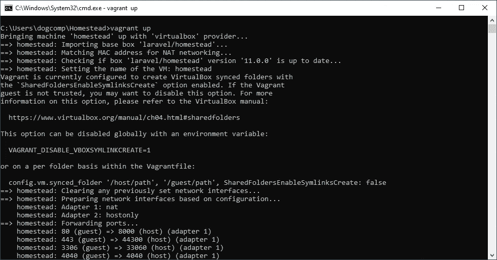

第一次启动需要一些时间，请耐心等待…

> 注:如果您遇到`VERR_INTNET_FLT_IF_NOT_FOUND`错误，请转到设备管理器禁用，然后启用 VirtualBox 适配器。

> ⚠️对于那些看到这个错误消息的人:⚠️
> “资源库‘https://deb . node source . com/node _ 14 . x focal release’不再有发布文件。”。
> 
> 请参考这个:[https://github . com/laravel/homestead/issues/1707 # issue comment-933536900](https://github.com/laravel/homestead/issues/1707#issuecomment-933536900)

# 6.通过 SSH 连接您的家园


用你的 IP 或本地域名连接到你的家园

您可以通过用户名(`*vagrant*` ) &密码(`*vagrant*`)进行连接

或者，您可以通过 SSH 密钥连接

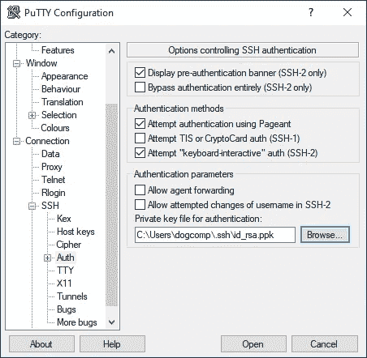

> 您必须使用“PuTTYgen”
> 将您的 SSH 密钥转换为 PuTTY 格式 a)从开始菜单
> 打开“PuTTYgen”b)从程序菜单，转换>导入密钥
> c)选择私钥(它应该在 C:\Users\ < username > \。ssh\id_rsa)
> d)点击“保存私钥”
> e)用 **id_rsa.ppk** ( **不要覆盖**已有的私钥！)

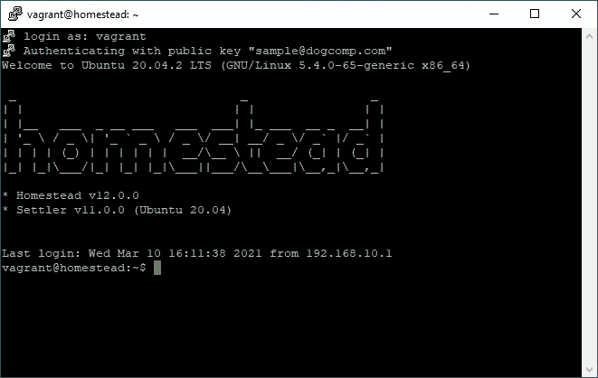

成功连接家园

# 7.通过 SSH 隧道连接您的 MySQL

a)打开 HeidiSQL >单击“新建”创建新会话

b)单击“SSH 隧道”选项卡

> 使用用户名(`*vagrant*` ) &)密码(`*vagrant*`)或您的私钥进行连接

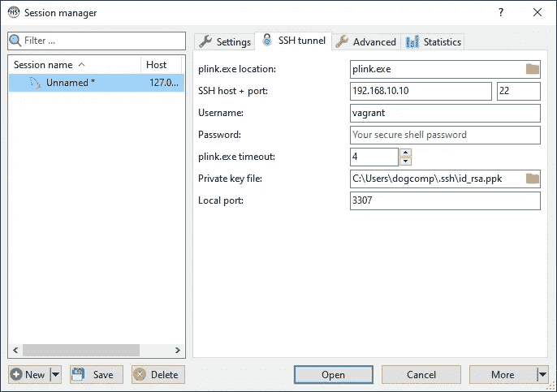

使用带私钥的 SSH 隧道

c)单击 MySQL(或 MariaDB)凭证的“设置”选项卡

> 使用用户名(`*homestead*` ) &密码(`*secret*`)连接

d)通过右键单击会话>重命名来重命名您的会话

e)最后，点击“保存”

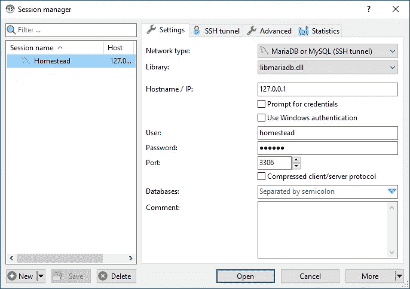

点击“打开”,你应该可以在 Homestead 虚拟机中连接 MySQL 了

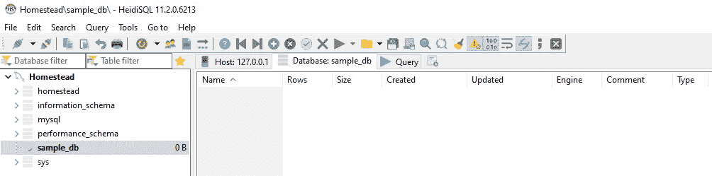

在 Homestead.yaml 中配置的数据库已创建

# 8.安装 Laravel 8.x

通过 PuTTY 登录，并在`cd code`之前转到您的项目文件夹

**选项 1:通过 Composer 安装**

```
composer create-project laravel/laravel sample
```

**选项 2:通过 Laravel 安装程序安装(推荐)**

```
composer global update laravel/installerlaravel new sample
```

> 提示:如果您编辑了您的`Homestead.yaml`，您可以运行`vagrant provision`来应用您的新配置
> 
> 提示:如果您面临任何性能问题，您可以通过运行`*vagrant reload*`来尝试重启 Homestead VM

一旦安装完成，`cd sample`然后运行`php artisan --version`

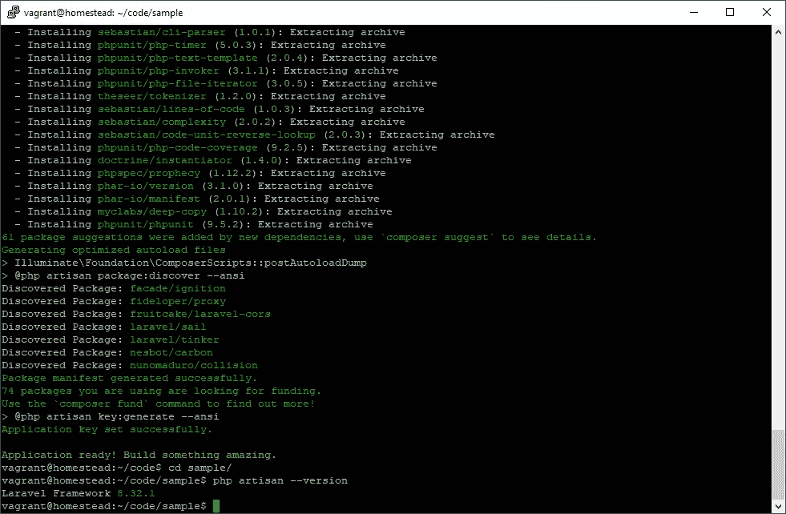

# 8.1 在开发前更新您的`.env`

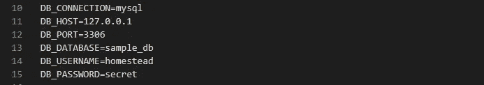

在中更新您的数据库配置。项目根目录中的 env 文件

# 9.编码快乐！

Git 提交您的全新安装，然后用 VSCode/PhpStorm 打开您的项目文件夹，开始您的 Artisan 之旅！

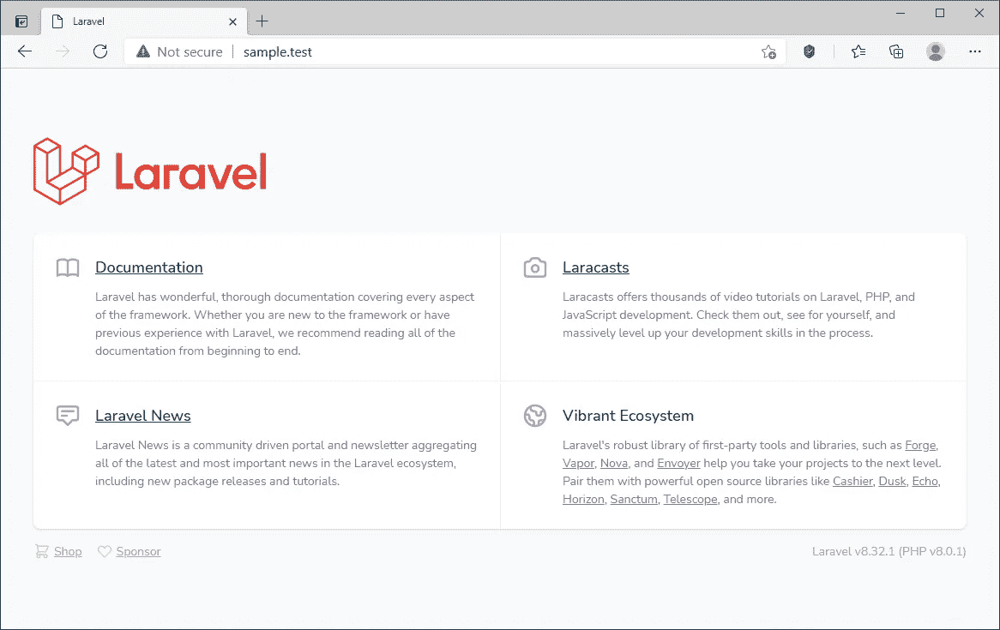

键入您的本地域，然后您应该会看到 Laravel 欢迎页面

> 提示:在你关闭窗口之前，记得运行`vagrant halt`

# 视频演示

# 你准备好把你的网站放在网上，每月只需 10 美元就可以无限制地托管应用程序了吗？

**Cloudways** 提供了大量的特性，让你可以轻松托管你的 Laravel、WordPress 或任何 PHP 网站，而不用担心网络安全的噩梦。

现在，您可以在 BFCM 2022 活动期间享受额外折扣！

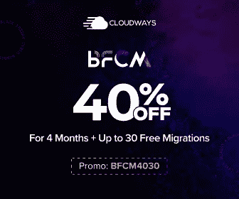

链接:[www.cloudways.com/en/?id=66136](http://www.cloudways.com/en/?id=66136)

让我们开始尝试**云道**！