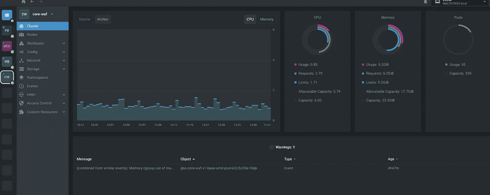
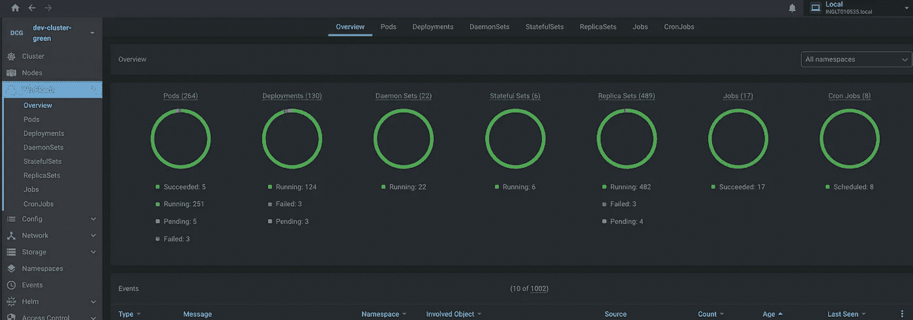
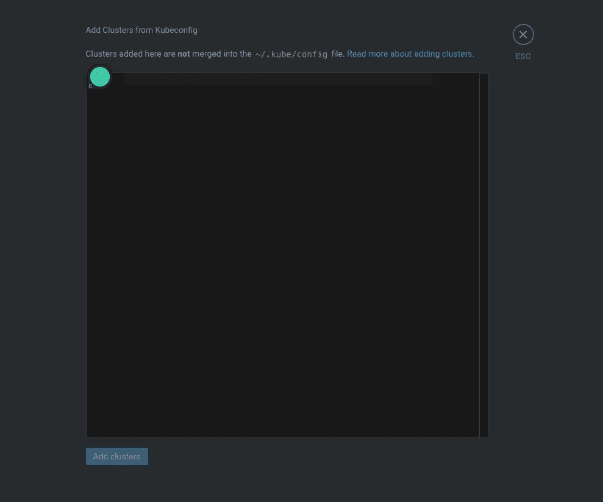
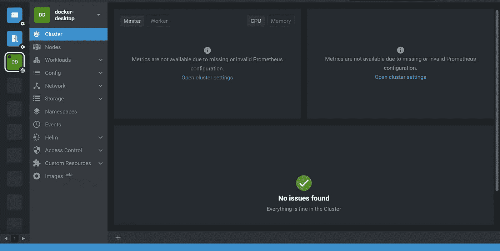

# 安装镜头-最佳 Kubernetes 仪表板和 IDE

> 原文：<https://blog.devgenius.io/install-lens-best-kubernetes-dashboard-ide-70a16eecde05?source=collection_archive---------4----------------------->

Kubernetes Lens 是 Kubernetes 的一个有效的开源 IDE。Lens 通过帮助您实时管理和监控集群，简化了 Kubernetes 的工作。它由 Kontena，Inc .开发，然后在 2020 年被 Mirantis 收购，Mirantis 随后开源并提供免费下载。

Lens 是一个独立的应用程序，可以安装在 [macOS](https://docs.k8slens.dev/main/getting-started/#macos) 、 [Windows](https://docs.k8slens.dev/main/getting-started/#windows) 和[某些 Linux 版本](https://docs.k8slens.dev/main/getting-started/#linux)上。使用 Kubernetes Lens，您可以在任何地方与任何 Kubernetes 集群对话。

**Kubernetes Lens 面向一般的开发人员、软件工程师和软件工程师**。它很可能是管理 Kubernetes 集群系统所需的唯一平台。

# 安装镜头桌面 [#](https://docs.k8slens.dev/main/getting-started/install-lens/#install-lens-desktop)

镜头桌面重量轻，安装简单。您将在几分钟内启动并运行。

有关可用安装选项的完整列表，请查看[镜头网站](https://k8slens.dev/)。

# 平台 [#](https://docs.k8slens.dev/main/getting-started/install-lens/#platforms)

Lens 已在以下平台上经过测试:

*   马科斯
*   Windows 操作系统
*   Linux 操作系统

# 在 macOS 上安装镜头桌面 [#](https://docs.k8slens.dev/main/getting-started/install-lens/#install-lens-desktop-on-macos)

1.  从 macOS 的 [Lens 网站](https://k8slens.dev/)下载 Lens Desktop。
2.  双击镜头-{版本}。dmg 并将 Lens.app 拖到 Applications 文件夹，使其在 macOS Launchpad 中可用。
3.  将镜头添加到您的 Dock 中，方法是右键单击图标，打开上下文菜单，然后选择选项，保留在 Dock 中。

# 在 Windows 上安装镜头桌面 [#](https://docs.k8slens.dev/main/getting-started/install-lens/#install-lens-desktop-on-windows)

1.  下载用于 Windows 的[镜头桌面安装程序](https://k8slens.dev/)。
2.  通过运行`Lens-Setup-{version}.exe`安装程序安装镜头桌面。默认情况下，Lens Desktop 安装在`C:\users\{username}\AppData\Local\Programs\Lens`下。

# 在 Linux 上安装镜头桌面 [#](https://docs.k8slens.dev/main/getting-started/install-lens/#install-lens-desktop-on-linux)

对于 Linux，您有以下下载选项:

*   `.rpm`和`.deb`文件
*   `AppImage`文件
*   `.snap`文件

# 添加一个集群 [#](https://docs.k8slens.dev/main/catalog/add-cluster/#add-a-cluster)

首先，Lens 会自动检测 kubeconfig 文件中的集群，并将它们添加到目录中。如果您想要手动添加其他集群，您可以导航到目录类别“集群”并单击右下角的**添加集群**按钮。

1.  点击**添加集群**按钮(用“+”图标表示)。
2.  您可以将 kubeconfig 文件直接输入到显示的输入字段中。

# 查看集群详情 [#](https://docs.k8slens.dev/main/getting-started/cluster-view/#view-cluster-details)

一旦集群启动并运行，您可以在 Lens Desktop 中看到以下视图:

使用集群导航面板在集群的不同功能部分之间切换。有关更多信息，请参阅集群一节中的文章。

## 查看工作负载

您可以通过单击菜单栏中的工作负载来查看集群概述

了解更多镜头功能[https://docs.k8slens.dev/main/](https://docs.k8slens.dev/main/)