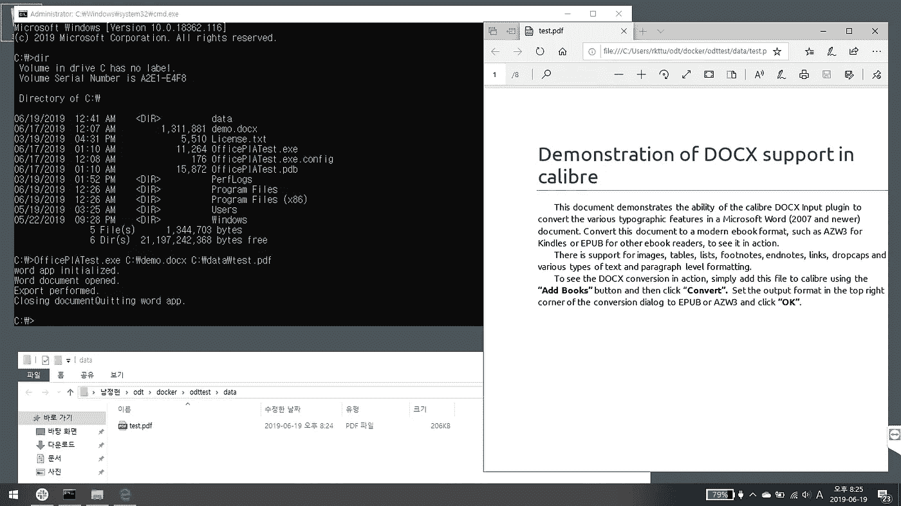

# 在 Windows 容器中安装 Microsoft Office

> 原文：<https://blog.devgenius.io/install-microsoft-office-in-windows-container-ce05877138fd?source=collection_archive---------0----------------------->


港集装箱办公室:[https://commons . wikimedia . org/wiki/File:Container _ Office . jpg](https://commons.wikimedia.org/wiki/File:Container_office.jpg)

**注意 1** :写这篇文章只是为了好玩。微软从来不保证 Office 在 Windows 容器环境下工作得最好。此外，微软可以在不发出任何通知的情况下随时破坏本文中描述的功能。所以，请不要依赖这篇文章。

**注意 2** :由于软件的许可限制，您不能为任何类型的互联网和内部网服务运行 Microsoft Office container。请参考微软的[许可描述](https://support.microsoft.com/en-us/help/257757/considerations-for-server-side-automation-of-office)。无论这个容器工作与否，请测试这个功能只是为了好玩。

# 一个关于办公自动化的故事

微软 Office 长期以来都是最畅销的软件。这个软件成了每个人生活中必不可少的东西。

微软 Office 以其流畅独特的界面而闻名。不仅如此，当用户可以采用自动化功能时，Office 也会大放异彩。然而，这些自动化特性并不适合传统的服务器场景。性能和许可方面。

作为替代，微软向公众发布了 OOXML 格式的 SDK，许多第三方和开源项目采用了 OOXML 并发布了它的 SDK。不管怎样，微软 Office 总是赢，因为他们开发了自己的功能。因此，如果你想坚持使用 Office 的最新亮点，你将不可避免地安装微软 Office。

这里有一个简单的问题。如果微软 Office 可以在 Windows 容器中运行，是不是很整洁呢？但我们不知道 Windows 容器是否支持 Microsoft Office。此外，自动安装也不容易。

# 挖掘

最近，Windows 容器映像的完整版本 Windows Server 2019 (1809)的开始已经发布。该映像包含支持和运行办公室的几乎所有组件。遗憾的是，尽管存在这种情况，用户仍然不能在容器中与应用程序进行交互。但是，有了这个映像，应用程序可以持久化并处理它的消息循环。

此外，微软 Office 的最新版本可以通过 Office 部署工具包(又名 ODT)进行定制和自动化。您可以用 XML 语法编写自己的 ODT 配置文件，这将在容器上很好地工作。

在本文中，我使用 Windows Server version 1903 容器进行了测试。

# 写入 ODT 文件

起初，我编写了一个名为`config.xml`的 ODT 文件来自动安装 32 位版本的 Office 2019。

```
<Configuration>
  <Add OfficeClientEdition="32" Channel="PerpetualVL2019">
    <Product ID="ProPlus2019Volume">
      <Language ID="ko-kr" />
    </Product>
  </Add>
  <Display Level="None" AcceptEULA="TRUE" />
  <Property Name="AUTOACTIVATE" Value="1"/>
</Configuration>
```

没有什么不寻常的，但重点是，我用的是 32 位版本的 Office 2019 作为永久授权版本，而不是 Office 365。

# 编写 Dockerfile 文件

我编写了一个 docker 文件，从微软下载中心下载 ODT，并基于 config.xml 文件运行安装。

```
FROM mcr.microsoft.com/windows:1903 AS buildWORKDIR C:\\odtsetup
ADD [https://download.microsoft.com/download/2/7/A/27AF1BE6-DD20-4CB4-B154-EBAB8A7D4A7E/officedeploymenttool_11617-33601.exe](https://download.microsoft.com/download/2/7/A/27AF1BE6-DD20-4CB4-B154-EBAB8A7D4A7E/officedeploymenttool_11617-33601.exe) odtsetup.exe
RUN odtsetup.exe /quiet /norestart /extract:C:\\odtsetupFROM mcr.microsoft.com/windows:1903 AS downloadWORKDIR C:\\odtsetup
COPY --from=build C:\\odtsetup\\setup.exe .
ADD config.xml .
RUN setup.exe /download C:\\odtsetup\\config.xmlFROM mcr.microsoft.com/windows:1903
MAINTAINER rkttuWORKDIR C:\\odtsetup
COPY --from=build C:\\odtsetup\\setup.exe .
COPY --from=download C:\\odtsetup\\Office .
ADD config.xml .
RUN setup.exe /configure C:\\odtsetup\\config.xmlWORKDIR /
RUN rmdir /s /q C:\\odtsetup# [https://stackoverflow.com/questions/10837437/interop-word-documents-open-is-null](https://stackoverflow.com/questions/10837437/interop-word-documents-open-is-null)
RUN powershell -Command new-object -comobject word.application
RUN mkdir C:\\Windows\\SysWOW64\\config\\systemprofile\\DesktopVOLUME C:\\data
```

我多次尝试实现这个 Dockerfile。当我试图安装 Office 365 x64 时，安装程序变得奇怪或干脆失败，并返回非零代码，这导致构建映像失败。

最后两行是在容器中正确运行 Microsoft Office 应用程序所必需的。我会解释的。

*   我看不到发生了什么，因为没有用户界面，但是`Word.Application` COM 对象应该至少启动一次来继续其余的步骤。
*   如果用户配置文件目录中不存在桌面目录，则当调用 open file 方法时，COM 对象将返回空引用。我在 Stackoverflow 网站上添加了一个[相关链接](https://stackoverflow.com/questions/10837437/interop-word-documents-open-is-null)。

> 请记住，正如我在第一段所说，微软可以更新 Office，这可能会导致突破性的变化，从而影响本文。

让我们用一个命令来构建 Office 容器。请确保 Docker Desktop for Windows 正在运行。

```
docker build -t o365full:latest .
```

# 编写一个将 DOCX 文档转换成 PDF 文件的应用程序

在容器映像构建成功后，你可以放入 C#应用程序，它使用 Office Primary Interop Assembly(又名 PIA)接口，并将 DOCX 文档转换成 PDF 文件。

```
// Requires office.dll and word interop pia.dll from GACusing Microsoft.Office.Interop.Word;
using System;
using System.IO;
using System.Linq;namespace OfficePIATest
{
    internal static class Program
    {
        [STAThread]
        public static void Main(string[] args)
        {
            var input = args.ElementAtOrDefault(0) ?? string.Empty;
            var output = args.ElementAtOrDefault(1) ?? string.Empty;if (!File.Exists(input))
            {
                Console.Error.WriteLine("Cannot open the file `{0}`.", input);
                Environment.Exit(1);
                return;
            }if (string.IsNullOrWhiteSpace(output))
            {
                Console.Error.WriteLine("Invalid output path.");
                Environment.Exit(2);
                return;
            }var outputDir = Path.GetDirectoryName(output);
            if (!Directory.Exists(outputDir))
                Directory.CreateDirectory(outputDir);var wordApp = new Application();
            Console.Out.WriteLine("word app initialized.");Document wordDocument = null;
            var t = new System.Threading.Tasks.Task(() => wordDocument = wordApp.Documents.Open(input));
            t.Start();
            t.Wait();if (wordDocument == null)
            {
                Console.Error.WriteLine("Word document is null reference.");
                Environment.Exit(3);
                return;
            }
            else
                Console.Out.WriteLine("Word document opened.");wordDocument.ExportAsFixedFormat(output, WdExportFormat.wdExportFormatPDF);
            Console.Out.WriteLine("Export performed.");wordDocument.Close(WdSaveOptions.wdDoNotSaveChanges,
                               WdOriginalFormat.wdOriginalDocumentFormat,
                               false); //Close document
            Console.Write("Closing document");wordApp.Quit(); //Important: When you forget this Word keeps running in the background
            Console.Out.WriteLine("Quitting word app.");
        }
    }
}
```

要构建此代码，您需要 Office PIA DLLs。当你安装 Office 时，PIA 会自动把它放到%windir%\Assembly\GAC_MSIL 目录下。另外，你需要 Office 汇编和微软。Office.Word 库。

此外，在构建这段代码时，有一点很重要。您应该将此应用程序编译为 x86 应用程序，或者设置 32 位首选应用程序。我们将 32 位 Microsoft Office 安装到一个容器中，因此我们应该尊重这种配置。

构建您的可执行文件，并将其与示例文档文件一起添加到容器中。在 docker 文件的末尾添加下面一行，添加示例目录并放置您的示例文档以供测试。

让我们假设可执行文件的名称是“OfficePIATest.exe”，而放在目录“sample”中的示例文档的名称是“demo.docx”

```
ADD sample .
```

然后让我们建立 docker 图像。

```
docker build -t o365full:latest .
```

请参考此要点代码以供参考。

# 测试

您可以使用目录挂载来运行容器。示例应用程序将在挂载的目录下创建 PDF 文件。

```
docker run -v %cd%\data:c:\data --rm -it --name=o365fulltest o365full:latest cmd
```

在容器环境中，让我们运行这个命令。

```
OfficePIATest.exe C:\demo.docx C:\data\test.pdf
```

然后创建的 PDF 文件如下！



瞧啊。容器中的 Microsoft Word 将示例文档转换为 PDF 文件。

# 结论

您可以通过多种方式将 Word 文档更高效地转换为 PDF。但是正如您所看到的，这个容器可以运行依赖于 Office PIA 程序集的应用程序。

我之前说过，尽管，Office 不是服务器应用程序，你不能这样使用 Office，所以你不能，也不应该使用这个 Windows 容器。

但是 Windows 容器进化得相当多，所以有更多的应用程序可以转换成 Windows 容器。我想用文章的一小部分和你分享这个好玩的因素。

如果您有任何反馈或建议，请写下来作为回应。😀

[](https://www.buymeacoffee.com/rkttu)