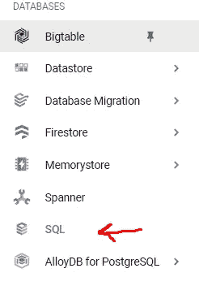
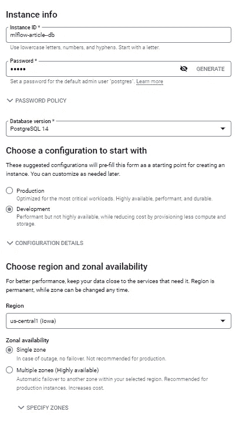
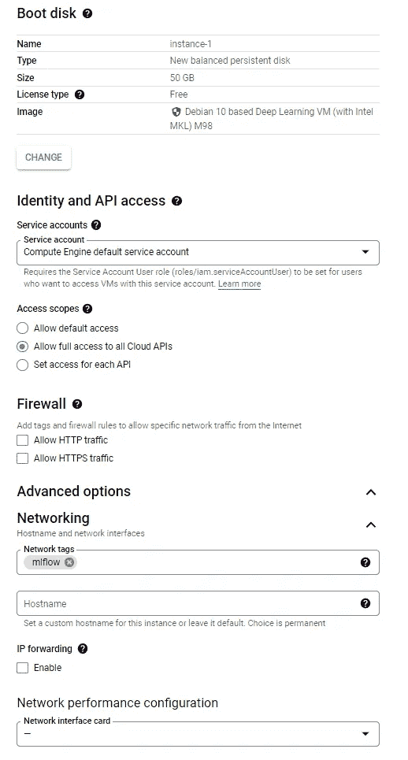
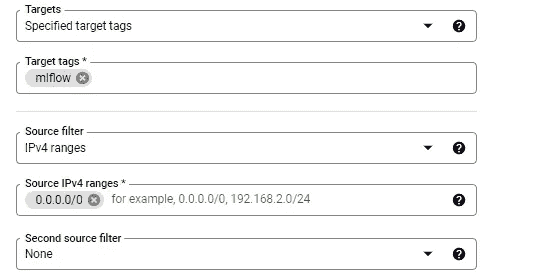
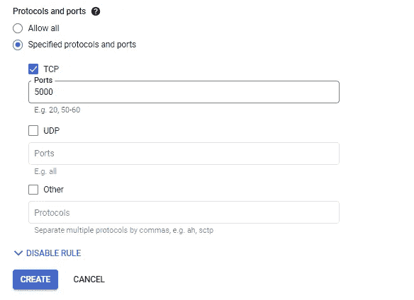

# 为您的团队在 GCP 上安装 MLFlow:最简单的方法

> 原文：<https://blog.devgenius.io/install-mlflow-on-gcp-for-your-team-the-simplest-way-d208b4ee3cd3?source=collection_archive---------2----------------------->


托拜厄斯·卡尔松在 [Unsplash](https://unsplash.com?utm_source=medium&utm_medium=referral) 上的照片

作为机器学习工程师或者数据科学家，你需要做实验。也许您会尝试新的模型、新的参数或新的数据预处理方法。当你在笔记本上做这些事情时，很容易迷失方向，忘记你从实验中得到的结果。当你不是一个人和一个团队一起工作的时候，你会希望看到别人以前尝试过的东西也许你不需要做什么新的实验，或者基本上，你不会用不必要的计算能力去尝试以前尝试过的东西。为了解决这些问题，MLFlow 与我们一起！我不会详细介绍 MLFlow，因为我假设您在这里是因为您已经了解它并希望在您的团队中使用它。

要在 GCP 上安装 MLFlow，我们需要执行 3 个步骤:

1.  创建一个 PostgreSQL 数据库来存储模型元数据。
2.  创建一个 Google 云存储桶来存储工件。
3.  创建计算引擎实例以安装 MLFlow 并运行 MLFlow 服务器

# 数据库创建

从导航栏中，在 databases 部分下找到 SQL 并单击它，单击“Create Instance”按钮并选择 PostgreSQL。



导航栏中的 SQL 部分

为管理员用户提供一个实例 ID 和密码。选择开发配置，因为我们不需要很快的东西。选择一个适合自己的地区。最后，在 customize your instance 部分，打开 connections 部分，选中 private IP 选项，同时取消选中 public IP。我们不需要从外部访问这个实例。计算引擎虚拟机将访问它，它可以使用私有 IP。并点击“创建实例”。需要一些时间来完成。



你可以去做其他部分，而不是等待，但完成后，再次来到这里，在你的数据库信息进入“数据库”菜单，并创建一个名为“mlflow”的数据库。

# 云存储创建

从导航栏转到云存储，并创建一个新的存储桶。对于命名，我一般从项目 ID 开始，加上一个破折号，再加上 bucket 的名称。这将很快结束。

# 计算引擎创建

让我们转到“计算引擎”并单击“创建实例”按钮。给它起个名字，然后选择一个地区。在“启动磁盘”部分，点击“更改”按钮，为操作系统选择“Linux 上的深度学习”(实际上 Ubuntu 也可以，我认为)，为版本选择“基于 Debian 10(以当时最新的为准)的深度学习虚拟机”。您可以随意更改其他设置，然后单击“选择”。在“身份和 API，访问”部分，选择“访问范围”下的“允许对所有云 API 的完全访问”。在高级选项中，打开网络部分，添加“mlflow”网络标记，然后单击创建。我们稍后将在防火墙规则中使用这个标签。



这应该是结尾的样子

单击“创建”按钮后，您将被重定向到主页，您可以看到有一个名为“相关操作”的部分。单击“设置防火墙规则”，然后单击“创建防火墙规则”。给它一个名称，并在 targets 部分，在 target 标记中添加 mlflow。对于 IP 范围，“0.0.0.0/0”将允许每个人访问。如果你不希望这样(是的，你不希望这样)，从了解网络的人那里获得帮助，或者只是键入我说的用于测试的不安全选项，或者键入你的 IP 地址并在其后添加一个/32，例如“192.168.1.1/32”。要了解更多关于 IP 范围的信息，请看一下。



不安全选项

然后只需为协议和端口选择 TCP 和端口 5000。我们选择 5000 是因为它是 mlflow 用于其 UI 和服务器的。



现在返回计算引擎，使用 UI(最后一栏中的选项)将 SSH 连接到您的机器。在终端中:

```
sudo apt update
pip3 install mlflow psycopg2-binary
mlflow server -h 0.0.0.0 -p 5000 --backend-store-uri postgresql://DB_USER:DB_PASSWORD@DB_ENDPOINT:5432/DB_NAME --default-artifact-root gs://GS_BUCKET_NAME
```

在我们的案例中:

**DB_USER** 是“postgres”

**DB_PASSWORD** 是我们创建数据库时您选择的

**DB_ENDPOINT** 是您可以在 SQL 部分的概述部分找到的私有 IP。

**DB_NAME** 是我们在创建实例后创建的 DB。如果像文章中那样命名的话应该是 mlflow。

**GS_BUCKET_NAME** 是我们创建的存储桶的名称。

现在您的实例已经准备好了，让我们连接到它并做一些实验。复制虚拟机的外部 IP 地址并打开笔记本。

现在你可以带着你的“ <external_ip>/5000”去 MLFlow UI 看实验和模型了！</external_ip>

就这些，非常感谢你的阅读！

# 参考

1.  [https://github.com/DataTalksClub/mlops-zoomcamp](https://github.com/DataTalksClub/mlops-zoomcamp)
2.  [https://S3 . Amazon AWS . com/tr-learn canvas/docs/IP _ Filtering _ in _ canvas . pdf](https://s3.amazonaws.com/tr-learncanvas/docs/IP_Filtering_in_Canvas.pdf)