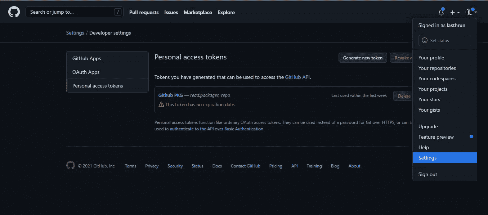
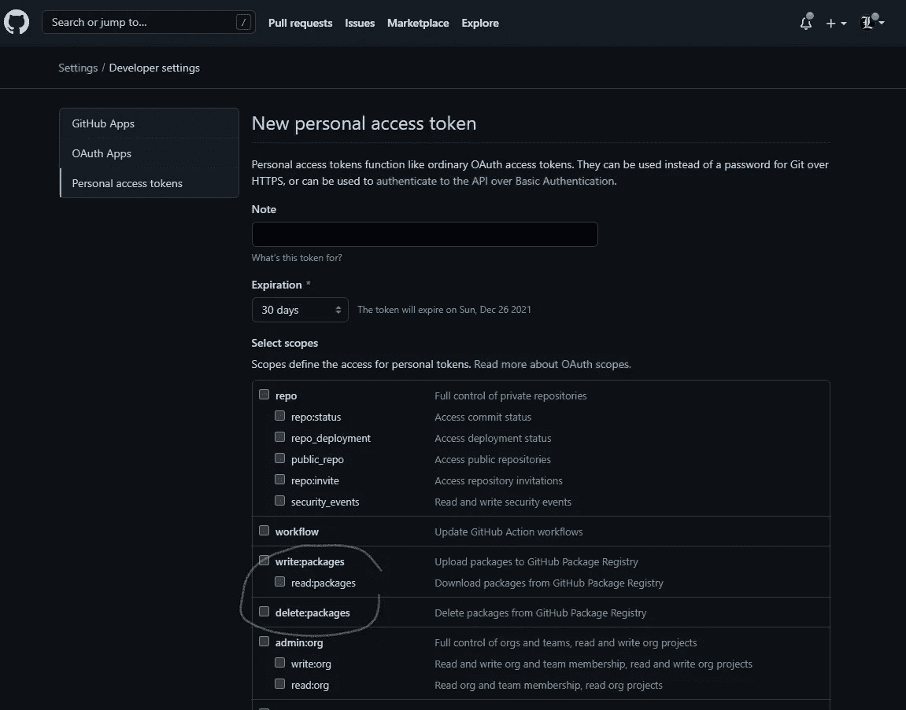
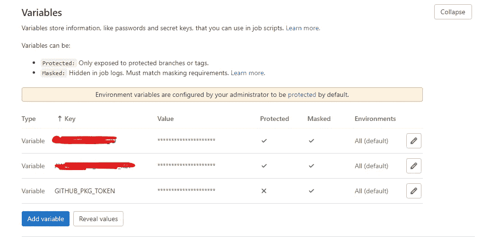

# 从 CI/CD 中的 GitHub 包安装包

> 原文：<https://blog.devgenius.io/install-packages-from-github-packages-in-ci-cd-9a0c8d463375?source=collection_archive---------8----------------------->

## 在 CI/CD 中安装定制软件包的解决方案


[博凯利](https://unsplash.com/@bochelly?utm_source=medium&utm_medium=referral)先生在 [Unsplash](https://unsplash.com?utm_source=medium&utm_medium=referral) 上的照片

我认为每个团队之前都面临这个问题，我们在 GitHub 上找到了一个很棒的库，但它并不能 100%满足团队要求。有些团队会选择分叉它，定制它并发布在 GitHub 包中。

这是一个很好的解决方案，但新的问题是，如何在您的团队 CI/CD 流程中安装这个定制的包？

这个问题的要点是:

**如何解决 GitHub 包要求的认证？**

1.  从 GitHub 安装包需要一个访问令牌。无论公私。
    可以查看这个[讨论](https://github.community/t/download-from-github-package-registry-without-authentication/14407/135)。
2.  对 CI/CD 中的 GitHub 包进行身份验证。

在这种情况下，我将展示 GitLab Runner 的解决方案，但我认为该解决方案对其他 CI/CD 服务也很有效。

# 生成访问令牌

正如我们在上一节中分析的那样，我们需要一个访问令牌。

所以首先打开 GitHub，进入开发者设置页面。



开发者设置页面

然后，单击“生成新令牌”。您应该会看到如下图所示的页面。



新建个人访问令牌页面

我们需要的唯一功能是“读取:包”。


新令牌已生成！

现在我们得到了新的访问令牌！我建议备份这个令牌，因为这是唯一一次看到它的机会。

# 设置 CI/CD 环境变量

CI/CD 环境变量允许我们将访问令牌传递给容器。(或者您可以在映像或容器配置中进行硬编码，但实际上..？

在这种情况下，我们将这个变量命名为“GITHUB _ PKG _ 令牌”。值请设置如下

```
//npm.pkg.github.com/:_authToken=YOUR_TOKEN
```



CI/CD 环境设置页面

出于安全原因，请记住在 CI/CD 日志中屏蔽您访问令牌。

# 创建并配置。CI/CD 容器中的 npmrc

现在我们能够在 CI/CD 容器中获得访问密钥，我们需要做的就是创建。带有访问令牌 npmrc。

在本例中，这个 CI/CD 进程使用基于 Linux 的映像节点:16。

因此，我们应该在您的业务逻辑之前运行下面的脚本。

```
- touch ~/.npmrc
- printf "$GITHUB_PKG_TOKEN" >> ~/.npmrc
```

搞定了。享受您的定制套餐！

虽然这篇文章描述了如何处理 GitHub 包，但是你可以将这个解决方案用于所有其他需要认证来安装包的平台。

感谢观看！请关注我在[我的作品集网站](https://ckmo.me)的更新。

*更多内容尽在*[*blog . dev genius . io*](http://blog.devgenius.io)*。*