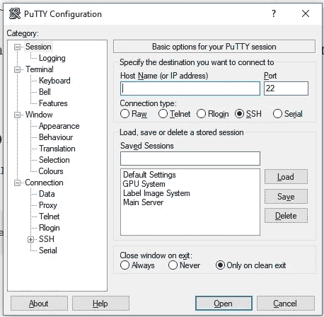
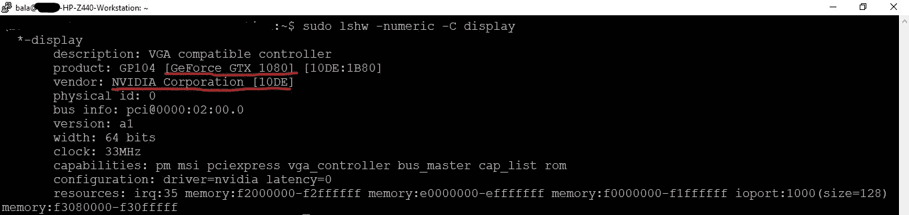
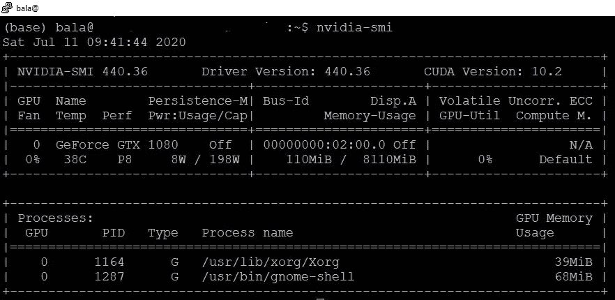
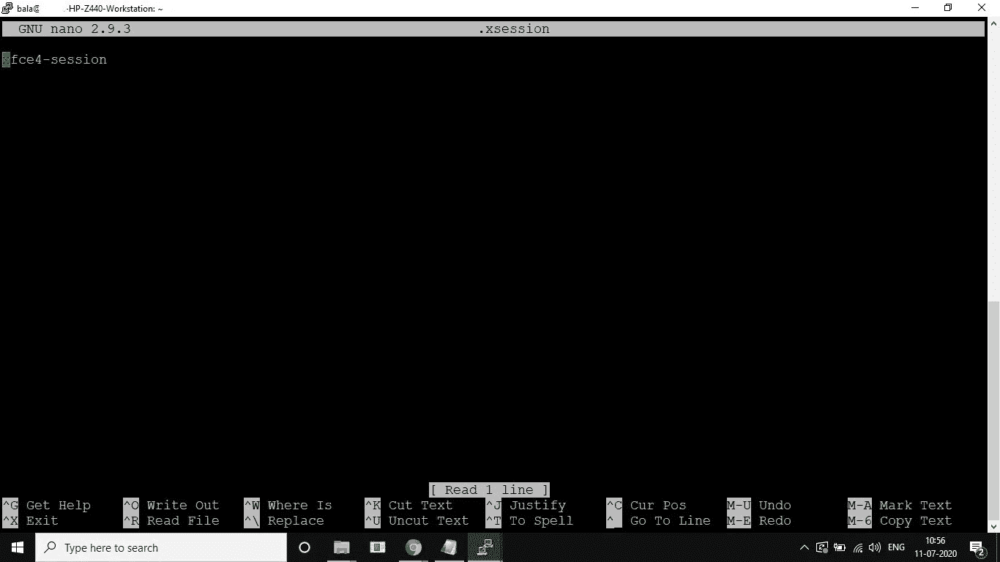
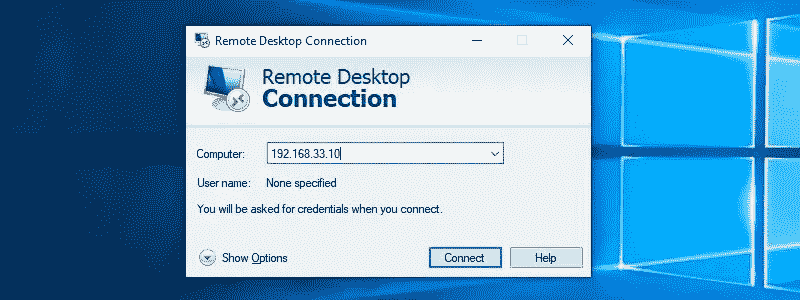
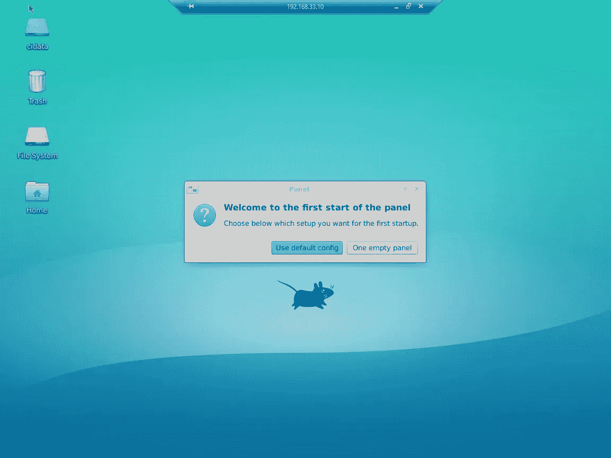

# 在 Ubuntu 上安装 Xrdp 服务器

> 原文：<https://blog.devgenius.io/install-xrdp-server-on-ubuntu-7088583bc01?source=collection_archive---------0----------------------->

## 在 Ubuntu 18.04 | 16.04 | 14.04 中安装 Xrdp(远程桌面)

# 为什么是这个教程？？？

如今，大多数人都在“在家工作”，需要远程连接到他们的系统。因此，他们给基础架构团队打电话，设置“远程桌面”来访问系统。事实上，这并不是一个乏味的任务来设置它。我们也可以设置“远程桌面”。希望这篇教程对你“在 Ubuntu 中安装 Xrdp”有所帮助。我在 Ubuntu 18.04 测试过这个。

> [*XRDP*](http://xrdp.org/) *是一款基于* [*远程桌面协议*](https://en.wikipedia.org/wiki/Remote_Desktop_Protocol) *(RDP)的 Linux 远程桌面服务器。*

Ubuntu 资源库中有几个桌面环境(DE)可用。我们会看到 Xfce 和 MATE 环境。


由 [Domenico Loia](https://unsplash.com/@domenicoloia?utm_source=medium&utm_medium=referral) 在 [Unsplash](https://unsplash.com?utm_source=medium&utm_medium=referral) 上拍摄的照片

# 步骤 1:连接远程系统

打开命令提示符，键入以下命令

```
**ssh username@remoteServerIP**
```

或者您可以使用 PuTTY 工具来连接远程系统。



PuTTY 是一个免费的开源终端模拟器、串行控制台和网络文件传输应用程序。它支持多种网络协议，包括 SCP、SSH、Telnet、rlogin 和原始套接字连接。

要安装油灰，

*   [在窗户上安装油灰](https://www.putty.org/)
*   [在 Linux 中安装 PuTTY](https://websiteforstudents.com/installing-putty-on-ubuntu-16-04-17-10-18-04/)

# 第二步:删除不需要的包

不需要的软件包，如硬件支持堆栈和部分安装的软件包可能会影响 Xrdp 会话失败。所以，把 Xorg，Xrdp，Xfce 4，Mate，Xserver 和 hwe 的包去掉，重新安装。

```
sudo apt purge hwe*sudo apt purge xorg*sudo apt purge xserver-xorg-coresudo apt purge xrdp*sudo apt purge mate*sudo apt purge xfce4*sudo apt purge xfce4 xfce4-goodies xorg dbus-x11 x11-xserver-utilssudo apt purge mate-core mate-desktop-environment mate-notification-daemonsudo rm /etc/systemd/system/xrdp.service (if already have xrdp.service)sudo apt autoremove
```

***更新系统软件包***

```
sudo apt-get update
sudo apt-get upgrade
```

***重启系统***

```
sudo reboot
```

# 步骤 3:安装支持的软件包

安装支持的包:Xorg、Xrdp、Xserver、Xfce4 和 Mate 包

在这里，我们首先检查是否安装了 Nvidia 驱动程序。

该驱动程序为远程桌面系统提供 GUI(图形用户界面)。

# #安装 NVIDIA 驱动程序

**→首先检查系统中的 GPU 硬件**

```
sudo lshw -numeric -C display
```



**→然后使用以下命令**检查是否安装了 NVIDIA GPU 驱动程序

```
nvidia-smi
```



**→如果没有安装 Nvidia 驱动程序，安装 Nvidia 驱动程序**

```
sudo add-apt-repository ppa:graphics-drivers/ppa
```

使用输入“nvidia-smi”时获得的信息，我们下载并安装我们的 GPU 支持的最新 nvidia 驱动程序。请注意，每个图形卡的命令是不同的，这取决于它可用的驱动程序

```
sudo apt-get install nvidia-XYXYXsudo apt-get update
sudo apt-get upgrade
```

(例如。nvidia-390 是 GTX 1xxx 系列的最新驱动程序版本)。

安装完成后，我们需要重新启动计算机:

```
sudo reboot
```

# #安装 Xrdp 支持的软件包

```
sudo apt-get install xorgsudo apt-get install xserver-xorg-coresudo apt-get install xorgxrdp
```

# 步骤 4:安装 Xrdp

在 Xrdp 中，XFCE4 和 MATE 最适合健壮的远程桌面环境

我使用 XFCE 作为我的桌面环境，因为它的资源很少，我在远程工作时并不总是有良好的互联网连接。你可以选择另一个你喜欢的环境，比如交配。

> ***XFCE 4***

```
sudo apt install xfce4 xfce4-goodies xorg dbus-x11 x11-xserver-utils
```

或者

> ***配偶***

```
sudo apt-get install mate-core mate-desktop-environment mate-notification-daemon
```

然后安装 XRDP 包

```
sudo apt install xrdpsudo systemctl status xrdpsudo systemctl restart xrdp
```

# 步骤 5:配置环境

告诉 xRDP 使用您的环境

## XFCE

```
sudo sed -i.bak ‘/fi/a #xrdp multiple users configuration \n xfce-session \n’ /etc/xrdp/startwm.sh
```

# 交配

```
sudo sed -i.bak ‘/fi/a #xrdp multiple users configuration \n mate-session \n’ /etc/xrdp/startwm.sh
```

> ***这是重要的一条***

在“/home/ <username>”中包含“xfce4-session”。xsession”。</username>

在终端中键入以下命令，并包含 **xfce-session。**如果你正在使用 Mate 环境，包括 **mate-session**

```
nano /home/<username>/.xsession
```

使用“**ctrl+x”**保存文件，然后键入“**y”**键



# 更新系统软件包

```
sudo apt-get update
sudo apt-get upgrade
```

# 步骤 6:配置防火墙

默认情况下，Xrdp 监听所有接口上的端口 3389。如果你在 Ubuntu 服务器上运行了防火墙(你应该经常这么做)，你需要添加一个规则来启用 Xrdp 端口上的流量。

要允许从特定 IP 地址或 IP 范围(在本例中为 192.168.1.0/24)访问 Xrdp 服务器，请运行以下命令:

```
sudo ufw allow from 192.168.1.0/24 to any port 3389
```

如果您希望允许从任何地方访问(出于安全原因，不建议这样做)，请运行:

```
sudo ufw allow 3389
```

***更新系统包***

```
sudo apt-get update
sudo apt-get upgrade
```

***重启系统***

```
sudo reboot
```

# 终于！！！高潮结束了。。。,



默认情况下，Windows 用户的计算机上有一个 RDP 连接应用程序。要找到它，请从“开始”菜单中搜索“远程桌面连接”。Ubuntu 用户可以使用 Remmina 连接远程系统

> 我们终于成功了！！！



当你第一次使用 XFCE 登录时，系统会询问你是想要默认面板设置还是空白面板。除非您知道自己想要什么，否则请选择默认设置。

如果您想重定向来自远程系统的音频，[检查此处](https://c-nergy.be/blog/?p=12469#:~:text=If%20you%20perform%20a%20remote,will%20work%20on%20your%20system.)

注意:不要尝试 GNOME 桌面环境的 xRDP，因为它不起作用。

Ubuntu 的早期版本可能适用于 RDP。。,

希望这篇教程对你“**在 Ubuntu** 安装 Xrdp”有所帮助。

***按住*** *的“拍手”按钮并保持支撑*

有问题吗？评论？建议？不要评论

> *谢谢，*
> 
> *巴拉穆鲁甘 N G*

如果你喜欢这篇文章，对你有帮助，请尽可能地鼓掌并分享


# 参考

[XRDP 服务器](https://linuxize.com/post/how-to-install-xrdp-on-ubuntu-18-04/)

[在 Windows 10 中安装远程桌面](https://www.windowscentral.com/how-use-remove-desktop-app-connect-pc-windows-10-0)

[重定向音频](https://c-nergy.be/blog/?p=12469#:~:text=If%20you%20perform%20a%20remote,will%20work%20on%20your%20system.)