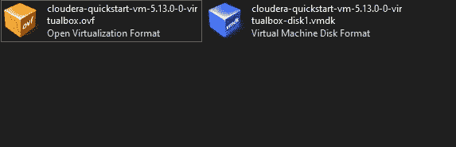
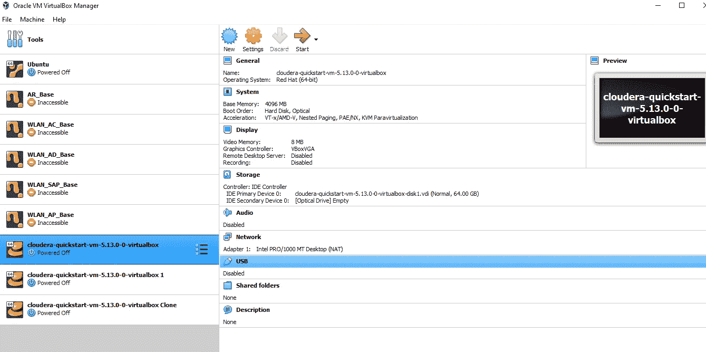
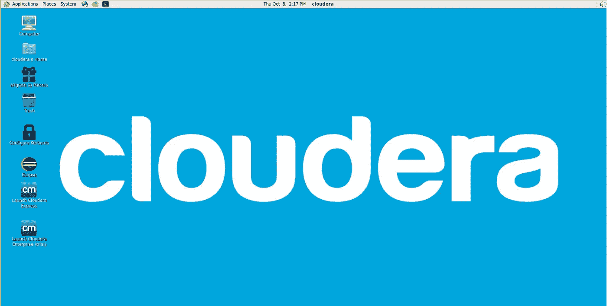

# 在 Windows 上安装 Hadoop

> 原文：<https://blog.devgenius.io/installation-of-hadoop-on-windows-266671e79921?source=collection_archive---------23----------------------->

实用模式开启！

行动时间到了，伙计们💥我们将在自己的系统上使用 Hadoop。之前，我们有三种模式可以在我们的系统上安装 Hadoop。

1.  本地模式(只是地图缩小)(我们将使用这一点)
2.  伪分布式模式(分布式，但没有并行性)
3.  完全分布式系统(由公司使用)(我们没有这方面的预算💸💸)

我们可以直接在 windows 上安装 Hadoop，它之前有问题，但现在已经解决了，但仍然需要配置一些帮助 Hadoop 的软件，并使其兼容，这很复杂。此外，这些行业使用 LINUX/UNIX 操作系统来运行 Hadoop 和其他大数据应用。因此，我们将坚持这一点。

如果你已经有一个 LINUX 平台，你可以运行 Hadoop 和其他大数据应用程序，但在此之前，你需要配置你的机器，并安装各种软件包和其他重要文件。

Cloudera quickstart vm 是一个预安装和配置一切的虚拟机，我们只需要做几件事。因此，我们将与它合作。

# 装置

下载虚拟机并安装它就像😫

1.  **虚拟机**

虚拟机帮助您在任何其他操作系统上工作，但它需要您的系统存储和配置。简单地说，假设你在 windows 上工作，你也想在同一个系统上使用 linux。我们可以在我们的系统上单独安装 linux，这被称为双重引导，或者我们可以将一部分 RAM 和存储空间分配给虚拟机，这样就可以创建一个虚拟操作系统，我们可以在其中使用 Linux。你只需要打开或关闭它。因此，我们将安装 Cloudera Quickstart VM(它使用 CentOS 作为操作系统)，并将在 Hadoop 上实际操作。

感觉像平行世界

链接:[甲骨文虚拟机](https://www.virtualbox.org/wiki/Downloads)

只需点击 windows 主机进行安装

**2。Cloudera 快速启动虚拟机**

链接: [Cloudera 快速启动虚拟机](https://drive.google.com/file/d/1yaoxB6bo8MbZfFkznKYfgy3Uza3lqI2G/view)

解压缩 zip 文件后，您将看到以下两个文件

你需要打开**。ovf** 文件通过虚拟箱。

> 注意:-在机器的 bios 设置下启用虚拟化技术

给正好一半的 CPU 和 RAM 资源。如果您的系统有 8 GB RAM 和 2 个内核，则给 1 个内核和 4 GB RAM。建议使用 8GB 内存的虚拟盒。点击导入按钮并等待。

选择刚刚添加到虚拟框中的机器后，单击“start”。

您将看到这个页面🙏🙏。

如果你看到这个，这就是真正的成功💯

因此，我们能够在我们的机器上安装 Cloudera Quickstart。我们已经为一些现场表演做好了准备。现在，是时候使用一些命令了。

> 注意:-在评论中联系我💬安装过程中的任何错误。

你可以安心睡觉了😴

下次我们会开火🔥一些基本的命令，会看到他们的使用，并会尝试记住其中一些😆。不要担心，它们很简单，就像 linux 命令一样，只需稍加修改。

干杯🤗读者们，如果你们已经走了这么远..

让我们暂时结束这个博客吧！

再见了，🥰

**谢谢！为了阅读。**

**如果你喜欢这个博客，请鼓掌回应👏**

**跟随..☺️** [**我**](https://medium.com/@prikshitsingla78) **更多这样有见地的 articles✍️**

**在评论中分享你的想法，并请分享对需要改进的部分的反馈，以便我下次改进。**

**祝大家愉快！**